::: {style="DISPLAY: none"}
{#d2h_url_template}{#d2h_package_url style="WIDTH: 0px; DISPLAY: none; HEIGHT: 0px"}
:::

::::: {#nsbanner .d2h_main_nsbanner style="BORDER-BOTTOM: #999999 1px solid; POSITION: relative; PADDING-BOTTOM: 0px; BACKGROUND-COLOR: transparent; PADDING-LEFT: 0px; PADDING-RIGHT: 0px; DISPLAY: none; BORDER-TOP: #999999 1px solid; PADDING-TOP: 0px; LEFT: 0px"}
:::: {#TitleRow .d2h_main_titlerow style="PADDING-BOTTOM: 4px; BACKGROUND-COLOR: transparent; PADDING-LEFT: 22px; WIDTH: 100%; PADDING-RIGHT: 10px; DISPLAY: none; PADDING-TOP: 4px"}
::: {#ienav .d2h_main_ienav style="DISPLAY: none"}
{#D2HPrevious .D2HPreviousEnabled}  {#D2HNext .D2HNextEnabled}
:::
::::
:::::

::::: {#nstext .d2h_main_nstext style="PADDING-BOTTOM: 10px; BACKGROUND-COLOR: transparent; PADDING-LEFT: 22px; PADDING-RIGHT: 10px; HEIGHT: 100%; OVERFLOW: auto; PADDING-TOP: 5px" hasuserbackground="true" valign="bottom"}
::: {#d2h_breadcrumbs .d2h_breadcrumbs}
[Essential Studio User Guide Documentation](ms-xhelp:///?Id=12457748-09e3-4d74-a240-8e049cedf030){.d2h_breadcrumbsNormal}[ \> ]{.d2h_breadcrumbsLinkSeparator}[Essential Common](ms-xhelp:///?Id=2bfe10b6-fac1-4f91-a173-04db314f10c3){.d2h_breadcrumbsNormal}
:::

# Brief Tour of Dashboard {#brief-tour-of-dashboard style="tab-stops: 0pt"}

[]{style="FONT-FAMILY: 'Trebuchet MS','sans-serif'; COLOR: #15428b; FONT-SIZE: 9pt"} 

This section provides details on the structure and composition of Syncfusion Essential Studio dashboard. It also elaborates on navigating our dashboard to access various utilities and product samples.

[]{style="FONT-FAMILY: 'Trebuchet MS','sans-serif'; COLOR: #15428b; FONT-SIZE: 9pt"} 

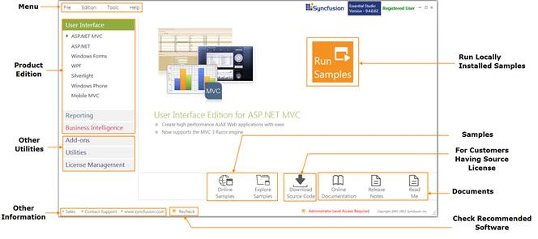{border="0"}

Figure 103: Dashboard

***[]{style="FONT-FAMILY: 'Trebuchet MS','sans-serif'; COLOR: #15428b; FONT-SIZE: 9pt"}*** 

The dashboard structure can be split into the following:

[]{style="FONT-FAMILY: 'Trebuchet MS','sans-serif'; COLOR: #15428b; FONT-SIZE: 9pt"} 

Menu

Menu comprises the menu bar which accommodates four menus:

1.   **[File ]{style="FONT-SIZE: 9pt"}**- Allows you to exit the dashboard, which can alternatively be done by clicking {border="0"} on the right top corner of dashboard.

[]{style="FONT-FAMILY: 'Trebuchet MS','sans-serif'; COLOR: #15428b"} 

 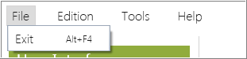{border="0"}

Figure 104: File

***[]{style="FONT-FAMILY: 'Trebuchet MS','sans-serif'; COLOR: #15428b; FONT-SIZE: 9pt"}*** 

2.   **Editions -** Allows you to access the products under each edition. Also, provides access to view local and online product samples. It allows you to access the online documentation, release notes and read me documents for the respective products. 

This can alternatively be accessed using the Product Editions section on dashboard.

[]{style="FONT-FAMILY: 'Trebuchet MS','sans-serif'; COLOR: #15428b"} 

 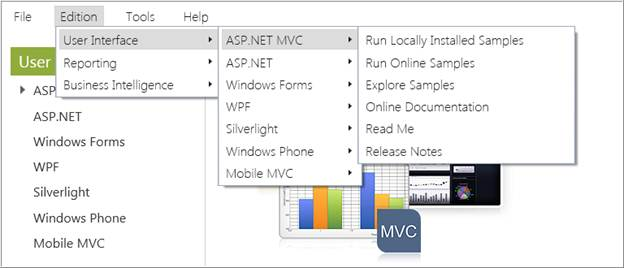{border="0"}

Figure 105: Editions

[]{style="FONT-FAMILY: 'Trebuchet MS','sans-serif'; COLOR: #15428b"} 

3.   **Tools -** Allows you to access the add-ons and utilities available for various platforms and products. Also, allows you to manage assemblies and license. The Toolbox configuration allows you to choose from various Visual Studio versions to be installed apt for you system configuration. This can alternatively be accessed through Utilities & Documentation section.

 

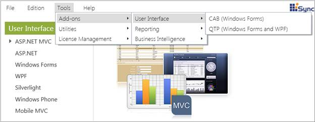{border="0"}

Figure 106: Tools

***[]{style="FONT-FAMILY: 'Trebuchet MS','sans-serif'; COLOR: #15428b; FONT-SIZE: 9pt"}*** 

4.   **Help** - Allows you to access the information on the current installed version by clicking **About**. Also, you can access the Direct-Trac support page over internet.

[]{style="FONT-FAMILY: 'Trebuchet MS','sans-serif'; COLOR: #15428b; FONT-SIZE: 9pt"} 

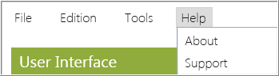{border="0"}

Figure 107: Help

 

Product Editions

 

This section allows you to access the product samples available. There are three product editions offered namely:

 

1\. User Interface

 

User Interface lists complete set of components for Windows and Web development supported under various platforms. They help you implement professional user interfaces in your applications. Currently, products under the following platforms are supported. For detailed list of the products, refer to the individual UGs.

 

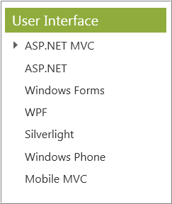{border="0"}

Figure 108: User Interface

 

2\. Reporting

Reporting lists the products useful for creating advanced reports under various platforms. Currently, products under the following platforms are supported. For detailed list of the products, refer to the individual UGs.

[]{style="FONT-FAMILY: 'Trebuchet MS','sans-serif'; COLOR: #15428b; FONT-SIZE: 9pt"} 

 

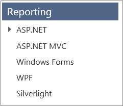{border="0"}

Figure 109:  Reporting

[]{style="FONT-FAMILY: 'Trebuchet MS','sans-serif'; COLOR: #15428b; FONT-SIZE: 9pt"} 

3\. Business Intelligence

Business Intelligence lists the products useful for performing business intelligence analysis and creating professional dashboards using relational and OLAP data, under various platforms. Currently, products under the following platforms are supported. For detailed list of the products, refer to the individual UGs.

[]{style="FONT-FAMILY: 'Trebuchet MS','sans-serif'; COLOR: #15428b; FONT-SIZE: 9pt"} 

 

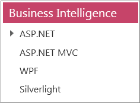{border="0"}

Figure 110:  BI

 

Accessing Product Samples

The Syncfusion provides lots of online and local samples for better understanding of the controls. You can access them as illustrated in the following steps:

 

1.   Open **Syncfusion Dashboard**.

 

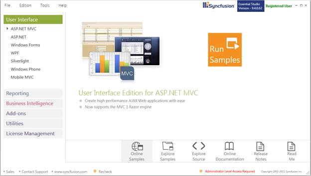{border="0"}

Figure 111: Dashboard

 

2.   Select the required edition. The platforms under the same will be displayed.

3.   Select the required platform. Options for the concerned platform will be displayed at the right.

4.   Click any of the following to know more about the selected product:

[·      ]{style="FONT-FAMILY: Symbol"}**Run Samples** to run the locally installed samples.

[·      ]{style="FONT-FAMILY: Symbol"}**Online Samples** to view online samples.

[·      ]{style="FONT-FAMILY: Symbol"}**Explore Samples** to open local installed location.

[·      ]{style="FONT-FAMILY: Symbol"}**Explore Source** to view the source, if you have installed the source add-on setup

[·      ]{style="FONT-FAMILY: Symbol"}**Online Documentation** to view the documentation help contents for the respective products

[·      ]{style="FONT-FAMILY: Symbol"}**Release Notes** to view the release notes content

[·      ]{style="FONT-FAMILY: Symbol"}**Read Me** to view the read me content

 

::: {style="BORDER-BOTTOM: windowtext 1pt solid; BORDER-LEFT: medium none; PADDING-BOTTOM: 1pt; MARGIN-TOP: 9pt; PADDING-LEFT: 0pt; PADDING-RIGHT: 0pt; MARGIN-BOTTOM: 9pt; BORDER-TOP: windowtext 1pt solid; BORDER-RIGHT: medium none; PADDING-TOP: 1pt"}
{border="0"}Note: You can explore source only when you have Source licence and installed the source add-on setup.
:::

 

 

Checking Pre-requisites

You need to install a list of prerequisite for all the products to work successfully. If some of the software are not installed Dashboard will display an alert. Click the **Missing Software**, Recommended Software dialog box will open. 

 

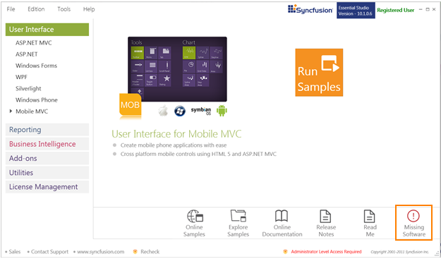{border="0"} 

Figure 112:  Missing Software

 

Recommended Software

 

Recommended Software will list the prerequisites for all platforms.  A {border="0"} symbol appears if all recommended software for the platform is installed in your system. A {border="0"}symbol appears if any recommended software for a platform is not installed in your system before installing Essential Studio.

Recheck option will recheck the prerequisites list and refresh the currently installed software list.

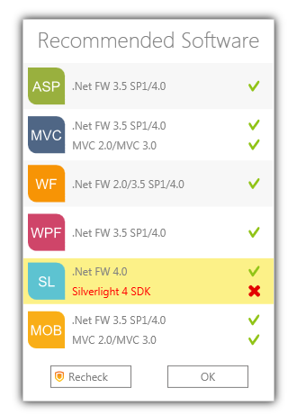{border="0"}

Figure 113:  Recommended Software

 

Other Utilities

**[                   ]{style="FONT-FAMILY: 'Trebuchet MS','sans-serif'; COLOR: #15428b"}**

This section allows you to access the following:

 

[·      ]{style="FONT-FAMILY: Symbol"}[[Add ons]{.UGHyperlink}](ms-xhelp:///?Id=7c10b224-a4ea-4fc9-9001-14a1ae81e83b)-This lists the Add-on utilities that will help the user to utilize additional product services from Syncfusion. All the three editions offer different add-ons for users.

[·      ]{style="FONT-FAMILY: Symbol"}[[Utilities]{style="FONT-FAMILY: 'Trebuchet MS','sans-serif'; FONT-SIZE: 9pt"}](ms-xhelp:///?Id=8c8e64fd-3f7c-49b7-9da4-ead03a407645)- This accordion set displays the common utilities for all editions:

 

[·      ]{style="FONT-FAMILY: Symbol"}[[Toolbox Configuration]{.UGHyperlink}](ms-xhelp:///?Id=8c8e64fd-3f7c-49b7-9da4-ead03a407645)-This installer allows you to configure Syncfusion controls for various .NET frameworks in combination with compatible Visual Studio versions.

[·      ]{style="FONT-FAMILY: Symbol"}[Assembly Manager](ms-xhelp:///?Id=b0ff40c1-1de5-47db-a178-653b0a5beaa4)-This utility allows the user to manage installation and uninstallation of Syncfusion Essential Studio assemblies in the GAC and in the Assemblies folders.

[·      ]{style="FONT-FAMILY: Symbol"}[Build Management](ms-xhelp:///?Id=b19f910c-29e3-4e73-86a2-575122081468) -- This utility allows you to build or debug assemblies using the source installed in the Essential Studio's installed location.

[·      ]{style="FONT-FAMILY: Symbol"}[[Documentation]{.UGHyperlink}](ms-xhelp:///?Id=b19f910c-29e3-4e73-86a2-575122081468)-This provides access to view the online documentation and installed documentation.

[·      ]{style="FONT-FAMILY: Symbol"}[[License Manager]{.UGHyperlink}](ms-xhelp:///?Id=09734a55-89d7-4174-884a-f6b1811a0889)-This allows you to manage the licensing information such as the validity of license key and also the products that are licensed with this key.

[·      ]{style="FONT-FAMILY: Symbol"}[License Agreement](ms-xhelp:///?Id=09734a55-89d7-4174-884a-f6b1811a0889) -- This allows you to navigate to the Software License Agreement.

 

Other Information

Other information available in the dashboard is:

[·      ]{style="FONT-FAMILY: Symbol"}**Messages** **-** This section allows you to view the user registration information i.e. whether the user is registered or not.

 

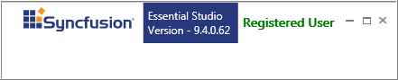{border="0"}

Figure 114: Message

 

[·      ]{style="FONT-FAMILY: Symbol"}[[Sales FAQ]{.UGHyperlink}](http://www.syncfusion.com/sales/faq)[[ ]{style="FONT-FAMILY: 'Trebuchet MS','sans-serif'; FONT-SIZE: 9pt"}]{.MsoHyperlink}- Clicking this link directs you to FAQ page, which lists common sales related queries and other sales contact information.

[·      ]{style="FONT-FAMILY: Symbol"}[[Contact Support]{.UGHyperlink}](http://www.syncfusion.com/Account/Logon?ReturnUrl=%2fsupport%2fdirecttrac)[ ]{.UGHyperlink}- Clicking this link directs you to Direct-Trac Login page to contact our support team.

[·      ]{style="FONT-FAMILY: Symbol"}[Website](http://www.syncfusion.com/)[ ]{.UGHyperlink}- Clicking this link directs you to Syncfusion website.

 

 

[]{#related-topics}
:::::
