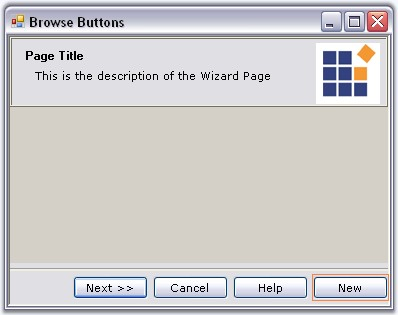
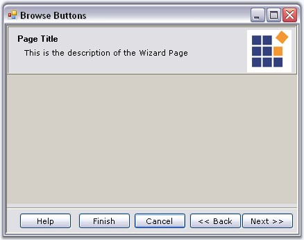
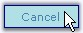
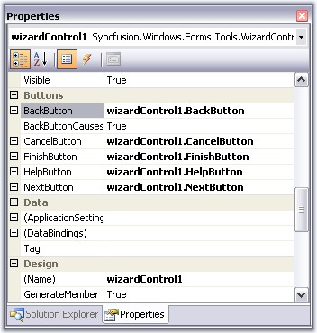

::: {style="DISPLAY: none"}
{#d2h_url_template}{#d2h_package_url style="WIDTH: 0px; DISPLAY: none; HEIGHT: 0px"}
:::

:::::::::: {.d2h_secondary_topic style="PADDING-BOTTOM: 10pt; MARGIN: 0pt; PADDING-LEFT: 0pt; PADDING-RIGHT: 0pt; PADDING-TOP: 0pt"}
##### Browse Buttons {#browse-buttons style="MARGIN-LEFT: 18pt; tab-stops: 18.0pt"}

[]{#p1052}[]{style="COLOR: #15428b"} 

The default buttons which are available for the Wizard control are Back, Next, Cancel and Help. The Next and the Back buttons facilitates users to navigate between wizard pages.

[]{style="COLOR: #15428b"} 

::: {style="BORDER-BOTTOM: windowtext 1pt solid; BORDER-LEFT: medium none; PADDING-BOTTOM: 1pt; MARGIN: 9pt 0pt 9pt 18pt; PADDING-LEFT: 0pt; PADDING-RIGHT: 0pt; BORDER-TOP: windowtext 1pt solid; BORDER-RIGHT: medium none; PADDING-TOP: 1pt"}
{border="0"} Note: You can navigate between the pages at Design Time also. See [[[Page Navigation at Design time]{style="COLOR: windowtext; FONT-SIZE: 9pt; TEXT-DECORATION: none; text-underline: none"}]{.UGHyperlink}](../../../../../../../../Documents%20and%20Settings/sylviap/Desktop/Tools%20-%20Part%202.docx#_Page_Selection_at)[[ ]{style="COLOR: windowtext; FONT-SIZE: 9pt; TEXT-DECORATION: none; text-underline: none"}]{.UGHyperlink}topic for more details.
:::

[]{style="COLOR: #15428b"} 

Button Visibility

[]{style="COLOR: #15428b"} 

By default, all the buttons are visible for all the Wizard pages. To change their visibility, use the below properties in individual pages.

[]{style="COLOR: #15428b"} 

::: {align="center"}
  ---------------------- -----------------------------------------------------
  Wizard Page Property   Description
  BackVisible            Specifies whether to display the \'Back\' button.
  CancelVisible          Specifies whether to display \'Cancel\' the button.
  FinishVisible          Specifies whether to display the \'Finish\' button.
  HelpVisible            Specifies whether to display the \'Help\' button.
  NextVisible            Specifies whether to display the \'Next\' button.
  ---------------------- -----------------------------------------------------
:::

[]{style="FONT-SIZE: 8pt"} 

::: {style="BORDER-BOTTOM: windowtext 1pt solid; BORDER-LEFT: medium none; PADDING-BOTTOM: 1pt; MARGIN: 9pt 0pt 9pt 18pt; PADDING-LEFT: 0pt; PADDING-RIGHT: 0pt; BORDER-TOP: windowtext 1pt solid; BORDER-RIGHT: medium none; PADDING-TOP: 1pt"}
[{border="0"}]{style="FONT-SIZE: 8pt"} Note: When you use more than one wizard page, you may set the BackVisible property of the first page to true to hide the back button.
:::

[]{style="COLOR: #15428b"} 

+-----------------------------------------------------------------------------------------------------------------------------------------------------------------------------------------------------------------------------------------------------------------------------------------------------------+
| **[\[C#\]]{style="FONT-FAMILY: 'Courier New'; COLOR: black"}**                                                                                                                                                                                                                                            |
|                                                                                                                                                                                                                                                                                                           |
| **[]{style="FONT-FAMILY: 'Courier New'; COLOR: black"}**                                                                                                                                                                                                                                                  |
|                                                                                                                                                                                                                                                                                                           |
| [this]{style="FONT-FAMILY: 'Courier New'; COLOR: blue"}[.]{style="FONT-FAMILY: 'Courier New'"}[wizardControlPage1.BackVisible = [true]{style="COLOR: blue"};]{style="FONT-FAMILY: 'Courier New'"}                                                                                                         |
|                                                                                                                                                                                                                                                                                                           |
| [this]{style="FONT-FAMILY: 'Courier New'; COLOR: blue"}[.wizardControlPage1.NextVisible =]{style="FONT-FAMILY: 'Courier New'"}[ ]{style="FONT-FAMILY: 'Courier New'"}[true]{style="FONT-FAMILY: 'Courier New'; COLOR: blue"}[;]{style="FONT-FAMILY: 'Courier New'"}[]{style="FONT-FAMILY: 'Courier New'"} |
|                                                                                                                                                                                                                                                                                                           |
| [this]{style="FONT-FAMILY: 'Courier New'; COLOR: blue"}[.wizardControlPage1.CancelVisible = [true]{style="COLOR: blue"};]{style="FONT-FAMILY: 'Courier New'"}                                                                                                                                             |
|                                                                                                                                                                                                                                                                                                           |
| [this]{style="FONT-FAMILY: 'Courier New'; COLOR: blue"}[.wizardControlPage1.HelpVisible = [true]{style="COLOR: blue"};]{style="FONT-FAMILY: 'Courier New'"}                                                                                                                                               |
|                                                                                                                                                                                                                                                                                                           |
| [this]{style="FONT-FAMILY: 'Courier New'; COLOR: blue"}[.wizardControlPage1.FinishVisible = [true]{style="COLOR: blue"};]{style="FONT-FAMILY: 'Courier New'"}[]{style="FONT-FAMILY: 'Courier New'"}                                                                                                       |
+-----------------------------------------------------------------------------------------------------------------------------------------------------------------------------------------------------------------------------------------------------------------------------------------------------------+

[]{style="COLOR: #15428b"} 

+------------------------------------------------------------------------------------------------------------------------------------------------------------+
| **[\[VB.NET\]]{style="FONT-FAMILY: 'Courier New'; COLOR: black"}**                                                                                         |
|                                                                                                                                                            |
| **[]{style="FONT-FAMILY: 'Courier New'; COLOR: black"}**                                                                                                   |
|                                                                                                                                                            |
| [Me]{style="FONT-FAMILY: 'Courier New'; COLOR: blue"}[.wizardControlPage1.BackVisible = [True]{style="COLOR: blue"}]{style="FONT-FAMILY: 'Courier New'"}   |
|                                                                                                                                                            |
| [Me]{style="FONT-FAMILY: 'Courier New'; COLOR: blue"}[.wizardControlPage1.NextVisible = [true]{style="COLOR: blue"}]{style="FONT-FAMILY: 'Courier New'"}   |
|                                                                                                                                                            |
| [Me]{style="FONT-FAMILY: 'Courier New'; COLOR: blue"}[.wizardControlPage1.CancelVisible = [True]{style="COLOR: blue"}]{style="FONT-FAMILY: 'Courier New'"} |
|                                                                                                                                                            |
| [Me]{style="FONT-FAMILY: 'Courier New'; COLOR: blue"}[.wizardControlPage1.HelpVisible = [true]{style="COLOR: blue"}]{style="FONT-FAMILY: 'Courier New'"}   |
|                                                                                                                                                            |
| [Me]{style="FONT-FAMILY: 'Courier New'; COLOR: blue"}[.wizardControlPage1.FinishVisible = [True]{style="COLOR: blue"}]{style="FONT-FAMILY: 'Courier New'"} |
+------------------------------------------------------------------------------------------------------------------------------------------------------------+

[]{style="COLOR: #15428b"} 

You can enable or disable the buttons using the respective button enabled properties.[]{#p1053}

[]{style="COLOR: #15428b"} 

::: {align="center"}
  ---------------------------- ---------------------------------------------------------------------------------
  WizardControlPage Property   Description
  BackEnabled                  Specifies whether the state of \'Back\' button should be enabled or disabled.
  CancelEnabled                Specifies whether the state of \'Cancel\' button should be enabled or disabled.
  FinishEnabled                Specifies whether the state of \'Finish\' button should be enabled or disabled.
  HelpEnabled                  Specifies whether the state of \'Help\' button should be enabled or disabled.
  NextEnabled                  Specifies whether the state of \'Next\' button should be enabled or disabled.
  ---------------------------- ---------------------------------------------------------------------------------
:::

 

**Adding Finish Button**

 

In order to display the \'Finish\' button in the last wizard page, user should set **CancelOverFinish** property in the WizardControlPage Collection Editor to false. This property determines if the Cancel button is positioned over the Finish button. If this property is set to true, it will override the **FinishVisible** property.

[]{style="COLOR: #15428b"} 

+-----------------------------------------------------------------------------------------------------------------------------------------------------------+
| **[\[C#\]]{style="FONT-FAMILY: 'Courier New'; COLOR: black"}**                                                                                            |
|                                                                                                                                                           |
| []{style="COLOR: #15428b"}                                                                                                                                |
|                                                                                                                                                           |
| [this]{style="FONT-FAMILY: 'Courier New'; COLOR: blue"}[.finishPage.CancelOverFinish = [false]{style="COLOR: blue"};]{style="FONT-FAMILY: 'Courier New'"} |
+-----------------------------------------------------------------------------------------------------------------------------------------------------------+

[]{style="COLOR: #15428b"} 

+--------------------------------------------------------------------------------------------------------------------------------------------------------+
| **[\[VB.NET\]]{style="FONT-FAMILY: 'Courier New'; COLOR: black"}**                                                                                     |
|                                                                                                                                                        |
| []{style="COLOR: #15428b"}                                                                                                                             |
|                                                                                                                                                        |
| [Me]{style="FONT-FAMILY: 'Courier New'; COLOR: blue"}[.finishPage.CancelOverFinish = [False]{style="COLOR: blue"}]{style="FONT-FAMILY: 'Courier New'"} |
+--------------------------------------------------------------------------------------------------------------------------------------------------------+

[]{style="COLOR: #15428b"} 

A sample which includes button settings is available in the below sample installation location.

 

***..\\My Documents\\Syncfusion\\EssentialStudio\\Version Number\\Windows\\Tools.Windows\\Samples\\2.0\\Wizard Package\\WizardControl_Tutorial***

 

**See Also**

[]{style="COLOR: black"} 

[[How to set spacing between the browsing buttons?]{.UGHyperlink}](../../../../../../../../Documents%20and%20Settings/sylviap/Desktop/Tools%20-%20Part%202.docx#_How_to_set)[, ]{.UGHyperlink}

 

 

###### []{#_Adding_and_Reordering}3.13.1.4.3.1    Adding and Reordering Buttons {#adding-and-reordering-buttons style="MARGIN-LEFT: 18pt; tab-stops: 18.0pt"}

[]{#p1054} 

**Adding new Button to a Page**

 

The following code snippet shows how to add a button to the wizard control browse buttons.

[]{style="COLOR: #15428b"} 

+------------------------------------------------------------------------------------------------------------------------------------------------------------------------------------------------------------------+
| **[\[C#\]]{style="FONT-FAMILY: 'Courier New'; COLOR: black"}**                                                                                                                                                   |
|                                                                                                                                                                                                                  |
| **[]{style="FONT-FAMILY: 'Courier New'; COLOR: black"}**                                                                                                                                                         |
|                                                                                                                                                                                                                  |
| [// To add a new button ]{style="FONT-FAMILY: 'Courier New'; COLOR: green"}                                                                                                                                      |
|                                                                                                                                                                                                                  |
| [Button btn = [new]{style="COLOR: blue"} Button(); ]{style="FONT-FAMILY: 'Courier New'"}                                                                                                                         |
|                                                                                                                                                                                                                  |
| [btn.Text = \"New Button\"; ]{style="FONT-FAMILY: 'Courier New'"}                                                                                                                                                |
|                                                                                                                                                                                                                  |
| [// Add button]{style="FONT-FAMILY: 'Courier New'; COLOR: green"}[ to ]{style="FONT-FAMILY: 'Courier New'; COLOR: green"}[the WizardControl]{style="FONT-FAMILY: 'Courier New'; COLOR: green"}                   |
|                                                                                                                                                                                                                  |
| [this]{style="FONT-FAMILY: 'Courier New'; COLOR: blue"}[.wizardControl1.Controls.Add(btn); ]{style="FONT-FAMILY: 'Courier New'"}                                                                                 |
|                                                                                                                                                                                                                  |
| [// Set the constraints]{style="FONT-FAMILY: 'Courier New'; COLOR: green"}[ for ]{style="FONT-FAMILY: 'Courier New'; COLOR: green"}[the newly created Button ]{style="FONT-FAMILY: 'Courier New'; COLOR: green"} |
|                                                                                                                                                                                                                  |
| [this]{style="FONT-FAMILY: 'Courier New'; COLOR: blue"}[.wizardControl1.GridBagLayout.GetConstraintsRef(btn).GridPosX = 6; ]{style="FONT-FAMILY: 'Courier New'"}                                                 |
|                                                                                                                                                                                                                  |
| [this]{style="FONT-FAMILY: 'Courier New'; COLOR: blue"}[.wizardControl1.GridBagLayout.GetConstraintsRef(btn).GridPosY = 5; ]{style="FONT-FAMILY: 'Courier New'"}[]{style="FONT-FAMILY: 'Courier New'"}           |
+------------------------------------------------------------------------------------------------------------------------------------------------------------------------------------------------------------------+

[]{style="COLOR: #15428b"} 

+----------------------------------------------------------------------------------------------------------------------------------------------------------------------------------------------------+
| **[\[]{style="FONT-FAMILY: 'Courier New'; COLOR: black"}[VB.NET\]]{style="FONT-FAMILY: 'Courier New'; COLOR: black"}[]{style="FONT-FAMILY: 'Courier New'; COLOR: black"}**                         |
|                                                                                                                                                                                                    |
| **[]{style="FONT-FAMILY: 'Courier New'; COLOR: black"}**                                                                                                                                           |
|                                                                                                                                                                                                    |
| [\' To add a new button ]{style="FONT-FAMILY: 'Courier New'; COLOR: green"}                                                                                                                        |
|                                                                                                                                                                                                    |
| [Private]{style="FONT-FAMILY: 'Courier New'; COLOR: blue"}[ btn [As]{style="COLOR: blue"} Button = [New]{style="COLOR: blue"} Button()]{style="FONT-FAMILY: 'Courier New'"}                        |
|                                                                                                                                                                                                    |
| [Private]{style="FONT-FAMILY: 'Courier New'; COLOR: blue"}[ btn.Text = [\"New Button\"]{style="COLOR: maroon"}]{style="FONT-FAMILY: 'Courier New'"}                                                |
|                                                                                                                                                                                                    |
| [\']{style="FONT-FAMILY: 'Courier New'; COLOR: maroon"}[Add button to the WizardControl]{style="FONT-FAMILY: 'Courier New'; COLOR: green"}                                                         |
|                                                                                                                                                                                                    |
| [Me]{style="FONT-FAMILY: 'Courier New'; COLOR: blue"}[.wizardControl1.Controls.Add(btn)]{style="FONT-FAMILY: 'Courier New'"}                                                                       |
|                                                                                                                                                                                                    |
| [\' Set the constraints for the newly created Button ]{style="FONT-FAMILY: 'Courier New'; COLOR: green"}                                                                                           |
|                                                                                                                                                                                                    |
| [Me]{style="FONT-FAMILY: 'Courier New'; COLOR: blue"}[.wizardControl1.GridBagLayout.GetConstraintsRef(btn).GridPosX = 6]{style="FONT-FAMILY: 'Courier New'"}                                       |
|                                                                                                                                                                                                    |
| [Me]{style="FONT-FAMILY: 'Courier New'; COLOR: blue"}[.wizardControl1.GridBagLayout.GetConstraintsRef(btn).GridPosY = 5]{style="FONT-FAMILY: 'Courier New'"}[]{style="FONT-FAMILY: 'Courier New'"} |
+----------------------------------------------------------------------------------------------------------------------------------------------------------------------------------------------------+

[]{style="COLOR: #15428b"} 

{border="0"}

 

Figure 1222: Button \"New\" added to the Wizard Control

[]{style="COLOR: #15428b"} 

Reordering the Button Sequence

 

In order to change the position of the buttons, user should handle the GridPosX property and change the position programmatically.

[]{style="COLOR: #15428b"} 

::: {style="BORDER-BOTTOM: windowtext 1pt solid; BORDER-LEFT: medium none; PADDING-BOTTOM: 1pt; MARGIN: 9pt 0pt 9pt 18pt; PADDING-LEFT: 0pt; PADDING-RIGHT: 0pt; BORDER-TOP: windowtext 1pt solid; BORDER-RIGHT: medium none; PADDING-TOP: 1pt"}
{border="0"} Note: Wizard control automatically sets position for some buttons after page change. Setting the position for controls manually, is not supported in those cases.
:::

[]{style="COLOR: #15428b"} 

+------------------------------------------------------------------------------------------------------------------------------------------------------------------------------------------------------------------------------------------------------------------------------------------------+
| **[\[]{style="FONT-FAMILY: 'Courier New'; COLOR: black"}[C#\]]{style="FONT-FAMILY: 'Courier New'; COLOR: black"}[]{style="FONT-FAMILY: 'Courier New'; COLOR: black"}**                                                                                                                         |
|                                                                                                                                                                                                                                                                                                |
| **[]{style="FONT-FAMILY: 'Courier New'; COLOR: black"}**                                                                                                                                                                                                                                       |
|                                                                                                                                                                                                                                                                                                |
| [//Setting the GridPosX property for changing the position of buttons]{style="FONT-FAMILY: 'Courier New'; COLOR: green"}                                                                                                                                                                       |
|                                                                                                                                                                                                                                                                                                |
| [this]{style="FONT-FAMILY: 'Courier New'; COLOR: blue"}[.wizardControl1.GridBagLayout.GetConstraintsRef([this]{style="COLOR: blue"}.wizardControl1.BackButton).GridPosX = 5;]{style="FONT-FAMILY: 'Courier New'"}                                                                              |
|                                                                                                                                                                                                                                                                                                |
| [this]{style="FONT-FAMILY: 'Courier New'; COLOR: blue"}[.wizardControl1.GridBagLayout.GetConstraintsRef([this]{style="COLOR: blue"}.wizardControl1.NextButton).GridPosX = 6;]{style="FONT-FAMILY: 'Courier New'"}                                                                              |
|                                                                                                                                                                                                                                                                                                |
| [this]{style="FONT-FAMILY: 'Courier New'; COLOR: blue"}[.wizardControl1.GridBagLayout.GetConstraintsRef([this]{style="COLOR: blue"}.wizardControl1.CancelButton).GridPosX = 4;]{style="FONT-FAMILY: 'Courier New'"}                                                                            |
|                                                                                                                                                                                                                                                                                                |
| [this]{style="FONT-FAMILY: 'Courier New'; COLOR: blue"}[.wizardControl1.GridBagLayout.GetConstraintsRef([this]{style="COLOR: blue"}.wizardControl1.FinishButton).GridPosX = 3;]{style="FONT-FAMILY: 'Courier New'"}                                                                            |
|                                                                                                                                                                                                                                                                                                |
| [this]{style="FONT-FAMILY: 'Courier New'; COLOR: blue"}[.wizardControl1.GridBagLayout.GetConstraintsRef([this]{style="COLOR: blue"}.wizardControl1.HelpButton).GridPosX = 2;]{style="FONT-FAMILY: 'Courier New'"}[ ]{style="FONT-FAMILY: 'Courier New'"}[]{style="FONT-FAMILY: 'Courier New'"} |
+------------------------------------------------------------------------------------------------------------------------------------------------------------------------------------------------------------------------------------------------------------------------------------------------+

[]{#p1055}[]{style="COLOR: #15428b"} 

+----------------------------------------------------------------------------------------------------------------------------------------------------------------------------------------------------------------------------------------------------------------------------------------------------------------------------------------------------------------+
| **[\[VB.NET\]]{style="FONT-FAMILY: 'Courier New'; COLOR: black"}**                                                                                                                                                                                                                                                                                             |
|                                                                                                                                                                                                                                                                                                                                                                |
| **[]{style="FONT-FAMILY: 'Courier New'; COLOR: black"}**                                                                                                                                                                                                                                                                                                       |
|                                                                                                                                                                                                                                                                                                                                                                |
| [\'Setting the GridPosX property for changing the position of buttons]{style="FONT-FAMILY: 'Courier New'; COLOR: green"}                                                                                                                                                                                                                                       |
|                                                                                                                                                                                                                                                                                                                                                                |
| [Me]{style="FONT-FAMILY: 'Courier New'; COLOR: blue"}[.wizardControl1.GridBagLayout.GetConstraintsRef(]{style="FONT-FAMILY: 'Courier New'; COLOR: black"}[Me]{style="FONT-FAMILY: 'Courier New'; COLOR: blue"}[.wizardControl1.BackButton).GridPosX = 5]{style="FONT-FAMILY: 'Courier New'; COLOR: black"}                                                     |
|                                                                                                                                                                                                                                                                                                                                                                |
| [Me]{style="FONT-FAMILY: 'Courier New'; COLOR: blue"}[.wizardControl1.GridBagLayout.GetConstraintsRef(]{style="FONT-FAMILY: 'Courier New'; COLOR: black"}[Me]{style="FONT-FAMILY: 'Courier New'; COLOR: blue"}[.wizardControl1.NextButton).GridPosX = 6]{style="FONT-FAMILY: 'Courier New'; COLOR: black"}                                                     |
|                                                                                                                                                                                                                                                                                                                                                                |
| [Me]{style="FONT-FAMILY: 'Courier New'; COLOR: blue"}[.wizardControl1.GridBagLayout.GetConstraintsRef(]{style="FONT-FAMILY: 'Courier New'; COLOR: black"}[Me]{style="FONT-FAMILY: 'Courier New'; COLOR: blue"}[.wizardControl1.CancelButton).GridPosX = 4]{style="FONT-FAMILY: 'Courier New'; COLOR: black"}                                                   |
|                                                                                                                                                                                                                                                                                                                                                                |
| [Me]{style="FONT-FAMILY: 'Courier New'; COLOR: blue"}[.wizardControl1.GridBagLayout.GetConstraintsRef(]{style="FONT-FAMILY: 'Courier New'; COLOR: black"}[Me]{style="FONT-FAMILY: 'Courier New'; COLOR: blue"}[.wizardControl1.FinishButton).GridPosX= 3]{style="FONT-FAMILY: 'Courier New'; COLOR: black"}                                                    |
|                                                                                                                                                                                                                                                                                                                                                                |
| [Me]{style="FONT-FAMILY: 'Courier New'; COLOR: blue"}[.wizardControl1.GridBagLayout.GetConstraintsRef(]{style="FONT-FAMILY: 'Courier New'; COLOR: black"}[Me]{style="FONT-FAMILY: 'Courier New'; COLOR: blue"}[.wizardControl1.HelpButton).GridPosX = 2]{style="FONT-FAMILY: 'Courier New'; COLOR: black"}[]{style="FONT-FAMILY: 'Courier New'; COLOR: black"} |
+----------------------------------------------------------------------------------------------------------------------------------------------------------------------------------------------------------------------------------------------------------------------------------------------------------------------------------------------------------------+

[]{style="COLOR: #15428b"} 

{border="0"}

[]{style="COLOR: #15428b"} 

Figure 1223: Browse Buttons Arranged according to GridPosX Property

 

 

###### []{#_Button_Appearance}3.13.1.4.3.2    Button Appearance {#button-appearance style="MARGIN-LEFT: 18pt; tab-stops: 18.0pt"}

[]{style="COLOR: #15428b"} 

The default browse buttons are the normal windows button controls. Appearance of the buttons can be controlled using the properties available. Some appearance properties are listed below.

[]{style="COLOR: #15428b"} 

::: {align="center"}
+-----------------------------------+----------------------------------------------------------------------------------------------------------------------------------------------+
| Button Property                   | Description                                                                                                                                  |
+-----------------------------------+----------------------------------------------------------------------------------------------------------------------------------------------+
| FlatStyle                         | Sets the appearance of the button control. The flat style are,                                                                               |
|                                   |                                                                                                                                              |
|                                   |                                                                                                                                              |
|                                   |                                                                                                                                              |
|                                   | [·      ]{style="FONT-FAMILY: Symbol"}Flat,                                                                                                  |
|                                   |                                                                                                                                              |
|                                   | [·      ]{style="FONT-FAMILY: Symbol"}Popup,                                                                                                 |
|                                   |                                                                                                                                              |
|                                   | [·      ]{style="FONT-FAMILY: Symbol"}Standard and                                                                                           |
|                                   |                                                                                                                                              |
|                                   | [·      ]{style="FONT-FAMILY: Symbol"}System.                                                                                                |
+-----------------------------------+----------------------------------------------------------------------------------------------------------------------------------------------+
| FlatAppearance                    | Sets the appearance of the border, color for mouse state and check state. This setting will be effective only when FlatStyle is set to Flat. |
+-----------------------------------+----------------------------------------------------------------------------------------------------------------------------------------------+
| Font                              | Sets the Font Style for the button text.                                                                                                     |
+-----------------------------------+----------------------------------------------------------------------------------------------------------------------------------------------+
| ForeColor                         | Sets the fore color for the button text.                                                                                                     |
+-----------------------------------+----------------------------------------------------------------------------------------------------------------------------------------------+
| Image                             | Sets an image icon for the button.                                                                                                           |
+-----------------------------------+----------------------------------------------------------------------------------------------------------------------------------------------+
| ImageAlign                        | Specifies the image alignment in the control.                                                                                                |
+-----------------------------------+----------------------------------------------------------------------------------------------------------------------------------------------+
| ImageIndex                        | Specifies the image index for the button, when ImageList property is used.                                                                   |
+-----------------------------------+----------------------------------------------------------------------------------------------------------------------------------------------+
| ImageList                         | Specifies the image list.                                                                                                                    |
+-----------------------------------+----------------------------------------------------------------------------------------------------------------------------------------------+
| Text                              | Specifies the button text.                                                                                                                   |
+-----------------------------------+----------------------------------------------------------------------------------------------------------------------------------------------+
| TextAlign                         | Specifies the alignment of the text.                                                                                                         |
+-----------------------------------+----------------------------------------------------------------------------------------------------------------------------------------------+
| TextImageRelation                 | Specifies the relative location of the image to the text on the button.                                                                      |
+-----------------------------------+----------------------------------------------------------------------------------------------------------------------------------------------+
:::

[]{style="COLOR: #15428b"} 

+-------------------------------------------------------------------------------------------------------------------------------------------------------------------------------------------------------------------------------------------------------------+
| **[\[]{style="FONT-FAMILY: 'Courier New'; COLOR: black"}[C#\]]{style="FONT-FAMILY: 'Courier New'; COLOR: black"}[]{style="FONT-FAMILY: 'Courier New'; COLOR: black"}**                                                                                      |
|                                                                                                                                                                                                                                                             |
| **[]{style="FONT-FAMILY: 'Courier New'; COLOR: black"}**                                                                                                                                                                                                    |
|                                                                                                                                                                                                                                                             |
| [//Sets the flat style settings for the Cancel button]{style="FONT-FAMILY: 'Courier New'; COLOR: green"}                                                                                                                                                    |
|                                                                                                                                                                                                                                                             |
| [this]{style="FONT-FAMILY: 'Courier New'; COLOR: blue"}[.wizardControl1.CancelButton.FlatStyle = System.Windows.Forms.[FlatStyle]{style="COLOR: teal"}.Flat;]{style="FONT-FAMILY: 'Courier New'"}                                                           |
|                                                                                                                                                                                                                                                             |
| [this]{style="FONT-FAMILY: 'Courier New'; COLOR: blue"}[.wizardControl1.CancelButton.ForeColor = System.Drawing.[Color]{style="COLOR: teal"}.SteelBlue;]{style="FONT-FAMILY: 'Courier New'"}                                                                |
|                                                                                                                                                                                                                                                             |
| [this]{style="FONT-FAMILY: 'Courier New'; COLOR: blue"}[.wizardControl1.CancelButton.FlatAppearance.BorderSize = 1;]{style="FONT-FAMILY: 'Courier New'"}                                                                                                    |
|                                                                                                                                                                                                                                                             |
| [this]{style="FONT-FAMILY: 'Courier New'; COLOR: blue"}[.wizardControl1.CancelButton.FlatAppearance.BorderColor = System.Drawing.[Color]{style="COLOR: teal"}.DarkBlue;]{style="FONT-FAMILY: 'Courier New'"}                                                |
|                                                                                                                                                                                                                                                             |
| [this]{style="FONT-FAMILY: 'Courier New'; COLOR: blue"}[.wizardControl1.CancelButton.FlatAppearance.MouseOverBackColor = System.Drawing.[Color]{style="COLOR: teal"}.PowderBlue;]{style="FONT-FAMILY: 'Courier New'"}[]{style="FONT-FAMILY: 'Courier New'"} |
+-------------------------------------------------------------------------------------------------------------------------------------------------------------------------------------------------------------------------------------------------------------+

[]{#p1056}[]{style="COLOR: #15428b"} 

+-------------------------------------------------------------------------------------------------------------------------------------------------------------------------------------------------------------------------------------------------------------+
| **[\[VB.NET\]]{style="FONT-FAMILY: 'Courier New'; COLOR: black"}**                                                                                                                                                                                          |
|                                                                                                                                                                                                                                                             |
| **[]{style="FONT-FAMILY: 'Courier New'; COLOR: black"}**                                                                                                                                                                                                    |
|                                                                                                                                                                                                                                                             |
| [\'Sets the flat style settings for the Cancel button]{style="FONT-FAMILY: 'Courier New'; COLOR: green"}                                                                                                                                                    |
|                                                                                                                                                                                                                                                             |
| [Me]{style="FONT-FAMILY: 'Courier New'; COLOR: blue"}[.wizardControl1.CancelButton.FlatStyle = System.Windows.Forms.FlatStyle.Flat ]{style="FONT-FAMILY: 'Courier New'"}                                                                                    |
|                                                                                                                                                                                                                                                             |
| [Me]{style="FONT-FAMILY: 'Courier New'; COLOR: blue"}[.wizardControl1.CancelButton.ForeColor = System.Drawing.Color.SteelBlue]{style="FONT-FAMILY: 'Courier New'"}                                                                                          |
|                                                                                                                                                                                                                                                             |
| [this]{style="FONT-FAMILY: 'Courier New'; COLOR: blue"}[.wizardControl1.CancelButton.FlatAppearance.BorderSize = 1;]{style="FONT-FAMILY: 'Courier New'"}                                                                                                    |
|                                                                                                                                                                                                                                                             |
| [this]{style="FONT-FAMILY: 'Courier New'; COLOR: blue"}[.wizardControl1.CancelButton.FlatAppearance.BorderColor = System.Drawing.[Color]{style="COLOR: teal"}.DarkBlue;]{style="FONT-FAMILY: 'Courier New'"}                                                |
|                                                                                                                                                                                                                                                             |
| [this]{style="FONT-FAMILY: 'Courier New'; COLOR: blue"}[.wizardControl1.CancelButton.FlatAppearance.MouseOverBackColor = System.Drawing.[Color]{style="COLOR: teal"}.PowderBlue;]{style="FONT-FAMILY: 'Courier New'"}[]{style="FONT-FAMILY: 'Courier New'"} |
+-------------------------------------------------------------------------------------------------------------------------------------------------------------------------------------------------------------------------------------------------------------+

[]{style="COLOR: #15428b"} 

{border="0"}

 

Figure 1224: ForeColor = \"SteelBlue\"; FlatStyle = \"Flat\"; BorderSize = \"1\";

BoderColor = \"DarkBlue\"; MouseOverBackColor = \"PowderBlue\"

**[]{style="COLOR: #15428b"}** 

::: {style="BORDER-BOTTOM: windowtext 1pt solid; BORDER-LEFT: medium none; PADDING-BOTTOM: 1pt; MARGIN: 9pt 0pt 9pt 18pt; PADDING-LEFT: 0pt; PADDING-RIGHT: 0pt; BORDER-TOP: windowtext 1pt solid; BORDER-RIGHT: medium none; PADDING-TOP: 1pt"}
{border="0"} Note: You can access the properties of CancelButton, FinishButton, HelpButton and NextButton using WizardControl.CancelButton, WizardControl.FinishButton, WizardControl.HelpButton and WizardControl.NextButton properties respectively.
:::

[]{style="COLOR: #15428b"} 

{border="0"}

 

Figure 1225: BackButton, CancelButton, Finishbutton, HelpButton, NextButton Properties

 

 

 

 

[]{#related-topics}
::::::::::
