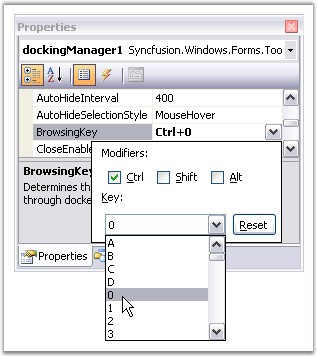

::: {style="DISPLAY: none"}
{#d2h_url_template}{#d2h_package_url style="WIDTH: 0px; DISPLAY: none; HEIGHT: 0px"}
:::

:::::: {.d2h_secondary_topic style="PADDING-BOTTOM: 10pt; MARGIN: 0pt; PADDING-LEFT: 0pt; PADDING-RIGHT: 0pt; PADDING-TOP: 0pt"}
##### Browsing Key {#browsing-key style="tab-stops: 0pt"}

[]{#p60}[]{style="COLOR: #15428b"} 

DockingManager lets you specify the keyboard key combinations, to tab through the docked controls. The property **BrowsingKey** of the docking manager, provides modifiers like CTRL, SHIFT, ALT Keys and keys like A, B, C, 0, 1 etc., User can also provide a combination of modifiers and the keys. Example \"CTRL + 0\", as shown in the image below.

[]{style="COLOR: #15428b"} 

{border="0"}

[]{style="COLOR: #15428b"} 

Figure 65: Browsing Key set for the Docking Manager

[]{style="COLOR: #15428b"} 

::: {style="BORDER-BOTTOM: windowtext 1pt solid; BORDER-LEFT: medium none; PADDING-BOTTOM: 1pt; MARGIN-TOP: 9pt; PADDING-LEFT: 0pt; PADDING-RIGHT: 0pt; MARGIN-BOTTOM: 9pt; BORDER-TOP: windowtext 1pt solid; BORDER-RIGHT: medium none; PADDING-TOP: 1pt"}
{border="0"} Note:[ ]{style="COLOR: black; FONT-SIZE: 8pt"}Before we set this property for docking manager, we have to set TabStop property to true and TabIndex property with the appropriate value. Otherwise its BrowsingKey property will not work.
:::

[]{style="COLOR: #15428b"} 

::: {align="center"}
  ------------------------- ---------------------------------------------------------------------------------------
  DockingManager Property   Description
  Browsing Key              Determines the value of the key which can be used to tab through the docked controls.
  ------------------------- ---------------------------------------------------------------------------------------
:::

[]{style="COLOR: #15428b"} 

::: {align="center"}
  ------------------------ ----------------------------------------------------------------------
  DockedControl Property   Description
  TabStop                  Indicates whether TAB key can be used to focus the control.
  TabIndex                 Determines the index in the tab order that this control will occupy.
  ------------------------ ----------------------------------------------------------------------
:::

[]{style="COLOR: #15428b"} 

These properties can be set through code by using the below code.

[]{style="COLOR: #15428b"} 

+------------------------------------------------------------------------------------------------------------------------------------------------------------------------------------------------------------------------------------------------------------------------------------------------------+
| **[\[C#\]]{style="FONT-FAMILY: 'Courier New'; COLOR: black"}**                                                                                                                                                                                                                                       |
|                                                                                                                                                                                                                                                                                                      |
| []{style="FONT-FAMILY: 'Courier New'; COLOR: green"}                                                                                                                                                                                                                                                 |
|                                                                                                                                                                                                                                                                                                      |
| [this]{style="FONT-FAMILY: 'Courier New'; COLOR: blue"}[.dockingManager1.BrowsingKey = ((System.Windows.Forms.[Keys]{style="COLOR: teal"})((System.Windows.Forms.[Keys]{style="COLOR: teal"}.Control \| System.Windows.Forms.[Keys]{style="COLOR: teal"}.D0)));]{style="FONT-FAMILY: 'Courier New'"} |
|                                                                                                                                                                                                                                                                                                      |
| [this]{style="FONT-FAMILY: 'Courier New'; COLOR: blue"}[.treeViewAdv1.TabStop = [true]{style="COLOR: blue"};]{style="FONT-FAMILY: 'Courier New'"}                                                                                                                                                    |
|                                                                                                                                                                                                                                                                                                      |
| [this]{style="FONT-FAMILY: 'Courier New'; COLOR: blue"}[.treeViewAdv1.TabIndex = 0;]{style="FONT-FAMILY: 'Courier New'"}                                                                                                                                                                             |
+------------------------------------------------------------------------------------------------------------------------------------------------------------------------------------------------------------------------------------------------------------------------------------------------------+

[]{style="COLOR: #15428b"} 

+-------------------------------------------------------------------------------------------------------------------------------------------------------------------------------------------------------------------------------------------------------------------------------+
| **[\[VB.NET\]]{style="FONT-FAMILY: 'Courier New'; COLOR: black"}**                                                                                                                                                                                                            |
|                                                                                                                                                                                                                                                                               |
| []{style="FONT-FAMILY: 'Courier New'; COLOR: green"}                                                                                                                                                                                                                          |
|                                                                                                                                                                                                                                                                               |
| [Me]{style="FONT-FAMILY: 'Courier New'; COLOR: blue"}[.DockingManager1.BrowsingKey = [CType]{style="COLOR: blue"}((System.Windows.Forms.Keys.Control [Or]{style="COLOR: blue"} System.Windows.Forms.Keys.D0), System.Windows.Forms.Keys)]{style="FONT-FAMILY: 'Courier New'"} |
|                                                                                                                                                                                                                                                                               |
| [Me]{style="FONT-FAMILY: 'Courier New'; COLOR: blue"}[.TreeViewAdv1.TabStop = [True]{style="COLOR: blue"}]{style="FONT-FAMILY: 'Courier New'"}                                                                                                                                |
|                                                                                                                                                                                                                                                                               |
| [Me]{style="FONT-FAMILY: 'Courier New'; COLOR: blue"}[.TreeViewAdv1.TabIndex = 0]{style="FONT-FAMILY: 'Courier New'"}                                                                                                                                                         |
+-------------------------------------------------------------------------------------------------------------------------------------------------------------------------------------------------------------------------------------------------------------------------------+

 

[]{#p61} 

 

[]{#related-topics}
::::::
