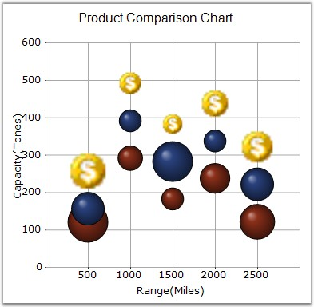

::: {style="DISPLAY: none"}
{#d2h_url_template}{#d2h_package_url style="WIDTH: 0px; DISPLAY: none; HEIGHT: 0px"}
:::

:::: {.d2h_secondary_topic style="PADDING-BOTTOM: 10pt; MARGIN: 0pt; PADDING-LEFT: 0pt; PADDING-RIGHT: 0pt; PADDING-TOP: 0pt"}
#### BubbleType {#bubbletype style="tab-stops: 0pt"}

**[]{style="FONT-FAMILY: 'Trebuchet MS','sans-serif'"}** 

**BubbleType -** Specifies whether to render the data point symbols as circle, square or as image.

[]{style="FONT-FAMILY: 'Trebuchet MS','sans-serif'; FONT-SIZE: 9pt"} 

::: {align="center"}
+-------------------------------------+------------------------------------------+
|                                                                                |
|                                                                                |
| Details                                                                        |
+-------------------------------------+------------------------------------------+
| Possible Values                     | Circle - Symbol is rendered as a circle\ |
|                                     | Square - Symbol is rendered as a square  |
|                                     |                                          |
|                                     | Image - Symbol is rendered as an image   |
+-------------------------------------+------------------------------------------+
| Default Value                       | Circle                                   |
+-------------------------------------+------------------------------------------+
| 2D / 3D Limitations                 | No                                       |
+-------------------------------------+------------------------------------------+
| Applies to Chart Element            | All Series                               |
+-------------------------------------+------------------------------------------+
| Applies to Chart Types              | Bubble                                   |
+-------------------------------------+------------------------------------------+
:::

**[]{style="FONT-FAMILY: 'Trebuchet MS','sans-serif'; FONT-SIZE: 9pt"}** 

Here is some sample code to specify an Image BubbleType.

[]{style="FONT-FAMILY: 'Trebuchet MS','sans-serif'; FONT-SIZE: 9pt"} 

Series wide setting

**[]{style="FONT-FAMILY: 'Trebuchet MS','sans-serif'"}** 

+-------------------------------------------------------------------------------------------------------------------------------------------------------------------------------------------------------------------------------------------------------------------+
| **[\[C#\]]{style="FONT-FAMILY: 'Courier New'; COLOR: black"}**                                                                                                                                                                                                    |
|                                                                                                                                                                                                                                                                   |
| **[]{style="FONT-FAMILY: 'Courier New'; COLOR: black"}**                                                                                                                                                                                                          |
|                                                                                                                                                                                                                                                                   |
| [this]{style="FONT-FAMILY: 'Courier New'; COLOR: blue"}[.ChartWebControl1.Series\[0\].ConfigItems.BubbleItem.BubbleType = ChartBubbleType.Image;]{style="FONT-FAMILY: 'Courier New'"}                                                                             |
|                                                                                                                                                                                                                                                                   |
| [this]{style="FONT-FAMILY: 'Courier New'; COLOR: blue"}[.ChartWebControl1.Series\[0\].Style.Images = [new]{style="COLOR: blue"} [ChartImageCollection]{style="COLOR: teal"}([this]{style="COLOR: blue"}.imageList1.Images );]{style="FONT-FAMILY: 'Courier New'"} |
|                                                                                                                                                                                                                                                                   |
| [this]{style="FONT-FAMILY: 'Courier New'; COLOR: blue"}[.ChartWebControl1.Series\[0\].Style.ImageIndex = 0;]{style="FONT-FAMILY: 'Courier New'"}                                                                                                                  |
+-------------------------------------------------------------------------------------------------------------------------------------------------------------------------------------------------------------------------------------------------------------------+

[]{style="FONT-FAMILY: 'Trebuchet MS','sans-serif'; FONT-SIZE: 9pt"} 

+--------------------------------------------------------------------------------------------------------------------------------------------------------------------------------------------------------------------------------------+
| **[\[VB.NET\]]{style="FONT-FAMILY: 'Courier New'; COLOR: black"}**                                                                                                                                                                   |
|                                                                                                                                                                                                                                      |
| **[]{style="FONT-FAMILY: 'Courier New'; COLOR: black"}**                                                                                                                                                                             |
|                                                                                                                                                                                                                                      |
| [Me]{style="FONT-FAMILY: 'Courier New'; COLOR: blue"}[.ChartWebControl1.Series\[0\].ConfigItems.BubbleItem.BubbleType = ChartBubbleType.Image]{style="FONT-FAMILY: 'Courier New'"}                                                   |
|                                                                                                                                                                                                                                      |
| [Me]{style="FONT-FAMILY: 'Courier New'; COLOR: blue"}[.ChartWebControl1.Series\[0\].Style.Images = [New]{style="COLOR: blue"} ChartImageCollection([Me]{style="COLOR: blue"}.imageList1.Images)]{style="FONT-FAMILY: 'Courier New'"} |
|                                                                                                                                                                                                                                      |
| [Me]{style="FONT-FAMILY: 'Courier New'; COLOR: blue"}[.ChartWebControl1.Series\[0\].Style.ImageIndex = 0]{style="FONT-FAMILY: 'Courier New'"}                                                                                        |
+--------------------------------------------------------------------------------------------------------------------------------------------------------------------------------------------------------------------------------------+

**[]{style="COLOR: red; FONT-SIZE: 8pt"}** 

Specific Data Point Setting

**[]{style="COLOR: red; FONT-SIZE: 8pt"}** 

Specify image for specific data points.

[]{style="FONT-FAMILY: 'Trebuchet MS','sans-serif'; FONT-SIZE: 9pt"} 

+-------------------------------------------------------------------------------------------------------------------------------------------------------------------------------------------------------------------------------------------------------------------------+
| **[\[C#\]]{style="FONT-FAMILY: 'Courier New'; COLOR: black"}**                                                                                                                                                                                                          |
|                                                                                                                                                                                                                                                                         |
| **[]{style="FONT-FAMILY: 'Courier New'; COLOR: black"}**                                                                                                                                                                                                                |
|                                                                                                                                                                                                                                                                         |
| [this]{style="FONT-FAMILY: 'Courier New'; COLOR: blue"}[.ChartWebControl1.Series\[0\].Styles\[0\].Images = [new]{style="COLOR: blue"} [ChartImageCollection]{style="COLOR: teal"}([this]{style="COLOR: blue"}.imageList1.Images );]{style="FONT-FAMILY: 'Courier New'"} |
|                                                                                                                                                                                                                                                                         |
| [this]{style="FONT-FAMILY: 'Courier New'; COLOR: blue"}[.ChartWebControl1.Series\[0\].Styles\[0\].ImageIndex = 0;]{style="FONT-FAMILY: 'Courier New'"}                                                                                                                  |
|                                                                                                                                                                                                                                                                         |
| [this]{style="FONT-FAMILY: 'Courier New'; COLOR: blue"}[.ChartWebControl1.Series\[0\].Styles\[1\].Images = [new]{style="COLOR: blue"} [ChartImageCollection]{style="COLOR: teal"}([this]{style="COLOR: blue"}.imageList1.Images );]{style="FONT-FAMILY: 'Courier New'"} |
|                                                                                                                                                                                                                                                                         |
| [this]{style="FONT-FAMILY: 'Courier New'; COLOR: blue"}[.ChartWebControl1.Series\[0\].Styles\[1\].ImageIndex = 1;]{style="FONT-FAMILY: 'Courier New'"}                                                                                                                  |
+-------------------------------------------------------------------------------------------------------------------------------------------------------------------------------------------------------------------------------------------------------------------------+

[]{style="FONT-FAMILY: 'Trebuchet MS','sans-serif'; FONT-SIZE: 9pt"} 

+------------------------------------------------------------------------------------------------------------------------------------------------------------------------------------------------------------------------------------------+
| **[\[VB.NET\]]{style="FONT-FAMILY: 'Courier New'; COLOR: black"}**                                                                                                                                                                       |
|                                                                                                                                                                                                                                          |
| **[]{style="FONT-FAMILY: 'Courier New'; COLOR: black"}**                                                                                                                                                                                 |
|                                                                                                                                                                                                                                          |
| [Me]{style="FONT-FAMILY: 'Courier New'; COLOR: blue"}[.ChartWebControl1.Series\[0\].Styles(0).Images = [New]{style="COLOR: blue"} ChartImageCollection([Me]{style="COLOR: blue"}.imageList1.Images)]{style="FONT-FAMILY: 'Courier New'"} |
|                                                                                                                                                                                                                                          |
| [Me]{style="FONT-FAMILY: 'Courier New'; COLOR: blue"}[.ChartWebControl1.Series\[0\].Styles\[0).ImageIndex = 0]{style="FONT-FAMILY: 'Courier New'"}                                                                                       |
|                                                                                                                                                                                                                                          |
| [Me]{style="FONT-FAMILY: 'Courier New'; COLOR: blue"}[.ChartWebControl1.Series\[0\].Styles(1).Images = [New]{style="COLOR: blue"} ChartImageCollection([Me]{style="COLOR: blue"}.imageList1.Images)]{style="FONT-FAMILY: 'Courier New'"} |
|                                                                                                                                                                                                                                          |
| [Me]{style="FONT-FAMILY: 'Courier New'; COLOR: blue"}[.ChartWebControl1.Series\[0\].Styles(1).ImageIndex = 1]{style="FONT-FAMILY: 'Courier New'"}                                                                                        |
+------------------------------------------------------------------------------------------------------------------------------------------------------------------------------------------------------------------------------------------+

**[]{style="COLOR: red; FONT-SIZE: 8pt"}** 

{border="0"}

**[]{style="FONT-FAMILY: 'Trebuchet MS','sans-serif'"}** 

Figure 97: Image BubbleType Chart Series

**[]{style="FONT-FAMILY: 'Trebuchet MS','sans-serif'"}** 

See Also

[]{style="FONT-FAMILY: 'Trebuchet MS','sans-serif'; FONT-SIZE: 9pt"} 

[[Bubble Chart]{.UGHyperlink}](ms-xhelp:///?Id=f561904f-bd17-40a3-a1b6-498ed5d46c43)[]{.UGHyperlink}

[]{#p82} 

[]{#related-topics}
::::
