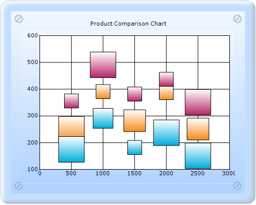

::: {style="DISPLAY: none"}
{#d2h_url_template}{#d2h_package_url style="WIDTH: 0px; DISPLAY: none; HEIGHT: 0px"}
:::

:::: {.d2h_secondary_topic style="PADDING-BOTTOM: 10pt; MARGIN: 0pt; PADDING-LEFT: 0pt; PADDING-RIGHT: 0pt; PADDING-TOP: 0pt"}
#### BubbleType {#bubbletype style="tab-stops: 0pt"}

BubbleType specifies whether to render the data point symbols as a circle, a square, or an image.

::: {align="center"}
+-------------------------------------+-----------------------------------------------+
| Details                                                                             |
+-------------------------------------+-----------------------------------------------+
| Possible values                     | **Circle** - Symbol is rendered as a circle.\ |
|                                     | **Square** - Symbol is rendered as a square.  |
|                                     |                                               |
|                                     | **Image** - Symbol is rendered as an image.   |
+-------------------------------------+-----------------------------------------------+
| Default value                       | Circle                                        |
+-------------------------------------+-----------------------------------------------+
| 2D/3D limitations                   | No                                            |
+-------------------------------------+-----------------------------------------------+
| Application to chart element        | All series                                    |
+-------------------------------------+-----------------------------------------------+
| Application to chart types          | Bubble chart                                  |
+-------------------------------------+-----------------------------------------------+
:::

 

{border="0"}

Figure 204: Bubble chart with BubbleType Square

Bubble chart with BubbleType can be created in two ways:

[·      ]{style="FONT-FAMILY: Symbol"}Builder

[·      ]{style="FONT-FAMILY: Symbol"}ChartModel

More:

[ ]{#related-topics}

[{border="0" align="absMiddle"}Builder](ms-xhelp:///?Id=aa5f86e7-0e29-4f26-a2dc-1ca5f37d41bc){style="TEXT-DECORATION: none"}

[{border="0" align="absMiddle"}ChartModel](ms-xhelp:///?Id=21a97b46-9efd-4921-bc5b-2b3762b4f717){style="TEXT-DECORATION: none"}
::::
