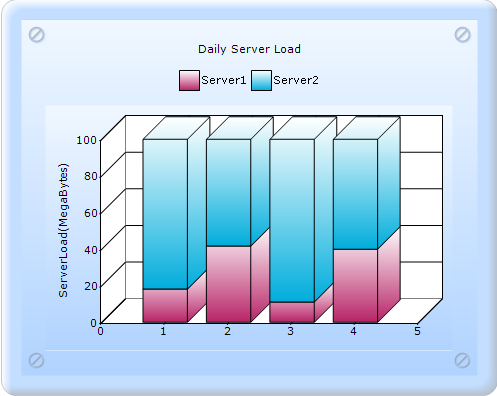

::: {style="DISPLAY: none"}
{#d2h_url_template}{#d2h_package_url style="WIDTH: 0px; DISPLAY: none; HEIGHT: 0px"}
:::

:::: {.d2h_secondary_topic style="PADDING-BOTTOM: 10pt; MARGIN: 0pt; PADDING-LEFT: 0pt; PADDING-RIGHT: 0pt; PADDING-TOP: 0pt"}
##### Builder {#builder style="tab-stops: 0pt"}

[]{style="FONT-FAMILY: 'Calibri','sans-serif'"} 

To create a Stacking Column100 chart through Builder:

1.   In **Controller**, return view to the corresponding **View** page.

 

::: {style="BORDER-BOTTOM: #c8c8c8 1pt solid; BORDER-LEFT: #c8c8c8 1pt solid; PADDING-BOTTOM: 1pt; MARGIN-TOP: 0pt; PADDING-LEFT: 4pt; PADDING-RIGHT: 4pt; MARGIN-BOTTOM: 0pt; BACKGROUND: #f0f0f0; BORDER-TOP: #c8c8c8 1pt solid; BORDER-RIGHT: #c8c8c8 1pt solid; PADDING-TOP: 1pt"}
\[C#\]

[        [public]{style="COLOR: blue"} [ActionResult]{style="COLOR: #2b91af"} SimpleChart()]{style="FONT-FAMILY: 'Courier New'"}

[        {            ]{style="FONT-FAMILY: 'Courier New'"}

[            [return]{style="COLOR: blue"} View();]{style="FONT-FAMILY: 'Courier New'"}

[        }]{style="FONT-FAMILY: 'Courier New'"}
:::

 

2.   In the **View** page, invoke the **ChartBuilder** by using the control ID as the first argument.

3.   Add the **Series** to the **ChartModel** and set the series type to **StackingColumn100**, and add the **Points** to the series and set the style.

4.   Set the **ChartModel** and **ChartArea** properties.

[]{style="FONT-FAMILY: 'Calibri','sans-serif'"} 

+------------------------------------------------------------------------------------------------------------------------------------------------------------------------------+
| **View\[ASPX\]**                                                                                                                                                             |
|                                                                                                                                                                              |
| [    [\<%]{style="BACKGROUND: yellow"}[=]{style="COLOR: blue"} Html.Chart([\"SimpleChart\"]{style="COLOR: #a31515"}).Series(series =\>{]{style="FONT-FAMILY: 'Courier New'"} |
|                                                                                                                                                                              |
| [                **    series.Add().Type(Syncfusion.Windows.Forms.Chart.[ChartSeriesType]{style="COLOR: #2b91af"}. StackingColumn100)**]{style="FONT-FAMILY: 'Courier New'"} |
|                                                                                                                                                                              |
| [                                .Text([\"Server 1\"]{style="COLOR: #a31515"})]{style="FONT-FAMILY: 'Courier New'"}                                                          |
|                                                                                                                                                                              |
| [                                .Points(point =\>]{style="FONT-FAMILY: 'Courier New'"}                                                                                      |
|                                                                                                                                                                              |
| [                                {]{style="FONT-FAMILY: 'Courier New'"}                                                                                                      |
|                                                                                                                                                                              |
| [                                    point.Add(1, 200);]{style="FONT-FAMILY: 'Courier New'"}                                                                                 |
|                                                                                                                                                                              |
| [                                    point.Add(2, 500);]{style="FONT-FAMILY: 'Courier New'"}                                                                                 |
|                                                                                                                                                                              |
| [                                    point.Add(3, 100);]{style="FONT-FAMILY: 'Courier New'"}                                                                                 |
|                                                                                                                                                                              |
| [                                    point.Add(4, 400);]{style="FONT-FAMILY: 'Courier New'"}                                                                                 |
|                                                                                                                                                                              |
| [                                });]{style="FONT-FAMILY: 'Courier New'"}                                                                                                    |
|                                                                                                                                                                              |
| [                **    series.Add().Type(Syncfusion.Windows.Forms.Chart.[ChartSeriesType]{style="COLOR: #2b91af"}. StackingColumn100)**]{style="FONT-FAMILY: 'Courier New'"} |
|                                                                                                                                                                              |
| [                                .Text([\"Server 2\"]{style="COLOR: #a31515"})]{style="FONT-FAMILY: 'Courier New'"}                                                          |
|                                                                                                                                                                              |
| [                                ]{style="FONT-FAMILY: 'Courier New'"}[.Points(point =\>]{style="FONT-FAMILY: 'Courier New'"}                                                |
|                                                                                                                                                                              |
| [                                {]{style="FONT-FAMILY: 'Courier New'"}                                                                                                      |
|                                                                                                                                                                              |
| [                                    point.Add(1, 900);]{style="FONT-FAMILY: 'Courier New'"}                                                                                 |
|                                                                                                                                                                              |
| [                                    point.Add(2, 700);]{style="FONT-FAMILY: 'Courier New'"}                                                                                 |
|                                                                                                                                                                              |
| [                                    point.Add(3, 800);]{style="FONT-FAMILY: 'Courier New'"}                                                                                 |
|                                                                                                                                                                              |
| [                                    point.Add(4, 600);]{style="FONT-FAMILY: 'Courier New'"}                                                                                 |
|                                                                                                                                                                              |
| [                                });]{style="FONT-FAMILY: 'Courier New'"}                                                                                                    |
|                                                                                                                                                                              |
| [            }).Skins([ChartModelSkins]{style="COLOR: #2b91af"}.Office2007Blue)]{style="FONT-FAMILY: 'Courier New'"}                                                         |
|                                                                                                                                                                              |
| [            .ChartSeriesSkins([ChartSeriesSkins]{style="COLOR: #2b91af"}.Analog)]{style="FONT-FAMILY: 'Courier New'"}                                                       |
|                                                                                                                                                                              |
| [              .ShowLegend([true]{style="COLOR: blue"})]{style="FONT-FAMILY: 'Courier New'"}                                                                                 |
|                                                                                                                                                                              |
| [              .LegendsPlacement(Syncfusion.Windows.Forms.Chart.[ChartPlacement]{style="COLOR: #2b91af"}.Outside)]{style="FONT-FAMILY: 'Courier New'"}                       |
|                                                                                                                                                                              |
| [              .LegendPosition(Syncfusion.Windows.Forms.Chart.[ChartDock]{style="COLOR: #2b91af"}.Top)]{style="FONT-FAMILY: 'Courier New'"}                                  |
|                                                                                                                                                                              |
| [              .Legend(legend =\>{]{style="FONT-FAMILY: 'Courier New'"}                                                                                                      |
|                                                                                                                                                                              |
| [                  legend.Alignment(Syncfusion.Windows.Forms.Chart.[ChartAlignment]{style="COLOR: #2b91af"}.Center);]{style="FONT-FAMILY: 'Courier New'"}                    |
|                                                                                                                                                                              |
| [              }).Series3D([true]{style="COLOR: blue"})]{style="FONT-FAMILY: 'Courier New'"}                                                                                 |
|                                                                                                                                                                              |
| [              .Size([new]{style="COLOR: blue"} System.Drawing.[Size]{style="COLOR: #2b91af"}(500, 400))]{style="FONT-FAMILY: 'Courier New'"}                                |
|                                                                                                                                                                              |
| [              .BorderAppearance(border =\>{]{style="FONT-FAMILY: 'Courier New'"}                                                                                            |
|                                                                                                                                                                              |
| [                  border.SkinStyle(Syncfusion.Windows.Forms.Chart.[ChartBorderSkinStyle]{style="COLOR: #2b91af"}.Pinned);]{style="FONT-FAMILY: 'Courier New'"}              |
|                                                                                                                                                                              |
| [              }).PrimaryYAxis(yaxis =\>{]{style="FONT-FAMILY: 'Courier New'"}                                                                                               |
|                                                                                                                                                                              |
| [                  yaxis.Title([\"Server Load(MegaBytes)\"]{style="COLOR: #a31515"});]{style="FONT-FAMILY: 'Courier New'"}                                                   |
|                                                                                                                                                                              |
| [              }).Text([\"Daily Server Load\"]{style="COLOR: #a31515"})]{style="FONT-FAMILY: 'Courier New'"}                                                                 |
|                                                                                                                                                                              |
| [    [%\>]{style="BACKGROUND: yellow"}]{style="FONT-FAMILY: 'Courier New'"}                                                                                                  |
+------------------------------------------------------------------------------------------------------------------------------------------------------------------------------+

 

[]{style="FONT-FAMILY: 'Calibri','sans-serif'"} 

+------------------------------------------------------------------------------------------------------------------------------------------------------------------------------+
| **View\[cshtml\]**                                                                                                                                                           |
|                                                                                                                                                                              |
| [    [\@{]{style="BACKGROUND: yellow"} Html.Chart([\"SimpleChart\"]{style="COLOR: #a31515"}).Series(series =\>{]{style="FONT-FAMILY: 'Courier New'"}                         |
|                                                                                                                                                                              |
| [                **    series.Add().Type(Syncfusion.Windows.Forms.Chart.[ChartSeriesType]{style="COLOR: #2b91af"}. StackingColumn100)**]{style="FONT-FAMILY: 'Courier New'"} |
|                                                                                                                                                                              |
| [                                .Text([\"Server 1\"]{style="COLOR: #a31515"})]{style="FONT-FAMILY: 'Courier New'"}                                                          |
|                                                                                                                                                                              |
| [                                .Points(point =\>]{style="FONT-FAMILY: 'Courier New'"}                                                                                      |
|                                                                                                                                                                              |
| [                                {]{style="FONT-FAMILY: 'Courier New'"}                                                                                                      |
|                                                                                                                                                                              |
| [                                    point.Add(1, 200);]{style="FONT-FAMILY: 'Courier New'"}                                                                                 |
|                                                                                                                                                                              |
| [                                    point.Add(2, 500);]{style="FONT-FAMILY: 'Courier New'"}                                                                                 |
|                                                                                                                                                                              |
| [                                    point.Add(3, 100);]{style="FONT-FAMILY: 'Courier New'"}                                                                                 |
|                                                                                                                                                                              |
| [                                    point.Add(4, 400);]{style="FONT-FAMILY: 'Courier New'"}                                                                                 |
|                                                                                                                                                                              |
| [                                });]{style="FONT-FAMILY: 'Courier New'"}                                                                                                    |
|                                                                                                                                                                              |
| [                **    series.Add().Type(Syncfusion.Windows.Forms.Chart.[ChartSeriesType]{style="COLOR: #2b91af"}. StackingColumn100)**]{style="FONT-FAMILY: 'Courier New'"} |
|                                                                                                                                                                              |
| [                                .Text([\"Server 2\"]{style="COLOR: #a31515"})]{style="FONT-FAMILY: 'Courier New'"}                                                          |
|                                                                                                                                                                              |
| [                                ]{style="FONT-FAMILY: 'Courier New'"}[.Points(point =\>]{style="FONT-FAMILY: 'Courier New'"}                                                |
|                                                                                                                                                                              |
| [                                {]{style="FONT-FAMILY: 'Courier New'"}                                                                                                      |
|                                                                                                                                                                              |
| [                                    point.Add(1, 900);]{style="FONT-FAMILY: 'Courier New'"}                                                                                 |
|                                                                                                                                                                              |
| [                                    point.Add(2, 700);]{style="FONT-FAMILY: 'Courier New'"}                                                                                 |
|                                                                                                                                                                              |
| [                                    point.Add(3, 800);]{style="FONT-FAMILY: 'Courier New'"}                                                                                 |
|                                                                                                                                                                              |
| [                                    point.Add(4, 600);]{style="FONT-FAMILY: 'Courier New'"}                                                                                 |
|                                                                                                                                                                              |
| [                                });]{style="FONT-FAMILY: 'Courier New'"}                                                                                                    |
|                                                                                                                                                                              |
| [            }).Skins([ChartModelSkins]{style="COLOR: #2b91af"}.Office2007Blue)]{style="FONT-FAMILY: 'Courier New'"}                                                         |
|                                                                                                                                                                              |
| [            .ChartSeriesSkins([ChartSeriesSkins]{style="COLOR: #2b91af"}.Analog)]{style="FONT-FAMILY: 'Courier New'"}                                                       |
|                                                                                                                                                                              |
| [              .ShowLegend([true]{style="COLOR: blue"})]{style="FONT-FAMILY: 'Courier New'"}                                                                                 |
|                                                                                                                                                                              |
| [              .LegendsPlacement(Syncfusion.Windows.Forms.Chart.[ChartPlacement]{style="COLOR: #2b91af"}.Outside)]{style="FONT-FAMILY: 'Courier New'"}                       |
|                                                                                                                                                                              |
| [              .LegendPosition(Syncfusion.Windows.Forms.Chart.[ChartDock]{style="COLOR: #2b91af"}.Top)]{style="FONT-FAMILY: 'Courier New'"}                                  |
|                                                                                                                                                                              |
| [              .Legend(legend =\>{]{style="FONT-FAMILY: 'Courier New'"}                                                                                                      |
|                                                                                                                                                                              |
| [                  legend.Alignment(Syncfusion.Windows.Forms.Chart.[ChartAlignment]{style="COLOR: #2b91af"}.Center);]{style="FONT-FAMILY: 'Courier New'"}                    |
|                                                                                                                                                                              |
| [              }).Series3D([true]{style="COLOR: blue"})]{style="FONT-FAMILY: 'Courier New'"}                                                                                 |
|                                                                                                                                                                              |
| [              .Size([new]{style="COLOR: blue"} System.Drawing.[Size]{style="COLOR: #2b91af"}(500, 400))]{style="FONT-FAMILY: 'Courier New'"}                                |
|                                                                                                                                                                              |
| [              .BorderAppearance(border =\>{]{style="FONT-FAMILY: 'Courier New'"}                                                                                            |
|                                                                                                                                                                              |
| [                  border.SkinStyle(Syncfusion.Windows.Forms.Chart.[ChartBorderSkinStyle]{style="COLOR: #2b91af"}.Pinned);]{style="FONT-FAMILY: 'Courier New'"}              |
|                                                                                                                                                                              |
| [              }).PrimaryYAxis(yaxis =\>{]{style="FONT-FAMILY: 'Courier New'"}                                                                                               |
|                                                                                                                                                                              |
| [                  yaxis.Title([\"Server Load(MegaBytes)\"]{style="COLOR: #a31515"});]{style="FONT-FAMILY: 'Courier New'"}                                                   |
|                                                                                                                                                                              |
| [              }).Text([\"Daily Server Load\"]{style="COLOR: #a31515"})]{style="FONT-FAMILY: 'Courier New'"}                                                                 |
|                                                                                                                                                                              |
| [              .Render();]{style="FONT-FAMILY: 'Courier New'"}                                                                                                               |
|                                                                                                                                                                              |
| [    [}]{style="BACKGROUND: yellow"}]{style="FONT-FAMILY: 'Courier New'"}                                                                                                    |
+------------------------------------------------------------------------------------------------------------------------------------------------------------------------------+

 

 

5.   Build and run the application, to get the following output:

[]{style="FONT-FAMILY: 'Calibri','sans-serif'"} 

{border="0"}

[]{style="FONT-FAMILY: 'Calibri','sans-serif'"} 

Figure 93: A 100 percent StackedColumn chart

[]{style="FONT-FAMILY: Consolas; BACKGROUND: yellow; FONT-SIZE: 9.5pt"} 

[]{#related-topics}
::::
