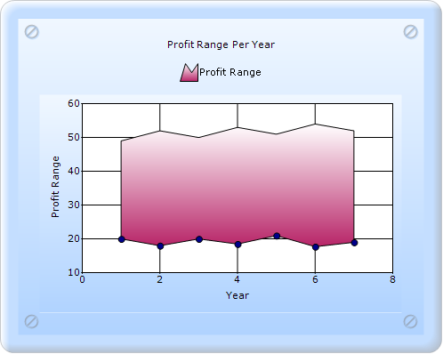

::: {style="DISPLAY: none"}
{#d2h_url_template}{#d2h_package_url style="WIDTH: 0px; DISPLAY: none; HEIGHT: 0px"}
:::

::: {.d2h_secondary_topic style="PADDING-BOTTOM: 10pt; MARGIN: 0pt; PADDING-LEFT: 0pt; PADDING-RIGHT: 0pt; PADDING-TOP: 0pt"}
##### Builder {#builder style="tab-stops: 0pt"}

[]{style="FONT-FAMILY: 'Calibri','sans-serif'"} 

To create a Range Area chart through Builder:

1.   In Controller, return view to the corresponding **View** page.

[]{style="FONT-FAMILY: 'Calibri','sans-serif'"} 

+-----------------------------------------------------------------------------------------------------------------------------------------------------------------------------------------------------------------+
| \[C#\]                                                                                                                                                                                                          |
|                                                                                                                                                                                                                 |
| [        ]{style="FONT-FAMILY: Consolas; FONT-SIZE: 9.5pt"}[public]{style="FONT-FAMILY: 'Courier New'; COLOR: blue"}[ [ActionResult]{style="COLOR: #2b91af"} SimpleChart()]{style="FONT-FAMILY: 'Courier New'"} |
|                                                                                                                                                                                                                 |
| [        {            ]{style="FONT-FAMILY: 'Courier New'"}                                                                                                                                                     |
|                                                                                                                                                                                                                 |
| [            [return]{style="COLOR: blue"} View();]{style="FONT-FAMILY: 'Courier New'"}                                                                                                                         |
|                                                                                                                                                                                                                 |
| [        }]{style="FONT-FAMILY: 'Courier New'"}                                                                                                                                                                 |
|                                                                                                                                                                                                                 |
| []{style="FONT-FAMILY: Consolas; COLOR: blue; FONT-SIZE: 9.5pt"}                                                                                                                                                |
+-----------------------------------------------------------------------------------------------------------------------------------------------------------------------------------------------------------------+

[]{style="FONT-FAMILY: 'Calibri','sans-serif'"} 

2.   In the **View** page, invoke the **ChartBuilder** by using the control ID as the first argument.

3.   Add the **Series** to the ChartModel and set the series type to **RangeArea**, and add the **Points** to the series and set the style.

4.   Set the **ChartModel** and **ChartArea** properties.

[]{style="FONT-FAMILY: 'Calibri','sans-serif'"} 

+-----------------------------------------------------------------------------------------------------------------------------------------------------------------------------------------------------------------------------------------------------------------------------------------+
| **View\[ASPX\]**                                                                                                                                                                                                                                                                        |
|                                                                                                                                                                                                                                                                                         |
| [    ]{style="FONT-FAMILY: Consolas; FONT-SIZE: 9.5pt"}[\<%]{style="FONT-FAMILY: 'Courier New'; BACKGROUND: yellow"}[=]{style="FONT-FAMILY: 'Courier New'; COLOR: blue"}[ Html.Chart([\"SimpleChart\"]{style="COLOR: #a31515"}).Series(series =\>{]{style="FONT-FAMILY: 'Courier New'"} |
|                                                                                                                                                                                                                                                                                         |
| **[    series.Add().Type(Syncfusion.Windows.Forms.Chart.[ChartSeriesType]{style="COLOR: #2b91af"}.RangeArea)]{style="FONT-FAMILY: 'Courier New'"}**                                                                                                                                     |
|                                                                                                                                                                                                                                                                                         |
| [                .Text([\"Profit Range\"]{style="COLOR: #a31515"})]{style="FONT-FAMILY: 'Courier New'"}                                                                                                                                                                                 |
|                                                                                                                                                                                                                                                                                         |
| [                .Style(style =\> {]{style="FONT-FAMILY: 'Courier New'"}                                                                                                                                                                                                                |
|                                                                                                                                                                                                                                                                                         |
| [                    style.Symbol(symbol =\>]{style="FONT-FAMILY: 'Courier New'"}                                                                                                                                                                                                       |
|                                                                                                                                                                                                                                                                                         |
| [                    {]{style="FONT-FAMILY: 'Courier New'"}                                                                                                                                                                                                                             |
|                                                                                                                                                                                                                                                                                         |
| [                        symbol.Shape(Syncfusion.Windows.Forms.Chart.[ChartSymbolShape]{style="COLOR: #2b91af"}.Circle)]{style="FONT-FAMILY: 'Courier New'"}                                                                                                                            |
|                                                                                                                                                                                                                                                                                         |
| [                              .Size([new]{style="COLOR: blue"} System.Drawing.[Size]{style="COLOR: #2b91af"}(7, 7))]{style="FONT-FAMILY: 'Courier New'"}                                                                                                                               |
|                                                                                                                                                                                                                                                                                         |
| [                              .Color(System.Drawing.[Color]{style="COLOR: #2b91af"}.DarkBlue);]{style="FONT-FAMILY: 'Courier New'"}                                                                                                                                                    |
|                                                                                                                                                                                                                                                                                         |
| [                    });]{style="FONT-FAMILY: 'Courier New'"}                                                                                                                                                                                                                           |
|                                                                                                                                                                                                                                                                                         |
| [                             ]{style="FONT-FAMILY: 'Courier New'"}                                                                                                                                                                                                                     |
|                                                                                                                                                                                                                                                                                         |
| [              }).Points(points =\>]{style="FONT-FAMILY: 'Courier New'"}                                                                                                                                                                                                                |
|                                                                                                                                                                                                                                                                                         |
| [                {]{style="FONT-FAMILY: 'Courier New'"}                                                                                                                                                                                                                                 |
|                                                                                                                                                                                                                                                                                         |
| **[                    points.Add(1, 20, 49);]{style="FONT-FAMILY: 'Courier New'"}**                                                                                                                                                                                                    |
|                                                                                                                                                                                                                                                                                         |
| **[                    points.Add(2, 18, 52);]{style="FONT-FAMILY: 'Courier New'"}**                                                                                                                                                                                                    |
|                                                                                                                                                                                                                                                                                         |
| **[                    points.Add(3, 20, 50);]{style="FONT-FAMILY: 'Courier New'"}**                                                                                                                                                                                                    |
|                                                                                                                                                                                                                                                                                         |
| **[                    points.Add(4, 18.5, 53);]{style="FONT-FAMILY: 'Courier New'"}**                                                                                                                                                                                                  |
|                                                                                                                                                                                                                                                                                         |
| **[                    points.Add(5, 21, 51);]{style="FONT-FAMILY: 'Courier New'"}**                                                                                                                                                                                                    |
|                                                                                                                                                                                                                                                                                         |
| **[                    points.Add(6, 17.7, 54);]{style="FONT-FAMILY: 'Courier New'"}**                                                                                                                                                                                                  |
|                                                                                                                                                                                                                                                                                         |
| **[                    points.Add(7, 19, 52);]{style="FONT-FAMILY: 'Courier New'"}**                                                                                                                                                                                                    |
|                                                                                                                                                                                                                                                                                         |
| [                });]{style="FONT-FAMILY: 'Courier New'"}                                                                                                                                                                                                                               |
|                                                                                                                                                                                                                                                                                         |
| [            }).Skins([ChartModelSkins]{style="COLOR: #2b91af"}.Office2007Blue)]{style="FONT-FAMILY: 'Courier New'"}                                                                                                                                                                    |
|                                                                                                                                                                                                                                                                                         |
| [                  .ChartSeriesSkins([ChartSeriesSkins]{style="COLOR: #2b91af"}.Analog)]{style="FONT-FAMILY: 'Courier New'"}                                                                                                                                                            |
|                                                                                                                                                                                                                                                                                         |
| [              .ShowLegend([true]{style="COLOR: blue"})]{style="FONT-FAMILY: 'Courier New'"}                                                                                                                                                                                            |
|                                                                                                                                                                                                                                                                                         |
| [              .LegendsPlacement(Syncfusion.Windows.Forms.Chart.[ChartPlacement]{style="COLOR: #2b91af"}.Outside)]{style="FONT-FAMILY: 'Courier New'"}                                                                                                                                  |
|                                                                                                                                                                                                                                                                                         |
| [              .LegendPosition(Syncfusion.Windows.Forms.Chart.[ChartDock]{style="COLOR: #2b91af"}.Top)]{style="FONT-FAMILY: 'Courier New'"}                                                                                                                                             |
|                                                                                                                                                                                                                                                                                         |
| [              .Legend(legend =\>{]{style="FONT-FAMILY: 'Courier New'"}                                                                                                                                                                                                                 |
|                                                                                                                                                                                                                                                                                         |
| [                  legend.Alignment(Syncfusion.Windows.Forms.Chart.[ChartAlignment]{style="COLOR: #2b91af"}.Center);]{style="FONT-FAMILY: 'Courier New'"}                                                                                                                               |
|                                                                                                                                                                                                                                                                                         |
| [            ]{style="FONT-FAMILY: 'Courier New'"}[}).Size([new]{style="COLOR: blue"} System.Drawing.[Size]{style="COLOR: #2b91af"}(500, 400))]{style="FONT-FAMILY: 'Courier New'"}                                                                                                     |
|                                                                                                                                                                                                                                                                                         |
| [              .BorderAppearance(border =\>{]{style="FONT-FAMILY: 'Courier New'"}                                                                                                                                                                                                       |
|                                                                                                                                                                                                                                                                                         |
| [                  border.SkinStyle(Syncfusion.Windows.Forms.Chart.[ChartBorderSkinStyle]{style="COLOR: #2b91af"}.Pinned);]{style="FONT-FAMILY: 'Courier New'"}                                                                                                                         |
|                                                                                                                                                                                                                                                                                         |
| [              }).PrimaryYAxis(yaxis =\>{]{style="FONT-FAMILY: 'Courier New'"}                                                                                                                                                                                                          |
|                                                                                                                                                                                                                                                                                         |
| [                  yaxis.Title([\"Profit Range\"]{style="COLOR: #a31515"});]{style="FONT-FAMILY: 'Courier New'"}                                                                                                                                                                        |
|                                                                                                                                                                                                                                                                                         |
| [              }).PrimaryXAxis(xaxis =\>]{style="FONT-FAMILY: 'Courier New'"}                                                                                                                                                                                                           |
|                                                                                                                                                                                                                                                                                         |
| [              {]{style="FONT-FAMILY: 'Courier New'"}                                                                                                                                                                                                                                   |
|                                                                                                                                                                                                                                                                                         |
| [                  xaxis.Title([\"Year\"]{style="COLOR: #a31515"});]{style="FONT-FAMILY: 'Courier New'"}                                                                                                                                                                                |
|                                                                                                                                                                                                                                                                                         |
| [              }).Text([\"Profit Range Per Year\"]{style="COLOR: #a31515"})        ]{style="FONT-FAMILY: 'Courier New'"}                                                                                                                                                                |
|                                                                                                                                                                                                                                                                                         |
| [    [%\>]{style="BACKGROUND: yellow"}]{style="FONT-FAMILY: 'Courier New'"}[]{style="FONT-FAMILY: Consolas; COLOR: blue; FONT-SIZE: 9.5pt"}                                                                                                                                             |
+-----------------------------------------------------------------------------------------------------------------------------------------------------------------------------------------------------------------------------------------------------------------------------------------+

[]{style="FONT-FAMILY: Consolas; BACKGROUND: yellow; FONT-SIZE: 9.5pt"} 

[]{style="FONT-FAMILY: 'Calibri','sans-serif'"} 

+----------------------------------------------------------------------------------------------------------------------------------------------------------------------------------------------------------------------------------------------------------------------------------------+
| **View\[cshtml\]**                                                                                                                                                                                                                                                                     |
|                                                                                                                                                                                                                                                                                        |
| [    ]{style="FONT-FAMILY: Consolas; FONT-SIZE: 9.5pt"}[\@{]{style="FONT-FAMILY: 'Courier New'; BACKGROUND: yellow"}[ ]{style="FONT-FAMILY: 'Courier New'; COLOR: blue"}[Html.Chart([\"SimpleChart\"]{style="COLOR: #a31515"}).Series(series =\>{]{style="FONT-FAMILY: 'Courier New'"} |
|                                                                                                                                                                                                                                                                                        |
| **[    series.Add().Type(Syncfusion.Windows.Forms.Chart.[ChartSeriesType]{style="COLOR: #2b91af"}.RangeArea)]{style="FONT-FAMILY: 'Courier New'"}**                                                                                                                                    |
|                                                                                                                                                                                                                                                                                        |
| [                .Text([\"Profit Range\"]{style="COLOR: #a31515"})]{style="FONT-FAMILY: 'Courier New'"}                                                                                                                                                                                |
|                                                                                                                                                                                                                                                                                        |
| [                .Style(style =\> {]{style="FONT-FAMILY: 'Courier New'"}                                                                                                                                                                                                               |
|                                                                                                                                                                                                                                                                                        |
| [                    style.Symbol(symbol =\>]{style="FONT-FAMILY: 'Courier New'"}                                                                                                                                                                                                      |
|                                                                                                                                                                                                                                                                                        |
| [                    {]{style="FONT-FAMILY: 'Courier New'"}                                                                                                                                                                                                                            |
|                                                                                                                                                                                                                                                                                        |
| [                        symbol.Shape(Syncfusion.Windows.Forms.Chart.[ChartSymbolShape]{style="COLOR: #2b91af"}.Circle)]{style="FONT-FAMILY: 'Courier New'"}                                                                                                                           |
|                                                                                                                                                                                                                                                                                        |
| [                              .Size([new]{style="COLOR: blue"} System.Drawing.[Size]{style="COLOR: #2b91af"}(7, 7))]{style="FONT-FAMILY: 'Courier New'"}                                                                                                                              |
|                                                                                                                                                                                                                                                                                        |
| [                              .Color(System.Drawing.[Color]{style="COLOR: #2b91af"}.DarkBlue);]{style="FONT-FAMILY: 'Courier New'"}                                                                                                                                                   |
|                                                                                                                                                                                                                                                                                        |
| [                    });]{style="FONT-FAMILY: 'Courier New'"}                                                                                                                                                                                                                          |
|                                                                                                                                                                                                                                                                                        |
| [                             ]{style="FONT-FAMILY: 'Courier New'"}                                                                                                                                                                                                                    |
|                                                                                                                                                                                                                                                                                        |
| [              }).Points(points =\>]{style="FONT-FAMILY: 'Courier New'"}                                                                                                                                                                                                               |
|                                                                                                                                                                                                                                                                                        |
| [                {]{style="FONT-FAMILY: 'Courier New'"}                                                                                                                                                                                                                                |
|                                                                                                                                                                                                                                                                                        |
| **[                    points.Add(1, 20, 49);]{style="FONT-FAMILY: 'Courier New'"}**                                                                                                                                                                                                   |
|                                                                                                                                                                                                                                                                                        |
| **[                    points.Add(2, 18, 52);]{style="FONT-FAMILY: 'Courier New'"}**                                                                                                                                                                                                   |
|                                                                                                                                                                                                                                                                                        |
| **[                    points.Add(3, 20, 50);]{style="FONT-FAMILY: 'Courier New'"}**                                                                                                                                                                                                   |
|                                                                                                                                                                                                                                                                                        |
| **[                    points.Add(4, 18.5, 53);]{style="FONT-FAMILY: 'Courier New'"}**                                                                                                                                                                                                 |
|                                                                                                                                                                                                                                                                                        |
| **[                    points.Add(5, 21, 51);]{style="FONT-FAMILY: 'Courier New'"}**                                                                                                                                                                                                   |
|                                                                                                                                                                                                                                                                                        |
| **[                    points.Add(6, 17.7, 54);]{style="FONT-FAMILY: 'Courier New'"}**                                                                                                                                                                                                 |
|                                                                                                                                                                                                                                                                                        |
| **[                    points.Add(7, 19, 52);]{style="FONT-FAMILY: 'Courier New'"}**                                                                                                                                                                                                   |
|                                                                                                                                                                                                                                                                                        |
| [                });]{style="FONT-FAMILY: 'Courier New'"}                                                                                                                                                                                                                              |
|                                                                                                                                                                                                                                                                                        |
| [            }).Skins([ChartModelSkins]{style="COLOR: #2b91af"}.Office2007Blue)]{style="FONT-FAMILY: 'Courier New'"}                                                                                                                                                                   |
|                                                                                                                                                                                                                                                                                        |
| [                  .ChartSeriesSkins([ChartSeriesSkins]{style="COLOR: #2b91af"}.Analog)]{style="FONT-FAMILY: 'Courier New'"}                                                                                                                                                           |
|                                                                                                                                                                                                                                                                                        |
| [              .ShowLegend([true]{style="COLOR: blue"})]{style="FONT-FAMILY: 'Courier New'"}                                                                                                                                                                                           |
|                                                                                                                                                                                                                                                                                        |
| [              .LegendsPlacement(Syncfusion.Windows.Forms.Chart.[ChartPlacement]{style="COLOR: #2b91af"}.Outside)]{style="FONT-FAMILY: 'Courier New'"}                                                                                                                                 |
|                                                                                                                                                                                                                                                                                        |
| [              .LegendPosition(Syncfusion.Windows.Forms.Chart.[ChartDock]{style="COLOR: #2b91af"}.Top)]{style="FONT-FAMILY: 'Courier New'"}                                                                                                                                            |
|                                                                                                                                                                                                                                                                                        |
| [              .Legend(legend =\>{]{style="FONT-FAMILY: 'Courier New'"}                                                                                                                                                                                                                |
|                                                                                                                                                                                                                                                                                        |
| [                  legend.Alignment(Syncfusion.Windows.Forms.Chart.[ChartAlignment]{style="COLOR: #2b91af"}.Center);]{style="FONT-FAMILY: 'Courier New'"}                                                                                                                              |
|                                                                                                                                                                                                                                                                                        |
| [            ]{style="FONT-FAMILY: 'Courier New'"}[}).Size([new]{style="COLOR: blue"} System.Drawing.[Size]{style="COLOR: #2b91af"}(500, 400))]{style="FONT-FAMILY: 'Courier New'"}                                                                                                    |
|                                                                                                                                                                                                                                                                                        |
| [              .BorderAppearance(border =\>{]{style="FONT-FAMILY: 'Courier New'"}                                                                                                                                                                                                      |
|                                                                                                                                                                                                                                                                                        |
| [                  border.SkinStyle(Syncfusion.Windows.Forms.Chart.[ChartBorderSkinStyle]{style="COLOR: #2b91af"}.Pinned);]{style="FONT-FAMILY: 'Courier New'"}                                                                                                                        |
|                                                                                                                                                                                                                                                                                        |
| [              }).PrimaryYAxis(yaxis =\>{]{style="FONT-FAMILY: 'Courier New'"}                                                                                                                                                                                                         |
|                                                                                                                                                                                                                                                                                        |
| [                  yaxis.Title([\"Profit Range\"]{style="COLOR: #a31515"});]{style="FONT-FAMILY: 'Courier New'"}                                                                                                                                                                       |
|                                                                                                                                                                                                                                                                                        |
| [              }).PrimaryXAxis(xaxis =\>]{style="FONT-FAMILY: 'Courier New'"}                                                                                                                                                                                                          |
|                                                                                                                                                                                                                                                                                        |
| [              {]{style="FONT-FAMILY: 'Courier New'"}                                                                                                                                                                                                                                  |
|                                                                                                                                                                                                                                                                                        |
| [                  xaxis.Title([\"Year\"]{style="COLOR: #a31515"});]{style="FONT-FAMILY: 'Courier New'"}                                                                                                                                                                               |
|                                                                                                                                                                                                                                                                                        |
| [              }).Text([\"Profit Range Per Year\"]{style="COLOR: #a31515"})]{style="FONT-FAMILY: 'Courier New'"}                                                                                                                                                                       |
|                                                                                                                                                                                                                                                                                        |
| [             .Render();        ]{style="FONT-FAMILY: 'Courier New'"}                                                                                                                                                                                                                  |
|                                                                                                                                                                                                                                                                                        |
| [    [}]{style="BACKGROUND: yellow"}]{style="FONT-FAMILY: 'Courier New'"}                                                                                                                                                                                                              |
|                                                                                                                                                                                                                                                                                        |
| []{style="FONT-FAMILY: Consolas; COLOR: blue; FONT-SIZE: 9.5pt"}                                                                                                                                                                                                                       |
+----------------------------------------------------------------------------------------------------------------------------------------------------------------------------------------------------------------------------------------------------------------------------------------+

[]{style="FONT-FAMILY: Consolas; BACKGROUND: yellow; FONT-SIZE: 9.5pt"} 

[]{style="FONT-FAMILY: Consolas; BACKGROUND: yellow; FONT-SIZE: 9.5pt"} 

5.   Build and run the application, to get the following output:

[]{style="FONT-FAMILY: 'Calibri','sans-serif'"} 

{border="0"}

[]{style="FONT-FAMILY: 'Calibri','sans-serif'"} 

Figure 107: Range Area chart

[]{style="FONT-FAMILY: 'Calibri','sans-serif'"} 

[]{#related-topics}
:::
