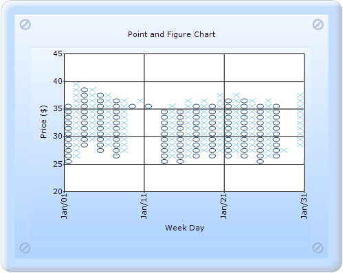

::: {style="DISPLAY: none"}
{#d2h_url_template}{#d2h_package_url style="WIDTH: 0px; DISPLAY: none; HEIGHT: 0px"}
:::

::::: {.d2h_secondary_topic style="PADDING-BOTTOM: 10pt; MARGIN: 0pt; PADDING-LEFT: 0pt; PADDING-RIGHT: 0pt; PADDING-TOP: 0pt"}
##### Builder {#builder style="tab-stops: 0pt"}

 

The steps to create a Point and Figure chart through Builder are as follows:

1.   In Controller, return view to the corresponding View page.

[]{style="FONT-FAMILY: 'Calibri','sans-serif'"} 

+----------------------------------------------------------------------------------------------------------------------------------+
| \[C#\]                                                                                                                           |
|                                                                                                                                  |
| [        [public]{style="COLOR: blue"} [ActionResult]{style="COLOR: #2b91af"} SimpleChart()]{style="FONT-FAMILY: 'Courier New'"} |
|                                                                                                                                  |
| [        {            ]{style="FONT-FAMILY: 'Courier New'"}                                                                      |
|                                                                                                                                  |
| [            [return]{style="COLOR: blue"} View();]{style="FONT-FAMILY: 'Courier New'"}                                          |
|                                                                                                                                  |
| [        }]{style="FONT-FAMILY: 'Courier New'"}                                                                                  |
|                                                                                                                                  |
| []{style="FONT-FAMILY: Consolas; COLOR: blue; FONT-SIZE: 9.5pt"}                                                                 |
+----------------------------------------------------------------------------------------------------------------------------------+

[]{style="FONT-FAMILY: 'Calibri','sans-serif'"} 

2.   In the View page, invoke the ChartBuilder by using the control ID as the first argument.

3.   Add the **Series** to the ChartModel and set the series type to **PointAndFigure**, and add the **Points** to the series and set the style.

4.   Set the ChartModel and ChartArea properties.

[]{style="FONT-FAMILY: 'Calibri','sans-serif'"} 

::: {style="BORDER-BOTTOM: #c8c8c8 1pt solid; BORDER-LEFT: #c8c8c8 1pt solid; PADDING-BOTTOM: 1pt; MARGIN-TOP: 0pt; PADDING-LEFT: 4pt; PADDING-RIGHT: 4pt; MARGIN-BOTTOM: 0pt; BACKGROUND: #f0f0f0; BORDER-TOP: #c8c8c8 1pt solid; BORDER-RIGHT: #c8c8c8 1pt solid; PADDING-TOP: 1pt"}
[ **View**]{style="FONT-FAMILY: 'Calibri','sans-serif'"}**\[ASPX\]**

[\<%]{style="FONT-FAMILY: 'Courier New'; BACKGROUND: yellow"}[]{style="FONT-FAMILY: 'Courier New'"}

[    [double]{style="COLOR: blue"}\[\] points1 = {   35.250,37.750,39.000,38.275,37.750,37.750,37.275,36.250,35.750,35.250,36.250,35.250,34.500,]{style="FONT-FAMILY: 'Courier New'"}

[                                          35.625,35.500,36.625,36.275,36.250,36.875,37.250,36.875,36.500,37.125,36.275,35.875,36.625,]{style="FONT-FAMILY: 'Courier New'"}

[                                          27.125,26.250,27.000,27.250,37.500,38.500,39.500,38.875,38.500,39.000,38.500,28.500,29.000,]{style="FONT-FAMILY: 'Courier New'"}

[                                          29.000,40.000,29.875,29.875,28.875,28.500,28.250,28.875,29.275,29.275,29.750,29.500,29.275,]{style="FONT-FAMILY: 'Courier New'"}

[                                          28.500,27.750,27.625,27.500,26.500,25.000,26.625,26.000,25.875,25.000,25.250,25.125,25.050};]{style="FONT-FAMILY: 'Courier New'"}

[]{style="FONT-FAMILY: 'Courier New'"} 

[    [double]{style="COLOR: blue"}\[\] points2 = {   25,27.500,28.750,28.025,27.500,27.500,27.025,26.250,35.750,35.250,36.250,35.250,34.500,]{style="FONT-FAMILY: 'Courier New'"}

[                                           25.625,25.500,26.625,26.275,26.250,26.875,27.250,26.875,26.500,27.125,26.275,25.875,26.625,]{style="FONT-FAMILY: 'Courier New'"}

[                                           27.125,26.250,27.000,27.250,27.500,38.500,39.500,38.875,38.500,39.000,28.500,28.500,29.000,]{style="FONT-FAMILY: 'Courier New'"}

[                                           29.000,40.000,29.875,29.875,28.875,28.500,28.250,28.875,29.275,29.275,29.750,29.500,29.275,]{style="FONT-FAMILY: 'Courier New'"}

[                                           28.500,27.750,27.625,27.500,26.500,25.000,26.625,26.000,25.875,25.000,25.250,25.125,25.050};]{style="FONT-FAMILY: 'Courier New'"}

[]{style="FONT-FAMILY: 'Courier New'"} 

[]{style="FONT-FAMILY: Consolas; FONT-SIZE: 9.5pt"} 

[    [DateTime]{style="COLOR: #2b91af"} current = [new]{style="COLOR: blue"} [DateTime]{style="COLOR: #2b91af"}(2004, 01, 1);]{style="FONT-FAMILY: 'Courier New'"}

[    [int]{style="COLOR: blue"} numPoints = points1.Length;]{style="FONT-FAMILY: 'Courier New'"}

[%\>]{style="FONT-FAMILY: 'Courier New'; BACKGROUND: yellow"}[]{style="FONT-FAMILY: 'Courier New'"}

[    [\<%]{style="BACKGROUND: yellow"}[=]{style="COLOR: blue"}Html.Chart([\"chart_Model\"]{style="COLOR: #a31515"}).Text([\"Point and Figure Chart\"]{style="COLOR: #a31515"}).Series(series =\>]{style="FONT-FAMILY: 'Courier New'"}

[        {]{style="FONT-FAMILY: 'Courier New'"}

[]{style="FONT-FAMILY: 'Courier New'"} 

**[            series.Add()]{style="FONT-FAMILY: 'Courier New'"}**

**[                  .Name([\"FT\"]{style="COLOR: #a31515"})]{style="FONT-FAMILY: 'Courier New'"}**

**[                  .Type(Syncfusion.Windows.Forms.Chart.[ChartSeriesType]{style="COLOR: #2b91af"}.PointAndFigure)]{style="FONT-FAMILY: 'Courier New'"}**

[                  .ReversalAmount(0.0)]{style="FONT-FAMILY: 'Courier New'"}

[                  .Points(points =\>]{style="FONT-FAMILY: 'Courier New'"}

[                  {]{style="FONT-FAMILY: 'Courier New'"}

**[                      [for]{style="COLOR: blue"} ([int]{style="COLOR: blue"} j = 0; j \< numPoints; j++)]{style="FONT-FAMILY: 'Courier New'"}**

**[                          points.Add(current.AddDays(j), [new]{style="COLOR: blue"} [double]{style="COLOR: blue"}\[\] { points1\[j\], points2\[j\] });]{style="FONT-FAMILY: 'Courier New'"}**

[                  })]{style="FONT-FAMILY: 'Courier New'"}

[                  .ConfigItems(item =\>]{style="FONT-FAMILY: 'Courier New'"}

[                  {]{style="FONT-FAMILY: 'Courier New'"}

[                      item.FinancialItem(financialitem =\>]{style="FONT-FAMILY: 'Courier New'"}

[                      {]{style="FONT-FAMILY: 'Courier New'"}

[                          financialitem.PriceUpColor(System.Drawing.[Color]{style="COLOR: #2b91af"}.SkyBlue)]{style="FONT-FAMILY: 'Courier New'"}

[                                       .PriceDownColor(System.Drawing.[Color]{style="COLOR: #2b91af"}.FromArgb(33, 76, 129));]{style="FONT-FAMILY: 'Courier New'"}

[                      });]{style="FONT-FAMILY: 'Courier New'"}

[                  });]{style="FONT-FAMILY: 'Courier New'"}

[        }).BorderAppearance(border =\>]{style="FONT-FAMILY: 'Courier New'"}

[        {]{style="FONT-FAMILY: 'Courier New'"}

[            border.SkinStyle(Syncfusion.Windows.Forms.Chart.[ChartBorderSkinStyle]{style="COLOR: #2b91af"}.Pinned);]{style="FONT-FAMILY: 'Courier New'"}

[        }).SmoothingMode(System.Drawing.Drawing2D.[SmoothingMode]{style="COLOR: #2b91af"}.AntiAlias)]{style="FONT-FAMILY: 'Courier New'"}

[              .Size([new]{style="COLOR: blue"} System.Drawing.[Size]{style="COLOR: #2b91af"}(500, 400))]{style="FONT-FAMILY: 'Courier New'"}

[              .Skins([ChartModelSkins]{style="COLOR: #2b91af"}.Office2007Blue)]{style="FONT-FAMILY: 'Courier New'"}

[              .ChartSeriesSkins([ChartSeriesSkins]{style="COLOR: #2b91af"}.Analog)                            ]{style="FONT-FAMILY: 'Courier New'"}

[              .PrimaryXAxis(xaxis =\>]{style="FONT-FAMILY: 'Courier New'"}

[              {]{style="FONT-FAMILY: 'Courier New'"}

[                  xaxis.Title([\"Week Day\"]{style="COLOR: #a31515"})]{style="FONT-FAMILY: 'Courier New'"}

[                       .ValueType(Syncfusion.Windows.Forms.Chart.[ChartValueType]{style="COLOR: #2b91af"}.DateTime)]{style="FONT-FAMILY: 'Courier New'"}

[                       .DateTimeFormat([\"MMM/dd\"]{style="COLOR: #a31515"})]{style="FONT-FAMILY: 'Courier New'"}

[                       .DateTimeRange([new]{style="COLOR: blue"} Syncfusion.Windows.Forms.Chart.[ChartDateTimeRange]{style="COLOR: #2b91af"}(current, current.AddDays(30), 10, Syncfusion.Windows.Forms.Chart.[ChartDateTimeIntervalType]{style="COLOR: #2b91af"}.Days))]{style="FONT-FAMILY: 'Courier New'"}

[                       .IntervalType(Syncfusion.Windows.Forms.Chart.[ChartDateTimeIntervalType]{style="COLOR: #2b91af"}.Months)                       ]{style="FONT-FAMILY: 'Courier New'"}

[              ]{style="FONT-FAMILY: 'Courier New'"}[         .LabelRotate([true]{style="COLOR: blue"})]{style="FONT-FAMILY: 'Courier New'"}

[                       .LabelRotateAngle(270);                       ]{style="FONT-FAMILY: 'Courier New'"}

[              }).PrimaryYAxis(yaxis =\> {]{style="FONT-FAMILY: 'Courier New'"}

[                  yaxis.Title([\"Price (\$)\"]{style="COLOR: #a31515"});                       ]{style="FONT-FAMILY: 'Courier New'"}

[              })]{style="FONT-FAMILY: 'Courier New'"}

[]{style="FONT-FAMILY: 'Courier New'"} 

[    ]{style="FONT-FAMILY: 'Courier New'"}

[    [%\>]{style="BACKGROUND: yellow"}]{style="FONT-FAMILY: 'Courier New'"}
:::

 

::: {style="BORDER-BOTTOM: #c8c8c8 1pt solid; BORDER-LEFT: #c8c8c8 1pt solid; PADDING-BOTTOM: 1pt; MARGIN-TOP: 0pt; PADDING-LEFT: 4pt; PADDING-RIGHT: 4pt; MARGIN-BOTTOM: 0pt; BACKGROUND: #f0f0f0; BORDER-TOP: #c8c8c8 1pt solid; BORDER-RIGHT: #c8c8c8 1pt solid; PADDING-TOP: 1pt"}
[ **View**]{style="FONT-FAMILY: 'Calibri','sans-serif'"}**\[cshtml\]**

[\@{]{style="FONT-FAMILY: 'Courier New'; BACKGROUND: yellow"}[]{style="FONT-FAMILY: 'Courier New'"}

[    [double]{style="COLOR: blue"}\[\] points1 = {   35.250,37.750,39.000,38.275,37.750,37.750,37.275,36.250,35.750,35.250,36.250,35.250,34.500,]{style="FONT-FAMILY: 'Courier New'"}

[                                          35.625,35.500,36.625,36.275,36.250,36.875,37.250,36.875,36.500,37.125,36.275,35.875,36.625,]{style="FONT-FAMILY: 'Courier New'"}

[                                          27.125,26.250,27.000,27.250,37.500,38.500,39.500,38.875,38.500,39.000,38.500,28.500,29.000,]{style="FONT-FAMILY: 'Courier New'"}

[                                          29.000,40.000,29.875,29.875,28.875,28.500,28.250,28.875,29.275,29.275,29.750,29.500,29.275,]{style="FONT-FAMILY: 'Courier New'"}

[                                          28.500,27.750,27.625,27.500,26.500,25.000,26.625,26.000,25.875,25.000,25.250,25.125,25.050};]{style="FONT-FAMILY: 'Courier New'"}

[]{style="FONT-FAMILY: 'Courier New'"} 

[    [double]{style="COLOR: blue"}\[\] points2 = {   25,27.500,28.750,28.025,27.500,27.500,27.025,26.250,35.750,35.250,36.250,35.250,34.500,]{style="FONT-FAMILY: 'Courier New'"}

[                                           25.625,25.500,26.625,26.275,26.250,26.875,27.250,26.875,26.500,27.125,26.275,25.875,26.625,]{style="FONT-FAMILY: 'Courier New'"}

[                                           27.125,26.250,27.000,27.250,27.500,38.500,39.500,38.875,38.500,39.000,28.500,28.500,29.000,]{style="FONT-FAMILY: 'Courier New'"}

[                                           29.000,40.000,29.875,29.875,28.875,28.500,28.250,28.875,29.275,29.275,29.750,29.500,29.275,]{style="FONT-FAMILY: 'Courier New'"}

[                                           28.500,27.750,27.625,27.500,26.500,25.000,26.625,26.000,25.875,25.000,25.250,25.125,25.050};]{style="FONT-FAMILY: 'Courier New'"}

[]{style="FONT-FAMILY: 'Courier New'"} 

[]{style="FONT-FAMILY: Consolas; FONT-SIZE: 9.5pt"} 

[    [DateTime]{style="COLOR: #2b91af"} current = [new]{style="COLOR: blue"} [DateTime]{style="COLOR: #2b91af"}(2004, 01, 1);]{style="FONT-FAMILY: 'Courier New'"}

[    [int]{style="COLOR: blue"} numPoints = points1.Length;]{style="FONT-FAMILY: 'Courier New'"}

[}]{style="FONT-FAMILY: 'Courier New'; BACKGROUND: yellow"}[]{style="FONT-FAMILY: 'Courier New'"}

[    [\@{]{style="BACKGROUND: yellow"} Html.Chart([\"chart_Model\"]{style="COLOR: #a31515"}).Text([\"Point and Figure Chart\"]{style="COLOR: #a31515"}).Series(series =\>]{style="FONT-FAMILY: 'Courier New'"}

[        {]{style="FONT-FAMILY: 'Courier New'"}

[]{style="FONT-FAMILY: 'Courier New'"} 

**[            series.Add()]{style="FONT-FAMILY: 'Courier New'"}**

**[                  .Name([\"FT\"]{style="COLOR: #a31515"})]{style="FONT-FAMILY: 'Courier New'"}**

**[                  .Type(Syncfusion.Windows.Forms.Chart.[ChartSeriesType]{style="COLOR: #2b91af"}.PointAndFigure)]{style="FONT-FAMILY: 'Courier New'"}**

[                  .ReversalAmount(0.0)]{style="FONT-FAMILY: 'Courier New'"}

[                  .Points(points =\>]{style="FONT-FAMILY: 'Courier New'"}

[                  {]{style="FONT-FAMILY: 'Courier New'"}

**[                      [for]{style="COLOR: blue"} ([int]{style="COLOR: blue"} j = 0; j \< numPoints; j++)]{style="FONT-FAMILY: 'Courier New'"}**

**[                          points.Add(current.AddDays(j), [new]{style="COLOR: blue"} [double]{style="COLOR: blue"}\[\] { points1\[j\], points2\[j\] });]{style="FONT-FAMILY: 'Courier New'"}**

[                  })]{style="FONT-FAMILY: 'Courier New'"}

[                  .ConfigItems(item =\>]{style="FONT-FAMILY: 'Courier New'"}

[                  {]{style="FONT-FAMILY: 'Courier New'"}

[                      item.FinancialItem(financialitem =\>]{style="FONT-FAMILY: 'Courier New'"}

[                      {]{style="FONT-FAMILY: 'Courier New'"}

[                          financialitem.PriceUpColor(System.Drawing.[Color]{style="COLOR: #2b91af"}.SkyBlue)]{style="FONT-FAMILY: 'Courier New'"}

[                                       .PriceDownColor(System.Drawing.[Color]{style="COLOR: #2b91af"}.FromArgb(33, 76, 129));]{style="FONT-FAMILY: 'Courier New'"}

[                      });]{style="FONT-FAMILY: 'Courier New'"}

[                  });]{style="FONT-FAMILY: 'Courier New'"}

[        }).BorderAppearance(border =\>]{style="FONT-FAMILY: 'Courier New'"}

[        {]{style="FONT-FAMILY: 'Courier New'"}

[            border.SkinStyle(Syncfusion.Windows.Forms.Chart.[ChartBorderSkinStyle]{style="COLOR: #2b91af"}.Pinned);]{style="FONT-FAMILY: 'Courier New'"}

[        }).SmoothingMode(System.Drawing.Drawing2D.[SmoothingMode]{style="COLOR: #2b91af"}.AntiAlias)]{style="FONT-FAMILY: 'Courier New'"}

[              .Size([new]{style="COLOR: blue"} System.Drawing.[Size]{style="COLOR: #2b91af"}(500, 400))]{style="FONT-FAMILY: 'Courier New'"}

[              .Skins([ChartModelSkins]{style="COLOR: #2b91af"}.Office2007Blue)]{style="FONT-FAMILY: 'Courier New'"}

[              .ChartSeriesSkins([ChartSeriesSkins]{style="COLOR: #2b91af"}.Analog)                            ]{style="FONT-FAMILY: 'Courier New'"}

[              .PrimaryXAxis(xaxis =\>]{style="FONT-FAMILY: 'Courier New'"}

[              {]{style="FONT-FAMILY: 'Courier New'"}

[                  xaxis.Title([\"Week Day\"]{style="COLOR: #a31515"})]{style="FONT-FAMILY: 'Courier New'"}

[                       .ValueType(Syncfusion.Windows.Forms.Chart.[ChartValueType]{style="COLOR: #2b91af"}.DateTime)]{style="FONT-FAMILY: 'Courier New'"}

[                       .DateTimeFormat([\"MMM/dd\"]{style="COLOR: #a31515"})]{style="FONT-FAMILY: 'Courier New'"}

[                       .DateTimeRange([new]{style="COLOR: blue"} Syncfusion.Windows.Forms.Chart.[ChartDateTimeRange]{style="COLOR: #2b91af"}(current, current.AddDays(30), 10, Syncfusion.Windows.Forms.Chart.[ChartDateTimeIntervalType]{style="COLOR: #2b91af"}.Days))]{style="FONT-FAMILY: 'Courier New'"}

[                       .IntervalType(Syncfusion.Windows.Forms.Chart.[ChartDateTimeIntervalType]{style="COLOR: #2b91af"}.Months)                       ]{style="FONT-FAMILY: 'Courier New'"}

[              ]{style="FONT-FAMILY: 'Courier New'"}[         .LabelRotate([true]{style="COLOR: blue"})]{style="FONT-FAMILY: 'Courier New'"}

[                       .LabelRotateAngle(270);                       ]{style="FONT-FAMILY: 'Courier New'"}

[              }).PrimaryYAxis(yaxis =\> {]{style="FONT-FAMILY: 'Courier New'"}

[                  yaxis.Title([\"Price (\$)\"]{style="COLOR: #a31515"});                       ]{style="FONT-FAMILY: 'Courier New'"}

[              })]{style="FONT-FAMILY: 'Courier New'"}

[           .Render();]{style="FONT-FAMILY: 'Courier New'"}

[    ]{style="FONT-FAMILY: 'Courier New'"}

[    [}]{style="BACKGROUND: yellow"}]{style="FONT-FAMILY: 'Courier New'"}
:::

 

 

5.   [Build and run the application, to get the following output:]{style="FONT-FAMILY: 'Calibri','sans-serif'"}

[]{style="FONT-FAMILY: 'Calibri','sans-serif'"} 

[]{style="FONT-FAMILY: 'Calibri','sans-serif'"} 

{border="0"}

[]{style="FONT-FAMILY: 'Calibri','sans-serif'"} 

Figure 133: Chart displaying Point and Figure chart Series[ ]{style="FONT-STYLE: normal"}

**[]{style="COLOR: #4e84c4"}** 

[]{#related-topics}
:::::
