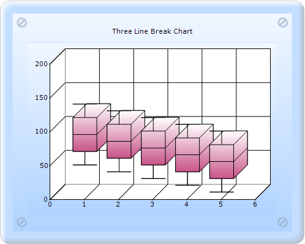

::: {style="DISPLAY: none"}
{#d2h_url_template}{#d2h_package_url style="WIDTH: 0px; DISPLAY: none; HEIGHT: 0px"}
:::

::: {.d2h_secondary_topic style="PADDING-BOTTOM: 10pt; MARGIN: 0pt; PADDING-LEFT: 0pt; PADDING-RIGHT: 0pt; PADDING-TOP: 0pt"}
##### Builder {#builder style="tab-stops: 0pt"}

[]{style="FONT-FAMILY: 'Calibri','sans-serif'"} 

To create a Box and Whisker chart through Builder:

1.   In Controller, return view to the corresponding View page.

[]{style="FONT-FAMILY: 'Calibri','sans-serif'"} 

+-----------------------------------------------------------------------------------------------------------------------------------------------------------------------------------------------------------------+
| \[C#\]                                                                                                                                                                                                          |
|                                                                                                                                                                                                                 |
| [        ]{style="FONT-FAMILY: Consolas; FONT-SIZE: 9.5pt"}[public]{style="FONT-FAMILY: 'Courier New'; COLOR: blue"}[ [ActionResult]{style="COLOR: #2b91af"} SimpleChart()]{style="FONT-FAMILY: 'Courier New'"} |
|                                                                                                                                                                                                                 |
| [        {            ]{style="FONT-FAMILY: 'Courier New'"}                                                                                                                                                     |
|                                                                                                                                                                                                                 |
| [            [return]{style="COLOR: blue"} View();]{style="FONT-FAMILY: 'Courier New'"}                                                                                                                         |
|                                                                                                                                                                                                                 |
| [        }]{style="FONT-FAMILY: 'Courier New'"}                                                                                                                                                                 |
|                                                                                                                                                                                                                 |
| []{style="FONT-FAMILY: Consolas; COLOR: blue; FONT-SIZE: 9.5pt"}                                                                                                                                                |
+-----------------------------------------------------------------------------------------------------------------------------------------------------------------------------------------------------------------+

[]{style="FONT-FAMILY: 'Calibri','sans-serif'"} 

2.   In the **View** page, invoke the ChartBuilder by using the control ID as the first argument.

3.   Add the **Series** to the ChartModel and set the series type to **BoxAndWhisker**, and add the **Points** to the series and set the style.

4.   Set the **ChartModel** and **ChartArea** properties.

[]{style="FONT-FAMILY: 'Calibri','sans-serif'"} 

+---------------------------------------------------------------------------------------------------------------------------------------------------------------------------------------------------------------------------------------------------+
| **View\[ASPX\]**                                                                                                                                                                                                                                  |
|                                                                                                                                                                                                                                                   |
|                                                                                                                                                                                                                                                   |
|                                                                                                                                                                                                                                                   |
| [    [\<%]{style="BACKGROUND: yellow"}[=]{style="COLOR: blue"}Html.Chart([\"chart_Model\"]{style="COLOR: #a31515"}).Text([\"Box and Whisker Chart\"]{style="COLOR: #a31515"}).Series(series =\>]{style="FONT-FAMILY: Consolas; FONT-SIZE: 9.5pt"} |
|                                                                                                                                                                                                                                                   |
| [        {]{style="FONT-FAMILY: Consolas; FONT-SIZE: 9.5pt"}                                                                                                                                                                                      |
|                                                                                                                                                                                                                                                   |
| []{style="FONT-FAMILY: Consolas; FONT-SIZE: 9.5pt"}                                                                                                                                                                                               |
|                                                                                                                                                                                                                                                   |
| **[            series.Add()]{style="FONT-FAMILY: Consolas; FONT-SIZE: 9.5pt"}**                                                                                                                                                                   |
|                                                                                                                                                                                                                                                   |
| **[                  .Name([\"Analysis\"]{style="COLOR: #a31515"})]{style="FONT-FAMILY: Consolas; FONT-SIZE: 9.5pt"}**                                                                                                                            |
|                                                                                                                                                                                                                                                   |
| **[                  .Type(Syncfusion.Windows.Forms.Chart.[ChartSeriesType]{style="COLOR: #2b91af"}.BoxAndWhisker)                  ]{style="FONT-FAMILY: Consolas; FONT-SIZE: 9.5pt"}**                                                          |
|                                                                                                                                                                                                                                                   |
| **[                  .Points(points =\>]{style="FONT-FAMILY: Consolas; FONT-SIZE: 9.5pt"}**                                                                                                                                                       |
|                                                                                                                                                                                                                                                   |
| **[                  {                      ]{style="FONT-FAMILY: Consolas; FONT-SIZE: 9.5pt"}**                                                                                                                                                  |
|                                                                                                                                                                                                                                                   |
| **[                      points.Add(1, 50, 60, 70, 80, 90, 100, 110, 120, 130, 140);]{style="FONT-FAMILY: Consolas; FONT-SIZE: 9.5pt"}**                                                                                                          |
|                                                                                                                                                                                                                                                   |
| **[                      points.Add(2, 40, 50, 60, 70, 80, 90, 100, 110, 120, 130);]{style="FONT-FAMILY: Consolas; FONT-SIZE: 9.5pt"}**                                                                                                           |
|                                                                                                                                                                                                                                                   |
| **[                      points.Add(3, 30, 40, 50, 60, 70, 80, 90, 100, 110, 120);]{style="FONT-FAMILY: Consolas; FONT-SIZE: 9.5pt"}**                                                                                                            |
|                                                                                                                                                                                                                                                   |
| **[                      points.Add(4, 20, 30, 40, 50, 60, 70, 80, 90, 100, 110);]{style="FONT-FAMILY: Consolas; FONT-SIZE: 9.5pt"}**                                                                                                             |
|                                                                                                                                                                                                                                                   |
| **[                      points.Add(5, 10, 20, 30, 40, 50, 60, 70, 80, 90, 100);]{style="FONT-FAMILY: Consolas; FONT-SIZE: 9.5pt"}**                                                                                                              |
|                                                                                                                                                                                                                                                   |
| [                  });]{style="FONT-FAMILY: Consolas; FONT-SIZE: 9.5pt"}                                                                                                                                                                          |
|                                                                                                                                                                                                                                                   |
| [        }).BorderAppearance(border =\>]{style="FONT-FAMILY: Consolas; FONT-SIZE: 9.5pt"}                                                                                                                                                         |
|                                                                                                                                                                                                                                                   |
| [        {]{style="FONT-FAMILY: Consolas; FONT-SIZE: 9.5pt"}                                                                                                                                                                                      |
|                                                                                                                                                                                                                                                   |
| [            border.SkinStyle(Syncfusion.Windows.Forms.Chart.[ChartBorderSkinStyle]{style="COLOR: #2b91af"}.Pinned);]{style="FONT-FAMILY: Consolas; FONT-SIZE: 9.5pt"}                                                                            |
|                                                                                                                                                                                                                                                   |
| [        }).SmoothingMode(System.Drawing.Drawing2D.[SmoothingMode]{style="COLOR: #2b91af"}.AntiAlias)]{style="FONT-FAMILY: Consolas; FONT-SIZE: 9.5pt"}                                                                                           |
|                                                                                                                                                                                                                                                   |
| [              .Size([new]{style="COLOR: blue"} System.Drawing.[Size]{style="COLOR: #2b91af"}(500, 400))]{style="FONT-FAMILY: Consolas; FONT-SIZE: 9.5pt"}                                                                                        |
|                                                                                                                                                                                                                                                   |
| [              .Skins([ChartModelSkins]{style="COLOR: #2b91af"}.Office2007Blue)]{style="FONT-FAMILY: Consolas; FONT-SIZE: 9.5pt"}                                                                                                                 |
|                                                                                                                                                                                                                                                   |
| [              .ChartSeriesSkins([ChartSeriesSkins]{style="COLOR: #2b91af"}.Analog) ]{style="FONT-FAMILY: Consolas; FONT-SIZE: 9.5pt"}                                                                                                            |
|                                                                                                                                                                                                                                                   |
| [              .Series3D([true]{style="COLOR: blue"})                          ]{style="FONT-FAMILY: Consolas; FONT-SIZE: 9.5pt"}                                                                                                                 |
|                                                                                                                                                                                                                                                   |
| [        [%\>]{style="BACKGROUND: yellow"}[]{style="COLOR: blue"}]{style="FONT-FAMILY: Consolas; FONT-SIZE: 9.5pt"}                                                                                                                               |
+---------------------------------------------------------------------------------------------------------------------------------------------------------------------------------------------------------------------------------------------------+

 

[]{style="FONT-FAMILY: 'Calibri','sans-serif'"} 

+----------------------------------------------------------------------------------------------------------------------------------------------------------------------------------------------------------------------------+
| **View\[cshtml\]**                                                                                                                                                                                                         |
|                                                                                                                                                                                                                            |
| [    [\@{]{style="BACKGROUND: yellow"} Html.Chart([\"chart_Model\"]{style="COLOR: #a31515"}).Text([\"Box and Whisker Chart\"]{style="COLOR: #a31515"}).Series(series =\>]{style="FONT-FAMILY: Consolas; FONT-SIZE: 9.5pt"} |
|                                                                                                                                                                                                                            |
| [        {]{style="FONT-FAMILY: Consolas; FONT-SIZE: 9.5pt"}                                                                                                                                                               |
|                                                                                                                                                                                                                            |
| []{style="FONT-FAMILY: Consolas; FONT-SIZE: 9.5pt"}                                                                                                                                                                        |
|                                                                                                                                                                                                                            |
| **[            series.Add()]{style="FONT-FAMILY: Consolas; FONT-SIZE: 9.5pt"}**                                                                                                                                            |
|                                                                                                                                                                                                                            |
| **[                  .Name([\"Analysis\"]{style="COLOR: #a31515"})]{style="FONT-FAMILY: Consolas; FONT-SIZE: 9.5pt"}**                                                                                                     |
|                                                                                                                                                                                                                            |
| **[                  .Type(Syncfusion.Windows.Forms.Chart.[ChartSeriesType]{style="COLOR: #2b91af"}.BoxAndWhisker)                  ]{style="FONT-FAMILY: Consolas; FONT-SIZE: 9.5pt"}**                                   |
|                                                                                                                                                                                                                            |
| **[                  .Points(points =\>]{style="FONT-FAMILY: Consolas; FONT-SIZE: 9.5pt"}**                                                                                                                                |
|                                                                                                                                                                                                                            |
| **[                  {                      ]{style="FONT-FAMILY: Consolas; FONT-SIZE: 9.5pt"}**                                                                                                                           |
|                                                                                                                                                                                                                            |
| **[                      points.Add(1, 50, 60, 70, 80, 90, 100, 110, 120, 130, 140);]{style="FONT-FAMILY: Consolas; FONT-SIZE: 9.5pt"}**                                                                                   |
|                                                                                                                                                                                                                            |
| **[                      points.Add(2, 40, 50, 60, 70, 80, 90, 100, 110, 120, 130);]{style="FONT-FAMILY: Consolas; FONT-SIZE: 9.5pt"}**                                                                                    |
|                                                                                                                                                                                                                            |
| **[                      points.Add(3, 30, 40, 50, 60, 70, 80, 90, 100, 110, 120);]{style="FONT-FAMILY: Consolas; FONT-SIZE: 9.5pt"}**                                                                                     |
|                                                                                                                                                                                                                            |
| **[                      points.Add(4, 20, 30, 40, 50, 60, 70, 80, 90, 100, 110);]{style="FONT-FAMILY: Consolas; FONT-SIZE: 9.5pt"}**                                                                                      |
|                                                                                                                                                                                                                            |
| **[                      points.Add(5, 10, 20, 30, 40, 50, 60, 70, 80, 90, 100);]{style="FONT-FAMILY: Consolas; FONT-SIZE: 9.5pt"}**                                                                                       |
|                                                                                                                                                                                                                            |
| [                  });]{style="FONT-FAMILY: Consolas; FONT-SIZE: 9.5pt"}                                                                                                                                                   |
|                                                                                                                                                                                                                            |
| [        }).BorderAppearance(border =\>]{style="FONT-FAMILY: Consolas; FONT-SIZE: 9.5pt"}                                                                                                                                  |
|                                                                                                                                                                                                                            |
| [        {]{style="FONT-FAMILY: Consolas; FONT-SIZE: 9.5pt"}                                                                                                                                                               |
|                                                                                                                                                                                                                            |
| [            border.SkinStyle(Syncfusion.Windows.Forms.Chart.[ChartBorderSkinStyle]{style="COLOR: #2b91af"}.Pinned);]{style="FONT-FAMILY: Consolas; FONT-SIZE: 9.5pt"}                                                     |
|                                                                                                                                                                                                                            |
| [        }).SmoothingMode(System.Drawing.Drawing2D.[SmoothingMode]{style="COLOR: #2b91af"}.AntiAlias)]{style="FONT-FAMILY: Consolas; FONT-SIZE: 9.5pt"}                                                                    |
|                                                                                                                                                                                                                            |
| [              .Size([new]{style="COLOR: blue"} System.Drawing.[Size]{style="COLOR: #2b91af"}(500, 400))]{style="FONT-FAMILY: Consolas; FONT-SIZE: 9.5pt"}                                                                 |
|                                                                                                                                                                                                                            |
| [              .Skins([ChartModelSkins]{style="COLOR: #2b91af"}.Office2007Blue)]{style="FONT-FAMILY: Consolas; FONT-SIZE: 9.5pt"}                                                                                          |
|                                                                                                                                                                                                                            |
| [              .ChartSeriesSkins([ChartSeriesSkins]{style="COLOR: #2b91af"}.Analog) ]{style="FONT-FAMILY: Consolas; FONT-SIZE: 9.5pt"}                                                                                     |
|                                                                                                                                                                                                                            |
| [             .Series3D([true]{style="COLOR: blue"})]{style="FONT-FAMILY: Consolas; FONT-SIZE: 9.5pt"}                                                                                                                     |
|                                                                                                                                                                                                                            |
| [             .Render();                         ]{style="FONT-FAMILY: Consolas; FONT-SIZE: 9.5pt"}                                                                                                                        |
|                                                                                                                                                                                                                            |
| [        [}]{style="BACKGROUND: yellow"}[]{style="COLOR: blue"}]{style="FONT-FAMILY: Consolas; FONT-SIZE: 9.5pt"}                                                                                                          |
+----------------------------------------------------------------------------------------------------------------------------------------------------------------------------------------------------------------------------+

 

 

5.   Build and run the application, to get the following output:

[]{style="FONT-FAMILY: 'Calibri','sans-serif'"} 

{border="0"}

Figure 139: Chart displaying Box and Whisker chart Series

[]{style="FONT-FAMILY: 'Calibri','sans-serif'"} 

[]{#related-topics}
:::
