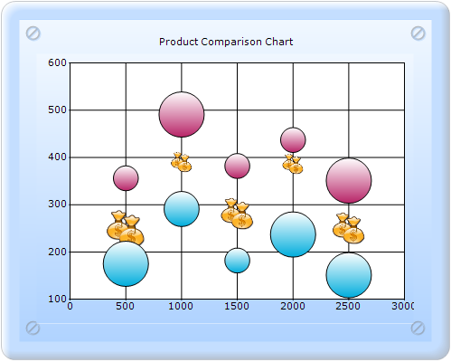

::: {style="DISPLAY: none"}
{#d2h_url_template}{#d2h_package_url style="WIDTH: 0px; DISPLAY: none; HEIGHT: 0px"}
:::

::: {.d2h_secondary_topic style="PADDING-BOTTOM: 10pt; MARGIN: 0pt; PADDING-LEFT: 0pt; PADDING-RIGHT: 0pt; PADDING-TOP: 0pt"}
##### Builder {#builder style="tab-stops: 0pt"}

[]{style="FONT-FAMILY: 'Calibri','sans-serif'"} 

To create a Bubble chart with BubbleType through Builder:

1.   In Controller, return view to the corresponding View page.

[]{style="FONT-FAMILY: 'Calibri','sans-serif'"} 

+----------------------------------------------------------------------------------------------------------------------------------+
| \[C#\]                                                                                                                           |
|                                                                                                                                  |
| [        [public]{style="COLOR: blue"} [ActionResult]{style="COLOR: #2b91af"} SimpleChart()]{style="FONT-FAMILY: 'Courier New'"} |
|                                                                                                                                  |
| [        {            ]{style="FONT-FAMILY: 'Courier New'"}                                                                      |
|                                                                                                                                  |
| [            [return]{style="COLOR: blue"} View();]{style="FONT-FAMILY: 'Courier New'"}                                          |
|                                                                                                                                  |
| [        }]{style="FONT-FAMILY: 'Courier New'"}                                                                                  |
|                                                                                                                                  |
| []{style="FONT-FAMILY: Consolas; COLOR: blue; FONT-SIZE: 9.5pt"}                                                                 |
+----------------------------------------------------------------------------------------------------------------------------------+

[]{style="FONT-FAMILY: 'Calibri','sans-serif'"} 

2.   In the View page, invoke the ChartBuilder by using the control ID as the first argument.

3.   Add the **Series** to the ChartModel and set the series type to **Bubble**, and add the **Points** to the series and set the style.

4.   Set the ChartModel and ChartArea properties.

[]{style="FONT-FAMILY: 'Calibri','sans-serif'"} 

+----------------------------------------------------------------------------------------------------------------------------------------------------------------------------------------------------------------------------------------------------------------------------+
| View \[ASPX\]                                                                                                                                                                                                                                                              |
|                                                                                                                                                                                                                                                                            |
|                                                                                                                                                                                                                                                                            |
|                                                                                                                                                                                                                                                                            |
| [     ]{style="FONT-FAMILY: Consolas; FONT-SIZE: 9.5pt"}[\<%]{style="FONT-FAMILY: 'Courier New'; BACKGROUND: yellow"}[            [string]{style="COLOR: blue"} accessFileLocation = Server.MapPath([\".\"]{style="COLOR: #a31515"});]{style="FONT-FAMILY: 'Courier New'"} |
|                                                                                                                                                                                                                                                                            |
| [                  accessFileLocation += [@\"\\Content\\Bubble.png\"]{style="COLOR: #a31515"};]{style="FONT-FAMILY: 'Courier New'"}                                                                                                                                        |
|                                                                                                                                                                                                                                                                            |
| [                  System.Drawing.[Bitmap]{style="COLOR: #2b91af"} flower = [new]{style="COLOR: blue"} System.Drawing.[Bitmap]{style="COLOR: #2b91af"}(accessFileLocation);]{style="FONT-FAMILY: 'Courier New'"}                                                           |
|                                                                                                                                                                                                                                                                            |
| [    [%\>]{style="BACKGROUND: yellow"}]{style="FONT-FAMILY: 'Courier New'"}                                                                                                                                                                                                |
|                                                                                                                                                                                                                                                                            |
| [    [\<%]{style="BACKGROUND: yellow"}[=]{style="COLOR: blue"}Html.Chart([\"chart_Model\"]{style="COLOR: #a31515"}).Text([\"Product Comparison Chart\"]{style="COLOR: #a31515"}).Series(series =\>]{style="FONT-FAMILY: 'Courier New'"}                                    |
|                                                                                                                                                                                                                                                                            |
| [        {]{style="FONT-FAMILY: 'Courier New'"}                                                                                                                                                                                                                            |
|                                                                                                                                                                                                                                                                            |
| [//\-\-\-\-\-\-\-\-- Add the Series and set the styling properties that you want\-\-\-\-\--]{style="FONT-FAMILY: 'Courier New'; COLOR: green"}[]{style="FONT-FAMILY: 'Courier New'"}                                                                                       |
|                                                                                                                                                                                                                                                                            |
| [            series.Add()]{style="FONT-FAMILY: 'Courier New'"}                                                                                                                                                                                                             |
|                                                                                                                                                                                                                                                                            |
| [                  .Name([\"Technology CCC\"]{style="COLOR: #a31515"})]{style="FONT-FAMILY: 'Courier New'"}                                                                                                                                                                |
|                                                                                                                                                                                                                                                                            |
| [                  .Type(Syncfusion.Windows.Forms.Chart.[ChartSeriesType]{style="COLOR: #2b91af"}.Bubble)]{style="FONT-FAMILY: 'Courier New'"}                                                                                                                             |
|                                                                                                                                                                                                                                                                            |
| [    .Points(points =\>]{style="FONT-FAMILY: 'Courier New'"}                                                                                                                                                                                                               |
|                                                                                                                                                                                                                                                                            |
| [            {]{style="FONT-FAMILY: 'Courier New'"}                                                                                                                                                                                                                        |
|                                                                                                                                                                                                                                                                            |
| [                points.Add(500, 250, 5);]{style="FONT-FAMILY: 'Courier New'"}                                                                                                                                                                                             |
|                                                                                                                                                                                                                                                                            |
| [                points.Add(1000, 391, 2);]{style="FONT-FAMILY: 'Courier New'"}                                                                                                                                                                                            |
|                                                                                                                                                                                                                                                                            |
| [                points.Add(1500, 282, 4);]{style="FONT-FAMILY: 'Courier New'"}                                                                                                                                                                                            |
|                                                                                                                                                                                                                                                                            |
| [                points.Add(2000, 387, 2);]{style="FONT-FAMILY: 'Courier New'"}                                                                                                                                                                                            |
|                                                                                                                                                                                                                                                                            |
| [                points.Add(2500, 251, 4);]{style="FONT-FAMILY: 'Courier New'"}                                                                                                                                                                                            |
|                                                                                                                                                                                                                                                                            |
| [            }).Style(style =\>{]{style="FONT-FAMILY: 'Courier New'"}                                                                                                                                                                                                      |
|                                                                                                                                                                                                                                                                            |
| **[                    style.Images(images =\>{]{style="FONT-FAMILY: 'Courier New'"}**                                                                                                                                                                                     |
|                                                                                                                                                                                                                                                                            |
| **[                            images.Add(flower);]{style="FONT-FAMILY: 'Courier New'"}**                                                                                                                                                                                  |
|                                                                                                                                                                                                                                                                            |
| **[                });]{style="FONT-FAMILY: 'Courier New'"}**                                                                                                                                                                                                              |
|                                                                                                                                                                                                                                                                            |
| [            }).ScatterConnectType(Syncfusion.Windows.Forms.Chart.[ScatterConnectType]{style="COLOR: #2b91af"}.None)]{style="FONT-FAMILY: 'Courier New'"}                                                                                                                  |
|                                                                                                                                                                                                                                                                            |
| **[              .ConfigItems(items =\>{]{style="FONT-FAMILY: 'Courier New'"}**                                                                                                                                                                                            |
|                                                                                                                                                                                                                                                                            |
| **[                    items.BubbleItem(item =\> item.BubbleType(Syncfusion.Windows.Forms.Chart.[ChartBubbleType]{style="COLOR: #2b91af"}.Image));]{style="FONT-FAMILY: 'Courier New'"}**                                                                                  |
|                                                                                                                                                                                                                                                                            |
| **[                });]{style="FONT-FAMILY: 'Courier New'"}**                                                                                                                                                                                                              |
|                                                                                                                                                                                                                                                                            |
| [            })]{style="FONT-FAMILY: 'Courier New'"}                                                                                                                                                                                                                       |
|                                                                                                                                                                                                                                                                            |
| []{style="FONT-FAMILY: 'Courier New'"}                                                                                                                                                                                                                                     |
|                                                                                                                                                                                                                                                                            |
| [//\-\-\-\-\-\-\-\--Set the ChartModel and ChartArea Properties that you want\-\-\-\-\--]{style="FONT-FAMILY: 'Courier New'; COLOR: green"}[]{style="FONT-FAMILY: 'Courier New'"}                                                                                          |
|                                                                                                                                                                                                                                                                            |
| [   ]{style="FONT-FAMILY: 'Courier New'"}                                                                                                                                                                                                                                  |
|                                                                                                                                                                                                                                                                            |
| [    [%\>]{style="BACKGROUND: yellow"}]{style="FONT-FAMILY: 'Courier New'"}[]{style="FONT-FAMILY: Consolas; COLOR: blue; FONT-SIZE: 9.5pt"}                                                                                                                                |
+----------------------------------------------------------------------------------------------------------------------------------------------------------------------------------------------------------------------------------------------------------------------------+

[]{style="FONT-FAMILY: 'Calibri','sans-serif'"} 

[]{style="FONT-FAMILY: 'Calibri','sans-serif'"} 

+--------------------------------------------------------------------------------------------------------------------------------------------------------------------------------------------------------------------------------------------------------------------------------------+
| View \[cshtml\]                                                                                                                                                                                                                                                                      |
|                                                                                                                                                                                                                                                                                      |
| [     ]{style="FONT-FAMILY: Consolas; FONT-SIZE: 9.5pt"}[\@{]{style="FONT-FAMILY: 'Courier New'; BACKGROUND: yellow"}[           [string]{style="COLOR: blue"} accessFileLocation = Server.MapPath([\".\"]{style="COLOR: #a31515"});]{style="FONT-FAMILY: 'Courier New'"}            |
|                                                                                                                                                                                                                                                                                      |
| [                  accessFileLocation += [@\"\\Content\\Bubble.png\"]{style="COLOR: #a31515"};]{style="FONT-FAMILY: 'Courier New'"}                                                                                                                                                  |
|                                                                                                                                                                                                                                                                                      |
| [                  System.Drawing.[Bitmap]{style="COLOR: #2b91af"} flower = [new]{style="COLOR: blue"} System.Drawing.[Bitmap]{style="COLOR: #2b91af"}(accessFileLocation);]{style="FONT-FAMILY: 'Courier New'"}                                                                     |
|                                                                                                                                                                                                                                                                                      |
| [    [}]{style="BACKGROUND: yellow"}]{style="FONT-FAMILY: 'Courier New'"}                                                                                                                                                                                                            |
|                                                                                                                                                                                                                                                                                      |
| [    [\@{]{style="BACKGROUND: yellow"} Html.Chart([\"chart_Model\"]{style="COLOR: #a31515"}).Text([\"Product Comparison Chart\"]{style="COLOR: #a31515"}).Series(series =\>]{style="FONT-FAMILY: 'Courier New'"}                                                                     |
|                                                                                                                                                                                                                                                                                      |
| [        {]{style="FONT-FAMILY: 'Courier New'"}                                                                                                                                                                                                                                      |
|                                                                                                                                                                                                                                                                                      |
| [//\-\-\-\-\-\-\-\-- Add the Series and set the styling properties that you want\-\-\-\-\--]{style="FONT-FAMILY: 'Courier New'; COLOR: green"}[]{style="FONT-FAMILY: 'Courier New'"}                                                                                                 |
|                                                                                                                                                                                                                                                                                      |
| [            series.Add()]{style="FONT-FAMILY: 'Courier New'"}                                                                                                                                                                                                                       |
|                                                                                                                                                                                                                                                                                      |
| [                  .Name([\"Technology CCC\"]{style="COLOR: #a31515"})                  .Type(Syncfusion.Windows.Forms.Chart.[ChartSeriesType]{style="COLOR: #2b91af"}.Bubble)]{style="FONT-FAMILY: 'Courier New'"}                                                                  |
|                                                                                                                                                                                                                                                                                      |
| [    .Points(points =\>]{style="FONT-FAMILY: 'Courier New'"}                                                                                                                                                                                                                         |
|                                                                                                                                                                                                                                                                                      |
| [            {]{style="FONT-FAMILY: 'Courier New'"}                                                                                                                                                                                                                                  |
|                                                                                                                                                                                                                                                                                      |
| [                points.Add(500, 250, 5);]{style="FONT-FAMILY: 'Courier New'"}                                                                                                                                                                                                       |
|                                                                                                                                                                                                                                                                                      |
| [                points.Add(1000, 391, 2);]{style="FONT-FAMILY: 'Courier New'"}                                                                                                                                                                                                      |
|                                                                                                                                                                                                                                                                                      |
| [                points.Add(1500, 282, 4);]{style="FONT-FAMILY: 'Courier New'"}                                                                                                                                                                                                      |
|                                                                                                                                                                                                                                                                                      |
| [                points.Add(2000, 387, 2);]{style="FONT-FAMILY: 'Courier New'"}                                                                                                                                                                                                      |
|                                                                                                                                                                                                                                                                                      |
| [                points.Add(2500, 251, 4);]{style="FONT-FAMILY: 'Courier New'"}                                                                                                                                                                                                      |
|                                                                                                                                                                                                                                                                                      |
| [            }).Style(style =\>{]{style="FONT-FAMILY: 'Courier New'"}                                                                                                                                                                                                                |
|                                                                                                                                                                                                                                                                                      |
| **[                    style.Images(images =\>{]{style="FONT-FAMILY: 'Courier New'"}**                                                                                                                                                                                               |
|                                                                                                                                                                                                                                                                                      |
| **[                            images.Add(flower);]{style="FONT-FAMILY: 'Courier New'"}**                                                                                                                                                                                            |
|                                                                                                                                                                                                                                                                                      |
| **[                });]{style="FONT-FAMILY: 'Courier New'"}**                                                                                                                                                                                                                        |
|                                                                                                                                                                                                                                                                                      |
| [            }).ScatterConnectType(Syncfusion.Windows.Forms.Chart.[ScatterConnectType]{style="COLOR: #2b91af"}.None)]{style="FONT-FAMILY: 'Courier New'"}                                                                                                                            |
|                                                                                                                                                                                                                                                                                      |
| **[              .ConfigItems(items =\>{]{style="FONT-FAMILY: 'Courier New'"}**                                                                                                                                                                                                      |
|                                                                                                                                                                                                                                                                                      |
| **[                    items.BubbleItem(item =\> item.BubbleType(Syncfusion.Windows.Forms.Chart.[ChartBubbleType]{style="COLOR: #2b91af"}.Image));]{style="FONT-FAMILY: 'Courier New'"}**                                                                                            |
|                                                                                                                                                                                                                                                                                      |
| **[                });]{style="FONT-FAMILY: 'Courier New'"}**                                                                                                                                                                                                                        |
|                                                                                                                                                                                                                                                                                      |
| [            })]{style="FONT-FAMILY: 'Courier New'"}                                                                                                                                                                                                                                 |
|                                                                                                                                                                                                                                                                                      |
| [//\-\-\-\-\-\-\-\--Set the ChartModel and ChartArea Properties that you want\-\-\-\-\--]{style="FONT-FAMILY: 'Courier New'; COLOR: green"}[    [}]{style="BACKGROUND: yellow"}]{style="FONT-FAMILY: 'Courier New'"}[]{style="FONT-FAMILY: Consolas; COLOR: blue; FONT-SIZE: 9.5pt"} |
+--------------------------------------------------------------------------------------------------------------------------------------------------------------------------------------------------------------------------------------------------------------------------------------+

[]{style="FONT-FAMILY: 'Calibri','sans-serif'"} 

[]{style="FONT-FAMILY: 'Calibri','sans-serif'"} 

5.   Build and run the application, to get the following output:

[]{style="FONT-FAMILY: 'Calibri','sans-serif'"} 

{border="0"}

Figure 205: Chart displaying Bubble chart Series

[                                                ]{style="FONT-FAMILY: 'Calibri','sans-serif'"}

See also

[BubbleChart]{style="COLOR: windowtext; TEXT-DECORATION: none; text-underline: none"}

[]{#related-topics}
:::
