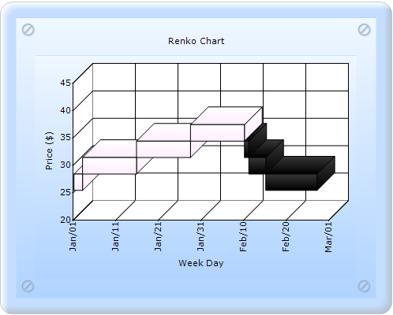

::: {style="DISPLAY: none"}
{#d2h_url_template}{#d2h_package_url style="WIDTH: 0px; DISPLAY: none; HEIGHT: 0px"}
:::

::: {.d2h_secondary_topic style="PADDING-BOTTOM: 10pt; MARGIN: 0pt; PADDING-LEFT: 0pt; PADDING-RIGHT: 0pt; PADDING-TOP: 0pt"}
##### Builder {#builder style="tab-stops: 0pt"}

[]{style="FONT-FAMILY: 'Calibri','sans-serif'"} 

The steps to create a Renko chart with ColorsMode, DarkLightPower, and ReversalAmount through Builder are as follows:

1.   In Controller, return view to the corresponding View page.

[]{style="FONT-FAMILY: 'Calibri','sans-serif'"} 

+----------------------------------------------------------------------------------------------------------------------------------+
| \[C#\]                                                                                                                           |
|                                                                                                                                  |
| [        [public]{style="COLOR: blue"} [ActionResult]{style="COLOR: #2b91af"} SimpleChart()]{style="FONT-FAMILY: 'Courier New'"} |
|                                                                                                                                  |
| [        {            ]{style="FONT-FAMILY: 'Courier New'"}                                                                      |
|                                                                                                                                  |
| [            [return]{style="COLOR: blue"} View();]{style="FONT-FAMILY: 'Courier New'"}                                          |
|                                                                                                                                  |
| [        }]{style="FONT-FAMILY: 'Courier New'"}                                                                                  |
|                                                                                                                                  |
| []{style="FONT-FAMILY: Consolas; COLOR: blue; FONT-SIZE: 9.5pt"}                                                                 |
+----------------------------------------------------------------------------------------------------------------------------------+

[]{style="FONT-FAMILY: 'Calibri','sans-serif'"} 

2.   In the View page, invoke the ChartBuilder by using the control ID as the first argument.

3.   Add the **Series** to the ChartModel and set the series type to **Renko**, and add the **Points** to the series and set the style.

4.   Set the ChartModel and ChartArea properties.

5.   Set the ColorsMode, DarkLightPower, and ReversalAmount properties.

[]{style="FONT-FAMILY: 'Calibri','sans-serif'"} 

+----------------------------------------------------------------------------------------------------------------------------------------------------------------------------------------------------------------------------------------------------------------------------------------------------------------------+
| View \[ASPX\]                                                                                                                                                                                                                                                                                                        |
|                                                                                                                                                                                                                                                                                                                      |
| []{style="FONT-FAMILY: 'Calibri','sans-serif'"}                                                                                                                                                                                                                                                                      |
|                                                                                                                                                                                                                                                                                                                      |
| [\<%]{style="FONT-FAMILY: 'Courier New'; BACKGROUND: yellow"}[]{style="FONT-FAMILY: 'Courier New'"}                                                                                                                                                                                                                  |
|                                                                                                                                                                                                                                                                                                                      |
| [    [double]{style="COLOR: blue"}\[\] points1 = {   25.250,27.750,29.000,28.275,27.750,27.750,27.275,26.250,25.750,25.250,26.250,25.250,24.500,]{style="FONT-FAMILY: 'Courier New'"}                                                                                                                                |
|                                                                                                                                                                                                                                                                                                                      |
| [                                          25.625,25.500,26.625,26.275,26.250,26.875,27.250,26.875,26.500,27.125,26.275,25.875,26.625,]{style="FONT-FAMILY: 'Courier New'"}                                                                                                                                          |
|                                                                                                                                                                                                                                                                                                                      |
| [                                          27.125,26.250,27.000,27.250,27.500,28.500,29.500,28.875,28.500,29.000,28.500,28.500,29.000,]{style="FONT-FAMILY: 'Courier New'"}                                                                                                                                          |
|                                                                                                                                                                                                                                                                                                                      |
| [                                          29.000,40.000,29.875,29.875,28.875,28.500,28.250,28.875,29.275,29.275,29.750,29.500,29.275,]{style="FONT-FAMILY: 'Courier New'"}                                                                                                                                          |
|                                                                                                                                                                                                                                                                                                                      |
| [                                          28.500,27.750,27.625,27.500,26.500,25.000,26.625,26.000,25.875,25.000,25.250,25.125,25.050};]{style="FONT-FAMILY: 'Courier New'"}                                                                                                                                         |
|                                                                                                                                                                                                                                                                                                                      |
| []{style="FONT-FAMILY: 'Courier New'"}                                                                                                                                                                                                                                                                               |
|                                                                                                                                                                                                                                                                                                                      |
| [    [DateTime]{style="COLOR: #2b91af"} current = [new]{style="COLOR: blue"} [DateTime]{style="COLOR: #2b91af"}(2004, 1, 1);]{style="FONT-FAMILY: 'Courier New'"}                                                                                                                                                    |
|                                                                                                                                                                                                                                                                                                                      |
| []{style="FONT-FAMILY: 'Courier New'"}                                                                                                                                                                                                                                                                               |
|                                                                                                                                                                                                                                                                                                                      |
| [%\>]{style="FONT-FAMILY: 'Courier New'; BACKGROUND: yellow"}[]{style="FONT-FAMILY: 'Courier New'"}                                                                                                                                                                                                                  |
|                                                                                                                                                                                                                                                                                                                      |
| [    [\<%]{style="BACKGROUND: yellow"}[=]{style="COLOR: blue"}Html.Chart([\"chart_Model\"]{style="COLOR: #a31515"}).Text([\"Renko Chart\"]{style="COLOR: #a31515"}).Series(series =\>]{style="FONT-FAMILY: 'Courier New'"}                                                                                           |
|                                                                                                                                                                                                                                                                                                                      |
| [        {]{style="FONT-FAMILY: 'Courier New'"}                                                                                                                                                                                                                                                                      |
|                                                                                                                                                                                                                                                                                                                      |
| []{style="FONT-FAMILY: 'Courier New'"}                                                                                                                                                                                                                                                                               |
|                                                                                                                                                                                                                                                                                                                      |
| [            series.Add()]{style="FONT-FAMILY: 'Courier New'"}                                                                                                                                                                                                                                                       |
|                                                                                                                                                                                                                                                                                                                      |
| [                  .Name([\"FT\"]{style="COLOR: #a31515"})]{style="FONT-FAMILY: 'Courier New'"}                                                                                                                                                                                                                      |
|                                                                                                                                                                                                                                                                                                                      |
| [                  .Type(Syncfusion.Windows.Forms.Chart.[ChartSeriesType]{style="COLOR: #2b91af"}.Renko)]{style="FONT-FAMILY: 'Courier New'"}                                                                                                                                                                        |
|                                                                                                                                                                                                                                                                                                                      |
| **[                  .ReversalAmount(3.0)]{style="FONT-FAMILY: 'Courier New'"}**                                                                                                                                                                                                                                     |
|                                                                                                                                                                                                                                                                                                                      |
| **[                  .Points(points =\>]{style="FONT-FAMILY: 'Courier New'"}**                                                                                                                                                                                                                                       |
|                                                                                                                                                                                                                                                                                                                      |
| **[                  {]{style="FONT-FAMILY: 'Courier New'"}**                                                                                                                                                                                                                                                        |
|                                                                                                                                                                                                                                                                                                                      |
| **[                      [for]{style="COLOR: blue"} ([int]{style="COLOR: blue"} day = 0; day \< points1.Length; day++)]{style="FONT-FAMILY: 'Courier New'"}**                                                                                                                                                        |
|                                                                                                                                                                                                                                                                                                                      |
| **[                      {]{style="FONT-FAMILY: 'Courier New'"}**                                                                                                                                                                                                                                                    |
|                                                                                                                                                                                                                                                                                                                      |
| **[                          points.Add(current.AddDays(day), points1\[day\]);]{style="FONT-FAMILY: 'Courier New'"}**                                                                                                                                                                                                |
|                                                                                                                                                                                                                                                                                                                      |
| **[                      }]{style="FONT-FAMILY: 'Courier New'"}**                                                                                                                                                                                                                                                    |
|                                                                                                                                                                                                                                                                                                                      |
| **[                  })]{style="FONT-FAMILY: 'Courier New'"}**                                                                                                                                                                                                                                                       |
|                                                                                                                                                                                                                                                                                                                      |
| **[                  .ConfigItems(item =\>]{style="FONT-FAMILY: 'Courier New'"}**                                                                                                                                                                                                                                    |
|                                                                                                                                                                                                                                                                                                                      |
| **[                  {]{style="FONT-FAMILY: 'Courier New'"}**                                                                                                                                                                                                                                                        |
|                                                                                                                                                                                                                                                                                                                      |
| **[                      item.FinancialItem(financialitem =\>]{style="FONT-FAMILY: 'Courier New'"}**                                                                                                                                                                                                                 |
|                                                                                                                                                                                                                                                                                                                      |
| **[                      {]{style="FONT-FAMILY: 'Courier New'"}**                                                                                                                                                                                                                                                    |
|                                                                                                                                                                                                                                                                                                                      |
| **[                          financialitem.PriceUpColor(System.Drawing.[Color]{style="COLOR: #2b91af"}.SkyBlue)]{style="FONT-FAMILY: 'Courier New'"}**                                                                                                                                                               |
|                                                                                                                                                                                                                                                                                                                      |
| **[                                       .PriceDownColor(System.Drawing.[Color]{style="COLOR: #2b91af"}.FromArgb(33, 76, 129))                                       .ColorsMode(Syncfusion.Windows.Forms.Chart.[ChartFinancialColorMode]{style="COLOR: #2b91af"}.DarkLight)]{style="FONT-FAMILY: 'Courier New'"}** |
|                                                                                                                                                                                                                                                                                                                      |
| **[                                       .DarkLightPower(200); ]{style="FONT-FAMILY: 'Courier New'"}**                                                                                                                                                                                                              |
|                                                                                                                                                                                                                                                                                                                      |
| **[                      });]{style="FONT-FAMILY: 'Courier New'"}**                                                                                                                                                                                                                                                  |
|                                                                                                                                                                                                                                                                                                                      |
| **[                  });]{style="FONT-FAMILY: 'Courier New'"}**                                                                                                                                                                                                                                                      |
|                                                                                                                                                                                                                                                                                                                      |
| [        })]{style="FONT-FAMILY: 'Courier New'"}                                                                                                                                                                                                                                                                     |
|                                                                                                                                                                                                                                                                                                                      |
| []{style="FONT-FAMILY: 'Courier New'"}                                                                                                                                                                                                                                                                               |
|                                                                                                                                                                                                                                                                                                                      |
| [//\-\-\-\-\-\-\-\--Set the ChartModel and ChartArea properties that you want\-\-\-\-\--]{style="FONT-FAMILY: 'Courier New'; COLOR: green"}[]{style="FONT-FAMILY: 'Courier New'"}                                                                                                                                    |
|                                                                                                                                                                                                                                                                                                                      |
| []{style="FONT-FAMILY: 'Courier New'"}                                                                                                                                                                                                                                                                               |
|                                                                                                                                                                                                                                                                                                                      |
| [    ]{style="FONT-FAMILY: 'Courier New'"}                                                                                                                                                                                                                                                                           |
|                                                                                                                                                                                                                                                                                                                      |
| [    [%\>]{style="BACKGROUND: yellow"}]{style="FONT-FAMILY: 'Courier New'"}[]{style="FONT-FAMILY: Consolas; COLOR: blue; FONT-SIZE: 9.5pt"}                                                                                                                                                                          |
+----------------------------------------------------------------------------------------------------------------------------------------------------------------------------------------------------------------------------------------------------------------------------------------------------------------------+

[]{style="FONT-FAMILY: 'Calibri','sans-serif'"} 

+----------------------------------------------------------------------------------------------------------------------------------------------------------------------------------------------------------------------------------------------------------------------------------------------------------------------+
| View \[cshtml\]                                                                                                                                                                                                                                                                                                      |
|                                                                                                                                                                                                                                                                                                                      |
| [\@{]{style="FONT-FAMILY: 'Courier New'; BACKGROUND: yellow"}[]{style="FONT-FAMILY: 'Courier New'"}                                                                                                                                                                                                                  |
|                                                                                                                                                                                                                                                                                                                      |
| [    [double]{style="COLOR: blue"}\[\] points1 = {   25.250,27.750,29.000,28.275,27.750,27.750,27.275,26.250,25.750,25.250,26.250,25.250,24.500,]{style="FONT-FAMILY: 'Courier New'"}                                                                                                                                |
|                                                                                                                                                                                                                                                                                                                      |
| [                                          25.625,25.500,26.625,26.275,26.250,26.875,27.250,26.875,26.500,27.125,26.275,25.875,26.625,]{style="FONT-FAMILY: 'Courier New'"}                                                                                                                                          |
|                                                                                                                                                                                                                                                                                                                      |
| [                                          27.125,26.250,27.000,27.250,27.500,28.500,29.500,28.875,28.500,29.000,28.500,28.500,29.000,]{style="FONT-FAMILY: 'Courier New'"}                                                                                                                                          |
|                                                                                                                                                                                                                                                                                                                      |
| [                                          29.000,40.000,29.875,29.875,28.875,28.500,28.250,28.875,29.275,29.275,29.750,29.500,29.275,]{style="FONT-FAMILY: 'Courier New'"}                                                                                                                                          |
|                                                                                                                                                                                                                                                                                                                      |
| [                                          28.500,27.750,27.625,27.500,26.500,25.000,26.625,26.000,25.875,25.000,25.250,25.125,25.050};]{style="FONT-FAMILY: 'Courier New'"}                                                                                                                                         |
|                                                                                                                                                                                                                                                                                                                      |
| []{style="FONT-FAMILY: 'Courier New'"}                                                                                                                                                                                                                                                                               |
|                                                                                                                                                                                                                                                                                                                      |
| [    [DateTime]{style="COLOR: #2b91af"} current = [new]{style="COLOR: blue"} [DateTime]{style="COLOR: #2b91af"}(2004, 1, 1);]{style="FONT-FAMILY: 'Courier New'"}                                                                                                                                                    |
|                                                                                                                                                                                                                                                                                                                      |
| []{style="FONT-FAMILY: 'Courier New'"}                                                                                                                                                                                                                                                                               |
|                                                                                                                                                                                                                                                                                                                      |
| [}]{style="FONT-FAMILY: 'Courier New'; BACKGROUND: yellow"}[]{style="FONT-FAMILY: 'Courier New'"}                                                                                                                                                                                                                    |
|                                                                                                                                                                                                                                                                                                                      |
| [    [\@{]{style="BACKGROUND: yellow"} Html.Chart([\"chart_Model\"]{style="COLOR: #a31515"}).Text([\"Renko Chart\"]{style="COLOR: #a31515"}).Series(series =\>]{style="FONT-FAMILY: 'Courier New'"}                                                                                                                  |
|                                                                                                                                                                                                                                                                                                                      |
| [        {]{style="FONT-FAMILY: 'Courier New'"}                                                                                                                                                                                                                                                                      |
|                                                                                                                                                                                                                                                                                                                      |
| []{style="FONT-FAMILY: 'Courier New'"}                                                                                                                                                                                                                                                                               |
|                                                                                                                                                                                                                                                                                                                      |
| [            series.Add()]{style="FONT-FAMILY: 'Courier New'"}                                                                                                                                                                                                                                                       |
|                                                                                                                                                                                                                                                                                                                      |
| [                  .Name([\"FT\"]{style="COLOR: #a31515"})]{style="FONT-FAMILY: 'Courier New'"}                                                                                                                                                                                                                      |
|                                                                                                                                                                                                                                                                                                                      |
| [                  .Type(Syncfusion.Windows.Forms.Chart.[ChartSeriesType]{style="COLOR: #2b91af"}.Renko)]{style="FONT-FAMILY: 'Courier New'"}                                                                                                                                                                        |
|                                                                                                                                                                                                                                                                                                                      |
| **[                  .ReversalAmount(3.0)]{style="FONT-FAMILY: 'Courier New'"}**                                                                                                                                                                                                                                     |
|                                                                                                                                                                                                                                                                                                                      |
| **[                  .Points(points =\>]{style="FONT-FAMILY: 'Courier New'"}**                                                                                                                                                                                                                                       |
|                                                                                                                                                                                                                                                                                                                      |
| **[                  {]{style="FONT-FAMILY: 'Courier New'"}**                                                                                                                                                                                                                                                        |
|                                                                                                                                                                                                                                                                                                                      |
| **[                      [for]{style="COLOR: blue"} ([int]{style="COLOR: blue"} day = 0; day \< points1.Length; day++)]{style="FONT-FAMILY: 'Courier New'"}**                                                                                                                                                        |
|                                                                                                                                                                                                                                                                                                                      |
| **[                      {]{style="FONT-FAMILY: 'Courier New'"}**                                                                                                                                                                                                                                                    |
|                                                                                                                                                                                                                                                                                                                      |
| **[                          points.Add(current.AddDays(day), points1\[day\]);]{style="FONT-FAMILY: 'Courier New'"}**                                                                                                                                                                                                |
|                                                                                                                                                                                                                                                                                                                      |
| **[                      }]{style="FONT-FAMILY: 'Courier New'"}**                                                                                                                                                                                                                                                    |
|                                                                                                                                                                                                                                                                                                                      |
| **[                  })]{style="FONT-FAMILY: 'Courier New'"}**                                                                                                                                                                                                                                                       |
|                                                                                                                                                                                                                                                                                                                      |
| **[                  .ConfigItems(item =\>]{style="FONT-FAMILY: 'Courier New'"}**                                                                                                                                                                                                                                    |
|                                                                                                                                                                                                                                                                                                                      |
| **[                  {]{style="FONT-FAMILY: 'Courier New'"}**                                                                                                                                                                                                                                                        |
|                                                                                                                                                                                                                                                                                                                      |
| **[                      item.FinancialItem(financialitem =\>]{style="FONT-FAMILY: 'Courier New'"}**                                                                                                                                                                                                                 |
|                                                                                                                                                                                                                                                                                                                      |
| **[                      {]{style="FONT-FAMILY: 'Courier New'"}**                                                                                                                                                                                                                                                    |
|                                                                                                                                                                                                                                                                                                                      |
| **[                          financialitem.PriceUpColor(System.Drawing.[Color]{style="COLOR: #2b91af"}.SkyBlue)]{style="FONT-FAMILY: 'Courier New'"}**                                                                                                                                                               |
|                                                                                                                                                                                                                                                                                                                      |
| **[                                       .PriceDownColor(System.Drawing.[Color]{style="COLOR: #2b91af"}.FromArgb(33, 76, 129))                                       .ColorsMode(Syncfusion.Windows.Forms.Chart.[ChartFinancialColorMode]{style="COLOR: #2b91af"}.DarkLight)]{style="FONT-FAMILY: 'Courier New'"}** |
|                                                                                                                                                                                                                                                                                                                      |
| **[                                       .DarkLightPower(200); ]{style="FONT-FAMILY: 'Courier New'"}**                                                                                                                                                                                                              |
|                                                                                                                                                                                                                                                                                                                      |
| **[                      });]{style="FONT-FAMILY: 'Courier New'"}**                                                                                                                                                                                                                                                  |
|                                                                                                                                                                                                                                                                                                                      |
| **[                  });]{style="FONT-FAMILY: 'Courier New'"}**                                                                                                                                                                                                                                                      |
|                                                                                                                                                                                                                                                                                                                      |
| [        }).Render();]{style="FONT-FAMILY: 'Courier New'"}                                                                                                                                                                                                                                                           |
|                                                                                                                                                                                                                                                                                                                      |
| [//\-\-\-\-\-\-\-\--Set the ChartModel and ChartArea properties that you want\-\-\-\-\--]{style="FONT-FAMILY: 'Courier New'; COLOR: green"}[]{style="FONT-FAMILY: 'Courier New'"}                                                                                                                                    |
|                                                                                                                                                                                                                                                                                                                      |
| [        [}]{style="BACKGROUND: yellow"}]{style="FONT-FAMILY: 'Courier New'"}[]{style="FONT-FAMILY: Consolas; COLOR: blue; FONT-SIZE: 9.5pt"}                                                                                                                                                                        |
+----------------------------------------------------------------------------------------------------------------------------------------------------------------------------------------------------------------------------------------------------------------------------------------------------------------------+

[]{style="FONT-FAMILY: 'Calibri','sans-serif'"} 

6.   Build and run the application, to get the following output:

[]{style="FONT-FAMILY: 'Calibri','sans-serif'"} 

{border="0"}

Figure 240: Renko chart with ReversalAmount 3.0, ColorsMode as DarkLight, and DarkLightPower as 200

[]{#related-topics}
:::
