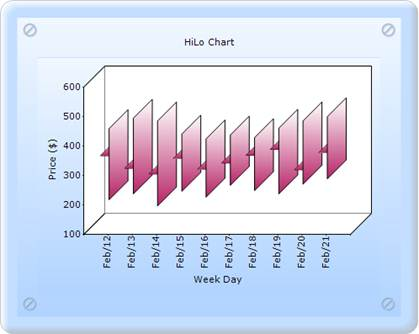

::: {style="DISPLAY: none"}
{#d2h_url_template}{#d2h_package_url style="WIDTH: 0px; DISPLAY: none; HEIGHT: 0px"}
:::

::: {.d2h_secondary_topic style="PADDING-BOTTOM: 10pt; MARGIN: 0pt; PADDING-LEFT: 0pt; PADDING-RIGHT: 0pt; PADDING-TOP: 0pt"}
##### Builder {#builder style="tab-stops: 0pt"}

[]{style="FONT-FAMILY: 'Calibri','sans-serif'"} 

To create a HiLoOpenClose chart with OpenCloseDrawMode through Builder:

1.   In Controller, return view to the corresponding View page.

 

+----------------------------------------------------------------------------------------------------------------------------------+
| \[C#\]                                                                                                                           |
|                                                                                                                                  |
| [        [public]{style="COLOR: blue"} [ActionResult]{style="COLOR: #2b91af"} SimpleChart()]{style="FONT-FAMILY: 'Courier New'"} |
|                                                                                                                                  |
| [        {            ]{style="FONT-FAMILY: 'Courier New'"}                                                                      |
|                                                                                                                                  |
| [            [return]{style="COLOR: blue"} View();]{style="FONT-FAMILY: 'Courier New'"}                                          |
|                                                                                                                                  |
| [        }]{style="FONT-FAMILY: 'Courier New'"}                                                                                  |
|                                                                                                                                  |
| []{style="FONT-FAMILY: Consolas; COLOR: blue; FONT-SIZE: 9.5pt"}                                                                 |
+----------------------------------------------------------------------------------------------------------------------------------+

[]{style="FONT-FAMILY: 'Calibri','sans-serif'"} 

2.   In the **View Page**, invoke the ChartBuilder by using the control ID as the first argument.

3.   Add the **Series** to the ChartModel and set the series type to **HiLoOpenClose**, and add the **Points** to the series and set the style.

4.   Set the **ChartModel** and **ChartArea** properties.

[]{style="FONT-FAMILY: 'Calibri','sans-serif'"} 

+----------------------------------------------------------------------------------------------------------------------------------------------------------------------------------------------------------------------------------------+
| View \[ASPX\]                                                                                                                                                                                                                          |
|                                                                                                                                                                                                                                        |
| []{style="FONT-FAMILY: 'Calibri','sans-serif'"}                                                                                                                                                                                        |
|                                                                                                                                                                                                                                        |
| [   [\<%]{style="BACKGROUND: yellow"}[=]{style="COLOR: blue"}Html.Chart([\"chart_Model\"]{style="COLOR: #a31515"}).Text([\"HiLo Chart\"]{style="COLOR: #a31515"}).Series(series =\>]{style="FONT-FAMILY: 'Courier New'"}               |
|                                                                                                                                                                                                                                        |
| [        {]{style="FONT-FAMILY: 'Courier New'"}                                                                                                                                                                                        |
|                                                                                                                                                                                                                                        |
| []{style="FONT-FAMILY: 'Courier New'"}                                                                                                                                                                                                 |
|                                                                                                                                                                                                                                        |
| **[            series.Add()]{style="FONT-FAMILY: 'Courier New'"}**                                                                                                                                                                     |
|                                                                                                                                                                                                                                        |
| [                  .Name([\"FT\"]{style="COLOR: #a31515"})]{style="FONT-FAMILY: 'Courier New'"}                                                                                                                                        |
|                                                                                                                                                                                                                                        |
| **[                  .Type(Syncfusion.Windows.Forms.Chart.[ChartSeriesType]{style="COLOR: #2b91af"}.HiLoOpenClose)]{style="FONT-FAMILY: 'Courier New'"}**                                                                              |
|                                                                                                                                                                                                                                        |
| [                  .Points(points =\>]{style="FONT-FAMILY: 'Courier New'"}                                                                                                                                                             |
|                                                                                                                                                                                                                                        |
| [                  {]{style="FONT-FAMILY: 'Courier New'"}                                                                                                                                                                              |
|                                                                                                                                                                                                                                        |
| [                      [DateTime]{style="COLOR: #2b91af"} start = [new]{style="COLOR: blue"} [DateTime]{style="COLOR: #2b91af"}(2006, 2, 12);]{style="FONT-FAMILY: 'Courier New'"}                                                     |
|                                                                                                                                                                                                                                        |
| []{style="FONT-FAMILY: 'Courier New'"}                                                                                                                                                                                                 |
|                                                                                                                                                                                                                                        |
| **[                      points.Add(start.AddDays(0), 456, 214, 364, 386);]{style="FONT-FAMILY: 'Courier New'"}**                                                                                                                      |
|                                                                                                                                                                                                                                        |
| **[                      points.Add(start.AddDays(1), 491, 234, 321, 378);]{style="FONT-FAMILY: 'Courier New'"}**                                                                                                                      |
|                                                                                                                                                                                                                                        |
| **[                      points.Add(start.AddDays(2), 482, 193, 302, 352);]{style="FONT-FAMILY: 'Courier New'"}**                                                                                                                      |
|                                                                                                                                                                                                                                        |
| **[                      points.Add(start.AddDays(3), 437, 243, 354, 391);]{style="FONT-FAMILY: 'Courier New'"}**                                                                                                                      |
|                                                                                                                                                                                                                                        |
| **[                      points.Add(start.AddDays(4), 421, 223, 317, 367);]{style="FONT-FAMILY: 'Courier New'"}**                                                                                                                      |
|                                                                                                                                                                                                                                        |
| **[                      points.Add(start.AddDays(5), 434, 263, 339, 385);]{style="FONT-FAMILY: 'Courier New'"}**                                                                                                                      |
|                                                                                                                                                                                                                                        |
| **[                      points.Add(start.AddDays(6), 425, 245, 365, 396);]{style="FONT-FAMILY: 'Courier New'"}**                                                                                                                      |
|                                                                                                                                                                                                                                        |
| **[                      points.Add(start.AddDays(7), 457, 234, 385, 398);]{style="FONT-FAMILY: 'Courier New'"}**                                                                                                                      |
|                                                                                                                                                                                                                                        |
| **[                      points.Add(start.AddDays(8), 482, 267, 316, 389);]{style="FONT-FAMILY: 'Courier New'"}**                                                                                                                      |
|                                                                                                                                                                                                                                        |
| **[                      points.Add(start.AddDays(9), 496, 285, 374, 399);]{style="FONT-FAMILY: 'Courier New'"}**                                                                                                                      |
|                                                                                                                                                                                                                                        |
| [                  })]{style="FONT-FAMILY: 'Courier New'"}                                                                                                                                                                             |
|                                                                                                                                                                                                                                        |
| **[    .ConfigItems(configitems =\> {]{style="FONT-FAMILY: 'Courier New'"}**                                                                                                                                                           |
|                                                                                                                                                                                                                                        |
| **[                      configitems.HiLoOpenCloseItem(item =\> {                          item.DrawMode(Syncfusion.Windows.Forms.Chart.[ChartOpenCloseDrawMode]{style="COLOR: #2b91af"}.Open);]{style="FONT-FAMILY: 'Courier New'"}** |
|                                                                                                                                                                                                                                        |
| **[                      });]{style="FONT-FAMILY: 'Courier New'"}**                                                                                                                                                                    |
|                                                                                                                                                                                                                                        |
| **[                  });]{style="FONT-FAMILY: 'Courier New'"}**[]{style="FONT-FAMILY: 'Courier New'"}                                                                                                                                  |
|                                                                                                                                                                                                                                        |
| [        })]{style="FONT-FAMILY: 'Courier New'"}                                                                                                                                                                                       |
|                                                                                                                                                                                                                                        |
| []{style="FONT-FAMILY: 'Courier New'"}                                                                                                                                                                                                 |
|                                                                                                                                                                                                                                        |
| [//\-\-\-\-\-\-\-\--Set the ChartModel and ChartArea properties that you want\-\-\-\-\--]{style="FONT-FAMILY: 'Courier New'; COLOR: green"}[]{style="FONT-FAMILY: 'Courier New'"}                                                      |
|                                                                                                                                                                                                                                        |
| [   ]{style="FONT-FAMILY: 'Courier New'"}                                                                                                                                                                                              |
|                                                                                                                                                                                                                                        |
| [    [%\>]{style="BACKGROUND: yellow"}]{style="FONT-FAMILY: 'Courier New'"}[]{style="FONT-FAMILY: Consolas; COLOR: blue; FONT-SIZE: 9.5pt"}                                                                                            |
+----------------------------------------------------------------------------------------------------------------------------------------------------------------------------------------------------------------------------------------+

[]{style="FONT-FAMILY: 'Calibri','sans-serif'"} 

[]{style="FONT-FAMILY: 'Calibri','sans-serif'"} 

+----------------------------------------------------------------------------------------------------------------------------------------------------------------------------------------------------------------------------------------+
| View \[cshtml\]                                                                                                                                                                                                                        |
|                                                                                                                                                                                                                                        |
| []{style="FONT-FAMILY: 'Calibri','sans-serif'"}                                                                                                                                                                                        |
|                                                                                                                                                                                                                                        |
| [   [\@{]{style="BACKGROUND: yellow"} Html.Chart([\"chart_Model\"]{style="COLOR: #a31515"}).Text([\"HiLo Chart\"]{style="COLOR: #a31515"}).Series(series =\>]{style="FONT-FAMILY: 'Courier New'"}                                      |
|                                                                                                                                                                                                                                        |
| [        {]{style="FONT-FAMILY: 'Courier New'"}                                                                                                                                                                                        |
|                                                                                                                                                                                                                                        |
| []{style="FONT-FAMILY: 'Courier New'"}                                                                                                                                                                                                 |
|                                                                                                                                                                                                                                        |
| **[            series.Add()]{style="FONT-FAMILY: 'Courier New'"}**                                                                                                                                                                     |
|                                                                                                                                                                                                                                        |
| [                  .Name([\"FT\"]{style="COLOR: #a31515"})]{style="FONT-FAMILY: 'Courier New'"}                                                                                                                                        |
|                                                                                                                                                                                                                                        |
| **[                  .Type(Syncfusion.Windows.Forms.Chart.[ChartSeriesType]{style="COLOR: #2b91af"}.HiLoOpenClose)]{style="FONT-FAMILY: 'Courier New'"}**                                                                              |
|                                                                                                                                                                                                                                        |
| [                  .Points(points =\>]{style="FONT-FAMILY: 'Courier New'"}                                                                                                                                                             |
|                                                                                                                                                                                                                                        |
| [                  {]{style="FONT-FAMILY: 'Courier New'"}                                                                                                                                                                              |
|                                                                                                                                                                                                                                        |
| [                      [DateTime]{style="COLOR: #2b91af"} start = [new]{style="COLOR: blue"} [DateTime]{style="COLOR: #2b91af"}(2006, 2, 12);]{style="FONT-FAMILY: 'Courier New'"}                                                     |
|                                                                                                                                                                                                                                        |
| []{style="FONT-FAMILY: 'Courier New'"}                                                                                                                                                                                                 |
|                                                                                                                                                                                                                                        |
| **[                      points.Add(start.AddDays(0), 456, 214, 364, 386);]{style="FONT-FAMILY: 'Courier New'"}**                                                                                                                      |
|                                                                                                                                                                                                                                        |
| **[                      points.Add(start.AddDays(1), 491, 234, 321, 378);]{style="FONT-FAMILY: 'Courier New'"}**                                                                                                                      |
|                                                                                                                                                                                                                                        |
| **[                      points.Add(start.AddDays(2), 482, 193, 302, 352);]{style="FONT-FAMILY: 'Courier New'"}**                                                                                                                      |
|                                                                                                                                                                                                                                        |
| **[                      points.Add(start.AddDays(3), 437, 243, 354, 391);]{style="FONT-FAMILY: 'Courier New'"}**                                                                                                                      |
|                                                                                                                                                                                                                                        |
| **[                      points.Add(start.AddDays(4), 421, 223, 317, 367);]{style="FONT-FAMILY: 'Courier New'"}**                                                                                                                      |
|                                                                                                                                                                                                                                        |
| **[                      points.Add(start.AddDays(5), 434, 263, 339, 385);]{style="FONT-FAMILY: 'Courier New'"}**                                                                                                                      |
|                                                                                                                                                                                                                                        |
| **[                      points.Add(start.AddDays(6), 425, 245, 365, 396);]{style="FONT-FAMILY: 'Courier New'"}**                                                                                                                      |
|                                                                                                                                                                                                                                        |
| **[                      points.Add(start.AddDays(7), 457, 234, 385, 398);]{style="FONT-FAMILY: 'Courier New'"}**                                                                                                                      |
|                                                                                                                                                                                                                                        |
| **[                      points.Add(start.AddDays(8), 482, 267, 316, 389);]{style="FONT-FAMILY: 'Courier New'"}**                                                                                                                      |
|                                                                                                                                                                                                                                        |
| **[                      points.Add(start.AddDays(9), 496, 285, 374, 399);]{style="FONT-FAMILY: 'Courier New'"}**                                                                                                                      |
|                                                                                                                                                                                                                                        |
| [                  })]{style="FONT-FAMILY: 'Courier New'"}                                                                                                                                                                             |
|                                                                                                                                                                                                                                        |
| **[    .ConfigItems(configitems =\> {]{style="FONT-FAMILY: 'Courier New'"}**                                                                                                                                                           |
|                                                                                                                                                                                                                                        |
| **[                      configitems.HiLoOpenCloseItem(item =\> {                          item.DrawMode(Syncfusion.Windows.Forms.Chart.[ChartOpenCloseDrawMode]{style="COLOR: #2b91af"}.Open);]{style="FONT-FAMILY: 'Courier New'"}** |
|                                                                                                                                                                                                                                        |
| **[                      });]{style="FONT-FAMILY: 'Courier New'"}**                                                                                                                                                                    |
|                                                                                                                                                                                                                                        |
| **[                  });]{style="FONT-FAMILY: 'Courier New'"}**                                                                                                                                                                        |
|                                                                                                                                                                                                                                        |
| [        }).Render();]{style="FONT-FAMILY: 'Courier New'"}                                                                                                                                                                             |
|                                                                                                                                                                                                                                        |
| []{style="FONT-FAMILY: 'Courier New'"}                                                                                                                                                                                                 |
|                                                                                                                                                                                                                                        |
| [//\-\-\-\-\-\-\-\--Set the ChartModel and ChartArea properties that you want\-\-\-\-\--]{style="FONT-FAMILY: 'Courier New'; COLOR: green"}[]{style="FONT-FAMILY: 'Courier New'"}                                                      |
|                                                                                                                                                                                                                                        |
| [    ]{style="FONT-FAMILY: 'Courier New'"}                                                                                                                                                                                             |
|                                                                                                                                                                                                                                        |
| [    [}]{style="BACKGROUND: yellow"}]{style="FONT-FAMILY: 'Courier New'"}                                                                                                                                                              |
|                                                                                                                                                                                                                                        |
| []{style="FONT-FAMILY: Consolas; COLOR: blue; FONT-SIZE: 9.5pt"}                                                                                                                                                                       |
+----------------------------------------------------------------------------------------------------------------------------------------------------------------------------------------------------------------------------------------+

[]{style="FONT-FAMILY: 'Calibri','sans-serif'"} 

[]{style="FONT-FAMILY: 'Calibri','sans-serif'"} 

5.   Build and run the application, to get the following output:

[]{style="FONT-FAMILY: Consolas; BACKGROUND: yellow; FONT-SIZE: 9.5pt"} 

{border="0"}

Figure 249: HiLoOpenClose chart with OpenCloseDrawMode as Open

 

[]{#related-topics}
:::
