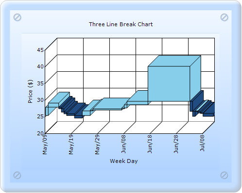

::: {style="DISPLAY: none"}
{#d2h_url_template}{#d2h_package_url style="WIDTH: 0px; DISPLAY: none; HEIGHT: 0px"}
:::

::: {.d2h_secondary_topic style="PADDING-BOTTOM: 10pt; MARGIN: 0pt; PADDING-LEFT: 0pt; PADDING-RIGHT: 0pt; PADDING-TOP: 0pt"}
#### Builder {#builder style="tab-stops: 0pt"}

[]{style="FONT-FAMILY: 'Calibri','sans-serif'"} 

To create Axis Range and Intervals by using any chart through Builder:

1.   In Controller, return view to the corresponding View page.

[]{style="FONT-FAMILY: 'Calibri','sans-serif'"} 

+----------------------------------------------------------------------------------------------------------------------------------+
| \[C#\]                                                                                                                           |
|                                                                                                                                  |
| [        [public]{style="COLOR: blue"} [ActionResult]{style="COLOR: #2b91af"} SimpleChart()]{style="FONT-FAMILY: 'Courier New'"} |
|                                                                                                                                  |
| [        {            ]{style="FONT-FAMILY: 'Courier New'"}                                                                      |
|                                                                                                                                  |
| [            [return]{style="COLOR: blue"} View();]{style="FONT-FAMILY: 'Courier New'"}                                          |
|                                                                                                                                  |
| [        }]{style="FONT-FAMILY: 'Courier New'"}                                                                                  |
|                                                                                                                                  |
| []{style="FONT-FAMILY: Consolas; COLOR: blue; FONT-SIZE: 9.5pt"}                                                                 |
+----------------------------------------------------------------------------------------------------------------------------------+

[]{style="FONT-FAMILY: 'Calibri','sans-serif'"} 

2.   In the View page, invoke the ChartBuilder by using the control ID as the first argument.

3.   Add the **Series** to the ChartModel and set the series type to **ThreeLineBreak**, and add the **Points** to the series and set the style.

4.   Set the ChartModel and ChartArea properties.

[]{style="FONT-FAMILY: 'Calibri','sans-serif'"} 

+--------------------------------------------------------------------------------------------------------------------------------------------------------------------------------------------------------------------------------------------------------------------------------------------------------------------+
| View \[ASPX\]                                                                                                                                                                                                                                                                                                      |
|                                                                                                                                                                                                                                                                                                                    |
| []{style="FONT-FAMILY: 'Calibri','sans-serif'"}                                                                                                                                                                                                                                                                    |
|                                                                                                                                                                                                                                                                                                                    |
| [\<%]{style="FONT-FAMILY: 'Courier New'; BACKGROUND: yellow"}[]{style="FONT-FAMILY: 'Courier New'"}                                                                                                                                                                                                                |
|                                                                                                                                                                                                                                                                                                                    |
| [    [double]{style="COLOR: blue"}\[\] points1 = {   25.250,27.750,29.000,28.275,27.750,27.750,27.275,26.250,25.750,25.250,26.250,25.250,24.500,]{style="FONT-FAMILY: 'Courier New'"}                                                                                                                              |
|                                                                                                                                                                                                                                                                                                                    |
| [                                          25.625,25.500,26.625,26.275,26.250,26.875,27.250,26.875,26.500,27.125,26.275,25.875,26.625,]{style="FONT-FAMILY: 'Courier New'"}                                                                                                                                        |
|                                                                                                                                                                                                                                                                                                                    |
| [                                          27.125,26.250,27.000,27.250,27.500,28.500,29.500,28.875,28.500,29.000,28.500,28.500,29.000,]{style="FONT-FAMILY: 'Courier New'"}                                                                                                                                        |
|                                                                                                                                                                                                                                                                                                                    |
| [                                          29.000,40.000,29.875,29.875,28.875,28.500,28.250,28.875,29.275,29.275,29.750,29.500,29.275,]{style="FONT-FAMILY: 'Courier New'"}                                                                                                                                        |
|                                                                                                                                                                                                                                                                                                                    |
| [                                          28.500,27.750,27.625,27.500,26.500,25.000,26.625,26.000,25.875,25.000,25.250,25.125,25.050};]{style="FONT-FAMILY: 'Courier New'"}                                                                                                                                       |
|                                                                                                                                                                                                                                                                                                                    |
| []{style="FONT-FAMILY: 'Courier New'"}                                                                                                                                                                                                                                                                             |
|                                                                                                                                                                                                                                                                                                                    |
| [    [DateTime]{style="COLOR: #2b91af"} current = [DateTime]{style="COLOR: #2b91af"}.Today.AddDays(-points1.Length);]{style="FONT-FAMILY: 'Courier New'"}                                                                                                                                                          |
|                                                                                                                                                                                                                                                                                                                    |
| []{style="FONT-FAMILY: 'Courier New'"}                                                                                                                                                                                                                                                                             |
|                                                                                                                                                                                                                                                                                                                    |
| [%\>]{style="FONT-FAMILY: 'Courier New'; BACKGROUND: yellow"}[]{style="FONT-FAMILY: 'Courier New'"}                                                                                                                                                                                                                |
|                                                                                                                                                                                                                                                                                                                    |
| [    [\<%]{style="BACKGROUND: yellow"}[=]{style="COLOR: blue"}Html.Chart([\"chart_Model\"]{style="COLOR: #a31515"}).Text([\"Three Line Break Chart\"]{style="COLOR: #a31515"})        ]{style="FONT-FAMILY: 'Courier New'"}                                                                                        |
|                                                                                                                                                                                                                                                                                                                    |
| [//\-\-\-\-\-\-\-\-\-\-\-\-\-- Addthe Series, add the points to the series and set some stylings you want to the series \-\-\-\-\-\-\-\-\-\-\-\-\-\-\-\-\--]{style="FONT-FAMILY: 'Courier New'; COLOR: green"}[]{style="FONT-FAMILY: 'Courier New'"}                                                               |
|                                                                                                                                                                                                                                                                                                                    |
| [              .PrimaryXAxis(xaxis =\>]{style="FONT-FAMILY: 'Courier New'"}                                                                                                                                                                                                                                        |
|                                                                                                                                                                                                                                                                                                                    |
| [              {]{style="FONT-FAMILY: 'Courier New'"}                                                                                                                                                                                                                                                              |
|                                                                                                                                                                                                                                                                                                                    |
| []{style="FONT-FAMILY: 'Courier New'"}                                                                                                                                                                                                                                                                             |
|                                                                                                                                                                                                                                                                                                                    |
| **[                  xaxis.Title([\"Week Day\"]{style="COLOR: #a31515"})]{style="FONT-FAMILY: 'Courier New'"}**                                                                                                                                                                                                    |
|                                                                                                                                                                                                                                                                                                                    |
| **[                       .ValueType(Syncfusion.Windows.Forms.Chart.[ChartValueType]{style="COLOR: #2b91af"}.DateTime)]{style="FONT-FAMILY: 'Courier New'"}**                                                                                                                                                      |
|                                                                                                                                                                                                                                                                                                                    |
| **[                       .DateTimeFormat([\"MMM/dd\"]{style="COLOR: #a31515"})]{style="FONT-FAMILY: 'Courier New'"}**                                                                                                                                                                                             |
|                                                                                                                                                                                                                                                                                                                    |
| **[                       .DateTimeRange([new]{style="COLOR: blue"} Syncfusion.Windows.Forms.Chart.[ChartDateTimeRange]{style="COLOR: #2b91af"}(current, current.AddDays(60), 10, Syncfusion.Windows.Forms.Chart.[ChartDateTimeIntervalType]{style="COLOR: #2b91af"}.Days))]{style="FONT-FAMILY: 'Courier New'"}** |
|                                                                                                                                                                                                                                                                                                                    |
| **[                       .IntervalType(Syncfusion.Windows.Forms.Chart.[ChartDateTimeIntervalType]{style="COLOR: #2b91af"}.Months)                       ]{style="FONT-FAMILY: 'Courier New'"}**                                                                                                                   |
|                                                                                                                                                                                                                                                                                                                    |
| **[                       .LabelRotate([true]{style="COLOR: blue"})]{style="FONT-FAMILY: 'Courier New'"}**                                                                                                                                                                                                         |
|                                                                                                                                                                                                                                                                                                                    |
| **[                       .LabelRotateAngle(270);                       ]{style="FONT-FAMILY: 'Courier New'"}**                                                                                                                                                                                                    |
|                                                                                                                                                                                                                                                                                                                    |
| **[              }).PrimaryYAxis(yaxis =\> {]{style="FONT-FAMILY: 'Courier New'"}**                                                                                                                                                                                                                                |
|                                                                                                                                                                                                                                                                                                                    |
| **[                  yaxis.Title([\"Price (\$)\"]{style="COLOR: #a31515"});                       ]{style="FONT-FAMILY: 'Courier New'"}**                                                                                                                                                                          |
|                                                                                                                                                                                                                                                                                                                    |
| **[              })]{style="FONT-FAMILY: 'Courier New'"}**                                                                                                                                                                                                                                                         |
|                                                                                                                                                                                                                                                                                                                    |
| [//\-\-\-\-\-\-\-\-\-\-\-\-- Set the required properties to chartmodel to set skin, size, legend visibility and so on  \-\-\-\-\-\-\-\-\-\-\-\-\-\-\-\-\-\-\-\-\-\-\--]{style="FONT-FAMILY: 'Courier New'; COLOR: green"}[    ]{style="FONT-FAMILY: 'Courier New'"}                                                |
|                                                                                                                                                                                                                                                                                                                    |
| [    ]{style="FONT-FAMILY: 'Courier New'"}                                                                                                                                                                                                                                                                         |
|                                                                                                                                                                                                                                                                                                                    |
| [    [%\>]{style="BACKGROUND: yellow"}]{style="FONT-FAMILY: 'Courier New'"}                                                                                                                                                                                                                                        |
+--------------------------------------------------------------------------------------------------------------------------------------------------------------------------------------------------------------------------------------------------------------------------------------------------------------------+

[]{style="FONT-FAMILY: 'Calibri','sans-serif'"} 

[]{style="FONT-FAMILY: 'Calibri','sans-serif'"} 

+--------------------------------------------------------------------------------------------------------------------------------------------------------------------------------------------------------------------------------------------------------------------------------------------------------------------+
| View \[cshtml\]                                                                                                                                                                                                                                                                                                    |
|                                                                                                                                                                                                                                                                                                                    |
| []{style="FONT-FAMILY: 'Calibri','sans-serif'"}                                                                                                                                                                                                                                                                    |
|                                                                                                                                                                                                                                                                                                                    |
| [\@{]{style="FONT-FAMILY: 'Courier New'; BACKGROUND: yellow"}[]{style="FONT-FAMILY: 'Courier New'"}                                                                                                                                                                                                                |
|                                                                                                                                                                                                                                                                                                                    |
| [    [double]{style="COLOR: blue"}\[\] points1 = {   25.250,27.750,29.000,28.275,27.750,27.750,27.275,26.250,25.750,25.250,26.250,25.250,24.500,]{style="FONT-FAMILY: 'Courier New'"}                                                                                                                              |
|                                                                                                                                                                                                                                                                                                                    |
| [                                          25.625,25.500,26.625,26.275,26.250,26.875,27.250,26.875,26.500,27.125,26.275,25.875,26.625,]{style="FONT-FAMILY: 'Courier New'"}                                                                                                                                        |
|                                                                                                                                                                                                                                                                                                                    |
| [                                          27.125,26.250,27.000,27.250,27.500,28.500,29.500,28.875,28.500,29.000,28.500,28.500,29.000,]{style="FONT-FAMILY: 'Courier New'"}                                                                                                                                        |
|                                                                                                                                                                                                                                                                                                                    |
| [                                          29.000,40.000,29.875,29.875,28.875,28.500,28.250,28.875,29.275,29.275,29.750,29.500,29.275,]{style="FONT-FAMILY: 'Courier New'"}                                                                                                                                        |
|                                                                                                                                                                                                                                                                                                                    |
| [                                          28.500,27.750,27.625,27.500,26.500,25.000,26.625,26.000,25.875,25.000,25.250,25.125,25.050};]{style="FONT-FAMILY: 'Courier New'"}                                                                                                                                       |
|                                                                                                                                                                                                                                                                                                                    |
| [    [DateTime]{style="COLOR: #2b91af"} current = [DateTime]{style="COLOR: #2b91af"}.Today.AddDays(-points1.Length);]{style="FONT-FAMILY: 'Courier New'"}                                                                                                                                                          |
|                                                                                                                                                                                                                                                                                                                    |
| [}]{style="FONT-FAMILY: 'Courier New'; BACKGROUND: yellow"}[]{style="FONT-FAMILY: 'Courier New'"}                                                                                                                                                                                                                  |
|                                                                                                                                                                                                                                                                                                                    |
| [    [\@{]{style="BACKGROUND: yellow"} Html.Chart([\"chart_Model\"]{style="COLOR: #a31515"}).Text([\"Three Line Break Chart\"]{style="COLOR: #a31515"})        ]{style="FONT-FAMILY: 'Courier New'"}                                                                                                               |
|                                                                                                                                                                                                                                                                                                                    |
| [//\-\-\-\-\-\-\-\-\-\-\-\-\-- Addthe Series, add the points to the series and set some stylings you want to the series \-\-\-\-\-\-\-\-\-\-\-\-\-\-\-\-\--]{style="FONT-FAMILY: 'Courier New'; COLOR: green"}[]{style="FONT-FAMILY: 'Courier New'"}                                                               |
|                                                                                                                                                                                                                                                                                                                    |
| [              .PrimaryXAxis(xaxis =\>]{style="FONT-FAMILY: 'Courier New'"}                                                                                                                                                                                                                                        |
|                                                                                                                                                                                                                                                                                                                    |
| [              {]{style="FONT-FAMILY: 'Courier New'"}                                                                                                                                                                                                                                                              |
|                                                                                                                                                                                                                                                                                                                    |
| **[                  xaxis.Title([\"Week Day\"]{style="COLOR: #a31515"})]{style="FONT-FAMILY: 'Courier New'"}**                                                                                                                                                                                                    |
|                                                                                                                                                                                                                                                                                                                    |
| **[                       .ValueType(Syncfusion.Windows.Forms.Chart.[ChartValueType]{style="COLOR: #2b91af"}.DateTime)]{style="FONT-FAMILY: 'Courier New'"}**                                                                                                                                                      |
|                                                                                                                                                                                                                                                                                                                    |
| **[                       .DateTimeFormat([\"MMM/dd\"]{style="COLOR: #a31515"})]{style="FONT-FAMILY: 'Courier New'"}**                                                                                                                                                                                             |
|                                                                                                                                                                                                                                                                                                                    |
| **[                       .DateTimeRange([new]{style="COLOR: blue"} Syncfusion.Windows.Forms.Chart.[ChartDateTimeRange]{style="COLOR: #2b91af"}(current, current.AddDays(60), 10, Syncfusion.Windows.Forms.Chart.[ChartDateTimeIntervalType]{style="COLOR: #2b91af"}.Days))]{style="FONT-FAMILY: 'Courier New'"}** |
|                                                                                                                                                                                                                                                                                                                    |
| **[                       .IntervalType(Syncfusion.Windows.Forms.Chart.[ChartDateTimeIntervalType]{style="COLOR: #2b91af"}.Months)                       ]{style="FONT-FAMILY: 'Courier New'"}**                                                                                                                   |
|                                                                                                                                                                                                                                                                                                                    |
| **[                       .LabelRotate([true]{style="COLOR: blue"})]{style="FONT-FAMILY: 'Courier New'"}**                                                                                                                                                                                                         |
|                                                                                                                                                                                                                                                                                                                    |
| **[                       .LabelRotateAngle(270);                       ]{style="FONT-FAMILY: 'Courier New'"}**                                                                                                                                                                                                    |
|                                                                                                                                                                                                                                                                                                                    |
| **[              }).PrimaryYAxis(yaxis =\> {]{style="FONT-FAMILY: 'Courier New'"}**                                                                                                                                                                                                                                |
|                                                                                                                                                                                                                                                                                                                    |
| **[                  yaxis.Title([\"Price (\$)\"]{style="COLOR: #a31515"});                       ]{style="FONT-FAMILY: 'Courier New'"}**                                                                                                                                                                          |
|                                                                                                                                                                                                                                                                                                                    |
| **[              })]{style="FONT-FAMILY: 'Courier New'"}**[.Render();]{style="FONT-FAMILY: 'Courier New'"}                                                                                                                                                                                                         |
|                                                                                                                                                                                                                                                                                                                    |
| [//\-\-\-\-\-\-\-\-\-\-\-\-- Set the required properties to chartmodel to set skin, size, legend visibility and so on  \-\-\-\-\-\-\-\-\-\-\-\-\-\-\-\-\-\-\-\-\-\-\--]{style="FONT-FAMILY: 'Courier New'; COLOR: green"}[        ]{style="FONT-FAMILY: 'Courier New'"}                                            |
|                                                                                                                                                                                                                                                                                                                    |
| [    [}]{style="BACKGROUND: yellow"}]{style="FONT-FAMILY: 'Courier New'"}                                                                                                                                                                                                                                          |
+--------------------------------------------------------------------------------------------------------------------------------------------------------------------------------------------------------------------------------------------------------------------------------------------------------------------+

[]{style="FONT-FAMILY: 'Calibri','sans-serif'"} 

[]{style="FONT-FAMILY: 'Calibri','sans-serif'"} 

[]{style="FONT-FAMILY: 'Calibri','sans-serif'"} 

5.   Build and run the application, to get the following output:

[]{style="FONT-FAMILY: Consolas; FONT-SIZE: 9.5pt"} 

{border="0"}

Figure 265: Chart displaying Three Line Break chart Series

[]{style="FONT-FAMILY: 'Times New Roman','serif'; FONT-SIZE: 12pt"} 

[]{#related-topics}
:::
