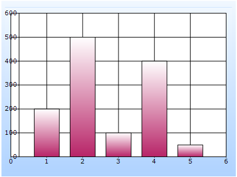

::: {style="DISPLAY: none"}
{#d2h_url_template}{#d2h_package_url style="WIDTH: 0px; DISPLAY: none; HEIGHT: 0px"}
:::

::: {.d2h_secondary_topic style="PADDING-BOTTOM: 10pt; MARGIN: 0pt; PADDING-LEFT: 0pt; PADDING-RIGHT: 0pt; PADDING-TOP: 0pt"}
##### Builder {#builder style="tab-stops: 0pt"}

[]{style="FONT-FAMILY: 'Calibri','sans-serif'"} 

To create a Custom Axis Location in any chart through Builder:

1.   In Controller, return view to the corresponding View page.

[]{style="FONT-FAMILY: 'Calibri','sans-serif'"} 

+----------------------------------------------------------------------------------------------------------------------------------+
| \[C#\]                                                                                                                           |
|                                                                                                                                  |
| [        [public]{style="COLOR: blue"} [ActionResult]{style="COLOR: #2b91af"} SimpleChart()]{style="FONT-FAMILY: 'Courier New'"} |
|                                                                                                                                  |
| [        {            ]{style="FONT-FAMILY: 'Courier New'"}                                                                      |
|                                                                                                                                  |
| [            [return]{style="COLOR: blue"} View();]{style="FONT-FAMILY: 'Courier New'"}                                          |
|                                                                                                                                  |
| [        }]{style="FONT-FAMILY: 'Courier New'"}                                                                                  |
|                                                                                                                                  |
| []{style="FONT-FAMILY: Consolas; COLOR: blue; FONT-SIZE: 9.5pt"}                                                                 |
+----------------------------------------------------------------------------------------------------------------------------------+

[]{style="FONT-FAMILY: 'Calibri','sans-serif'"} 

2.   In the View page, invoke the ChartBuilder by using the control ID as the first argument.

3.   Add the **Series** to the ChartModel and set the series type, and add the **Points** to the series and set the style.

4.   Set the ChartModel and ChartArea properties.

5.   Set the LocationType and Location properties of the PrimaryYAxis.

[]{style="FONT-FAMILY: 'Calibri','sans-serif'"} 

+-------------------------------------------------------------------------------------------------------------------------------------------------------------------------------------------------------------------------------------------------------------------------+
| View \[ASPX\]                                                                                                                                                                                                                                                           |
|                                                                                                                                                                                                                                                                         |
| []{style="FONT-FAMILY: 'Courier New'"}                                                                                                                                                                                                                                  |
|                                                                                                                                                                                                                                                                         |
| [    [\<%]{style="BACKGROUND: yellow"}[=]{style="COLOR: blue"} Html.Chart([\"SimpleChart\"]{style="COLOR: #a31515"}).Series(series =\>{})]{style="FONT-FAMILY: 'Courier New'"}                                                                                          |
|                                                                                                                                                                                                                                                                         |
| [            [//\-\-\-\-\-\-\-\-\-\-\-\-\-- Add the remaining Points to the series and set some stylings you want to the series \-\-\-\-\-\-\-\-\-\-\-\-\-\-\-\-\--]{style="COLOR: green"}]{style="FONT-FAMILY: 'Courier New'"}                                         |
|                                                                                                                                                                                                                                                                         |
| **[                      .PrimaryYAxis(yaxis =\> {                          yaxis.LocationType(Syncfusion.Windows.Forms.Chart.[ChartAxisLocationType]{style="COLOR: #2b91af"}.Set)]{style="FONT-FAMILY: 'Courier New'"}**                                               |
|                                                                                                                                                                                                                                                                         |
| **[                               .Location([new]{style="COLOR: blue"} System.Drawing.[PointF]{style="COLOR: #2b91af"}(30, 266));]{style="FONT-FAMILY: 'Courier New'"}**                                                                                                |
|                                                                                                                                                                                                                                                                         |
| **[                      })]{style="FONT-FAMILY: 'Courier New'"}**                                                                                                                                                                                                      |
|                                                                                                                                                                                                                                                                         |
| **[]{style="FONT-FAMILY: 'Courier New'"}**                                                                                                                                                                                                                              |
|                                                                                                                                                                                                                                                                         |
| [    //\-\-\-\-\-\-\-\-\-\-\-\-- Set the required properties to chartmodel to set skin, size, legend visibility and so on  \-\-\-\-\-\-\-\-\-\-\-\-\-\-\-\-\-\-\-\-\-\-\--]{style="FONT-FAMILY: 'Courier New'; COLOR: green"}[    ]{style="FONT-FAMILY: 'Courier New'"} |
|                                                                                                                                                                                                                                                                         |
| [        ]{style="FONT-FAMILY: 'Courier New'"}                                                                                                                                                                                                                          |
|                                                                                                                                                                                                                                                                         |
| [    [%\>]{style="BACKGROUND: yellow"}]{style="FONT-FAMILY: 'Courier New'"}                                                                                                                                                                                             |
|                                                                                                                                                                                                                                                                         |
| []{style="FONT-FAMILY: Consolas; COLOR: blue; FONT-SIZE: 9.5pt"}                                                                                                                                                                                                        |
|                                                                                                                                                                                                                                                                         |
| []{style="FONT-FAMILY: Consolas; COLOR: blue; FONT-SIZE: 9.5pt"}                                                                                                                                                                                                        |
+-------------------------------------------------------------------------------------------------------------------------------------------------------------------------------------------------------------------------------------------------------------------------+

[]{style="FONT-FAMILY: 'Calibri','sans-serif'"} 

[]{style="FONT-FAMILY: 'Calibri','sans-serif'"} 

+-------------------------------------------------------------------------------------------------------------------------------------------------------------------------------------------------------------------------------------------------------------------------+
| View \[cshtml\]                                                                                                                                                                                                                                                         |
|                                                                                                                                                                                                                                                                         |
| []{style="FONT-FAMILY: 'Courier New'"}                                                                                                                                                                                                                                  |
|                                                                                                                                                                                                                                                                         |
| [    [\@{]{style="BACKGROUND: yellow"} Html.Chart([\"SimpleChart\"]{style="COLOR: #a31515"}).Series(series =\>{]{style="FONT-FAMILY: 'Courier New'"}                                                                                                                    |
|                                                                                                                                                                                                                                                                         |
| [            [//\-\-\-\-\-\-\-\-\-\-\-\-\-- Add the remaining points to the series and set some stylings you want to the series \-\-\-\-\-\-\-\-\-\-\-\-\-\-\-\-\--]{style="COLOR: green"}]{style="FONT-FAMILY: 'Courier New'"}                                         |
|                                                                                                                                                                                                                                                                         |
| **[                   ]{style="FONT-FAMILY: 'Courier New'"}**[})**  ** ]{style="FONT-FAMILY: 'Courier New'"}                                                                                                                                                            |
|                                                                                                                                                                                                                                                                         |
| **[                .PrimaryYAxis(yaxis =\> {                          yaxis.LocationType(Syncfusion.Windows.Forms.Chart.[ChartAxisLocationType]{style="COLOR: #2b91af"}.Set)]{style="FONT-FAMILY: 'Courier New'"}**                                                     |
|                                                                                                                                                                                                                                                                         |
| **[                               .Location([new]{style="COLOR: blue"} System.Drawing.[PointF]{style="COLOR: #2b91af"}(30, 266));]{style="FONT-FAMILY: 'Courier New'"}**                                                                                                |
|                                                                                                                                                                                                                                                                         |
| **[                      })]{style="FONT-FAMILY: 'Courier New'"}**[.Render();]{style="FONT-FAMILY: 'Courier New'"}                                                                                                                                                      |
|                                                                                                                                                                                                                                                                         |
| **[]{style="FONT-FAMILY: 'Courier New'"}**                                                                                                                                                                                                                              |
|                                                                                                                                                                                                                                                                         |
| [    //\-\-\-\-\-\-\-\-\-\-\-\-- Set the required properties to chartmodel to set skin, size, legend visibility and so on  \-\-\-\-\-\-\-\-\-\-\-\-\-\-\-\-\-\-\-\-\-\-\--]{style="FONT-FAMILY: 'Courier New'; COLOR: green"}[    ]{style="FONT-FAMILY: 'Courier New'"} |
|                                                                                                                                                                                                                                                                         |
| [        ]{style="FONT-FAMILY: 'Courier New'"}                                                                                                                                                                                                                          |
|                                                                                                                                                                                                                                                                         |
| [    [}]{style="BACKGROUND: yellow"}]{style="FONT-FAMILY: 'Courier New'"}[]{style="FONT-FAMILY: Consolas; COLOR: blue; FONT-SIZE: 9.5pt"}                                                                                                                               |
+-------------------------------------------------------------------------------------------------------------------------------------------------------------------------------------------------------------------------------------------------------------------------+

[]{style="FONT-FAMILY: 'Calibri','sans-serif'"} 

[]{style="FONT-FAMILY: 'Calibri','sans-serif'"} 

6.   Build and run the application, to get the following output:

[]{style="FONT-FAMILY: 'Calibri','sans-serif'"} 

{border="0"}

Figure 269: Custom YAxis Location

[]{style="FONT-FAMILY: 'Calibri','sans-serif'"} 

[]{#related-topics}
:::
