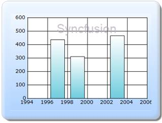

::: {style="DISPLAY: none"}
{#d2h_url_template}{#d2h_package_url style="WIDTH: 0px; DISPLAY: none; HEIGHT: 0px"}
:::

:::::: {.d2h_secondary_topic style="PADDING-BOTTOM: 10pt; MARGIN: 0pt; PADDING-LEFT: 0pt; PADDING-RIGHT: 0pt; PADDING-TOP: 0pt"}
#### Builder {#builder style="tab-stops: 0pt"}

[]{style="FONT-FAMILY: 'Calibri','sans-serif'"} 

The steps to customize the Watermark text through Builder are as follows:

 

Step 1:

View:

The Watermark text can be set by using the **WaterMarkText** property. The Watermark text can be positioned by using the **WaterMarkVerticalAlignment** and **WaterMarkVerticalAlignment** properties. The opacity of the text can be set by using the **WaterMarkOpacity** property. The **WaterMarkZOrder** is used to set the display of the text, if the text can be displayed behind or over the ChartArea. The text appearance can be customized by using the **WaterMarkFont** and **WaterMarkTextColor** properties.

Add the code displayed below in the aspx file.

[]{style="FONT-FAMILY: 'Calibri','sans-serif'"} 

::: {style="BORDER-BOTTOM: #c8c8c8 1pt solid; BORDER-LEFT: #c8c8c8 1pt solid; PADDING-BOTTOM: 1pt; MARGIN-TOP: 0pt; PADDING-LEFT: 4pt; PADDING-RIGHT: 4pt; MARGIN-BOTTOM: 0pt; BACKGROUND: #f0f0f0; BORDER-TOP: #c8c8c8 1pt solid; BORDER-RIGHT: #c8c8c8 1pt solid; PADDING-TOP: 1pt"}
[View\[ASPX\]]{style="FONT-FAMILY: 'Courier New'"}

[]{style="FONT-FAMILY: 'Courier New'; BACKGROUND: yellow"} 

[\<%]{style="FONT-FAMILY: 'Courier New'; BACKGROUND: yellow"}[\--Rendering the Chart COntrol\--]{style="FONT-FAMILY: 'Courier New'; COLOR: green"}[%\>]{style="FONT-FAMILY: 'Courier New'; BACKGROUND: yellow"}

[  ]{style="FONT-FAMILY: 'Courier New'"}

[    [\<%]{style="BACKGROUND: yellow"}[=]{style="COLOR: blue"}Html.Chart([\"chart_Model\"]{style="COLOR: #a31515"})]{style="FONT-FAMILY: 'Courier New'"}

[]{style="FONT-FAMILY: 'Courier New'"} 

[    .ChartArea(area =\> area.Depth(50)]{style="FONT-FAMILY: 'Courier New'"}

[        [//Setting the watermark text]{style="COLOR: green"}]{style="FONT-FAMILY: 'Courier New'"}

[                .WaterMarkText([\"Syncfusion\"]{style="COLOR: #a31515"})]{style="FONT-FAMILY: 'Courier New'"}

[                .WaterMarkZOrder(Syncfusion.Windows.Forms.Chart.[ChartWaterMarkOrder]{style="COLOR: #2b91af"}.Over)]{style="FONT-FAMILY: 'Courier New'"}

[        [//setting the vertical alignment of the text]{style="COLOR: green"}]{style="FONT-FAMILY: 'Courier New'"}

[                .WaterMarkVerticalAlignment(Syncfusion.Windows.Forms.Chart.[ChartAlignment]{style="COLOR: #2b91af"}.Near)]{style="FONT-FAMILY: 'Courier New'"}

[        [//setting the horizontal alignment of the text]{style="COLOR: green"}]{style="FONT-FAMILY: 'Courier New'"}

[                .WaterMarkHorizontalAlignment(Syncfusion.Windows.Forms.Chart.[ChartAlignment]{style="COLOR: #2b91af"}.Center)]{style="FONT-FAMILY: 'Courier New'"}

[        [//setting the opacity]{style="COLOR: green"}]{style="FONT-FAMILY: 'Courier New'"}

[                .WaterMarkOpacity(60f)]{style="FONT-FAMILY: 'Courier New'"}

[        [//Setting the Zorder to display the text over the chart area.]{style="COLOR: green"}]{style="FONT-FAMILY: 'Courier New'"}

[                .WaterMarkZOrder(Syncfusion.Windows.Forms.Chart.[ChartWaterMarkOrder]{style="COLOR: #2b91af"}.Over)]{style="FONT-FAMILY: 'Courier New'"}

[        [//setting the font style]{style="COLOR: green"}]{style="FONT-FAMILY: 'Courier New'"}

[                .WaterMarkFont([new]{style="COLOR: blue"} System.Drawing.[Font]{style="COLOR: #2b91af"}([\"Arial\"]{style="COLOR: #a31515"}, 18))]{style="FONT-FAMILY: 'Courier New'"}

[        [//setting the text color]{style="COLOR: green"}]{style="FONT-FAMILY: 'Courier New'"}

[                .WaterMarkTextColor(System.Drawing.[Color]{style="COLOR: #2b91af"}.FromArgb(171, 153, 177)))]{style="FONT-FAMILY: 'Courier New'"}

[]{style="FONT-FAMILY: 'Courier New'"} 

[    .Series(series=\>{]{style="FONT-FAMILY: 'Courier New'"}

[        series.Add().Points(points =\>]{style="FONT-FAMILY: 'Courier New'"}

[        {]{style="FONT-FAMILY: 'Courier New'"}

[            points.Add().X(1997).YValues([new]{style="COLOR: blue"} [double]{style="COLOR: blue"}\[\] { 437 });]{style="FONT-FAMILY: 'Courier New'"}

[            points.Add().X(1999).YValues([new]{style="COLOR: blue"} [double]{style="COLOR: blue"}\[\] { 311 });]{style="FONT-FAMILY: 'Courier New'"}

[            points.Add().X(2003).YValues([new]{style="COLOR: blue"} [double]{style="COLOR: blue"}\[\] { 466 });]{style="FONT-FAMILY: 'Courier New'"}

[        })]{style="FONT-FAMILY: 'Courier New'"}

[        .Type(Syncfusion.Windows.Forms.Chart.[ChartSeriesType]{style="COLOR: #2b91af"}.Column);]{style="FONT-FAMILY: 'Courier New'"}

[    })]{style="FONT-FAMILY: 'Courier New'"}

[]{style="FONT-FAMILY: 'Courier New'"} 

[        .Skins([ChartModelSkins]{style="COLOR: #2b91af"}.Office2007Blue)]{style="FONT-FAMILY: 'Courier New'"}

[         .ChartSeriesSkins([ChartSeriesSkins]{style="COLOR: #2b91af"}.DefaultAlpha)]{style="FONT-FAMILY: 'Courier New'"}

[        .BorderAppearance(border =\> border.SkinStyle(Syncfusion.Windows.Forms.Chart.[ChartBorderSkinStyle]{style="COLOR: #2b91af"}.Emboss))]{style="FONT-FAMILY: 'Courier New'"}

[        [%\>]{style="BACKGROUND: yellow"}]{style="FONT-FAMILY: 'Courier New'"}**[]{style="FONT-FAMILY: 'Courier New'"}**
:::

 

[]{style="FONT-FAMILY: 'Calibri','sans-serif'"} 

::: {style="BORDER-BOTTOM: #c8c8c8 1pt solid; BORDER-LEFT: #c8c8c8 1pt solid; PADDING-BOTTOM: 1pt; MARGIN-TOP: 0pt; PADDING-LEFT: 4pt; PADDING-RIGHT: 4pt; MARGIN-BOTTOM: 0pt; BACKGROUND: #f0f0f0; BORDER-TOP: #c8c8c8 1pt solid; BORDER-RIGHT: #c8c8c8 1pt solid; PADDING-TOP: 1pt"}
[View\[cshtml\]]{style="FONT-FAMILY: 'Courier New'"}

[]{style="FONT-FAMILY: 'Courier New'; BACKGROUND: yellow"} 

[@\*]{style="FONT-FAMILY: 'Courier New'; BACKGROUND: yellow"}[\--Rendering the Chart COntrol\--]{style="FONT-FAMILY: 'Courier New'; COLOR: green"}[\*@]{style="FONT-FAMILY: 'Courier New'; BACKGROUND: yellow"}

[  ]{style="FONT-FAMILY: 'Courier New'"}

[    [\<%]{style="BACKGROUND: yellow"}[=]{style="COLOR: blue"}Html.Chart([\"chart_Model\"]{style="COLOR: #a31515"})]{style="FONT-FAMILY: 'Courier New'"}

[]{style="FONT-FAMILY: 'Courier New'"} 

[    .ChartArea(area =\> area.Depth(50)]{style="FONT-FAMILY: 'Courier New'"}

[        [//Setting the watermark text]{style="COLOR: green"}]{style="FONT-FAMILY: 'Courier New'"}

[                .WaterMarkText([\"Syncfusion\"]{style="COLOR: #a31515"})]{style="FONT-FAMILY: 'Courier New'"}

[                .WaterMarkZOrder(Syncfusion.Windows.Forms.Chart.[ChartWaterMarkOrder]{style="COLOR: #2b91af"}.Over)]{style="FONT-FAMILY: 'Courier New'"}

[        [//setting the vertical alignment of the text]{style="COLOR: green"}]{style="FONT-FAMILY: 'Courier New'"}

[                .WaterMarkVerticalAlignment(Syncfusion.Windows.Forms.Chart.[ChartAlignment]{style="COLOR: #2b91af"}.Near)]{style="FONT-FAMILY: 'Courier New'"}

[        [//setting the horizontal alignment of the text]{style="COLOR: green"}]{style="FONT-FAMILY: 'Courier New'"}

[                .WaterMarkHorizontalAlignment(Syncfusion.Windows.Forms.Chart.[ChartAlignment]{style="COLOR: #2b91af"}.Center)]{style="FONT-FAMILY: 'Courier New'"}

[        [//setting the opacity]{style="COLOR: green"}]{style="FONT-FAMILY: 'Courier New'"}

[                .WaterMarkOpacity(60f)]{style="FONT-FAMILY: 'Courier New'"}

[        [//Setting the Zorder to display the text over the chart area.]{style="COLOR: green"}]{style="FONT-FAMILY: 'Courier New'"}

[                .WaterMarkZOrder(Syncfusion.Windows.Forms.Chart.[ChartWaterMarkOrder]{style="COLOR: #2b91af"}.Over)]{style="FONT-FAMILY: 'Courier New'"}

[        [//setting the font style]{style="COLOR: green"}]{style="FONT-FAMILY: 'Courier New'"}

[                .WaterMarkFont([new]{style="COLOR: blue"} System.Drawing.[Font]{style="COLOR: #2b91af"}([\"Arial\"]{style="COLOR: #a31515"}, 18))]{style="FONT-FAMILY: 'Courier New'"}

[        [//setting the text color]{style="COLOR: green"}]{style="FONT-FAMILY: 'Courier New'"}

[                .WaterMarkTextColor(System.Drawing.[Color]{style="COLOR: #2b91af"}.FromArgb(171, 153, 177)))]{style="FONT-FAMILY: 'Courier New'"}

[]{style="FONT-FAMILY: 'Courier New'"} 

[    .Series(series=\>{]{style="FONT-FAMILY: 'Courier New'"}

[        series.Add().Points(points =\>]{style="FONT-FAMILY: 'Courier New'"}

[        {]{style="FONT-FAMILY: 'Courier New'"}

[            points.Add().X(1997).YValues([new]{style="COLOR: blue"} [double]{style="COLOR: blue"}\[\] { 437 });]{style="FONT-FAMILY: 'Courier New'"}

[            points.Add().X(1999).YValues([new]{style="COLOR: blue"} [double]{style="COLOR: blue"}\[\] { 311 });]{style="FONT-FAMILY: 'Courier New'"}

[            points.Add().X(2003).YValues([new]{style="COLOR: blue"} [double]{style="COLOR: blue"}\[\] { 466 });]{style="FONT-FAMILY: 'Courier New'"}

[        })]{style="FONT-FAMILY: 'Courier New'"}

[        .Type(Syncfusion.Windows.Forms.Chart.[ChartSeriesType]{style="COLOR: #2b91af"}.Column);]{style="FONT-FAMILY: 'Courier New'"}

[    })]{style="FONT-FAMILY: 'Courier New'"}

[]{style="FONT-FAMILY: 'Courier New'"} 

[        .Skins([ChartModelSkins]{style="COLOR: #2b91af"}.Office2007Blue)]{style="FONT-FAMILY: 'Courier New'"}

[         .ChartSeriesSkins([ChartSeriesSkins]{style="COLOR: #2b91af"}.DefaultAlpha)]{style="FONT-FAMILY: 'Courier New'"}

[        .BorderAppearance(border =\> border.SkinStyle(Syncfusion.Windows.Forms.Chart.[ChartBorderSkinStyle]{style="COLOR: #2b91af"}.Emboss))]{style="FONT-FAMILY: 'Courier New'"}

[        [%\>]{style="BACKGROUND: yellow"}]{style="FONT-FAMILY: 'Courier New'"}**[]{style="FONT-FAMILY: 'Courier New'"}**
:::

 

Step 2:

Controller:

Add the code displayed below in the Controller file.  

::: {style="BORDER-BOTTOM: #c8c8c8 1pt solid; BORDER-LEFT: #c8c8c8 1pt solid; PADDING-BOTTOM: 1pt; MARGIN-TOP: 0pt; PADDING-LEFT: 4pt; PADDING-RIGHT: 4pt; MARGIN-BOTTOM: 0pt; BACKGROUND: #f0f0f0; BORDER-TOP: #c8c8c8 1pt solid; BORDER-RIGHT: #c8c8c8 1pt solid; PADDING-TOP: 1pt"}
[        [public]{style="COLOR: blue"} [ActionResult]{style="COLOR: #2b91af"} Index()]{style="FONT-FAMILY: 'Courier New'"}

[        {]{style="FONT-FAMILY: 'Courier New'"}

[            [return]{style="COLOR: blue"} View();]{style="FONT-FAMILY: 'Courier New'"}

[        }]{style="FONT-FAMILY: 'Courier New'"}
:::

**[]{style="FONT-FAMILY: 'Calibri','sans-serif'"}** 

Step 3:

Run the code, to get the following output:

[]{style="FONT-FAMILY: 'Calibri','sans-serif'"} 

{border="0"}

Figure 312: Chart - Watermark support

**[]{style="FONT-FAMILY: 'Calibri','sans-serif'"}** 

[]{#related-topics}
::::::
