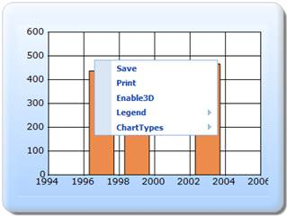

::: {style="DISPLAY: none"}
{#d2h_url_template}{#d2h_package_url style="WIDTH: 0px; DISPLAY: none; HEIGHT: 0px"}
:::

:::::::: {.d2h_secondary_topic style="PADDING-BOTTOM: 10pt; MARGIN: 0pt; PADDING-LEFT: 0pt; PADDING-RIGHT: 0pt; PADDING-TOP: 0pt"}
##### Builder {#builder style="tab-stops: 0pt"}

[]{style="FONT-FAMILY: 'Calibri','sans-serif'"} 

The steps to enable the ContextMenu through Builder are as follows:

 

Step 1:

View:

Add the code displayed below in the View.

 

::: {style="BORDER-BOTTOM: #c8c8c8 1pt solid; BORDER-LEFT: #c8c8c8 1pt solid; PADDING-BOTTOM: 1pt; MARGIN-TOP: 0pt; PADDING-LEFT: 4pt; PADDING-RIGHT: 4pt; MARGIN-BOTTOM: 0pt; BACKGROUND: #f0f0f0; BORDER-TOP: #c8c8c8 1pt solid; BORDER-RIGHT: #c8c8c8 1pt solid; PADDING-TOP: 1pt"}
View \[ASPX\]

[]{style="FONT-FAMILY: 'Courier New'; BACKGROUND: yellow"} 

[\<%]{style="FONT-FAMILY: 'Courier New'; BACKGROUND: yellow"}[\--Rendering the Chart through partial view\--]{style="FONT-FAMILY: 'Courier New'; COLOR: green"}[%\>]{style="FONT-FAMILY: 'Courier New'; BACKGROUND: yellow"}

[]{style="FONT-FAMILY: 'Courier New'; BACKGROUND: yellow"} 

[    [\<%]{style="BACKGROUND: yellow"} Html.RenderPartial([\"PartialView\"]{style="COLOR: #a31515"}, [this]{style="COLOR: blue"}.ViewData); [%\>]{style="BACKGROUND: yellow"}]{style="FONT-FAMILY: 'Courier New'"}
:::

 

::: {style="BORDER-BOTTOM: #c8c8c8 1pt solid; BORDER-LEFT: #c8c8c8 1pt solid; PADDING-BOTTOM: 1pt; MARGIN-TOP: 0pt; PADDING-LEFT: 4pt; PADDING-RIGHT: 4pt; MARGIN-BOTTOM: 0pt; BACKGROUND: #f0f0f0; BORDER-TOP: #c8c8c8 1pt solid; BORDER-RIGHT: #c8c8c8 1pt solid; PADDING-TOP: 1pt"}
View \[cshtml\]

[]{style="FONT-FAMILY: 'Courier New'; BACKGROUND: yellow"} 

[@\*]{style="FONT-FAMILY: 'Courier New'; BACKGROUND: yellow"}[\--Rendering the Chart through partial view\--]{style="FONT-FAMILY: 'Courier New'; COLOR: green"}[\*@]{style="FONT-FAMILY: 'Courier New'; BACKGROUND: yellow"}

[]{style="FONT-FAMILY: 'Courier New'; BACKGROUND: yellow"} 

[    [@]{style="BACKGROUND: yellow"}Html.RenderPartial([\"PartialView\"]{style="COLOR: #a31515"}, [this]{style="COLOR: blue"}.ViewData)[]{style="BACKGROUND: yellow"}]{style="FONT-FAMILY: 'Courier New'"}
:::

**[]{style="FONT-FAMILY: 'Calibri','sans-serif'"}** 

Step 2:

PartialView:

By setting the **ShowContextMenu** property to true, the context menu can be enabled. The ChartParams values can be got by using the **ChartParamsArgs** property. To get the updated chart, chart parameter values are used.

Add the code displayed below in the Partial View.

[]{style="FONT-FAMILY: 'Calibri','sans-serif'"} 

::: {style="BORDER-BOTTOM: #c8c8c8 1pt solid; BORDER-LEFT: #c8c8c8 1pt solid; PADDING-BOTTOM: 1pt; MARGIN-TOP: 0pt; PADDING-LEFT: 4pt; PADDING-RIGHT: 4pt; MARGIN-BOTTOM: 0pt; BACKGROUND: #f0f0f0; BORDER-TOP: #c8c8c8 1pt solid; BORDER-RIGHT: #c8c8c8 1pt solid; PADDING-TOP: 1pt"}
View \[ASPX\]

[]{style="FONT-FAMILY: 'Courier New'; BACKGROUND: yellow"} 

[\<%]{style="FONT-FAMILY: 'Courier New'; BACKGROUND: yellow"}[\--Rendering the Chart Control\--]{style="FONT-FAMILY: 'Courier New'; COLOR: green"}[%\>]{style="FONT-FAMILY: 'Courier New'; BACKGROUND: yellow"}

[    [\<%]{style="BACKGROUND: yellow"}[=]{style="COLOR: blue"}Html.Chart([\"chart_Model\"]{style="COLOR: #a31515"})]{style="FONT-FAMILY: 'Courier New'"}

[        [//Enabling the Context Menu ]{style="COLOR: green"}]{style="FONT-FAMILY: 'Courier New'"}

**[      .ShowContextMenu([true]{style="COLOR: blue"})]{style="FONT-FAMILY: 'Courier New'"}**

[       [//Getting the chart post parameter values from the controller]{style="COLOR: green"}]{style="FONT-FAMILY: 'Courier New'"}

**[     .ChartParamsArgs(([ChartParams]{style="COLOR: #2b91af"})ViewData\[[\"ChartParamsData\"]{style="COLOR: #a31515"}\])]{style="FONT-FAMILY: 'Courier New'"}**

[    .Series(series=\>{]{style="FONT-FAMILY: 'Courier New'"}

[        series.Add().Points(points =\>]{style="FONT-FAMILY: 'Courier New'"}

[        {]{style="FONT-FAMILY: 'Courier New'"}

[            points.Add().X(1997).YValues([new]{style="COLOR: blue"} [double]{style="COLOR: blue"}\[\] { 437 });]{style="FONT-FAMILY: 'Courier New'"}

[            points.Add().X(1999).YValues([new]{style="COLOR: blue"} [double]{style="COLOR: blue"}\[\] { 311 });]{style="FONT-FAMILY: 'Courier New'"}

[            points.Add().X(2003).YValues([new]{style="COLOR: blue"} [double]{style="COLOR: blue"}\[\] { 466 });]{style="FONT-FAMILY: 'Courier New'"}

[        })]{style="FONT-FAMILY: 'Courier New'"}

[        .Type(Syncfusion.Windows.Forms.Chart.[ChartSeriesType]{style="COLOR: #2b91af"}.Column);]{style="FONT-FAMILY: 'Courier New'"}

[    })]{style="FONT-FAMILY: 'Courier New'"}

[]{style="FONT-FAMILY: 'Courier New'"} 

[        .Skins([ChartModelSkins]{style="COLOR: #2b91af"}.Office2007Blue)]{style="FONT-FAMILY: 'Courier New'"}

[        .BorderAppearance(border =\> border.SkinStyle(Syncfusion.Windows.Forms.Chart.[ChartBorderSkinStyle]{style="COLOR: #2b91af"}.Emboss))]{style="FONT-FAMILY: 'Courier New'"}

[        [%\>]{style="BACKGROUND: yellow"}]{style="FONT-FAMILY: 'Courier New'"}**[]{style="FONT-FAMILY: 'Courier New'"}**
:::

[]{style="FONT-FAMILY: 'Calibri','sans-serif'"} 

::: {style="BORDER-BOTTOM: #c8c8c8 1pt solid; BORDER-LEFT: #c8c8c8 1pt solid; PADDING-BOTTOM: 1pt; MARGIN-TOP: 0pt; PADDING-LEFT: 4pt; PADDING-RIGHT: 4pt; MARGIN-BOTTOM: 0pt; BACKGROUND: #f0f0f0; BORDER-TOP: #c8c8c8 1pt solid; BORDER-RIGHT: #c8c8c8 1pt solid; PADDING-TOP: 1pt"}
View \[cshtml\]

[]{style="FONT-FAMILY: 'Courier New'; BACKGROUND: yellow"} 

[@\*]{style="FONT-FAMILY: 'Courier New'; BACKGROUND: yellow"}[\--Rendering the Chart Control\--]{style="FONT-FAMILY: 'Courier New'; COLOR: green"}[\*@]{style="FONT-FAMILY: 'Courier New'; BACKGROUND: yellow"}

[    [\@{]{style="BACKGROUND: yellow"} Html.Chart([\"chart_Model\"]{style="COLOR: #a31515"})]{style="FONT-FAMILY: 'Courier New'"}

[        [//Enabling the Context Menu ]{style="COLOR: green"}]{style="FONT-FAMILY: 'Courier New'"}

**[      .ShowContextMenu([true]{style="COLOR: blue"})]{style="FONT-FAMILY: 'Courier New'"}**

[       [//Getting the chart post parameter values from the controller]{style="COLOR: green"}]{style="FONT-FAMILY: 'Courier New'"}

**[     .ChartParamsArgs(([ChartParams]{style="COLOR: #2b91af"})ViewData\[[\"ChartParamsData\"]{style="COLOR: #a31515"}\])]{style="FONT-FAMILY: 'Courier New'"}**

[    .Series(series=\>{]{style="FONT-FAMILY: 'Courier New'"}

[        series.Add().Points(points =\>]{style="FONT-FAMILY: 'Courier New'"}

[        {]{style="FONT-FAMILY: 'Courier New'"}

[            points.Add().X(1997).YValues([new]{style="COLOR: blue"} [double]{style="COLOR: blue"}\[\] { 437 });]{style="FONT-FAMILY: 'Courier New'"}

[            points.Add().X(1999).YValues([new]{style="COLOR: blue"} [double]{style="COLOR: blue"}\[\] { 311 });]{style="FONT-FAMILY: 'Courier New'"}

[            points.Add().X(2003).YValues([new]{style="COLOR: blue"} [double]{style="COLOR: blue"}\[\] { 466 });]{style="FONT-FAMILY: 'Courier New'"}

[        })]{style="FONT-FAMILY: 'Courier New'"}

[        .Type(Syncfusion.Windows.Forms.Chart.[ChartSeriesType]{style="COLOR: #2b91af"}.Column);]{style="FONT-FAMILY: 'Courier New'"}

[    })]{style="FONT-FAMILY: 'Courier New'"}

[]{style="FONT-FAMILY: 'Courier New'"} 

[        .Skins([ChartModelSkins]{style="COLOR: #2b91af"}.Office2007Blue)]{style="FONT-FAMILY: 'Courier New'"}

[        .BorderAppearance(border =\> border.SkinStyle(Syncfusion.Windows.Forms.Chart.[ChartBorderSkinStyle]{style="COLOR: #2b91af"}.Emboss)).Render();]{style="FONT-FAMILY: 'Courier New'"}

[        [}]{style="BACKGROUND: yellow"}]{style="FONT-FAMILY: 'Courier New'"}**[]{style="FONT-FAMILY: 'Courier New'"}**
:::

 

Step 3:

Controller:

Add the code displayed below in the Controller. The **ChartParams** class is used to get the post parameter values. The post parameter values will be passed to the view through the ViewData.

[]{style="FONT-FAMILY: 'Calibri','sans-serif'"} 

::: {style="BORDER-BOTTOM: #c8c8c8 1pt solid; BORDER-LEFT: #c8c8c8 1pt solid; PADDING-BOTTOM: 1pt; MARGIN-TOP: 0pt; PADDING-LEFT: 4pt; PADDING-RIGHT: 4pt; MARGIN-BOTTOM: 0pt; BACKGROUND: #f0f0f0; BORDER-TOP: #c8c8c8 1pt solid; BORDER-RIGHT: #c8c8c8 1pt solid; PADDING-TOP: 1pt"}
[public]{style="FONT-FAMILY: 'Courier New'; COLOR: blue"}[ [ActionResult]{style="COLOR: #2b91af"} Index()]{style="FONT-FAMILY: 'Courier New'"}

[        {]{style="FONT-FAMILY: 'Courier New'"}

[            [ChartParams]{style="COLOR: #2b91af"} ChartParamsData = [new]{style="COLOR: blue"} [ChartParams]{style="COLOR: #2b91af"}();]{style="FONT-FAMILY: 'Courier New'"}

[            ViewData\[[\"ChartParamsData\"]{style="COLOR: #a31515"}\] = ChartParamsData;]{style="FONT-FAMILY: 'Courier New'"}

[            [return]{style="COLOR: blue"} View();]{style="FONT-FAMILY: 'Courier New'"}

[        }]{style="FONT-FAMILY: 'Courier New'"}

[]{style="FONT-FAMILY: 'Courier New'"} 

[        \[[AcceptVerbs]{style="COLOR: #2b91af"}([HttpVerbs]{style="COLOR: #2b91af"}.Post)\]]{style="FONT-FAMILY: 'Courier New'"}

[        [public]{style="COLOR: blue"} [ActionResult]{style="COLOR: #2b91af"} Index([MVCChartModel]{style="COLOR: #2b91af"} chartModel, [ChartParams]{style="COLOR: #2b91af"} param)]{style="FONT-FAMILY: 'Courier New'"}

[        {]{style="FONT-FAMILY: 'Courier New'"}

[            [//Passing the Chart post parameter values to the view]{style="COLOR: green"}]{style="FONT-FAMILY: 'Courier New'"}

[            ViewData\[[\"ChartParamsData\"]{style="COLOR: #a31515"}\] = param;]{style="FONT-FAMILY: 'Courier New'"}

[            [return]{style="COLOR: blue"} PartialView([\"PartialView\"]{style="COLOR: #a31515"}, [this]{style="COLOR: blue"}.ViewData);]{style="FONT-FAMILY: 'Courier New'"}

[]{style="FONT-FAMILY: 'Courier New'"} 

[        }]{style="FONT-FAMILY: 'Courier New'"}
:::

[]{style="FONT-FAMILY: 'Calibri','sans-serif'"} 

Step 4:

Run the code, to get the following output:

{border="0"}

Figure 324: Chart - ContextMenu

[]{style="FONT-FAMILY: 'Calibri','sans-serif'"} 

[]{#related-topics}
::::::::
