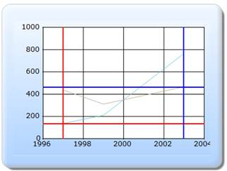

::: {style="DISPLAY: none"}
{#d2h_url_template}{#d2h_package_url style="WIDTH: 0px; DISPLAY: none; HEIGHT: 0px"}
:::

:::::: {.d2h_secondary_topic style="PADDING-BOTTOM: 10pt; MARGIN: 0pt; PADDING-LEFT: 0pt; PADDING-RIGHT: 0pt; PADDING-TOP: 0pt"}
#### Builder {#builder style="tab-stops: 0pt"}

[]{style="FONT-FAMILY: 'Calibri','sans-serif'"} 

The steps to add the Interactive Cursor to the ChartModel through Builder are as follows:

Step 1:

View:

Add the code displayed below in the aspx file. The Interactive cursors can be enabled by setting the **ShowInteractiveCursors** property to true. The Interactive cursors can be customized by using the **InteractiveCursors** mapper.

[]{style="FONT-FAMILY: 'Calibri','sans-serif'"} 

::: {style="BORDER-BOTTOM: #c8c8c8 1pt solid; BORDER-LEFT: #c8c8c8 1pt solid; PADDING-BOTTOM: 1pt; MARGIN-TOP: 0pt; PADDING-LEFT: 4pt; PADDING-RIGHT: 4pt; MARGIN-BOTTOM: 0pt; BACKGROUND: #f0f0f0; BORDER-TOP: #c8c8c8 1pt solid; BORDER-RIGHT: #c8c8c8 1pt solid; PADDING-TOP: 1pt"}
[View\[ASPX\]]{style="FONT-FAMILY: 'Courier New'"}

[]{style="FONT-FAMILY: 'Courier New'; BACKGROUND: yellow"} 

[\<%]{style="FONT-FAMILY: 'Courier New'; BACKGROUND: yellow"}[\--Rendering the Chart COntrol\--]{style="FONT-FAMILY: 'Courier New'; COLOR: green"}[%\>]{style="FONT-FAMILY: 'Courier New'; BACKGROUND: yellow"}

[    [\<%]{style="BACKGROUND: yellow"}[=]{style="COLOR: blue"}Html.Chart([\"chart_Model\"]{style="COLOR: #a31515"})]{style="FONT-FAMILY: 'Courier New'"}

[        [//Enabling the Interactive cursors]{style="COLOR: green"}]{style="FONT-FAMILY: 'Courier New'"}

**[                .ShowInteractiveCursors([true]{style="COLOR: blue"})]{style="FONT-FAMILY: 'Courier New'"}**

[    .Series(series=\>{]{style="FONT-FAMILY: 'Courier New'"}

[        series.Add()]{style="FONT-FAMILY: 'Courier New'"}

[            .Type(Syncfusion.Windows.Forms.Chart.[ChartSeriesType]{style="COLOR: #2b91af"}.Line)]{style="FONT-FAMILY: 'Courier New'"}

[       .Points(points =\>]{style="FONT-FAMILY: 'Courier New'"}

[        {]{style="FONT-FAMILY: 'Courier New'"}

[            points.Add().X(1997).YValues([new]{style="COLOR: blue"} [double]{style="COLOR: blue"}\[\] { 137 });]{style="FONT-FAMILY: 'Courier New'"}

[            points.Add().X(1999).YValues([new]{style="COLOR: blue"} [double]{style="COLOR: blue"}\[\] { 211 });]{style="FONT-FAMILY: 'Courier New'"}

[            points.Add().X(2003).YValues([new]{style="COLOR: blue"} [double]{style="COLOR: blue"}\[\] { 766 });]{style="FONT-FAMILY: 'Courier New'"}

[        });]{style="FONT-FAMILY: 'Courier New'"}

[        series.Add()]{style="FONT-FAMILY: 'Courier New'"}

[      .Points(points =\>]{style="FONT-FAMILY: 'Courier New'"}

[      {]{style="FONT-FAMILY: 'Courier New'"}

[          points.Add().X(1997).YValues([new]{style="COLOR: blue"} [double]{style="COLOR: blue"}\[\] { 437 });]{style="FONT-FAMILY: 'Courier New'"}

[          points.Add().X(1999).YValues([new]{style="COLOR: blue"} [double]{style="COLOR: blue"}\[\] { 311 });]{style="FONT-FAMILY: 'Courier New'"}

[          points.Add().X(2003).YValues([new]{style="COLOR: blue"} [double]{style="COLOR: blue"}\[\] { 466 });]{style="FONT-FAMILY: 'Courier New'"}

[      })]{style="FONT-FAMILY: 'Courier New'"}

[        .Type(Syncfusion.Windows.Forms.Chart.[ChartSeriesType]{style="COLOR: #2b91af"}.Line);]{style="FONT-FAMILY: 'Courier New'"}

[    })]{style="FONT-FAMILY: 'Courier New'"}

[        [//Customizing the Interactive cursors]{style="COLOR: green"}]{style="FONT-FAMILY: 'Courier New'"}

[     .ChartArea(area =\>]{style="FONT-FAMILY: 'Courier New'"}

[            area]{style="FONT-FAMILY: 'Courier New'"}

**[.InteractiveCursors(intercursors =\>]{style="FONT-FAMILY: 'Courier New'"}**

**[            {]{style="FONT-FAMILY: 'Courier New'"}**

**[               intercursors.Add(0).Color(System.Drawing.[Color]{style="COLOR: #2b91af"}.Red);]{style="FONT-FAMILY: 'Courier New'"}**

**[               intercursors.Add(1).Color(System.Drawing.[Color]{style="COLOR: #2b91af"}.Blue).XPosition(6);]{style="FONT-FAMILY: 'Courier New'"}**

**[            }))]{style="FONT-FAMILY: 'Courier New'"}**

[        .Skins([ChartModelSkins]{style="COLOR: #2b91af"}.Office2007Blue)]{style="FONT-FAMILY: 'Courier New'"}

[         .ChartSeriesSkins([ChartSeriesSkins]{style="COLOR: #2b91af"}.DefaultAlpha)]{style="FONT-FAMILY: 'Courier New'"}

[        .BorderAppearance(border =\> border.SkinStyle(Syncfusion.Windows.Forms.Chart.[ChartBorderSkinStyle]{style="COLOR: #2b91af"}.Emboss))]{style="FONT-FAMILY: 'Courier New'"}

[]{style="FONT-FAMILY: 'Courier New'"} 

[    [%\>]{style="BACKGROUND: yellow"}]{style="FONT-FAMILY: 'Courier New'"}[]{style="FONT-FAMILY: 'Courier New'"}
:::

[]{style="FONT-FAMILY: 'Calibri','sans-serif'"} 

::: {style="BORDER-BOTTOM: #c8c8c8 1pt solid; BORDER-LEFT: #c8c8c8 1pt solid; PADDING-BOTTOM: 1pt; MARGIN-TOP: 0pt; PADDING-LEFT: 4pt; PADDING-RIGHT: 4pt; MARGIN-BOTTOM: 0pt; BACKGROUND: #f0f0f0; BORDER-TOP: #c8c8c8 1pt solid; BORDER-RIGHT: #c8c8c8 1pt solid; PADDING-TOP: 1pt"}
[View\[cshtml\]]{style="FONT-FAMILY: 'Courier New'"}

[]{style="FONT-FAMILY: 'Courier New'; BACKGROUND: yellow"} 

[@\*]{style="FONT-FAMILY: 'Courier New'; BACKGROUND: yellow"}[\--Rendering the Chart COntrol\--]{style="FONT-FAMILY: 'Courier New'; COLOR: green"}[\*@]{style="FONT-FAMILY: 'Courier New'; BACKGROUND: yellow"}

[    [\@{]{style="BACKGROUND: yellow"} Html.Chart([\"chart_Model\"]{style="COLOR: #a31515"})]{style="FONT-FAMILY: 'Courier New'"}

[        [//Enabling the Interactive cursors]{style="COLOR: green"}]{style="FONT-FAMILY: 'Courier New'"}

**[                .ShowInteractiveCursors([true]{style="COLOR: blue"})]{style="FONT-FAMILY: 'Courier New'"}**

[    .Series(series=\>{]{style="FONT-FAMILY: 'Courier New'"}

[        series.Add()]{style="FONT-FAMILY: 'Courier New'"}

[            .Type(Syncfusion.Windows.Forms.Chart.[ChartSeriesType]{style="COLOR: #2b91af"}.Line)]{style="FONT-FAMILY: 'Courier New'"}

[       .Points(points =\>]{style="FONT-FAMILY: 'Courier New'"}

[        {]{style="FONT-FAMILY: 'Courier New'"}

[            points.Add().X(1997).YValues([new]{style="COLOR: blue"} [double]{style="COLOR: blue"}\[\] { 137 });]{style="FONT-FAMILY: 'Courier New'"}

[            points.Add().X(1999).YValues([new]{style="COLOR: blue"} [double]{style="COLOR: blue"}\[\] { 211 });]{style="FONT-FAMILY: 'Courier New'"}

[            points.Add().X(2003).YValues([new]{style="COLOR: blue"} [double]{style="COLOR: blue"}\[\] { 766 });]{style="FONT-FAMILY: 'Courier New'"}

[        });]{style="FONT-FAMILY: 'Courier New'"}

[        series.Add()]{style="FONT-FAMILY: 'Courier New'"}

[      .Points(points =\>]{style="FONT-FAMILY: 'Courier New'"}

[      {]{style="FONT-FAMILY: 'Courier New'"}

[          points.Add().X(1997).YValues([new]{style="COLOR: blue"} [double]{style="COLOR: blue"}\[\] { 437 });]{style="FONT-FAMILY: 'Courier New'"}

[          points.Add().X(1999).YValues([new]{style="COLOR: blue"} [double]{style="COLOR: blue"}\[\] { 311 });]{style="FONT-FAMILY: 'Courier New'"}

[          points.Add().X(2003).YValues([new]{style="COLOR: blue"} [double]{style="COLOR: blue"}\[\] { 466 });]{style="FONT-FAMILY: 'Courier New'"}

[      })]{style="FONT-FAMILY: 'Courier New'"}

[        .Type(Syncfusion.Windows.Forms.Chart.[ChartSeriesType]{style="COLOR: #2b91af"}.Line);]{style="FONT-FAMILY: 'Courier New'"}

[    })]{style="FONT-FAMILY: 'Courier New'"}

[        [//Customizing the Interactive cursors]{style="COLOR: green"}]{style="FONT-FAMILY: 'Courier New'"}

[     .ChartArea(area =\>]{style="FONT-FAMILY: 'Courier New'"}

[            area]{style="FONT-FAMILY: 'Courier New'"}

**[.InteractiveCursors(intercursors =\>]{style="FONT-FAMILY: 'Courier New'"}**

**[            {]{style="FONT-FAMILY: 'Courier New'"}**

**[               intercursors.Add(0).Color(System.Drawing.[Color]{style="COLOR: #2b91af"}.Red);]{style="FONT-FAMILY: 'Courier New'"}**

**[               intercursors.Add(1).Color(System.Drawing.[Color]{style="COLOR: #2b91af"}.Blue).XPosition(6);]{style="FONT-FAMILY: 'Courier New'"}**

**[            }))]{style="FONT-FAMILY: 'Courier New'"}**

[        .Skins([ChartModelSkins]{style="COLOR: #2b91af"}.Office2007Blue)]{style="FONT-FAMILY: 'Courier New'"}

[         .ChartSeriesSkins([ChartSeriesSkins]{style="COLOR: #2b91af"}.DefaultAlpha)]{style="FONT-FAMILY: 'Courier New'"}

[        .BorderAppearance(border =\> border.SkinStyle(Syncfusion.Windows.Forms.Chart.[ChartBorderSkinStyle]{style="COLOR: #2b91af"}.Emboss))]{style="FONT-FAMILY: 'Courier New'"}

[.Render();]{style="FONT-FAMILY: 'Courier New'"}

[]{style="FONT-FAMILY: 'Courier New'"} 

[    [}]{style="BACKGROUND: yellow"}]{style="FONT-FAMILY: 'Courier New'"}[]{style="FONT-FAMILY: 'Courier New'"}
:::

 

Step 2:

Add the code displayed below in the Controller.

[]{style="FONT-FAMILY: 'Calibri','sans-serif'"} 

::: {style="BORDER-BOTTOM: #c8c8c8 1pt solid; BORDER-LEFT: #c8c8c8 1pt solid; PADDING-BOTTOM: 1pt; MARGIN-TOP: 0pt; PADDING-LEFT: 4pt; PADDING-RIGHT: 4pt; MARGIN-BOTTOM: 0pt; BACKGROUND: #f0f0f0; BORDER-TOP: #c8c8c8 1pt solid; BORDER-RIGHT: #c8c8c8 1pt solid; PADDING-TOP: 1pt"}
[public]{style="FONT-FAMILY: 'Courier New'; COLOR: blue"}[ [ActionResult]{style="COLOR: #2b91af"} Index()]{style="FONT-FAMILY: 'Courier New'"}

[        {]{style="FONT-FAMILY: 'Courier New'"}

[            [return]{style="COLOR: blue"} View();]{style="FONT-FAMILY: 'Courier New'"}

[]{style="FONT-FAMILY: 'Courier New'"} 

[        }]{style="FONT-FAMILY: 'Courier New'"}[]{style="FONT-FAMILY: 'Courier New'"}
:::

Step 3:

Run the code, to get the following output:

[]{style="FONT-FAMILY: 'Calibri','sans-serif'"} 

{border="0"}

Figure 338: Chart - Interactive Cursor

[]{style="FONT-FAMILY: 'Calibri','sans-serif'"} 

[]{#related-topics}
::::::
