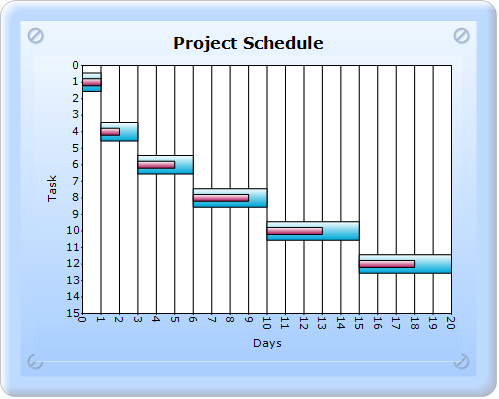

::: {style="DISPLAY: none"}
{#d2h_url_template}{#d2h_package_url style="WIDTH: 0px; DISPLAY: none; HEIGHT: 0px"}
:::

::: {.d2h_secondary_topic style="PADDING-BOTTOM: 10pt; MARGIN: 0pt; PADDING-LEFT: 0pt; PADDING-RIGHT: 0pt; PADDING-TOP: 0pt"}
##### Builder {#builder style="tab-stops: 0pt"}

 

To create a Gantt chart through Builder:

1.   In **Controller**, return view to the corresponding **View** page.

[]{style="FONT-FAMILY: 'Calibri','sans-serif'"} 

+-----------------------------------------------------------------------------------------------------------------------------------------------------------------------------------------------------------------+
| \[C#\]                                                                                                                                                                                                          |
|                                                                                                                                                                                                                 |
| [        ]{style="FONT-FAMILY: Consolas; FONT-SIZE: 9.5pt"}[public]{style="FONT-FAMILY: 'Courier New'; COLOR: blue"}[ [ActionResult]{style="COLOR: #2b91af"} SimpleChart()]{style="FONT-FAMILY: 'Courier New'"} |
|                                                                                                                                                                                                                 |
| [        {            ]{style="FONT-FAMILY: 'Courier New'"}                                                                                                                                                     |
|                                                                                                                                                                                                                 |
| [            [return]{style="COLOR: blue"} View();]{style="FONT-FAMILY: 'Courier New'"}                                                                                                                         |
|                                                                                                                                                                                                                 |
| [        }]{style="FONT-FAMILY: 'Courier New'"}                                                                                                                                                                 |
|                                                                                                                                                                                                                 |
| []{style="FONT-FAMILY: Consolas; COLOR: blue; FONT-SIZE: 9.5pt"}                                                                                                                                                |
+-----------------------------------------------------------------------------------------------------------------------------------------------------------------------------------------------------------------+

 

2.   In the **View** page, invoke the **ChartBuilder** by using the control ID as the first argument.

3.   Add the **Series** to the ChartModel and set the series type to **Gantt**, and add the **Points** to the series and set the style.

4.   Set the **ChartModel** and **ChartArea** properties.

[]{style="FONT-FAMILY: 'Calibri','sans-serif'"} 

+---------------------------------------------------------------------------------------------------------------------------------------------------------------------------------------------------------------------------------------------+
| **View\[ASPX\]**[    ]{style="FONT-FAMILY: Consolas; FONT-SIZE: 9.5pt"}                                                                                                                                                                     |
|                                                                                                                                                                                                                                             |
| [\<%]{style="FONT-FAMILY: 'Courier New'; BACKGROUND: yellow"}[=]{style="FONT-FAMILY: 'Courier New'; COLOR: blue"}[ Html.Chart([\"SimpleChart\"]{style="COLOR: #a31515"}).Series(series =\>{]{style="FONT-FAMILY: 'Courier New'"}            |
|                                                                                                                                                                                                                                             |
| [                    **series.Add().Type(Syncfusion.Windows.Forms.Chart.[ChartSeriesType]{style="COLOR: #2b91af"}.Gantt)**]{style="FONT-FAMILY: 'Courier New'"}                                                                             |
|                                                                                                                                                                                                                                             |
| [                                .Text([\"Completion\"]{style="COLOR: #a31515"})]{style="FONT-FAMILY: 'Courier New'"}                                                                                                                       |
|                                                                                                                                                                                                                                             |
| [                                .Style(style=\>{]{style="FONT-FAMILY: 'Courier New'"}                                                                                                                                                      |
|                                                                                                                                                                                                                                             |
| [                                    style.PointWidth(0.3f);]{style="FONT-FAMILY: 'Courier New'"}                                                                                                                                           |
|                                                                                                                                                                                                                                             |
| [                              }).Points(points =\>{]{style="FONT-FAMILY: 'Courier New'"}                                                                                                                                                   |
|                                                                                                                                                                                                                                             |
| [                                    points.Add(1, 0, 1);]{style="FONT-FAMILY: 'Courier New'"}                                                                                                                                              |
|                                                                                                                                                                                                                                             |
| [                                    points.Add(4, 1, 2);]{style="FONT-FAMILY: 'Courier New'"}                                                                                                                                              |
|                                                                                                                                                                                                                                             |
| [                                    points.Add(6, 3, 5);]{style="FONT-FAMILY: 'Courier New'"}                                                                                                                                              |
|                                                                                                                                                                                                                                             |
| [                                    points.Add(8, 6, 9);]{style="FONT-FAMILY: 'Courier New'"}                                                                                                                                              |
|                                                                                                                                                                                                                                             |
| [                                    points.Add(10, 10, 13);]{style="FONT-FAMILY: 'Courier New'"}                                                                                                                                           |
|                                                                                                                                                                                                                                             |
| [                                    points.Add(12, 15, 18);]{style="FONT-FAMILY: 'Courier New'"}                                                                                                                                           |
|                                                                                                                                                                                                                                             |
| [                                });]{style="FONT-FAMILY: 'Courier New'"}                                                                                                                                                                   |
|                                                                                                                                                                                                                                             |
| **[                    series.Add().Type(Syncfusion.Windows.Forms.Chart.[ChartSeriesType]{style="COLOR: #2b91af"}.Gantt)]{style="FONT-FAMILY: 'Courier New'"}**                                                                             |
|                                                                                                                                                                                                                                             |
| [                                .Text([\"Task\"]{style="COLOR: #a31515"})]{style="FONT-FAMILY: 'Courier New'"}                                                                                                                             |
|                                                                                                                                                                                                                                             |
| [                                .Style(style=\>{]{style="FONT-FAMILY: 'Courier New'"}                                                                                                                                                      |
|                                                                                                                                                                                                                                             |
| [                                    style.PointWidth(0.8f);]{style="FONT-FAMILY: 'Courier New'"}                                                                                                                                           |
|                                                                                                                                                                                                                                             |
| [                              }).Points(points =\>]{style="FONT-FAMILY: 'Courier New'"}                                                                                                                                                    |
|                                                                                                                                                                                                                                             |
| [                                {]{style="FONT-FAMILY: 'Courier New'"}                                                                                                                                                                     |
|                                                                                                                                                                                                                                             |
| [                                    points.Add(1, 0, 1);]{style="FONT-FAMILY: 'Courier New'"}                                                                                                                                              |
|                                                                                                                                                                                                                                             |
| [                                    points.Add(4, 1, 3);]{style="FONT-FAMILY: 'Courier New'"}                                                                                                                                              |
|                                                                                                                                                                                                                                             |
| [                                    points.Add(6, 3, 6);]{style="FONT-FAMILY: 'Courier New'"}                                                                                                                                              |
|                                                                                                                                                                                                                                             |
| [                                    points.Add(8, 6, 10);]{style="FONT-FAMILY: 'Courier New'"}                                                                                                                                             |
|                                                                                                                                                                                                                                             |
| [                                    points.Add(10, 10, 15);]{style="FONT-FAMILY: 'Courier New'"}                                                                                                                                           |
|                                                                                                                                                                                                                                             |
| [                                    points.Add(12, 15, 20);]{style="FONT-FAMILY: 'Courier New'"}                                                                                                                                           |
|                                                                                                                                                                                                                                             |
| [                                });]{style="FONT-FAMILY: 'Courier New'"}                                                                                                                                                                   |
|                                                                                                                                                                                                                                             |
| [            }).ChartArea(area=\>{]{style="FONT-FAMILY: 'Courier New'"}                                                                                                                                                                     |
|                                                                                                                                                                                                                                             |
| [                area.XAxesLayoutMode(Syncfusion.Windows.Forms.Chart.[ChartAxesLayoutMode]{style="COLOR: #2b91af"}.Stacking);]{style="FONT-FAMILY: 'Courier New'"}                                                                          |
|                                                                                                                                                                                                                                             |
| [            }).Skins([ChartModelSkins]{style="COLOR: #2b91af"}.Office2007Blue)]{style="FONT-FAMILY: 'Courier New'"}                                                                                                                        |
|                                                                                                                                                                                                                                             |
| [              .ChartSeriesSkins([ChartSeriesSkins]{style="COLOR: #2b91af"}.Analog)]{style="FONT-FAMILY: 'Courier New'"}                                                                                                                    |
|                                                                                                                                                                                                                                             |
| [              .ElementsSpacing(0)]{style="FONT-FAMILY: 'Courier New'"}                                                                                                                                                                     |
|                                                                                                                                                                                                                                             |
| [              .BorderStyle(System.Web.UI.WebControls.[BorderStyle]{style="COLOR: #2b91af"}.None)]{style="FONT-FAMILY: 'Courier New'"}                                                                                                      |
|                                                                                                                                                                                                                                             |
| [              .Font([new]{style="COLOR: blue"} System.Drawing.[Font]{style="COLOR: #2b91af"}([\"Verdana\"]{style="COLOR: #a31515"}, 12, System.Drawing.[FontStyle]{style="COLOR: #2b91af"}.Bold))    ]{style="FONT-FAMILY: 'Courier New'"} |
|                                                                                                                                                                                                                                             |
| [              .Size([new]{style="COLOR: blue"} System.Drawing.[Size]{style="COLOR: #2b91af"}(500, 400))]{style="FONT-FAMILY: 'Courier New'"}                                                                                               |
|                                                                                                                                                                                                                                             |
| [              .BorderAppearance(border =\>{]{style="FONT-FAMILY: 'Courier New'"}                                                                                                                                                           |
|                                                                                                                                                                                                                                             |
| [                  border.SkinStyle(Syncfusion.Windows.Forms.Chart.[ChartBorderSkinStyle]{style="COLOR: #2b91af"}.Pinned);]{style="FONT-FAMILY: 'Courier New'"}                                                                             |
|                                                                                                                                                                                                                                             |
| [              }).PrimaryYAxis(yaxis =\>{]{style="FONT-FAMILY: 'Courier New'"}                                                                                                                                                              |
|                                                                                                                                                                                                                                             |
| [                  yaxis.Title([\"Task\"]{style="COLOR: #a31515"})]{style="FONT-FAMILY: 'Courier New'"}                                                                                                                                     |
|                                                                                                                                                                                                                                             |
| [                       .DrawGrid([false]{style="COLOR: blue"})]{style="FONT-FAMILY: 'Courier New'"}                                                                                                                                        |
|                                                                                                                                                                                                                                             |
| [                       .Inversed([true]{style="COLOR: blue"})]{style="FONT-FAMILY: 'Courier New'"}                                                                                                                                         |
|                                                                                                                                                                                                                                             |
| [                       .RangeType(Syncfusion.Windows.Forms.Chart.[ChartAxisRangeType]{style="COLOR: #2b91af"}.Set)]{style="FONT-FAMILY: 'Courier New'"}                                                                                    |
|                                                                                                                                                                                                                                             |
| [                       .Range(range =\> {]{style="FONT-FAMILY: 'Courier New'"}                                                                                                                                                             |
|                                                                                                                                                                                                                                             |
| [                           range.Min(0)]{style="FONT-FAMILY: 'Courier New'"}                                                                                                                                                               |
|                                                                                                                                                                                                                                             |
| [                                .Max(15)]{style="FONT-FAMILY: 'Courier New'"}                                                                                                                                                              |
|                                                                                                                                                                                                                                             |
| [                                .Interval(1);]{style="FONT-FAMILY: 'Courier New'"}                                                                                                                                                         |
|                                                                                                                                                                                                                                             |
| [                       });]{style="FONT-FAMILY: 'Courier New'"}                                                                                                                                                                            |
|                                                                                                                                                                                                                                             |
| [              }).PrimaryXAxis(xaxis =\>{]{style="FONT-FAMILY: 'Courier New'"}                                                                                                                                                              |
|                                                                                                                                                                                                                                             |
| [                  xaxis.Title([\"Days\"]{style="COLOR: #a31515"})                      ]{style="FONT-FAMILY: 'Courier New'"}                                                                                                               |
|                                                                                                                                                                                                                                             |
| [                       .RangeType(Syncfusion.Windows.Forms.Chart.[ChartAxisRangeType]{style="COLOR: #2b91af"}.Set)]{style="FONT-FAMILY: 'Courier New'"}                                                                                    |
|                                                                                                                                                                                                                                             |
| [                       .Range(range =\> {]{style="FONT-FAMILY: 'Courier New'"}                                                                                                                                                             |
|                                                                                                                                                                                                                                             |
| [                           range.Min(0)]{style="FONT-FAMILY: 'Courier New'"}                                                                                                                                                               |
|                                                                                                                                                                                                                                             |
| [                                .Max(15)]{style="FONT-FAMILY: 'Courier New'"}                                                                                                                                                              |
|                                                                                                                                                                                                                                             |
| [                                .Interval(1);]{style="FONT-FAMILY: 'Courier New'"}                                                                                                                                                         |
|                                                                                                                                                                                                                                             |
| [                     }).LabelRotate([true]{style="COLOR: blue"})]{style="FONT-FAMILY: 'Courier New'"}                                                                                                                                      |
|                                                                                                                                                                                                                                             |
| [                       .LabelRotateAngle(90);]{style="FONT-FAMILY: 'Courier New'"}                                                                                                                                                         |
|                                                                                                                                                                                                                                             |
| [              }).Text([\"Project Schedule\"]{style="COLOR: #a31515"})        ]{style="FONT-FAMILY: 'Courier New'"}                                                                                                                         |
|                                                                                                                                                                                                                                             |
| [    [%\>]{style="BACKGROUND: yellow"}]{style="FONT-FAMILY: 'Courier New'"}[]{style="FONT-FAMILY: Consolas; COLOR: blue; FONT-SIZE: 9.5pt"}                                                                                                 |
+---------------------------------------------------------------------------------------------------------------------------------------------------------------------------------------------------------------------------------------------+

[]{style="FONT-FAMILY: 'Calibri','sans-serif'"} 

[]{style="FONT-FAMILY: 'Calibri','sans-serif'"} 

+---------------------------------------------------------------------------------------------------------------------------------------------------------------------------------------------------------------------------------------------+
| **[View\[cshtml\]]{style="FONT-FAMILY: 'Courier New'"}**                                                                                                                                                                                    |
|                                                                                                                                                                                                                                             |
| [\@{]{style="FONT-FAMILY: 'Courier New'; BACKGROUND: yellow"}[ ]{style="FONT-FAMILY: 'Courier New'"}[Html.Chart([\"SimpleChart\"]{style="COLOR: #a31515"}).Series(series =\>{]{style="FONT-FAMILY: 'Courier New'"}                          |
|                                                                                                                                                                                                                                             |
| [                    **series.Add().Type(Syncfusion.Windows.Forms.Chart.[ChartSeriesType]{style="COLOR: #2b91af"}.Gantt)**]{style="FONT-FAMILY: 'Courier New'"}                                                                             |
|                                                                                                                                                                                                                                             |
| [                                .Text([\"Completion\"]{style="COLOR: #a31515"})]{style="FONT-FAMILY: 'Courier New'"}                                                                                                                       |
|                                                                                                                                                                                                                                             |
| [                                .Style(style=\>{]{style="FONT-FAMILY: 'Courier New'"}                                                                                                                                                      |
|                                                                                                                                                                                                                                             |
| [                                    style.PointWidth(0.3f);]{style="FONT-FAMILY: 'Courier New'"}                                                                                                                                           |
|                                                                                                                                                                                                                                             |
| [                              }).Points(points =\>{]{style="FONT-FAMILY: 'Courier New'"}                                                                                                                                                   |
|                                                                                                                                                                                                                                             |
| [                                    points.Add(1, 0, 1);]{style="FONT-FAMILY: 'Courier New'"}                                                                                                                                              |
|                                                                                                                                                                                                                                             |
| [                                    points.Add(4, 1, 2);]{style="FONT-FAMILY: 'Courier New'"}                                                                                                                                              |
|                                                                                                                                                                                                                                             |
| [                                    points.Add(6, 3, 5);]{style="FONT-FAMILY: 'Courier New'"}                                                                                                                                              |
|                                                                                                                                                                                                                                             |
| [                                    points.Add(8, 6, 9);]{style="FONT-FAMILY: 'Courier New'"}                                                                                                                                              |
|                                                                                                                                                                                                                                             |
| [                                    points.Add(10, 10, 13);]{style="FONT-FAMILY: 'Courier New'"}                                                                                                                                           |
|                                                                                                                                                                                                                                             |
| [                                    points.Add(12, 15, 18);]{style="FONT-FAMILY: 'Courier New'"}                                                                                                                                           |
|                                                                                                                                                                                                                                             |
| [                                });]{style="FONT-FAMILY: 'Courier New'"}                                                                                                                                                                   |
|                                                                                                                                                                                                                                             |
| **[                    series.Add().Type(Syncfusion.Windows.Forms.Chart.[ChartSeriesType]{style="COLOR: #2b91af"}.Gantt)]{style="FONT-FAMILY: 'Courier New'"}**                                                                             |
|                                                                                                                                                                                                                                             |
| [                                .Text([\"Task\"]{style="COLOR: #a31515"})]{style="FONT-FAMILY: 'Courier New'"}                                                                                                                             |
|                                                                                                                                                                                                                                             |
| [                                .Style(style=\>{]{style="FONT-FAMILY: 'Courier New'"}                                                                                                                                                      |
|                                                                                                                                                                                                                                             |
| [                                    style.PointWidth(0.8f);]{style="FONT-FAMILY: 'Courier New'"}                                                                                                                                           |
|                                                                                                                                                                                                                                             |
| [                              }).Points(points =\>]{style="FONT-FAMILY: 'Courier New'"}                                                                                                                                                    |
|                                                                                                                                                                                                                                             |
| [                                {]{style="FONT-FAMILY: 'Courier New'"}                                                                                                                                                                     |
|                                                                                                                                                                                                                                             |
| [                                    points.Add(1, 0, 1);]{style="FONT-FAMILY: 'Courier New'"}                                                                                                                                              |
|                                                                                                                                                                                                                                             |
| [                                    points.Add(4, 1, 3);]{style="FONT-FAMILY: 'Courier New'"}                                                                                                                                              |
|                                                                                                                                                                                                                                             |
| [                                    points.Add(6, 3, 6);]{style="FONT-FAMILY: 'Courier New'"}                                                                                                                                              |
|                                                                                                                                                                                                                                             |
| [                                    points.Add(8, 6, 10);]{style="FONT-FAMILY: 'Courier New'"}                                                                                                                                             |
|                                                                                                                                                                                                                                             |
| [                                    points.Add(10, 10, 15);]{style="FONT-FAMILY: 'Courier New'"}                                                                                                                                           |
|                                                                                                                                                                                                                                             |
| [                                    points.Add(12, 15, 20);]{style="FONT-FAMILY: 'Courier New'"}                                                                                                                                           |
|                                                                                                                                                                                                                                             |
| [                                });]{style="FONT-FAMILY: 'Courier New'"}                                                                                                                                                                   |
|                                                                                                                                                                                                                                             |
| [            }).ChartArea(area=\>{]{style="FONT-FAMILY: 'Courier New'"}                                                                                                                                                                     |
|                                                                                                                                                                                                                                             |
| [                area.XAxesLayoutMode(Syncfusion.Windows.Forms.Chart.[ChartAxesLayoutMode]{style="COLOR: #2b91af"}.Stacking);]{style="FONT-FAMILY: 'Courier New'"}                                                                          |
|                                                                                                                                                                                                                                             |
| [            }).Skins([ChartModelSkins]{style="COLOR: #2b91af"}.Office2007Blue)]{style="FONT-FAMILY: 'Courier New'"}                                                                                                                        |
|                                                                                                                                                                                                                                             |
| [              .ChartSeriesSkins([ChartSeriesSkins]{style="COLOR: #2b91af"}.Analog)]{style="FONT-FAMILY: 'Courier New'"}                                                                                                                    |
|                                                                                                                                                                                                                                             |
| [              .ElementsSpacing(0)]{style="FONT-FAMILY: 'Courier New'"}                                                                                                                                                                     |
|                                                                                                                                                                                                                                             |
| [              .BorderStyle(System.Web.UI.WebControls.[BorderStyle]{style="COLOR: #2b91af"}.None)]{style="FONT-FAMILY: 'Courier New'"}                                                                                                      |
|                                                                                                                                                                                                                                             |
| [              .Font([new]{style="COLOR: blue"} System.Drawing.[Font]{style="COLOR: #2b91af"}([\"Verdana\"]{style="COLOR: #a31515"}, 12, System.Drawing.[FontStyle]{style="COLOR: #2b91af"}.Bold))    ]{style="FONT-FAMILY: 'Courier New'"} |
|                                                                                                                                                                                                                                             |
| [              .Size([new]{style="COLOR: blue"} System.Drawing.[Size]{style="COLOR: #2b91af"}(500, 400))]{style="FONT-FAMILY: 'Courier New'"}                                                                                               |
|                                                                                                                                                                                                                                             |
| [              .BorderAppearance(border =\>{]{style="FONT-FAMILY: 'Courier New'"}                                                                                                                                                           |
|                                                                                                                                                                                                                                             |
| [                  border.SkinStyle(Syncfusion.Windows.Forms.Chart.[ChartBorderSkinStyle]{style="COLOR: #2b91af"}.Pinned);]{style="FONT-FAMILY: 'Courier New'"}                                                                             |
|                                                                                                                                                                                                                                             |
| [              }).PrimaryYAxis(yaxis =\>{]{style="FONT-FAMILY: 'Courier New'"}                                                                                                                                                              |
|                                                                                                                                                                                                                                             |
| [                  yaxis.Title([\"Task\"]{style="COLOR: #a31515"})]{style="FONT-FAMILY: 'Courier New'"}                                                                                                                                     |
|                                                                                                                                                                                                                                             |
| [                       .DrawGrid([false]{style="COLOR: blue"})]{style="FONT-FAMILY: 'Courier New'"}                                                                                                                                        |
|                                                                                                                                                                                                                                             |
| [                       .Inversed([true]{style="COLOR: blue"})]{style="FONT-FAMILY: 'Courier New'"}                                                                                                                                         |
|                                                                                                                                                                                                                                             |
| [                       .RangeType(Syncfusion.Windows.Forms.Chart.[ChartAxisRangeType]{style="COLOR: #2b91af"}.Set)]{style="FONT-FAMILY: 'Courier New'"}                                                                                    |
|                                                                                                                                                                                                                                             |
| [                       .Range(range =\> {]{style="FONT-FAMILY: 'Courier New'"}                                                                                                                                                             |
|                                                                                                                                                                                                                                             |
| [                           range.Min(0)]{style="FONT-FAMILY: 'Courier New'"}                                                                                                                                                               |
|                                                                                                                                                                                                                                             |
| [                                .Max(15)]{style="FONT-FAMILY: 'Courier New'"}                                                                                                                                                              |
|                                                                                                                                                                                                                                             |
| [                                .Interval(1);]{style="FONT-FAMILY: 'Courier New'"}                                                                                                                                                         |
|                                                                                                                                                                                                                                             |
| [                       });]{style="FONT-FAMILY: 'Courier New'"}                                                                                                                                                                            |
|                                                                                                                                                                                                                                             |
| [              }).PrimaryXAxis(xaxis =\>{]{style="FONT-FAMILY: 'Courier New'"}                                                                                                                                                              |
|                                                                                                                                                                                                                                             |
| [                  xaxis.Title([\"Days\"]{style="COLOR: #a31515"})                      ]{style="FONT-FAMILY: 'Courier New'"}                                                                                                               |
|                                                                                                                                                                                                                                             |
| [                       .RangeType(Syncfusion.Windows.Forms.Chart.[ChartAxisRangeType]{style="COLOR: #2b91af"}.Set)]{style="FONT-FAMILY: 'Courier New'"}                                                                                    |
|                                                                                                                                                                                                                                             |
| [                       .Range(range =\> {]{style="FONT-FAMILY: 'Courier New'"}                                                                                                                                                             |
|                                                                                                                                                                                                                                             |
| [                           range.Min(0)]{style="FONT-FAMILY: 'Courier New'"}                                                                                                                                                               |
|                                                                                                                                                                                                                                             |
| [                                .Max(15)]{style="FONT-FAMILY: 'Courier New'"}                                                                                                                                                              |
|                                                                                                                                                                                                                                             |
| [                                .Interval(1);]{style="FONT-FAMILY: 'Courier New'"}                                                                                                                                                         |
|                                                                                                                                                                                                                                             |
| [                     }).LabelRotate([true]{style="COLOR: blue"})]{style="FONT-FAMILY: 'Courier New'"}                                                                                                                                      |
|                                                                                                                                                                                                                                             |
| [                       .LabelRotateAngle(90);]{style="FONT-FAMILY: 'Courier New'"}                                                                                                                                                         |
|                                                                                                                                                                                                                                             |
| [              }).Text([\"Project Schedule\"]{style="COLOR: #a31515"})     ]{style="FONT-FAMILY: 'Courier New'"}[          ]{style="FONT-FAMILY: 'Courier New'"}                                                                            |
|                                                                                                                                                                                                                                             |
| [              .Render();]{style="FONT-FAMILY: 'Courier New'"}                                                                                                                                                                              |
|                                                                                                                                                                                                                                             |
| [        ]{style="FONT-FAMILY: 'Courier New'"}                                                                                                                                                                                              |
|                                                                                                                                                                                                                                             |
| [              [}]{style="BACKGROUND: yellow"}]{style="FONT-FAMILY: 'Courier New'"}[                                      ]{style="FONT-FAMILY: 'Courier New'"}[]{style="FONT-FAMILY: Consolas; COLOR: blue; FONT-SIZE: 9.5pt"}             |
+---------------------------------------------------------------------------------------------------------------------------------------------------------------------------------------------------------------------------------------------+

[]{style="FONT-FAMILY: 'Calibri','sans-serif'"} 

[]{style="FONT-FAMILY: Consolas; FONT-SIZE: 9.5pt"} 

5.   Build and run the application, to get the following output:

[]{style="FONT-FAMILY: 'Calibri','sans-serif'"} 

{border="0"}

Figure 83: Chart displaying Gantt Series

[]{#related-topics}
:::
