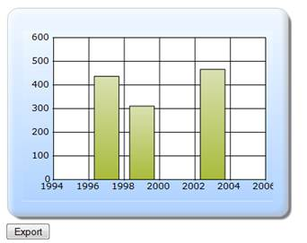
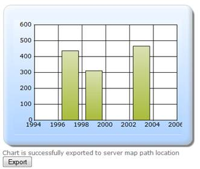

::: {style="DISPLAY: none"}
{#d2h_url_template}{#d2h_package_url style="WIDTH: 0px; DISPLAY: none; HEIGHT: 0px"}
:::

::::: {#nsbanner .d2h_main_nsbanner style="BORDER-BOTTOM: #999999 1px solid; POSITION: relative; PADDING-BOTTOM: 0px; BACKGROUND-COLOR: transparent; PADDING-LEFT: 0px; PADDING-RIGHT: 0px; DISPLAY: none; BORDER-TOP: #999999 1px solid; PADDING-TOP: 0px; LEFT: 0px"}
:::: {#TitleRow .d2h_main_titlerow style="PADDING-BOTTOM: 4px; BACKGROUND-COLOR: transparent; PADDING-LEFT: 22px; WIDTH: 100%; PADDING-RIGHT: 10px; DISPLAY: none; PADDING-TOP: 4px"}
::: {#ienav .d2h_main_ienav style="DISPLAY: none"}
{#D2HPrevious .D2HPreviousEnabled}  {#D2HNext .D2HNextEnabled}
:::
::::
:::::

:::::::: {#nstext .d2h_main_nstext style="PADDING-BOTTOM: 10px; BACKGROUND-COLOR: transparent; PADDING-LEFT: 22px; PADDING-RIGHT: 10px; HEIGHT: 100%; OVERFLOW: auto; PADDING-TOP: 5px" hasuserbackground="true" valign="bottom"}
::: {#d2h_breadcrumbs .d2h_breadcrumbs}
[Essential Studio User Guide Documentation](ms-xhelp:///?Id=12457748-09e3-4d74-a240-8e049cedf030){.d2h_breadcrumbsNormal}[ \> ]{.d2h_breadcrumbsLinkSeparator}[User Interface Edition](ms-xhelp:///?Id=c29296b7-531c-413b-a0ec-488ca1f7f669){.d2h_breadcrumbsNormal}[ \> ]{.d2h_breadcrumbsLinkSeparator}[Essential ASP.NET MVC](ms-xhelp:///?Id=4b14e7d1-65c4-4f67-b1aa-2c37709905a5){.d2h_breadcrumbsNormal}[ \> ]{.d2h_breadcrumbsLinkSeparator}[Essential Chart]{.d2h_breadcrumbsContentsOnly}[ \> ]{.d2h_breadcrumbsLinkSeparator}[Concepts and Features](ms-xhelp:///?Id=696f5666-8b81-4685-9bd9-12198f06f3ad){.d2h_breadcrumbsNormal}[ \> ]{.d2h_breadcrumbsLinkSeparator}[Exporting](ms-xhelp:///?Id=6ebb1818-ba28-4765-a17f-b54de9f06f7a){.d2h_breadcrumbsNormal}
:::

### Builder {#builder style="tab-stops: 0pt"}

[]{style="FONT-FAMILY: 'Calibri','sans-serif'"} 

The steps to export a chart through Builder are as follows:[]{style="FONT-FAMILY: 'Calibri','sans-serif'"}

 

Step 1:

View:

Add the code displayed below in the aspx file.

[]{style="FONT-FAMILY: 'Calibri','sans-serif'"} 

::: {style="BORDER-BOTTOM: #c8c8c8 1pt solid; BORDER-LEFT: #c8c8c8 1pt solid; PADDING-BOTTOM: 1pt; MARGIN-TOP: 0pt; PADDING-LEFT: 4pt; PADDING-RIGHT: 4pt; MARGIN-BOTTOM: 0pt; BACKGROUND: #f0f0f0; BORDER-TOP: #c8c8c8 1pt solid; BORDER-RIGHT: #c8c8c8 1pt solid; PADDING-TOP: 1pt"}
[View\[ASPX\]  ]{style="FONT-FAMILY: 'Courier New'"}

[]{style="FONT-FAMILY: 'Courier New'"} 

[  [\<%]{style="BACKGROUND: yellow"}[\--Rendering the Chart COntrol\--]{style="COLOR: green"}[%\>]{style="BACKGROUND: yellow"}]{style="FONT-FAMILY: 'Courier New'"}

[    [\<]{style="COLOR: blue"}[div]{style="COLOR: #a31515"} [id]{style="COLOR: red"}[=\"Chart\"\>]{style="COLOR: blue"}]{style="FONT-FAMILY: 'Courier New'"}

[    [\<%]{style="BACKGROUND: yellow"} Html.RenderPartial([\"PartialView\"]{style="COLOR: #a31515"}, [this]{style="COLOR: blue"}.ViewData); [%\>]{style="BACKGROUND: yellow"}[\</]{style="COLOR: blue"}[div]{style="COLOR: #a31515"}[\>]{style="COLOR: blue"}]{style="FONT-FAMILY: 'Courier New'"}

[  ]{style="FONT-FAMILY: 'Courier New'"}

[  [\<%]{style="BACKGROUND: yellow"}[using]{style="COLOR: blue"} (Ajax.BeginFormExt([\"Index\"]{style="COLOR: #a31515"}, [new]{style="COLOR: blue"} [AjaxOptions]{style="COLOR: #2b91af"}() { UpdateTargetId = [\"Chart\"]{style="COLOR: #a31515"} }))]{style="FONT-FAMILY: 'Courier New'"}

[              { [%\>]{style="BACKGROUND: yellow"} ]{style="FONT-FAMILY: 'Courier New'"}

[   ]{style="FONT-FAMILY: 'Courier New'"}

[    ]{style="FONT-FAMILY: 'Courier New'"}

[    [\<]{style="COLOR: blue"}[input]{style="COLOR: #a31515"} [type]{style="COLOR: red"}[=\"submit\"]{style="COLOR: blue"} [value]{style="COLOR: red"}[=\"Export\"]{style="COLOR: blue"} [id]{style="COLOR: red"}[=\"submit\"\"/\>]{style="COLOR: blue"}]{style="FONT-FAMILY: 'Courier New'"}

[                ]{style="FONT-FAMILY: 'Courier New'"}

[      ]{style="FONT-FAMILY: 'Courier New'"}

[            [\<%]{style="BACKGROUND: yellow"}} [%\>]{style="BACKGROUND: yellow"}]{style="FONT-FAMILY: 'Courier New'"}[]{style="FONT-FAMILY: 'Courier New'"}

[]{style="FONT-FAMILY: 'Courier New'"} 

[View\[cshtml\]  ]{style="FONT-FAMILY: 'Courier New'"}

[]{style="FONT-FAMILY: 'Courier New'"} 

[  [@\*]{style="BACKGROUND: yellow"}[\--Rendering the Chart COntrol\--]{style="COLOR: green"}[\*@]{style="BACKGROUND: yellow"}]{style="FONT-FAMILY: 'Courier New'"}

[    [\<]{style="COLOR: blue"}[div]{style="COLOR: #a31515"} [id]{style="COLOR: red"}[=\"Chart\"\>]{style="COLOR: blue"}]{style="FONT-FAMILY: 'Courier New'"}

[    [@]{style="BACKGROUND: yellow"}Html.RenderPartial([\"PartialView\"]{style="COLOR: #a31515"}, [this]{style="COLOR: blue"}.ViewData)]{style="FONT-FAMILY: 'Courier New'"}

[\</]{style="FONT-FAMILY: 'Courier New'; COLOR: blue"}[div]{style="FONT-FAMILY: 'Courier New'; COLOR: #a31515"}[\>]{style="FONT-FAMILY: 'Courier New'; COLOR: blue"}

[  ]{style="FONT-FAMILY: 'Courier New'"}

[  [@]{style="BACKGROUND: yellow"}[using]{style="COLOR: blue"} (Ajax.BeginFormExt([\"Index\"]{style="COLOR: #a31515"}, [new]{style="COLOR: blue"} [AjaxOptions]{style="COLOR: #2b91af"}() { UpdateTargetId = [\"Chart\"]{style="COLOR: #a31515"} }))]{style="FONT-FAMILY: 'Courier New'"}

[              {    ]{style="FONT-FAMILY: 'Courier New'"}

[    ]{style="FONT-FAMILY: 'Courier New'"}

[    [\<]{style="COLOR: blue"}[input]{style="COLOR: #a31515"} [type]{style="COLOR: red"}[=\"submit\"]{style="COLOR: blue"} [value]{style="COLOR: red"}[=\"Export\"]{style="COLOR: blue"} [id]{style="COLOR: red"}[=\"submit\"\"/\>]{style="COLOR: blue"}]{style="FONT-FAMILY: 'Courier New'"}

[                ]{style="FONT-FAMILY: 'Courier New'"}

[      ]{style="FONT-FAMILY: 'Courier New'"}

[            } ]{style="FONT-FAMILY: 'Courier New'"}[]{style="FONT-FAMILY: 'Courier New'"}
:::

**[]{style="FONT-FAMILY: 'Calibri','sans-serif'"}** 

**[]{style="FONT-FAMILY: 'Calibri','sans-serif'"}** 

Step 2:

Partial View:

Add the code displayed below in the Partial View. The ChartParamsArgs is used to get the parameter values for chart export.

::: {style="BORDER-BOTTOM: #c8c8c8 1pt solid; BORDER-LEFT: #c8c8c8 1pt solid; PADDING-BOTTOM: 1pt; MARGIN-TOP: 0pt; PADDING-LEFT: 4pt; PADDING-RIGHT: 4pt; MARGIN-BOTTOM: 0pt; BACKGROUND: #f0f0f0; BORDER-TOP: #c8c8c8 1pt solid; BORDER-RIGHT: #c8c8c8 1pt solid; PADDING-TOP: 1pt"}
[View\[ASPX\]  ]{style="FONT-FAMILY: 'Courier New'"}

[]{style="FONT-FAMILY: 'Courier New'; BACKGROUND: yellow"} 

[\<%]{style="FONT-FAMILY: 'Courier New'; BACKGROUND: yellow"}[=]{style="FONT-FAMILY: 'Courier New'; COLOR: blue"}[Html.Chart([\"chart_Model\"]{style="COLOR: #a31515"})]{style="FONT-FAMILY: 'Courier New'"}

[]{style="FONT-FAMILY: 'Courier New'"} 

[]{style="FONT-FAMILY: 'Courier New'"} 

[    .Series(series=\>{]{style="FONT-FAMILY: 'Courier New'"}

[        series.Add().Points(points =\>]{style="FONT-FAMILY: 'Courier New'"}

[        {]{style="FONT-FAMILY: 'Courier New'"}

[            points.Add().X(1997).YValues([new]{style="COLOR: blue"} [double]{style="COLOR: blue"}\[\] { 437 });]{style="FONT-FAMILY: 'Courier New'"}

[            points.Add().X(1999).YValues([new]{style="COLOR: blue"} [double]{style="COLOR: blue"}\[\] { 311 });]{style="FONT-FAMILY: 'Courier New'"}

[            points.Add().X(2003).YValues([new]{style="COLOR: blue"} [double]{style="COLOR: blue"}\[\] { 466 });]{style="FONT-FAMILY: 'Courier New'"}

[        })]{style="FONT-FAMILY: 'Courier New'"}

[        .Type(Syncfusion.Windows.Forms.Chart.[ChartSeriesType]{style="COLOR: #2b91af"}.Column);]{style="FONT-FAMILY: 'Courier New'"}

[    })]{style="FONT-FAMILY: 'Courier New'"}

[]{style="FONT-FAMILY: 'Courier New'"} 

[        .Skins([ChartModelSkins]{style="COLOR: #2b91af"}.Office2007Blue)]{style="FONT-FAMILY: 'Courier New'"}

[         .ChartSeriesSkins([ChartSeriesSkins]{style="COLOR: #2b91af"}.WarmCold)]{style="FONT-FAMILY: 'Courier New'"}

[        .BorderAppearance(border =\> border.SkinStyle(Syncfusion.Windows.Forms.Chart.[ChartBorderSkinStyle]{style="COLOR: #2b91af"}.Emboss))]{style="FONT-FAMILY: 'Courier New'"}

[      [//Getting the export parameter values from the controller]{style="COLOR: green"}]{style="FONT-FAMILY: 'Courier New'"}

[     .ChartParamsArgs(([ChartParams]{style="COLOR: #2b91af"})ViewData\[[\"ChartParamsData\"]{style="COLOR: #a31515"}\])]{style="FONT-FAMILY: 'Courier New'"}

[        [%\>]{style="BACKGROUND: yellow"}]{style="FONT-FAMILY: 'Courier New'"}**[]{style="FONT-FAMILY: 'Courier New'"}**
:::

 

::: {style="BORDER-BOTTOM: #c8c8c8 1pt solid; BORDER-LEFT: #c8c8c8 1pt solid; PADDING-BOTTOM: 1pt; MARGIN-TOP: 0pt; PADDING-LEFT: 4pt; PADDING-RIGHT: 4pt; MARGIN-BOTTOM: 0pt; BACKGROUND: #f0f0f0; BORDER-TOP: #c8c8c8 1pt solid; BORDER-RIGHT: #c8c8c8 1pt solid; PADDING-TOP: 1pt"}
[View\[cshtml\]  ]{style="FONT-FAMILY: 'Courier New'"}

[]{style="FONT-FAMILY: 'Courier New'; BACKGROUND: yellow"} 

[\@{]{style="FONT-FAMILY: 'Courier New'; BACKGROUND: yellow"}[ Html.Chart([\"chart_Model\"]{style="COLOR: #a31515"})]{style="FONT-FAMILY: 'Courier New'"}

[]{style="FONT-FAMILY: 'Courier New'"} 

[]{style="FONT-FAMILY: 'Courier New'"} 

[    .Series(series=\>{]{style="FONT-FAMILY: 'Courier New'"}

[        series.Add().Points(points =\>]{style="FONT-FAMILY: 'Courier New'"}

[        {]{style="FONT-FAMILY: 'Courier New'"}

[            points.Add().X(1997).YValues([new]{style="COLOR: blue"} [double]{style="COLOR: blue"}\[\] { 437 });]{style="FONT-FAMILY: 'Courier New'"}

[            points.Add().X(1999).YValues([new]{style="COLOR: blue"} [double]{style="COLOR: blue"}\[\] { 311 });]{style="FONT-FAMILY: 'Courier New'"}

[            points.Add().X(2003).YValues([new]{style="COLOR: blue"} [double]{style="COLOR: blue"}\[\] { 466 });]{style="FONT-FAMILY: 'Courier New'"}

[        })]{style="FONT-FAMILY: 'Courier New'"}

[        .Type(Syncfusion.Windows.Forms.Chart.[ChartSeriesType]{style="COLOR: #2b91af"}.Column);]{style="FONT-FAMILY: 'Courier New'"}

[    })]{style="FONT-FAMILY: 'Courier New'"}

[]{style="FONT-FAMILY: 'Courier New'"} 

[        .Skins([ChartModelSkins]{style="COLOR: #2b91af"}.Office2007Blue)]{style="FONT-FAMILY: 'Courier New'"}

[         .ChartSeriesSkins([ChartSeriesSkins]{style="COLOR: #2b91af"}.WarmCold)]{style="FONT-FAMILY: 'Courier New'"}

[        .BorderAppearance(border =\> border.SkinStyle(Syncfusion.Windows.Forms.Chart.[ChartBorderSkinStyle]{style="COLOR: #2b91af"}.Emboss))]{style="FONT-FAMILY: 'Courier New'"}

[      [//Getting the export parameter values from the controller]{style="COLOR: green"}]{style="FONT-FAMILY: 'Courier New'"}

[     .ChartParamsArgs(([ChartParams]{style="COLOR: #2b91af"})ViewData\[[\"ChartParamsData\"]{style="COLOR: #a31515"}\])]{style="FONT-FAMILY: 'Courier New'"}

[.Render();]{style="FONT-FAMILY: 'Courier New'"}

[        [}]{style="BACKGROUND: yellow"}]{style="FONT-FAMILY: 'Courier New'"}**[]{style="FONT-FAMILY: 'Courier New'"}**
:::

**[]{style="FONT-FAMILY: 'Calibri','sans-serif'"}** 

Step 3:

Controller:

Add the code displayed below in the Controller. By using the ExportType property, you can specify the export type of the chart. By using the FileName, you can set the filename to be exported and you have to set the ChartAction property to Export. To check whether the function call is ajax or not, IsAjaxCall is used.

[]{style="FONT-FAMILY: 'Calibri','sans-serif'"} 

::: {style="BORDER-BOTTOM: #c8c8c8 1pt solid; BORDER-LEFT: #c8c8c8 1pt solid; PADDING-BOTTOM: 1pt; MARGIN-TOP: 0pt; PADDING-LEFT: 4pt; PADDING-RIGHT: 4pt; MARGIN-BOTTOM: 0pt; BACKGROUND: #f0f0f0; BORDER-TOP: #c8c8c8 1pt solid; BORDER-RIGHT: #c8c8c8 1pt solid; PADDING-TOP: 1pt"}
[public]{style="FONT-FAMILY: 'Courier New'; COLOR: blue"}[ [ActionResult]{style="COLOR: #2b91af"} Index()]{style="FONT-FAMILY: 'Courier New'"}

[        {]{style="FONT-FAMILY: 'Courier New'"}

[            [ChartParams]{style="COLOR: #2b91af"} ChartParamsData = [new]{style="COLOR: blue"} [ChartParams]{style="COLOR: #2b91af"}();]{style="FONT-FAMILY: 'Courier New'"}

[            ChartParamsData.ExportType = [\"Bmp\"]{style="COLOR: #a31515"};]{style="FONT-FAMILY: 'Courier New'"}

[            ChartParamsData.FileName = [\"Chart\"]{style="COLOR: #a31515"};]{style="FONT-FAMILY: 'Courier New'"}

[            ChartParamsData.ChartAction = [ChartHtmlAction]{style="COLOR: #2b91af"}.Export;]{style="FONT-FAMILY: 'Courier New'"}

[            ViewData\[[\"ChartParamsData\"]{style="COLOR: #a31515"}\] = ChartParamsData;]{style="FONT-FAMILY: 'Courier New'"}

[            [if]{style="COLOR: blue"} (IsAjaxCall())]{style="FONT-FAMILY: 'Courier New'"}

[                [return]{style="COLOR: blue"} PartialView([\"PartialView\"]{style="COLOR: #a31515"}, [this]{style="COLOR: blue"}.ViewData);]{style="FONT-FAMILY: 'Courier New'"}

[            [else]{style="COLOR: blue"}]{style="FONT-FAMILY: 'Courier New'"}

[                [return]{style="COLOR: blue"} View();]{style="FONT-FAMILY: 'Courier New'"}

[]{style="FONT-FAMILY: 'Courier New'"} 

[        }]{style="FONT-FAMILY: 'Courier New'"}

[]{style="FONT-FAMILY: 'Courier New'"} 

[protected]{style="FONT-FAMILY: 'Courier New'; COLOR: blue"}[ [bool]{style="COLOR: blue"} IsAjaxCall()]{style="FONT-FAMILY: 'Courier New'"}

[        {]{style="FONT-FAMILY: 'Courier New'"}

[            [return]{style="COLOR: blue"} ControllerContext.HttpContext.Request.Headers\[[\"X-Requested-With\"]{style="COLOR: #a31515"}\] == [\"XMLHttpRequest\"]{style="COLOR: #a31515"};]{style="FONT-FAMILY: 'Courier New'"}

[        }]{style="FONT-FAMILY: 'Courier New'"}[]{style="FONT-FAMILY: 'Courier New'"}
:::

 

Step 4:

Run the code, to get the following output:

[]{style="FONT-FAMILY: 'Calibri','sans-serif'"} 

{border="0"}

Figure 344: Before Export

[]{style="FONT-FAMILY: 'Calibri','sans-serif'"} 

Step 5:

Click **Export** and then the chart will be exported to the server map path location. You will get the following output.

{border="0"}

Figure 345: After Export

[]{style="FONT-FAMILY: 'Calibri','sans-serif'"} 

[]{#related-topics}
::::::::
