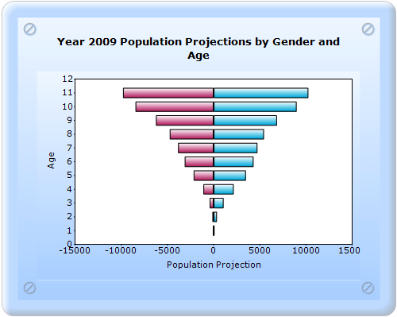

::: {style="DISPLAY: none"}
{#d2h_url_template}{#d2h_package_url style="WIDTH: 0px; DISPLAY: none; HEIGHT: 0px"}
:::

::: {.d2h_secondary_topic style="PADDING-BOTTOM: 10pt; MARGIN: 0pt; PADDING-LEFT: 0pt; PADDING-RIGHT: 0pt; PADDING-TOP: 0pt"}
##### Builder {#builder style="tab-stops: 0pt"}

[]{style="FONT-FAMILY: 'Calibri','sans-serif'"} 

To create a Histogram chart through Builder:

1.   In **Controller**, return view to the corresponding **View** page.

[]{style="FONT-FAMILY: 'Calibri','sans-serif'"} 

+-----------------------------------------------------------------------------------------------------------------------------------------------------------------------------------------------------------------+
| \[C#\]                                                                                                                                                                                                          |
|                                                                                                                                                                                                                 |
| [        ]{style="FONT-FAMILY: Consolas; FONT-SIZE: 9.5pt"}[public]{style="FONT-FAMILY: 'Courier New'; COLOR: blue"}[ [ActionResult]{style="COLOR: #2b91af"} SimpleChart()]{style="FONT-FAMILY: 'Courier New'"} |
|                                                                                                                                                                                                                 |
| [        {            ]{style="FONT-FAMILY: 'Courier New'"}                                                                                                                                                     |
|                                                                                                                                                                                                                 |
| [            [return]{style="COLOR: blue"} View();]{style="FONT-FAMILY: 'Courier New'"}                                                                                                                         |
|                                                                                                                                                                                                                 |
| [        }]{style="FONT-FAMILY: 'Courier New'"}                                                                                                                                                                 |
|                                                                                                                                                                                                                 |
| []{style="FONT-FAMILY: Consolas; COLOR: blue; FONT-SIZE: 9.5pt"}                                                                                                                                                |
+-----------------------------------------------------------------------------------------------------------------------------------------------------------------------------------------------------------------+

[]{style="FONT-FAMILY: 'Calibri','sans-serif'"} 

2.   In the **View Page**, invoke the **ChartBuilder** by using the control ID as the first argument.

3.   Add the **Series** to the **ChartModel** and set the series type to **Histogram**, and add the **Points** to the series and set the style.

4.   Set the **ChartModel** and **ChartArea** properties.

[]{style="FONT-FAMILY: 'Calibri','sans-serif'"} 

+-------------------------------------------------------------------------------------------------------------------------------------------------------------------------------------------------------------------------------------------------------------------------------+
| **View\[ASPX\]**                                                                                                                                                                                                                                                              |
|                                                                                                                                                                                                                                                                               |
| [       [\<%]{style="BACKGROUND: yellow"}             [double]{style="COLOR: blue"}\[\] point1 = {   25.250,27.750,29.000,28.275,29.750,27.750,28.275,26.250,25.750,25.250,26.250,25.250,24.500,]{style="FONT-FAMILY: 'Courier New'"}                                         |
|                                                                                                                                                                                                                                                                               |
| [                                          25.625,25.500,26.625,26.275,26.250,26.875,27.250,26.875,26.500,27.125,26.275,25.875,26.625,]{style="FONT-FAMILY: 'Courier New'"}                                                                                                   |
|                                                                                                                                                                                                                                                                               |
| [                                          27.125,26.250,27.000,27.250,27.500,28.500,29.500,28.875,28.500,29.000,28.500,28.500,29.000,]{style="FONT-FAMILY: 'Courier New'"}                                                                                                   |
|                                                                                                                                                                                                                                                                               |
| [                                          29.000]{style="FONT-FAMILY: 'Courier New'"}                                                                                                                                                                                        |
|                                                                                                                                                                                                                                                                               |
| [                                      };]{style="FONT-FAMILY: 'Courier New'"}                                                                                                                                                                                                |
|                                                                                                                                                                                                                                                                               |
| [                       [double]{style="COLOR: blue"}\[\] point2 = {]{style="FONT-FAMILY: 'Courier New'"}[  ]{style="FONT-FAMILY: Consolas"}[23.000,26.500,27.750,25.025,26.500,26.500,28.025,29.250,26.750,27.250,26.250,25.250,24.500,]{style="FONT-FAMILY: 'Courier New'"} |
|                                                                                                                                                                                                                                                                               |
| [                                           25.625,25.500,26.625,26.275,26.250,26.875,27.250,26.875,26.500,27.125,26.275,25.875,26.625,]{style="FONT-FAMILY: 'Courier New'"}                                                                                                  |
|                                                                                                                                                                                                                                                                               |
| [                                           27.125,26.250,27.000,27.250,27.500,28.500,29.500,28.875,28.500,29.000,28.500,28.500,29.000,]{style="FONT-FAMILY: 'Courier New'"}                                                                                                  |
|                                                                                                                                                                                                                                                                               |
| [                                           29.000]{style="FONT-FAMILY: 'Courier New'"}                                                                                                                                                                                       |
|                                                                                                                                                                                                                                                                               |
| [                                       };]{style="FONT-FAMILY: 'Courier New'"}                                                                                                                                                                                               |
|                                                                                                                                                                                                                                                                               |
| [                       [DateTime]{style="COLOR: #2b91af"} date = [DateTime]{style="COLOR: #2b91af"}.Today.AddDays(-point2.Length);]{style="FONT-FAMILY: 'Courier New'"}                                                                                                      |
|                                                                                                                                                                                                                                                                               |
| [                       [Random]{style="COLOR: #2b91af"} r = [new]{style="COLOR: blue"} [Random]{style="COLOR: #2b91af"}();]{style="FONT-FAMILY: 'Courier New'"}                                                                                                              |
|                                                                                                                                                                                                                                                                               |
| [        [%\>]{style="BACKGROUND: yellow"}]{style="FONT-FAMILY: 'Courier New'"}                                                                                                                                                                                               |
|                                                                                                                                                                                                                                                                               |
| [    [\<%]{style="BACKGROUND: yellow"}[=]{style="COLOR: blue"} Html.Chart([\"SimpleChart\"]{style="COLOR: #a31515"}).Series(series =\>{]{style="FONT-FAMILY: 'Courier New'"}                                                                                                  |
|                                                                                                                                                                                                                                                                               |
| [    **series.Add().Type(Syncfusion.Windows.Forms.Chart.[ChartSeriesType]{style="COLOR: #2b91af"}.Histogram)**]{style="FONT-FAMILY: 'Courier New'"}                                                                                                                           |
|                                                                                                                                                                                                                                                                               |
| [                .Text([\"Server 1\"]{style="COLOR: #a31515"})]{style="FONT-FAMILY: 'Courier New'"}                                                                                                                                                                           |
|                                                                                                                                                                                                                                                                               |
| [                .ConfigItems(configitem =\> {]{style="FONT-FAMILY: 'Courier New'"}                                                                                                                                                                                           |
|                                                                                                                                                                                                                                                                               |
| [                    configitem.HistogramItem(histoItem =\> {]{style="FONT-FAMILY: 'Courier New'"}                                                                                                                                                                            |
|                                                                                                                                                                                                                                                                               |
| [                        histoItem.ShowNormalDistribution([true]{style="COLOR: blue"})]{style="FONT-FAMILY: 'Courier New'"}                                                                                                                                                   |
|                                                                                                                                                                                                                                                                               |
| [                                 .NumberOfIntervals(20);]{style="FONT-FAMILY: 'Courier New'"}                                                                                                                                                                                |
|                                                                                                                                                                                                                                                                               |
| [                    });]{style="FONT-FAMILY: 'Courier New'"}                                                                                                                                                                                                                 |
|                                                                                                                                                                                                                                                                               |
| [              }).Points(points =\>]{style="FONT-FAMILY: 'Courier New'"}                                                                                                                                                                                                      |
|                                                                                                                                                                                                                                                                               |
| [                {]{style="FONT-FAMILY: 'Courier New'"}                                                                                                                                                                                                                       |
|                                                                                                                                                                                                                                                                               |
| [                    [for]{style="COLOR: blue"} ([int]{style="COLOR: blue"} j = 0; j \< 50; j++)]{style="FONT-FAMILY: 'Courier New'"}                                                                                                                                         |
|                                                                                                                                                                                                                                                                               |
| [                        points.Add(r.Next(10, 500), 1000);]{style="FONT-FAMILY: 'Courier New'"}                                                                                                                                                                              |
|                                                                                                                                                                                                                                                                               |
| [                });]{style="FONT-FAMILY: 'Courier New'"}                                                                                                                                                                                                                     |
|                                                                                                                                                                                                                                                                               |
| [    **series.Add().Type(Syncfusion.Windows.Forms.Chart.[ChartSeriesType]{style="COLOR: #2b91af"}.Histogram)**]{style="FONT-FAMILY: 'Courier New'"}                                                                                                                           |
|                                                                                                                                                                                                                                                                               |
| [                .Text([\"Server 2\"]{style="COLOR: #a31515"})]{style="FONT-FAMILY: 'Courier New'"}                                                                                                                                                                           |
|                                                                                                                                                                                                                                                                               |
| [                .ConfigItems(configitem =\>]{style="FONT-FAMILY: 'Courier New'"}                                                                                                                                                                                             |
|                                                                                                                                                                                                                                                                               |
| [                {]{style="FONT-FAMILY: 'Courier New'"}                                                                                                                                                                                                                       |
|                                                                                                                                                                                                                                                                               |
| [                    configitem.HistogramItem(histoItem =\>]{style="FONT-FAMILY: 'Courier New'"}                                                                                                                                                                              |
|                                                                                                                                                                                                                                                                               |
| [                    {]{style="FONT-FAMILY: 'Courier New'"}                                                                                                                                                                                                                   |
|                                                                                                                                                                                                                                                                               |
| [                        histoItem.ShowNormalDistribution([true]{style="COLOR: blue"})]{style="FONT-FAMILY: 'Courier New'"}                                                                                                                                                   |
|                                                                                                                                                                                                                                                                               |
| [                                 .NumberOfIntervals(20);]{style="FONT-FAMILY: 'Courier New'"}                                                                                                                                                                                |
|                                                                                                                                                                                                                                                                               |
| [                    });]{style="FONT-FAMILY: 'Courier New'"}                                                                                                                                                                                                                 |
|                                                                                                                                                                                                                                                                               |
| [              }).Points(points =\>]{style="FONT-FAMILY: 'Courier New'"}                                                                                                                                                                                                      |
|                                                                                                                                                                                                                                                                               |
| [                {]{style="FONT-FAMILY: 'Courier New'"}                                                                                                                                                                                                                       |
|                                                                                                                                                                                                                                                                               |
| [                    [for]{style="COLOR: blue"} ([int]{style="COLOR: blue"} j = 0; j \< 50; j++)]{style="FONT-FAMILY: 'Courier New'"}                                                                                                                                         |
|                                                                                                                                                                                                                                                                               |
| [                        points.Add(r.Next(10, 500), 1000);]{style="FONT-FAMILY: 'Courier New'"}                                                                                                                                                                              |
|                                                                                                                                                                                                                                                                               |
| [                });]{style="FONT-FAMILY: 'Courier New'"}                                                                                                                                                                                                                     |
|                                                                                                                                                                                                                                                                               |
| [            }).ChartArea(area=\>{]{style="FONT-FAMILY: 'Courier New'"}                                                                                                                                                                                                       |
|                                                                                                                                                                                                                                                                               |
| [                area.XAxesLayoutMode(Syncfusion.Windows.Forms.Chart.[ChartAxesLayoutMode]{style="COLOR: #2b91af"}.Stacking);]{style="FONT-FAMILY: 'Courier New'"}                                                                                                            |
|                                                                                                                                                                                                                                                                               |
| [            }).Skins([ChartModelSkins]{style="COLOR: #2b91af"}.Office2007Blue)]{style="FONT-FAMILY: 'Courier New'"}                                                                                                                                                          |
|                                                                                                                                                                                                                                                                               |
| [              .ChartSeriesSkins([ChartSeriesSkins]{style="COLOR: #2b91af"}.Analog)]{style="FONT-FAMILY: 'Courier New'"}                                                                                                                                                      |
|                                                                                                                                                                                                                                                                               |
| [              .DropSeriesPoints([true]{style="COLOR: blue"})]{style="FONT-FAMILY: 'Courier New'"}                                                                                                                                                                            |
|                                                                                                                                                                                                                                                                               |
| [              .BorderStyle(System.Web.UI.WebControls.[BorderStyle]{style="COLOR: #2b91af"}.None)]{style="FONT-FAMILY: 'Courier New'"}                                                                                                                                        |
|                                                                                                                                                                                                                                                                               |
| [              .Font([new]{style="COLOR: blue"} System.Drawing.[Font]{style="COLOR: #2b91af"}([\"Verdana\"]{style="COLOR: #a31515"}, 12, System.Drawing.[FontStyle]{style="COLOR: #2b91af"}.Bold))    ]{style="FONT-FAMILY: 'Courier New'"}                                   |
|                                                                                                                                                                                                                                                                               |
| [              .Size([new]{style="COLOR: blue"} System.Drawing.[Size]{style="COLOR: #2b91af"}(500, 400))]{style="FONT-FAMILY: 'Courier New'"}                                                                                                                                 |
|                                                                                                                                                                                                                                                                               |
| [              .BorderAppearance(border =\>{]{style="FONT-FAMILY: 'Courier New'"}                                                                                                                                                                                             |
|                                                                                                                                                                                                                                                                               |
| [                  border.SkinStyle(Syncfusion.Windows.Forms.Chart.[ChartBorderSkinStyle]{style="COLOR: #2b91af"}.Pinned);]{style="FONT-FAMILY: 'Courier New'"}                                                                                                               |
|                                                                                                                                                                                                                                                                               |
| [              }).PrimaryYAxis(yaxis =\>{]{style="FONT-FAMILY: 'Courier New'"}                                                                                                                                                                                                |
|                                                                                                                                                                                                                                                                               |
| [                  yaxis.Title([\"Server Load (MB)\"]{style="COLOR: #a31515"})]{style="FONT-FAMILY: 'Courier New'"}                                                                                                                                                           |
|                                                                                                                                                                                                                                                                               |
| [                       .DrawGrid([false]{style="COLOR: blue"})]{style="FONT-FAMILY: 'Courier New'"}                                                                                                                                                                          |
|                                                                                                                                                                                                                                                                               |
| [                       .ForceZero([true]{style="COLOR: blue"});]{style="FONT-FAMILY: 'Courier New'"}[]{style="FONT-FAMILY: Consolas; FONT-SIZE: 9.5pt"}                                                                                                                      |
|                                                                                                                                                                                                                                                                               |
| [              }).PrimaryXAxis(xaxis =\>{]{style="FONT-FAMILY: 'Courier New'"}                                                                                                                                                                                                |
|                                                                                                                                                                                                                                                                               |
| [                  xaxis.Title([\"Number Of Users\"]{style="COLOR: #a31515"})]{style="FONT-FAMILY: 'Courier New'"}                                                                                                                                                            |
|                                                                                                                                                                                                                                                                               |
| [                       .DrawGrid([false]{style="COLOR: blue"})]{style="FONT-FAMILY: 'Courier New'"}                                                                                                                                                                          |
|                                                                                                                                                                                                                                                                               |
| [                       .RangeType(Syncfusion.Windows.Forms.Chart.[ChartAxisRangeType]{style="COLOR: #2b91af"}.Set)]{style="FONT-FAMILY: 'Courier New'"}                                                                                                                      |
|                                                                                                                                                                                                                                                                               |
| [                       .Range(range =\>]{style="FONT-FAMILY: 'Courier New'"}                                                                                                                                                                                                 |
|                                                                                                                                                                                                                                                                               |
| [                       {]{style="FONT-FAMILY: 'Courier New'"}                                                                                                                                                                                                                |
|                                                                                                                                                                                                                                                                               |
| [                           range.Min(-100)]{style="FONT-FAMILY: 'Courier New'"}                                                                                                                                                                                              |
|                                                                                                                                                                                                                                                                               |
| [                                .Max(600)]{style="FONT-FAMILY: 'Courier New'"}                                                                                                                                                                                               |
|                                                                                                                                                                                                                                                                               |
| [                                .Interval(100);]{style="FONT-FAMILY: 'Courier New'"}                                                                                                                                                                                         |
|                                                                                                                                                                                                                                                                               |
| [                       });]{style="FONT-FAMILY: 'Courier New'"}                                                                                                                                                                                                              |
|                                                                                                                                                                                                                                                                               |
| [              }).Text([\"Server Load Analysis\"]{style="COLOR: #a31515"})]{style="FONT-FAMILY: 'Courier New'"}                                                                                                                                                               |
|                                                                                                                                                                                                                                                                               |
| [        ]{style="FONT-FAMILY: 'Courier New'"}                                                                                                                                                                                                                                |
|                                                                                                                                                                                                                                                                               |
| [    [%\>]{style="BACKGROUND: yellow"}]{style="FONT-FAMILY: 'Courier New'"}                                                                                                                                                                                                   |
|                                                                                                                                                                                                                                                                               |
| []{style="FONT-FAMILY: Consolas; COLOR: blue; FONT-SIZE: 9.5pt"}                                                                                                                                                                                                              |
+-------------------------------------------------------------------------------------------------------------------------------------------------------------------------------------------------------------------------------------------------------------------------------+

[]{style="FONT-FAMILY: 'Calibri','sans-serif'"} 

+-----------------------------------------------------------------------------------------------------------------------------------------------------------------------------------------------------------------------------------------------------------+
| **[View\[cshtml\]]{style="FONT-FAMILY: 'Courier New'"}**                                                                                                                                                                                                  |
|                                                                                                                                                                                                                                                           |
| [\@{]{style="FONT-FAMILY: 'Courier New'; BACKGROUND: yellow"}[            [double]{style="COLOR: blue"}\[\] point1 = {   25.250,27.750,29.000,28.275,29.750,27.750,28.275,26.250,25.750,25.250,26.250,25.250,24.500,]{style="FONT-FAMILY: 'Courier New'"} |
|                                                                                                                                                                                                                                                           |
| [                                          25.625,25.500,26.625,26.275,26.250,26.875,27.250,26.875,26.500,27.125,26.275,25.875,26.625,]{style="FONT-FAMILY: 'Courier New'"}                                                                               |
|                                                                                                                                                                                                                                                           |
| [                                          27.125,26.250,27.000,27.250,27.500,28.500,29.500,28.875,28.500,29.000,28.500,28.500,29.000,]{style="FONT-FAMILY: 'Courier New'"}                                                                               |
|                                                                                                                                                                                                                                                           |
| [                                          29.000]{style="FONT-FAMILY: 'Courier New'"}                                                                                                                                                                    |
|                                                                                                                                                                                                                                                           |
| [                                      };]{style="FONT-FAMILY: 'Courier New'"}                                                                                                                                                                            |
|                                                                                                                                                                                                                                                           |
| [                       [double]{style="COLOR: blue"}\[\] point2 = {  23.000,26.500,27.750,25.025,26.500,26.500,28.025,29.250,26.750,27.250,26.250,25.250,24.500,]{style="FONT-FAMILY: 'Courier New'"}                                                    |
|                                                                                                                                                                                                                                                           |
| [                                           25.625,25.500,26.625,26.275,26.250,26.875,27.250,26.875,26.500,27.125,26.275,25.875,26.625,]{style="FONT-FAMILY: 'Courier New'"}                                                                              |
|                                                                                                                                                                                                                                                           |
| [                                           27.125,26.250,27.000,27.250,27.500,28.500,29.500,28.875,28.500,29.000,28.500,28.500,29.000,]{style="FONT-FAMILY: 'Courier New'"}                                                                              |
|                                                                                                                                                                                                                                                           |
| [                                           29.000]{style="FONT-FAMILY: 'Courier New'"}                                                                                                                                                                   |
|                                                                                                                                                                                                                                                           |
| [                                       };]{style="FONT-FAMILY: 'Courier New'"}                                                                                                                                                                           |
|                                                                                                                                                                                                                                                           |
| [                       [DateTime]{style="COLOR: #2b91af"} date = [DateTime]{style="COLOR: #2b91af"}.Today.AddDays(-point2.Length);]{style="FONT-FAMILY: 'Courier New'"}                                                                                  |
|                                                                                                                                                                                                                                                           |
| [                       [Random]{style="COLOR: #2b91af"} r = [new]{style="COLOR: blue"} [Random]{style="COLOR: #2b91af"}();]{style="FONT-FAMILY: 'Courier New'"}                                                                                          |
|                                                                                                                                                                                                                                                           |
| [                       [}]{style="BACKGROUND: yellow"}]{style="FONT-FAMILY: 'Courier New'"}                                                                                                                                                              |
|                                                                                                                                                                                                                                                           |
| **[]{style="FONT-FAMILY: 'Courier New'"}**                                                                                                                                                                                                                |
|                                                                                                                                                                                                                                                           |
| [\@{]{style="FONT-FAMILY: 'Courier New'; BACKGROUND: yellow"}[ ]{style="FONT-FAMILY: 'Courier New'"}[Html.Chart([\"SimpleChart\"]{style="COLOR: #a31515"}).Series(series =\>{]{style="FONT-FAMILY: 'Courier New'"}                                        |
|                                                                                                                                                                                                                                                           |
| [    **series.Add().Type(Syncfusion.Windows.Forms.Chart.[ChartSeriesType]{style="COLOR: #2b91af"}.Histogram)**]{style="FONT-FAMILY: 'Courier New'"}                                                                                                       |
|                                                                                                                                                                                                                                                           |
| [                .Text([\"Server 1\"]{style="COLOR: #a31515"})]{style="FONT-FAMILY: 'Courier New'"}                                                                                                                                                       |
|                                                                                                                                                                                                                                                           |
| [                .ConfigItems(configitem =\> {]{style="FONT-FAMILY: 'Courier New'"}                                                                                                                                                                       |
|                                                                                                                                                                                                                                                           |
| [                    configitem.HistogramItem(histoItem =\> {]{style="FONT-FAMILY: 'Courier New'"}                                                                                                                                                        |
|                                                                                                                                                                                                                                                           |
| [                        histoItem.ShowNormalDistribution([true]{style="COLOR: blue"})]{style="FONT-FAMILY: 'Courier New'"}                                                                                                                               |
|                                                                                                                                                                                                                                                           |
| [                                 .NumberOfIntervals(20);]{style="FONT-FAMILY: 'Courier New'"}                                                                                                                                                            |
|                                                                                                                                                                                                                                                           |
| [                    });]{style="FONT-FAMILY: 'Courier New'"}                                                                                                                                                                                             |
|                                                                                                                                                                                                                                                           |
| [              }).Points(points =\>]{style="FONT-FAMILY: 'Courier New'"}                                                                                                                                                                                  |
|                                                                                                                                                                                                                                                           |
| [                {]{style="FONT-FAMILY: 'Courier New'"}                                                                                                                                                                                                   |
|                                                                                                                                                                                                                                                           |
| [                    [for]{style="COLOR: blue"} ([int]{style="COLOR: blue"} j = 0; j \< 50; j++)]{style="FONT-FAMILY: 'Courier New'"}                                                                                                                     |
|                                                                                                                                                                                                                                                           |
| [                        points.Add(r.Next(10, 500), 1000);]{style="FONT-FAMILY: 'Courier New'"}                                                                                                                                                          |
|                                                                                                                                                                                                                                                           |
| [                });]{style="FONT-FAMILY: 'Courier New'"}                                                                                                                                                                                                 |
|                                                                                                                                                                                                                                                           |
| [    **series.Add().Type(Syncfusion.Windows.Forms.Chart.[ChartSeriesType]{style="COLOR: #2b91af"}.Histogram)**]{style="FONT-FAMILY: 'Courier New'"}                                                                                                       |
|                                                                                                                                                                                                                                                           |
| [                .Text([\"Server 2\"]{style="COLOR: #a31515"})]{style="FONT-FAMILY: 'Courier New'"}                                                                                                                                                       |
|                                                                                                                                                                                                                                                           |
| [                .ConfigItems(configitem =\>]{style="FONT-FAMILY: 'Courier New'"}                                                                                                                                                                         |
|                                                                                                                                                                                                                                                           |
| [                {]{style="FONT-FAMILY: 'Courier New'"}                                                                                                                                                                                                   |
|                                                                                                                                                                                                                                                           |
| [                    configitem.HistogramItem(histoItem =\>]{style="FONT-FAMILY: 'Courier New'"}                                                                                                                                                          |
|                                                                                                                                                                                                                                                           |
| [                    {]{style="FONT-FAMILY: 'Courier New'"}                                                                                                                                                                                               |
|                                                                                                                                                                                                                                                           |
| [                        histoItem.ShowNormalDistribution([true]{style="COLOR: blue"})]{style="FONT-FAMILY: 'Courier New'"}                                                                                                                               |
|                                                                                                                                                                                                                                                           |
| [                                 .NumberOfIntervals(20);]{style="FONT-FAMILY: 'Courier New'"}                                                                                                                                                            |
|                                                                                                                                                                                                                                                           |
| [                    });]{style="FONT-FAMILY: 'Courier New'"}                                                                                                                                                                                             |
|                                                                                                                                                                                                                                                           |
| [              }).Points(points =\>]{style="FONT-FAMILY: 'Courier New'"}                                                                                                                                                                                  |
|                                                                                                                                                                                                                                                           |
| [                {]{style="FONT-FAMILY: 'Courier New'"}                                                                                                                                                                                                   |
|                                                                                                                                                                                                                                                           |
| [                    [for]{style="COLOR: blue"} ([int]{style="COLOR: blue"} j = 0; j \< 50; j++)]{style="FONT-FAMILY: 'Courier New'"}                                                                                                                     |
|                                                                                                                                                                                                                                                           |
| [                        points.Add(r.Next(10, 500), 1000);]{style="FONT-FAMILY: 'Courier New'"}                                                                                                                                                          |
|                                                                                                                                                                                                                                                           |
| [                });]{style="FONT-FAMILY: 'Courier New'"}                                                                                                                                                                                                 |
|                                                                                                                                                                                                                                                           |
| [            }).ChartArea(area=\>{]{style="FONT-FAMILY: 'Courier New'"}                                                                                                                                                                                   |
|                                                                                                                                                                                                                                                           |
| [                area.XAxesLayoutMode(Syncfusion.Windows.Forms.Chart.[ChartAxesLayoutMode]{style="COLOR: #2b91af"}.Stacking);]{style="FONT-FAMILY: 'Courier New'"}                                                                                        |
|                                                                                                                                                                                                                                                           |
| [            }).Skins([ChartModelSkins]{style="COLOR: #2b91af"}.Office2007Blue)]{style="FONT-FAMILY: 'Courier New'"}                                                                                                                                      |
|                                                                                                                                                                                                                                                           |
| [              .ChartSeriesSkins([ChartSeriesSkins]{style="COLOR: #2b91af"}.Analog)]{style="FONT-FAMILY: 'Courier New'"}                                                                                                                                  |
|                                                                                                                                                                                                                                                           |
| [              .DropSeriesPoints([true]{style="COLOR: blue"})]{style="FONT-FAMILY: 'Courier New'"}                                                                                                                                                        |
|                                                                                                                                                                                                                                                           |
| [              .BorderStyle(System.Web.UI.WebControls.[BorderStyle]{style="COLOR: #2b91af"}.None)]{style="FONT-FAMILY: 'Courier New'"}                                                                                                                    |
|                                                                                                                                                                                                                                                           |
| [              .Font([new]{style="COLOR: blue"} System.Drawing.[Font]{style="COLOR: #2b91af"}([\"Verdana\"]{style="COLOR: #a31515"}, 12, System.Drawing.[FontStyle]{style="COLOR: #2b91af"}.Bold))    ]{style="FONT-FAMILY: 'Courier New'"}               |
|                                                                                                                                                                                                                                                           |
| [              .Size([new]{style="COLOR: blue"} System.Drawing.[Size]{style="COLOR: #2b91af"}(500, 400))]{style="FONT-FAMILY: 'Courier New'"}                                                                                                             |
|                                                                                                                                                                                                                                                           |
| [              .BorderAppearance(border =\>{]{style="FONT-FAMILY: 'Courier New'"}                                                                                                                                                                         |
|                                                                                                                                                                                                                                                           |
| [                  border.SkinStyle(Syncfusion.Windows.Forms.Chart.[ChartBorderSkinStyle]{style="COLOR: #2b91af"}.Pinned);]{style="FONT-FAMILY: 'Courier New'"}                                                                                           |
|                                                                                                                                                                                                                                                           |
| [              }).PrimaryYAxis(yaxis =\>{]{style="FONT-FAMILY: 'Courier New'"}                                                                                                                                                                            |
|                                                                                                                                                                                                                                                           |
| [                  yaxis.Title([\"Server Load (MB)\"]{style="COLOR: #a31515"})]{style="FONT-FAMILY: 'Courier New'"}                                                                                                                                       |
|                                                                                                                                                                                                                                                           |
| [                       .DrawGrid([false]{style="COLOR: blue"})]{style="FONT-FAMILY: 'Courier New'"}                                                                                                                                                      |
|                                                                                                                                                                                                                                                           |
| [                       .ForceZero([true]{style="COLOR: blue"});]{style="FONT-FAMILY: 'Courier New'"}[]{style="FONT-FAMILY: Consolas; FONT-SIZE: 9.5pt"}                                                                                                  |
|                                                                                                                                                                                                                                                           |
| [              }).PrimaryXAxis(xaxis =\>{]{style="FONT-FAMILY: 'Courier New'"}                                                                                                                                                                            |
|                                                                                                                                                                                                                                                           |
| [                  xaxis.Title([\"Number Of Users\"]{style="COLOR: #a31515"})]{style="FONT-FAMILY: 'Courier New'"}                                                                                                                                        |
|                                                                                                                                                                                                                                                           |
| [                       .DrawGrid([false]{style="COLOR: blue"})]{style="FONT-FAMILY: 'Courier New'"}                                                                                                                                                      |
|                                                                                                                                                                                                                                                           |
| [                       .RangeType(Syncfusion.Windows.Forms.Chart.[ChartAxisRangeType]{style="COLOR: #2b91af"}.Set)]{style="FONT-FAMILY: 'Courier New'"}                                                                                                  |
|                                                                                                                                                                                                                                                           |
| [                       .Range(range =\>]{style="FONT-FAMILY: 'Courier New'"}                                                                                                                                                                             |
|                                                                                                                                                                                                                                                           |
| [                       {]{style="FONT-FAMILY: 'Courier New'"}                                                                                                                                                                                            |
|                                                                                                                                                                                                                                                           |
| [                           range.Min(-100)]{style="FONT-FAMILY: 'Courier New'"}                                                                                                                                                                          |
|                                                                                                                                                                                                                                                           |
| [                                .Max(600)]{style="FONT-FAMILY: 'Courier New'"}                                                                                                                                                                           |
|                                                                                                                                                                                                                                                           |
| [                                .Interval(100);]{style="FONT-FAMILY: 'Courier New'"}                                                                                                                                                                     |
|                                                                                                                                                                                                                                                           |
| [                       });]{style="FONT-FAMILY: 'Courier New'"}                                                                                                                                                                                          |
|                                                                                                                                                                                                                                                           |
| [              }).Text([\"Server Load Analysis\"]{style="COLOR: #a31515"})]{style="FONT-FAMILY: 'Courier New'"}[ ]{style="FONT-FAMILY: 'Courier New'"}[          ]{style="FONT-FAMILY: 'Courier New'"}                                                    |
|                                                                                                                                                                                                                                                           |
| [              .Render();]{style="FONT-FAMILY: 'Courier New'"}                                                                                                                                                                                            |
|                                                                                                                                                                                                                                                           |
| [        ]{style="FONT-FAMILY: 'Courier New'"}                                                                                                                                                                                                            |
|                                                                                                                                                                                                                                                           |
| [              [}]{style="BACKGROUND: yellow"}]{style="FONT-FAMILY: 'Courier New'"}[                                      ]{style="FONT-FAMILY: 'Courier New'"}[]{style="FONT-FAMILY: Consolas; COLOR: blue; FONT-SIZE: 9.5pt"}                           |
+-----------------------------------------------------------------------------------------------------------------------------------------------------------------------------------------------------------------------------------------------------------+

[]{style="FONT-FAMILY: 'Calibri','sans-serif'"} 

5.   Build and run the application, to get the following output:

[]{style="FONT-FAMILY: 'Calibri','sans-serif'"} 

{border="0"}

Figure 85: Chart displaying Histogram Series

[]{#related-topics}
:::
