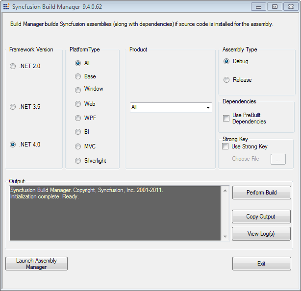

::: {style="DISPLAY: none"}
{#d2h_url_template}{#d2h_package_url style="WIDTH: 0px; DISPLAY: none; HEIGHT: 0px"}
:::

::::: {#nsbanner .d2h_main_nsbanner style="BORDER-BOTTOM: #999999 1px solid; POSITION: relative; PADDING-BOTTOM: 0px; BACKGROUND-COLOR: transparent; PADDING-LEFT: 0px; PADDING-RIGHT: 0px; DISPLAY: none; BORDER-TOP: #999999 1px solid; PADDING-TOP: 0px; LEFT: 0px"}
:::: {#TitleRow .d2h_main_titlerow style="PADDING-BOTTOM: 4px; BACKGROUND-COLOR: transparent; PADDING-LEFT: 22px; WIDTH: 100%; PADDING-RIGHT: 10px; DISPLAY: none; PADDING-TOP: 4px"}
::: {#ienav .d2h_main_ienav style="DISPLAY: none"}
{#D2HPrevious .D2HPreviousEnabled}  {#D2HNext .D2HNextEnabled}
:::
::::
:::::

::::::: {#nstext .d2h_main_nstext style="PADDING-BOTTOM: 10px; BACKGROUND-COLOR: transparent; PADDING-LEFT: 22px; PADDING-RIGHT: 10px; HEIGHT: 100%; OVERFLOW: auto; PADDING-TOP: 5px" hasuserbackground="true" valign="bottom"}
::: {#d2h_breadcrumbs .d2h_breadcrumbs}
[Essential Studio User Guide Documentation](ms-xhelp:///?Id=12457748-09e3-4d74-a240-8e049cedf030){.d2h_breadcrumbsNormal}[ \> ]{.d2h_breadcrumbsLinkSeparator}[Essential Common](ms-xhelp:///?Id=2bfe10b6-fac1-4f91-a173-04db314f10c3){.d2h_breadcrumbsNormal}[ \> ]{.d2h_breadcrumbsLinkSeparator}[Dashboard Utilities](ms-xhelp:///?Id=2f121e36-ec61-4721-87d7-ef6b9a6b8c4c){.d2h_breadcrumbsNormal}
:::

## Build Management {#build-management style="tab-stops: 0pt"}

Build Manager

Build Manager allows you to build or debug the assemblies using the Syncfusion source code.

 

Launching Build Manager

[]{style="FONT-FAMILY: 'Trebuchet MS','sans-serif'; COLOR: #15428b; FONT-SIZE: 9pt"} 

The following are the steps to launch the Build Manager:

[]{style="FONT-FAMILY: 'Trebuchet MS','sans-serif'; COLOR: #15428b; FONT-SIZE: 9pt"} 

1.   Open **Syncfusion** **Dashboard.**

2.   Click **Utilities \> Build Management**.

3.   Click **Launch** button for **Build Manager**.

4.  The **Syncfusion Build Manager x.x.x.x** window opens.

**[]{style="FONT-FAMILY: 'Trebuchet MS','sans-serif'; COLOR: #15428b; FONT-SIZE: 9pt"}** 

::: {style="BORDER-BOTTOM: windowtext 1pt solid; BORDER-LEFT: medium none; PADDING-BOTTOM: 1pt; MARGIN-TOP: 9pt; PADDING-LEFT: 0pt; PADDING-RIGHT: 0pt; MARGIN-BOTTOM: 9pt; BORDER-TOP: windowtext 1pt solid; BORDER-RIGHT: medium none; PADDING-TOP: 1pt"}
{border="0"}Note: Build Manager will be available in Dashboard only when Source code  is installed. You can also launch the Build Manager from the following location:
:::

*** C:\\Program Files\\Syncfusion\\Essential Studio\\x.x.x.x\\Utilities\\Build Manager\\buildmanagerwindows.exe***

**[]{style="FONT-FAMILY: 'Trebuchet MS','sans-serif'; COLOR: #15428b; FONT-SIZE: 9pt"}** 

{border="0"}

Figure 126: Syncfusion Essential Studio Build Manager

[]{style="FONT-FAMILY: 'Trebuchet MS','sans-serif'; COLOR: #15428b; FONT-SIZE: 9pt"} 

5.  Select the required setting in the **Syncfusion Build Manager x.x.x.x** window.

 

[]{style="FONT-FAMILY: 'Trebuchet MS','sans-serif'; COLOR: #15428b; FONT-SIZE: 9pt"} 

Build Manager Settings

This window contains six sections.

[]{style="FONT-FAMILY: 'Trebuchet MS','sans-serif'; COLOR: #15428b; FONT-SIZE: 9pt"} 

[·      ]{style="FONT-FAMILY: Symbol"}**Framework Version**

[]{style="FONT-FAMILY: 'Trebuchet MS','sans-serif'; COLOR: #15428b; FONT-SIZE: 9pt"} 

The **Framework Version** group box has three option buttons, the .NET 2.0, .NET 3.5 and .NET 4.0. If Visual Studio 2010 is not installed in your system, .NET 3.5 option is selected by default[.]{style="FONT-FAMILY: 'Times New Roman','serif'; FONT-SIZE: 12pt"} If Visual Studio 2008 is not installed in your system, .NET 2.0 options is selected by default.  You can change the default option by clicking the other option button. The version of the .NET Framework that the assemblies should be built with, is specified here which will be automatically used to rebuild the assemblies.

[]{style="FONT-FAMILY: 'Trebuchet MS','sans-serif'; COLOR: #15428b; FONT-SIZE: 9pt"} 

[·      ]{style="FONT-FAMILY: Symbol"}**Product**

[]{style="FONT-FAMILY: 'Trebuchet MS','sans-serif'; COLOR: #15428b; FONT-SIZE: 9pt"} 

The **Product** group box has a drop-down list box. By default, **All** is selected. You can change the default option by selecting one of the products in the drop-down list box.

[]{style="FONT-FAMILY: 'Trebuchet MS','sans-serif'; COLOR: #15428b; FONT-SIZE: 9pt"} 

[·      ]{style="FONT-FAMILY: Symbol"}**Platform Type**

[]{style="FONT-FAMILY: 'Trebuchet MS','sans-serif'; COLOR: #15428b; FONT-SIZE: 9pt"} 

Syncfusion products typically have a common base library, which forms the basis for the Windows and Web variant. The library category to be built is specified using the **Product Type**. This frame has eight option buttons. **All** is selected by default. You can click the required product\'s option button to perform the build operation.

::: {style="BORDER-BOTTOM: windowtext 1pt solid; BORDER-LEFT: medium none; PADDING-BOTTOM: 1pt; MARGIN-TOP: 9pt; PADDING-LEFT: 0pt; PADDING-RIGHT: 0pt; MARGIN-BOTTOM: 9pt; BORDER-TOP: windowtext 1pt solid; BORDER-RIGHT: medium none; PADDING-TOP: 1pt"}
{border="0"}Note: For assemblies that are not built and pre-compiled assemblies that ship with the product will automatically be used.
:::

[]{style="FONT-FAMILY: 'Trebuchet MS','sans-serif'; COLOR: #15428b; FONT-SIZE: 9pt"} 

[·      ]{style="FONT-FAMILY: Symbol"}**Assembly Type**

[]{style="FONT-FAMILY: 'Trebuchet MS','sans-serif'; COLOR: #15428b; FONT-SIZE: 9pt"} 

This frame has two option buttons-Debug and Release. **Debug** is selected by default. To choose release mode for assembly, select **Release**.

Here, the user can switch between the Debug and Release mode of product configurations. Building the debug version of the assemblies allows you to step into the Syncfusion assemblies, when debugging applications.

[]{style="FONT-FAMILY: 'Trebuchet MS','sans-serif'; COLOR: #15428b; FONT-SIZE: 9pt"} 

[·      ]{style="FONT-FAMILY: Symbol"}**Dependencies**

This enables you to specify whether the dependent assemblies of the product have to be used or not.[ ]{style="FONT-FAMILY: 'Trebuchet MS','sans-serif'; COLOR: #15428b; FONT-SIZE: 9pt"}If the **Use PreBuilt Dependencies** check box is selected, the dependent assemblies of the product, under the selected Product frame will be taken from the **Pre-Compiled Assemblies** folder, which is presently under the installed location. Rebuilding Assemblies can be restricted to specific assemblies by enabling the pre-built dependencies, in which case the other assemblies would be just pre compiled variants installed with the product.[]{style="FONT-FAMILY: 'Trebuchet MS','sans-serif'; COLOR: #15428b; FONT-SIZE: 9pt"}

 

[·      ]{style="FONT-FAMILY: Symbol"}**Strong Key**

This enables you to install the compiled assemblies in GAC. Select the **Use Strong Key** check box choose a **.snk** file to achieve this.

[]{style="FONT-FAMILY: 'Trebuchet MS','sans-serif'; COLOR: #15428b; FONT-SIZE: 9pt"} 

[·      ]{style="FONT-FAMILY: Symbol"}**Output**

[]{style="FONT-FAMILY: 'Trebuchet MS','sans-serif'; COLOR: #15428b; FONT-SIZE: 9pt"} 

This frame shows the output, i.e., the status of the build operation in a text area.

[]{style="FONT-FAMILY: 'Trebuchet MS','sans-serif'; COLOR: #15428b; FONT-SIZE: 9pt"} 

6.   After the selection of required options in the above-mentioned frames, click **Perform Build** inside the output frame.

[]{style="FONT-FAMILY: 'Trebuchet MS','sans-serif'; COLOR: #15428b; FONT-SIZE: 9pt"} 

::: {style="BORDER-BOTTOM: windowtext 1pt solid; BORDER-LEFT: medium none; PADDING-BOTTOM: 1pt; MARGIN-TOP: 9pt; PADDING-LEFT: 0pt; PADDING-RIGHT: 0pt; MARGIN-BOTTOM: 9pt; BORDER-TOP: windowtext 1pt solid; BORDER-RIGHT: medium none; PADDING-TOP: 1pt"}
{border="0"}Note: Now, the build operation is performed and the status is updated in the text area, inside the output frame. On completion of build operation, a dialog box is displayed stating that, \"Build operation has been completed. Please review build output and log files for additional information\".
:::

[]{style="FONT-FAMILY: 'Trebuchet MS','sans-serif'; COLOR: #15428b; FONT-SIZE: 9pt"} 

**[]{style="FONT-FAMILY: 'Trebuchet MS','sans-serif'; COLOR: #15428b"}** 

Refer Also

[]{style="FONT-FAMILY: 'Trebuchet MS','sans-serif'; COLOR: #15428b; FONT-SIZE: 9pt"} 

[[Assembly Manager]{.UGHyperlink}](ms-xhelp:///?Id=4318083c-5c86-440b-80b1-2bdbe8a6d424)[, ]{style="FONT-FAMILY: 'Trebuchet MS','sans-serif'; COLOR: #15428b; FONT-SIZE: 9pt"}[[Assembly Management]{.UGHyperlink}](ms-xhelp:///?Id=91cfe9e8-9d3a-41b4-bcea-59ec1af14a11)[]{.UGHyperlink}

[[]{style="TEXT-DECORATION: none"}]{.UGHyperlink} 

 

[]{#related-topics}
:::::::
