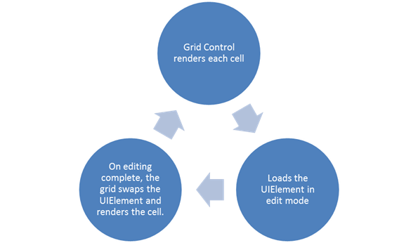

::: {style="DISPLAY: none"}
{#d2h_url_template}{#d2h_package_url style="WIDTH: 0px; DISPLAY: none; HEIGHT: 0px"}
:::

::: {.d2h_secondary_topic style="PADDING-BOTTOM: 10pt; MARGIN: 0pt; PADDING-LEFT: 0pt; PADDING-RIGHT: 0pt; PADDING-TOP: 0pt"}
#### Built-In Celltypes {#built-in-celltypes style="tab-stops: 0pt"}

**[]{style="FONT-FAMILY: 'Trebuchet MS','sans-serif'; COLOR: #15428b; FONT-SIZE: 9pt"}** 

Grid CellTypes

Essential Grid allows the inclusion of special controls in Grid cells. The attribute of a grid cell is referred to as its CellType. The editor elements (all cell types) are created only on demand. Here "on demand" stands for the loading of cells, which depends upon the CellType. The CellTypes for which optimization is enabled will load the CellType as TextBox (default CellType) in the Grid portions that are visible in the screen and loads the editor elements only on cell click. The CellTypes for which optimization is not enabled will directly load the UIElement on the Grid for the visible portion in the screen. Figure 1 explains the loading of grid cells pictorially.

[]{style="FONT-FAMILY: 'Trebuchet MS','sans-serif'; COLOR: #15428b; FONT-SIZE: 9pt"} 

The following diagram explains the loading of the cell's UIElement in the Grid.

[]{style="FONT-FAMILY: 'Trebuchet MS','sans-serif'; COLOR: #15428b; FONT-SIZE: 9pt"} 

{border="0"}

Figure 22: Loading of Grid cells for which the CellTypes has SupportsRenderOptimization set to true

[]{style="FONT-FAMILY: 'Calibri','sans-serif'"} 

When SupporsRenderOptimization is set to true, the grid loads with improved performance. You can use customization of GridControl with different CellTypes. [Adding CellTypes to an Application]{.UGHyperlink} topic explains more about each CellType.

[]{style="FONT-FAMILY: 'Trebuchet MS','sans-serif'; COLOR: #15428b; FONT-SIZE: 9pt"} 

 

 

Use Case Scenarios

Each cell type has some unique features that can be implemented according to the user's need. With respect to the data used in the cell, the CellType can be assigned.

 

More:

[ ]{#related-topics}

[{border="0" align="absMiddle"}Adding CellTypes to an Application](ms-xhelp:///?Id=f87b0f10-f48b-4019-88c8-833d2f9ea342){style="TEXT-DECORATION: none"}

[{border="0" align="absMiddle"}Sample Link](ms-xhelp:///?Id=a0be9652-dfe0-4f3f-a258-804858db4c48){style="TEXT-DECORATION: none"}
:::
