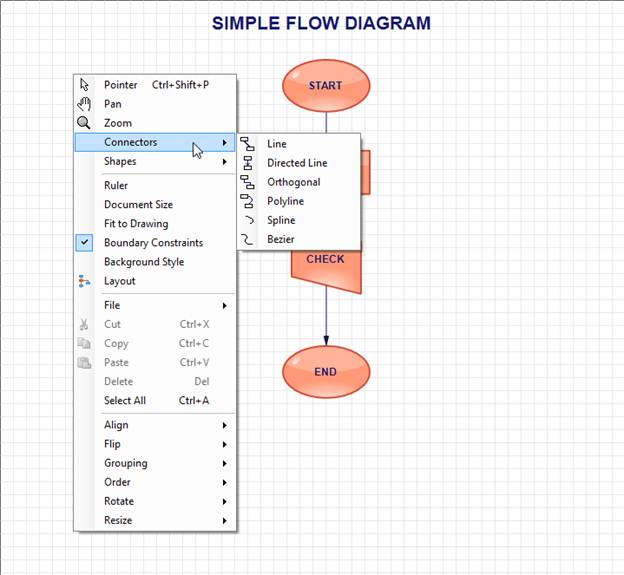

::: {style="DISPLAY: none"}
{#d2h_url_template}{#d2h_package_url style="WIDTH: 0px; DISPLAY: none; HEIGHT: 0px"}
:::

::::: {#nsbanner .d2h_main_nsbanner style="BORDER-BOTTOM: #999999 1px solid; POSITION: relative; PADDING-BOTTOM: 0px; BACKGROUND-COLOR: transparent; PADDING-LEFT: 0px; PADDING-RIGHT: 0px; DISPLAY: none; BORDER-TOP: #999999 1px solid; PADDING-TOP: 0px; LEFT: 0px"}
:::: {#TitleRow .d2h_main_titlerow style="PADDING-BOTTOM: 4px; BACKGROUND-COLOR: transparent; PADDING-LEFT: 22px; WIDTH: 100%; PADDING-RIGHT: 10px; DISPLAY: none; PADDING-TOP: 4px"}
::: {#ienav .d2h_main_ienav style="DISPLAY: none"}
{#D2HPrevious .D2HPreviousEnabled}  {#D2HNext .D2HNextEnabled}
:::
::::
:::::

::::: {#nstext .d2h_main_nstext style="PADDING-BOTTOM: 10px; BACKGROUND-COLOR: transparent; PADDING-LEFT: 22px; PADDING-RIGHT: 10px; HEIGHT: 100%; OVERFLOW: auto; PADDING-TOP: 5px" hasuserbackground="true" valign="bottom"}
::: {#d2h_breadcrumbs .d2h_breadcrumbs}
[Essential Studio User Guide Documentation](ms-xhelp:///?Id=12457748-09e3-4d74-a240-8e049cedf030){.d2h_breadcrumbsNormal}[ \> ]{.d2h_breadcrumbsLinkSeparator}[User Interface Edition](ms-xhelp:///?Id=c29296b7-531c-413b-a0ec-488ca1f7f669){.d2h_breadcrumbsNormal}[ \> ]{.d2h_breadcrumbsLinkSeparator}[Essential Windows](ms-xhelp:///?Id=e60759d8-47a4-4570-9d7a-16a68d63f2ea){.d2h_breadcrumbsNormal}[ \> ]{.d2h_breadcrumbsLinkSeparator}[Essential Diagram]{.d2h_breadcrumbsContentsOnly}[ \> ]{.d2h_breadcrumbsLinkSeparator}[Concepts And Features](ms-xhelp:///?Id=008cec4b-5177-4859-8616-c062751d8fb6){.d2h_breadcrumbsNormal}[ \> ]{.d2h_breadcrumbsLinkSeparator}[Advanced Features](ms-xhelp:///?Id=f661be94-4825-49a2-ac75-df5e8495098e){.d2h_breadcrumbsNormal}
:::

### Built-In Context Menu {#built-in-context-menu style="TEXT-ALIGN: justify; tab-stops: 0pt"}

 

Essential Diagram for Windows Forms provides Built-in Context Menu support for Diagram.

 

All available tools for Diagram control, File options, Edit options, Action options, Layout, Connectors and Shapes will be listed in the Built-in Context Menu.

 

Use Case Scenarios

This feature enables easy access of frequently used options.

 

Properties

Table 3: Property[ ]{style="COLOR: #c00000"}Table

::: {align="center"}
  --------------------------- -------------------------------------- ------ ----------- -----------------
  Property                    Description                            Type   Data Type   Reference links
  DefaultContextMenuEnabled   Used to enable default context menu.   NA     Boolean     NA
  --------------------------- -------------------------------------- ------ ----------- -----------------
:::

[]{style="FONT-FAMILY: 'Calibri','sans-serif'; COLOR: black"} 

Enabling Default Context Menu

You can enable the default context menu using the *DefaultContextMenuEnabled* property.

The following code illustrates how to enable the default context menu:

 

+---------------------------------------------------------------------------------------------------------------------+
| \[C#\]                                                                                                              |
|                                                                                                                     |
|                                                                                                                     |
|                                                                                                                     |
| [//show default context menu]{style="FONT-FAMILY: 'Courier New'; COLOR: green"}                                     |
|                                                                                                                     |
| [            diagram1.DefaultContextMenuEnabled = [true]{style="COLOR: blue"};]{style="FONT-FAMILY: 'Courier New'"} |
+---------------------------------------------------------------------------------------------------------------------+

 

+--------------------------------------------------------------------------------------------------------------------+
| [\[VB\]]{style="FONT-FAMILY: 'Courier New'"}                                                                       |
|                                                                                                                    |
| [\'show default context menu]{style="FONT-FAMILY: 'Courier New'; COLOR: green"}                                    |
|                                                                                                                    |
| [            diagram1.DefaultContextMenuEnabled = [True]{style="COLOR: blue"}]{style="FONT-FAMILY: 'Courier New'"} |
+--------------------------------------------------------------------------------------------------------------------+

[]{style="FONT-FAMILY: 'Courier New'"} 

{border="0"}

Figure 118: Default Context Menu\
\

[            ]{style="FONT-FAMILY: 'Courier New'"}

The following code illustrates how to disable the default context menu:

 

+----------------------------------------------------------------------------------------------------------------------+
| [\[C#\]]{style="FONT-FAMILY: 'Courier New'; COLOR: green"}                                                           |
|                                                                                                                      |
| []{style="FONT-FAMILY: 'Courier New'; COLOR: green"}                                                                 |
|                                                                                                                      |
| [//hide default context menu]{style="FONT-FAMILY: 'Courier New'; COLOR: green"}                                      |
|                                                                                                                      |
| [            diagram1.DefaultContextMenuEnabled = [false]{style="COLOR: blue"};]{style="FONT-FAMILY: 'Courier New'"} |
+----------------------------------------------------------------------------------------------------------------------+

 

+---------------------------------------------------------------------------------------------------------------------+
| [\[VB\]]{style="FONT-FAMILY: 'Courier New'; COLOR: green"}                                                          |
|                                                                                                                     |
| []{style="FONT-FAMILY: 'Courier New'; COLOR: green"}                                                                |
|                                                                                                                     |
| [\'hide default context menu]{style="FONT-FAMILY: 'Courier New'; COLOR: green"}                                     |
|                                                                                                                     |
| [            diagram1.DefaultContextMenuEnabled = [False]{style="COLOR: blue"}]{style="FONT-FAMILY: 'Courier New'"} |
+---------------------------------------------------------------------------------------------------------------------+

 

 

 

Sample Link

To view a sample:

 

1.   Open the Syncfusion Dashboard.

2.   Click the **Windows Forms** drop-down list and select **Run Locally Installed Samples.**

3.   Navigate to **Diagram[ ]{style="COLOR: #c00000"}Samples \> Product Showcase \> Diagram Builder.**

                      

[]{#related-topics}
:::::
