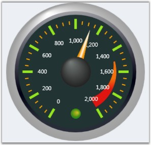
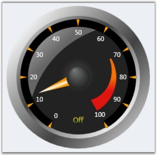
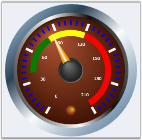
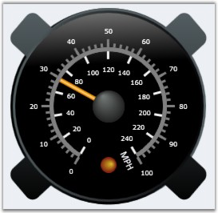
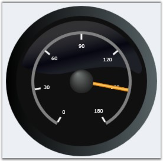
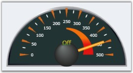

::: {style="DISPLAY: none"}
{#d2h_url_template}{#d2h_package_url style="WIDTH: 0px; DISPLAY: none; HEIGHT: 0px"}
:::

::: {.d2h_secondary_topic style="PADDING-BOTTOM: 10pt; MARGIN: 0pt; PADDING-LEFT: 0pt; PADDING-RIGHT: 0pt; PADDING-TOP: 0pt"}
##### Built-in Frames {#built-in-frames style="tab-stops: 0pt"}

Circular gauge contains variety of built-in frame types to provide effective rim styles. And also you can customize the built-in frame types through circular gauge properties such as FirstFrameThickness, SecondFrameThickness, FirstFrameFillColor, SecondFrameFillcolor and InnerFrameFillcolor.

 

Following built-in frame types are available in circular gauge.

[]{style="FONT-FAMILY: 'Trebuchet MS','sans-serif'; COLOR: #15428b; FONT-SIZE: 9pt"} 

[·      ]{style="FONT-FAMILY: Symbol"}**FullCircle**---circular gauge with default template will be displayed as full circle.

[·      ]{style="FONT-FAMILY: Symbol"}**HalfCircle**---circular gauge with default template will be displayed as half circle.

[·      ]{style="FONT-FAMILY: Symbol"}**CircularWithDarkOuterFrames**---circular gauge frame with dark first and second frame.

[·      ]{style="FONT-FAMILY: Symbol"}**CircularWithInnerTopGradient**---circular gauge frame with inner top gradient.

[·      ]{style="FONT-FAMILY: Symbol"}**CircularWithInnerLeftGradient**---circular gauge frame with inner left gradient.

[·      ]{style="FONT-FAMILY: Symbol"}**CircularCenterGradient**---circular gauge with center gradient.

[·      ]{style="FONT-FAMILY: Symbol"}**CounterclockwiseHalfCircle---**counter clockwise half circular gauge.

[]{style="FONT-FAMILY: 'Trebuchet MS','sans-serif'; COLOR: #15428b; FONT-SIZE: 9pt"} 

The following code example illustrates how to set the frame type for the Circular Gauge to *CircularWithDarkOuterFrames*.

[]{style="FONT-FAMILY: 'Trebuchet MS','sans-serif'; COLOR: #15428b; FONT-SIZE: 9pt"} 

+---------------------------------------------------------------------------------------------------------------------------------------------------------------------------------------------------------------------------------------------------------------------------------------------------------------------------------------------------------------------------------------------------------------------------------------------------------------------------------------------------------------------------------------------------------------------------------------------------------------------------------------------------------------------------------------------------------------------------------------------------------------------------------------------------------------+
| **[\[XAML\]]{style="FONT-FAMILY: 'Courier New'; COLOR: black; FONT-SIZE: 9pt"}**                                                                                                                                                                                                                                                                                                                                                                                                                                                                                                                                                                                                                                                                                                                              |
|                                                                                                                                                                                                                                                                                                                                                                                                                                                                                                                                                                                                                                                                                                                                                                                                               |
| []{style="FONT-FAMILY: 'Courier New'; COLOR: blue; FONT-SIZE: 9pt"}                                                                                                                                                                                                                                                                                                                                                                                                                                                                                                                                                                                                                                                                                                                                           |
|                                                                                                                                                                                                                                                                                                                                                                                                                                                                                                                                                                                                                                                                                                                                                                                                               |
| [\<!\--Circular gauge with frame type as CircularWithDarkOuterFrames.\--\>]{style="FONT-FAMILY: 'Courier New'; COLOR: green; FONT-SIZE: 9pt"}                                                                                                                                                                                                                                                                                                                                                                                                                                                                                                                                                                                                                                                                 |
|                                                                                                                                                                                                                                                                                                                                                                                                                                                                                                                                                                                                                                                                                                                                                                                                               |
| [\<]{style="FONT-FAMILY: 'Courier New'; COLOR: blue; FONT-SIZE: 9pt"}[syncfusion]{style="FONT-FAMILY: 'Courier New'; COLOR: #a31515; FONT-SIZE: 9pt"}[:]{style="FONT-FAMILY: 'Courier New'; COLOR: blue; FONT-SIZE: 9pt"}[CircularGauge]{style="FONT-FAMILY: 'Courier New'; COLOR: #a31515; FONT-SIZE: 9pt"}[ Margin]{style="FONT-FAMILY: 'Courier New'; COLOR: red; FONT-SIZE: 9pt"}[=\"5\"]{style="FONT-FAMILY: 'Courier New'; COLOR: blue; FONT-SIZE: 9pt"}[ Name]{style="FONT-FAMILY: 'Courier New'; COLOR: red; FONT-SIZE: 9pt"}[=\"circularGauge1\"]{style="FONT-FAMILY: 'Courier New'; COLOR: blue; FONT-SIZE: 9pt"}[ FrameType]{style="FONT-FAMILY: 'Courier New'; COLOR: red; FONT-SIZE: 9pt"}[=\"CircularWithDarkOuterFrames\"/\>]{style="FONT-FAMILY: 'Courier New'; COLOR: blue; FONT-SIZE: 9pt"} |
+---------------------------------------------------------------------------------------------------------------------------------------------------------------------------------------------------------------------------------------------------------------------------------------------------------------------------------------------------------------------------------------------------------------------------------------------------------------------------------------------------------------------------------------------------------------------------------------------------------------------------------------------------------------------------------------------------------------------------------------------------------------------------------------------------------------+

[]{style="FONT-FAMILY: 'Trebuchet MS','sans-serif'; COLOR: #15428b; FONT-SIZE: 9pt"} 

+----------------------------------------------------------------------------------------------------------------------------------------------------------------------------------------------------------------------------------+
| **[\[C#\]]{style="FONT-FAMILY: 'Courier New'; COLOR: black; FONT-SIZE: 9pt"}**                                                                                                                                                   |
|                                                                                                                                                                                                                                  |
| []{style="FONT-FAMILY: 'Courier New'; COLOR: blue; FONT-SIZE: 9pt"}                                                                                                                                                              |
|                                                                                                                                                                                                                                  |
| [\<!\--Circular gauge with frame type as CircularWithDarkOuterFrames.\--\>]{style="FONT-FAMILY: 'Courier New'; COLOR: green; FONT-SIZE: 9pt"}                                                                                    |
|                                                                                                                                                                                                                                  |
| [CircularGauge]{style="FONT-FAMILY: 'Courier New'; COLOR: #2b91af; FONT-SIZE: 9pt"}[ circularGauge1 = [new]{style="COLOR: blue"} [CircularGauge]{style="COLOR: #2b91af"}();]{style="FONT-FAMILY: 'Courier New'; FONT-SIZE: 9pt"} |
|                                                                                                                                                                                                                                  |
| [circularGauge1.FrameType = [GaugeFrameType]{style="COLOR: #2b91af"}.CircularWithDarkOuterFrames;]{style="FONT-FAMILY: 'Courier New'; FONT-SIZE: 9pt"}                                                                           |
+----------------------------------------------------------------------------------------------------------------------------------------------------------------------------------------------------------------------------------+

[]{style="FONT-FAMILY: 'Trebuchet MS','sans-serif'; COLOR: #15428b; FONT-SIZE: 9pt"} 

The following screen shots illustrate the different types of circular frame types that are available in the gauge library.

[]{style="FONT-FAMILY: 'Trebuchet MS','sans-serif'; COLOR: #15428b; FONT-SIZE: 9pt"} 

{border="0"}

Figure 20: Circular Gauge with \"FullCircle\" Frame

***[]{style="FONT-FAMILY: 'Trebuchet MS','sans-serif'; COLOR: #15428b; FONT-SIZE: 9pt"}*** 

{border="0"}

Figure 21: Circular Gauge with \"CircularWithInnerTopGradient\" Frame

***[]{style="FONT-FAMILY: 'Trebuchet MS','sans-serif'; COLOR: #15428b; FONT-SIZE: 9pt"}*** 

***[{border="0"}]{style="FONT-FAMILY: 'Trebuchet MS','sans-serif'; COLOR: #15428b; FONT-SIZE: 9pt"}**[]{style="FONT-FAMILY: 'Trebuchet MS','sans-serif'; COLOR: #15428b; FONT-SIZE: 9pt"}***

Figure 22:  Circular Gauge with \"CircularCenterGradient\" Frame

***[]{style="FONT-FAMILY: 'Trebuchet MS','sans-serif'; COLOR: #15428b; FONT-SIZE: 9pt"}*** 

{border="0"}

Figure 23: Circular Gauge with \"CircularWithDarkOuterFrames\" Frame

***[]{style="FONT-FAMILY: 'Trebuchet MS','sans-serif'; COLOR: #15428b; FONT-SIZE: 9pt"}*** 

{border="0"}

Figure 24: Circular Gauge with \"CircularWithInnerLeftGradient\" Frame

***[]{style="FONT-FAMILY: 'Trebuchet MS','sans-serif'; COLOR: #15428b; FONT-SIZE: 9pt"}*** 

{border="0"}

Figure 25: Circular Gauge with \"HalfCircle\" Frame

 

[]{#related-topics}
:::
