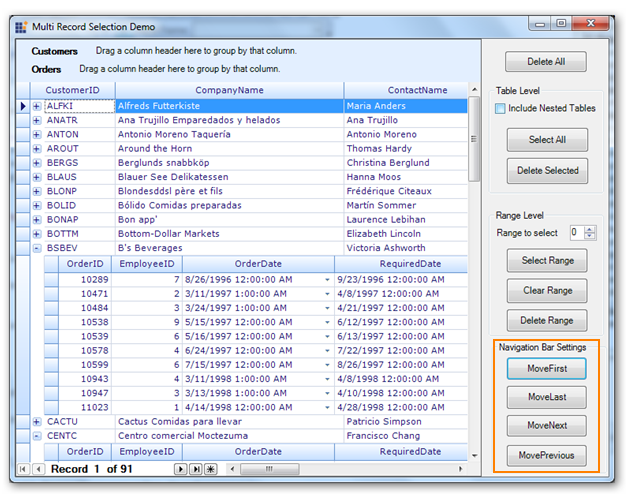

::: {style="DISPLAY: none"}
{#d2h_url_template}{#d2h_package_url style="WIDTH: 0px; DISPLAY: none; HEIGHT: 0px"}
:::

::::: {#nsbanner .d2h_main_nsbanner style="BORDER-BOTTOM: #999999 1px solid; POSITION: relative; PADDING-BOTTOM: 0px; BACKGROUND-COLOR: transparent; PADDING-LEFT: 0px; PADDING-RIGHT: 0px; DISPLAY: none; BORDER-TOP: #999999 1px solid; PADDING-TOP: 0px; LEFT: 0px"}
:::: {#TitleRow .d2h_main_titlerow style="PADDING-BOTTOM: 4px; BACKGROUND-COLOR: transparent; PADDING-LEFT: 22px; WIDTH: 100%; PADDING-RIGHT: 10px; DISPLAY: none; PADDING-TOP: 4px"}
::: {#ienav .d2h_main_ienav style="DISPLAY: none"}
{#D2HPrevious .D2HPreviousEnabled}  {#D2HNext .D2HNextEnabled}
:::
::::
:::::

::::: {#nstext .d2h_main_nstext style="PADDING-BOTTOM: 10px; BACKGROUND-COLOR: transparent; PADDING-LEFT: 22px; PADDING-RIGHT: 10px; HEIGHT: 100%; OVERFLOW: auto; PADDING-TOP: 5px" hasuserbackground="true" valign="bottom"}
::: {#d2h_breadcrumbs .d2h_breadcrumbs}
[Essential Studio User Guide Documentation](ms-xhelp:///?Id=12457748-09e3-4d74-a240-8e049cedf030){.d2h_breadcrumbsNormal}[ \> ]{.d2h_breadcrumbsLinkSeparator}[User Interface Edition](ms-xhelp:///?Id=c29296b7-531c-413b-a0ec-488ca1f7f669){.d2h_breadcrumbsNormal}[ \> ]{.d2h_breadcrumbsLinkSeparator}[Essential Windows](ms-xhelp:///?Id=e60759d8-47a4-4570-9d7a-16a68d63f2ea){.d2h_breadcrumbsNormal}[ \> ]{.d2h_breadcrumbsLinkSeparator}[Essential Grid]{.d2h_breadcrumbsContentsOnly}[ \> ]{.d2h_breadcrumbsLinkSeparator}[Grid Controls](ms-xhelp:///?Id=bf2d70d7-33dc-4c67-a55d-4fcf8d51dc2b){.d2h_breadcrumbsNormal}[ \> ]{.d2h_breadcrumbsLinkSeparator}[Grid Record Navigation Control](ms-xhelp:///?Id=1d28b67b-bfb5-4a6f-96c9-34b722de7fd5){.d2h_breadcrumbsNormal}
:::

### Built-in Navigation Support  for RecordNavigationControl in GridGroupingControl[]{style="FONT-SIZE: 18pt"} {#built-in-navigation-support-for-recordnavigationcontrol-in-gridgroupingcontrol style="tab-stops: 0pt"}

The GridGrouping control now provides four types of built-in navigation support, enabling users to navigate to the first record, last record, previous record, and next record.

 

Use Case Scenarios

When you have lots of records in your application, this feature helps you easily navigate to the required record.

 

Methods

 

Table 11: Methods Table

::: {align="center"}
  **[Method ]{style="LINE-HEIGHT: 115%; FONT-FAMILY: 'Calibri','sans-serif'; COLOR: black; FONT-SIZE: 11pt"}**[]{style="LINE-HEIGHT: 115%; FONT-FAMILY: 'Calibri','sans-serif'; COLOR: black; FONT-SIZE: 11pt"}   **[Description ]{style="LINE-HEIGHT: 115%; FONT-FAMILY: 'Calibri','sans-serif'; COLOR: black; FONT-SIZE: 11pt"}**[]{style="LINE-HEIGHT: 115%; FONT-FAMILY: 'Calibri','sans-serif'; COLOR: black; FONT-SIZE: 11pt"}   **[Parameters ]{style="LINE-HEIGHT: 115%; FONT-FAMILY: 'Calibri','sans-serif'; COLOR: black; FONT-SIZE: 11pt"}**[]{style="LINE-HEIGHT: 115%; FONT-FAMILY: 'Calibri','sans-serif'; COLOR: black; FONT-SIZE: 11pt"}   **[Type ]{style="LINE-HEIGHT: 115%; FONT-FAMILY: 'Calibri','sans-serif'; COLOR: black; FONT-SIZE: 11pt"}**[]{style="LINE-HEIGHT: 115%; FONT-FAMILY: 'Calibri','sans-serif'; COLOR: black; FONT-SIZE: 11pt"}   **[Return Type ]{style="LINE-HEIGHT: 115%; FONT-FAMILY: 'Calibri','sans-serif'; COLOR: black; FONT-SIZE: 11pt"}**[]{style="LINE-HEIGHT: 115%; FONT-FAMILY: 'Calibri','sans-serif'; COLOR: black; FONT-SIZE: 11pt"}   **[Reference links ]{style="LINE-HEIGHT: 115%; FONT-FAMILY: 'Calibri','sans-serif'; COLOR: black; FONT-SIZE: 11pt"}**[]{style="LINE-HEIGHT: 115%; FONT-FAMILY: 'Calibri','sans-serif'; COLOR: black; FONT-SIZE: 11pt"}
  --------------------------------------------------------------------------------------------------------------------------------------------------------------------------------------------------------------- -------------------------------------------------------------------------------------------------------------------------------------------------------------------------------------------------------------------- ------------------------------------------------------------------------------------------------------------------------------------------------------------------------------------------------------------------- ------------------------------------------------------------------------------------------------------------------------------------------------------------------------------------------------------------- -------------------------------------------------------------------------------------------------------------------------------------------------------------------------------------------------------------------- ------------------------------------------------------------------------------------------------------------------------------------------------------------------------------------------------------------------------
  [MoveFirst()]{style="COLOR: black"}                                                                                                                                                                             [This Method is used to navigate to the first record.]{style="COLOR: black"}                                                                                                                                         [N/A ]{style="COLOR: black"}                                                                                                                                                                                        [method]{style="COLOR: black"}                                                                                                                                                                                [void ]{style="COLOR: black"}                                                                                                                                                                                        [N/A. ]{style="COLOR: black"}
  [MoveLast()]{style="COLOR: black"}                                                                                                                                                                              [This method is used to navigate to the last record.]{style="COLOR: black"}                                                                                                                                          [N/A]{style="COLOR: black"}                                                                                                                                                                                         **[method]{style="COLOR: black"}**                                                                                                                                                                            [void]{style="COLOR: black"}                                                                                                                                                                                         [N/A]{style="COLOR: black"}
  [MoveNext()]{style="COLOR: black"}                                                                                                                                                                              [This method is used to navigate to the next record.]{style="COLOR: black"}                                                                                                                                          [N/A]{style="COLOR: black"}                                                                                                                                                                                         **[method]{style="COLOR: black"}**                                                                                                                                                                            [void]{style="COLOR: black"}                                                                                                                                                                                         [N/A]{style="COLOR: black"}
  [MovePrevious()]{style="COLOR: black"}                                                                                                                                                                          [This method is used to navigate to the previous record.]{style="COLOR: black"}                                                                                                                                      [N/A ]{style="COLOR: black"}                                                                                                                                                                                        **[method]{style="COLOR: black"}**                                                                                                                                                                            [void]{style="COLOR: black"}                                                                                                                                                                                         [N/A]{style="COLOR: black"}
:::

[]{style="FONT-FAMILY: 'Calibri','sans-serif'; COLOR: black"} 

Sample Link

A demo of this feature is available in the following location:

 

***..\\..\\AppData\\Local\\Syncfusion\\EssentialStudio\\{Installed Version}\\Windows\\Grid.Grouping.Windows\\Samples\\2.0\\Selection\\Multi Record Selection Demo***

 

 

Adding Navigation Bar to the RecordNavigationControl

The following are steps to add navigation bar:

 

1.   Enable navigation bar by setting the *[ShowNavigationBar ]{style="COLOR: black"}*[property to true. The following code illustrates this:]{style="COLOR: black"}

+-------------------------------------------------------------------------------------------------------------------------------------------------------------------------------------------------+
| **[\[C#\]]{style="FONT-FAMILY: 'Courier New'"}**                                                                                                                                                |
|                                                                                                                                                                                                 |
| []{style="FONT-FAMILY: 'Courier New'; COLOR: blue"}                                                                                                                                             |
|                                                                                                                                                                                                 |
| [this]{style="FONT-FAMILY: 'Courier New'; COLOR: blue"}[.gridGroupingControl1.ShowNavigationBar = [true]{style="COLOR: blue"};]{style="FONT-FAMILY: 'Courier New'"}**[]{style="COLOR: black"}** |
+-------------------------------------------------------------------------------------------------------------------------------------------------------------------------------------------------+

[]{style="FONT-FAMILY: 'Courier New'"} 

+----------------------------------------------------------------------------------------------------------------------------------------------------------------------------------------------+
| **[\[VB\]]{style="FONT-FAMILY: 'Courier New'"}**                                                                                                                                             |
|                                                                                                                                                                                              |
| []{style="FONT-FAMILY: 'Courier New'; COLOR: blue"}                                                                                                                                          |
|                                                                                                                                                                                              |
| [Me]{style="FONT-FAMILY: 'Courier New'; COLOR: blue"}[.gridGroupingControl1.ShowNavigationBar = [True]{style="COLOR: blue"}]{style="FONT-FAMILY: 'Courier New'"}**[]{style="COLOR: black"}** |
+----------------------------------------------------------------------------------------------------------------------------------------------------------------------------------------------+

[]{style="FONT-FAMILY: 'Courier New'"} 

2.   Call the methods for navigation bar i.e., MoveFirst(), MoveLast(), MoveNext() and MovePrevious() methods. The following code illustrates this:

**[]{style="COLOR: black"}** 

+-----------------------------------------------------------------------------------------------------------------------------------------------------------------------------------------------------------------------+
| [\[C#\]]{style="FONT-FAMILY: 'Courier New'; COLOR: black"}                                                                                                                                                            |
|                                                                                                                                                                                                                       |
| [    ]{style="FONT-FAMILY: 'Courier New'; COLOR: blue"}[//This property should set to true to show the navigation bar]{style="FONT-FAMILY: 'Courier New'; COLOR: green"}                                              |
|                                                                                                                                                                                                                       |
| [      [this]{style="COLOR: blue"}.gridGroupingControl1.ShowNavigationBar = [true]{style="COLOR: blue"};[]{style="COLOR: blue"}]{style="FONT-FAMILY: 'Courier New'"}                                                  |
|                                                                                                                                                                                                                       |
| [    ]{style="FONT-FAMILY: 'Courier New'; COLOR: blue"}[//This method is used to navigate the first record]{style="FONT-FAMILY: 'Courier New'; COLOR: green"}                                                         |
|                                                                                                                                                                                                                       |
| [this]{style="FONT-FAMILY: 'Courier New'; COLOR: blue"}[.gridGroupingControl1.RecordNavigationBar.MoveFirst();]{style="FONT-FAMILY: 'Courier New'"}**[ ]{style="FONT-FAMILY: 'Courier New'; COLOR: black"}**          |
|                                                                                                                                                                                                                       |
| **[        ]{style="FONT-FAMILY: 'Courier New'; COLOR: black"}**[//This method is used to navigate the last record]{style="FONT-FAMILY: 'Courier New'; COLOR: green"}                                                 |
|                                                                                                                                                                                                                       |
| [this]{style="FONT-FAMILY: 'Courier New'; COLOR: blue"}[.gridGroupingControl1.RecordNavigationBar.MoveLast();]{style="FONT-FAMILY: 'Courier New'"}                                                                    |
|                                                                                                                                                                                                                       |
| [    //This method is used to navigate the next record]{style="FONT-FAMILY: 'Courier New'; COLOR: green"}                                                                                                             |
|                                                                                                                                                                                                                       |
| **[           ]{style="FONT-FAMILY: 'Courier New'; COLOR: black"}**[this]{style="FONT-FAMILY: 'Courier New'; COLOR: blue"}[.gridGroupingControl1.RecordNavigationBar.MoveNext();]{style="FONT-FAMILY: 'Courier New'"} |
|                                                                                                                                                                                                                       |
| [    //This method is used to navigate the previous record]{style="FONT-FAMILY: 'Courier New'; COLOR: green"}                                                                                                         |
|                                                                                                                                                                                                                       |
| [    this]{style="FONT-FAMILY: 'Courier New'; COLOR: blue"}[.gridGroupingControl1.RecordNavigationBar.MovePrevious();]{style="FONT-FAMILY: 'Courier New'"}                                                            |
|                                                                                                                                                                                                                       |
| **[]{style="FONT-FAMILY: 'Courier New'; COLOR: black"}**                                                                                                                                                              |
+-----------------------------------------------------------------------------------------------------------------------------------------------------------------------------------------------------------------------+
| **[\[VB\]]{style="FONT-FAMILY: 'Courier New'; COLOR: black"}**                                                                                                                                                        |
|                                                                                                                                                                                                                       |
| [   ]{style="FONT-FAMILY: 'Courier New'; COLOR: green"}[   [\'This property should set to true to show the navigation bar]{style="COLOR: green"}]{style="FONT-FAMILY: 'Courier New'"}                                 |
|                                                                                                                                                                                                                       |
| [       [Me]{style="COLOR: blue"}.gridGroupingControl1.ShowNavigationBar = [True]{style="COLOR: blue"}[]{style="COLOR: green"}]{style="FONT-FAMILY: 'Courier New'"}                                                   |
|                                                                                                                                                                                                                       |
| [      \'This method is used to navigate the first record]{style="FONT-FAMILY: 'Courier New'; COLOR: green"}[  ]{style="FONT-FAMILY: 'Courier New'; COLOR: blue"}                                                     |
|                                                                                                                                                                                                                       |
| [    Me]{style="FONT-FAMILY: 'Courier New'; COLOR: blue"}[.gridGroupingControl1.RecordNavigationBar.MoveFirst()]{style="FONT-FAMILY: 'Courier New'"}                                                                  |
|                                                                                                                                                                                                                       |
| [   \'This method is used to navigate the last record]{style="FONT-FAMILY: 'Courier New'; COLOR: green"}                                                                                                              |
|                                                                                                                                                                                                                       |
| [     Me]{style="FONT-FAMILY: 'Courier New'; COLOR: blue"}[.gridGroupingControl1.RecordNavigationBar.MoveLast()]{style="FONT-FAMILY: 'Courier New'"}**[]{style="FONT-FAMILY: 'Courier New'; COLOR: black"}**          |
|                                                                                                                                                                                                                       |
| [   \'This method is used to navigate the next record]{style="FONT-FAMILY: 'Courier New'; COLOR: green"}                                                                                                              |
|                                                                                                                                                                                                                       |
| **[       ]{style="FONT-FAMILY: 'Courier New'; COLOR: black"}**[  [Me]{style="COLOR: blue"}.gridGroupingControl1.RecordNavigationBar.MoveNext()]{style="FONT-FAMILY: 'Courier New'"}                                  |
|                                                                                                                                                                                                                       |
| [    \'This method is used to navigate the previous record]{style="FONT-FAMILY: 'Courier New'; COLOR: green"}                                                                                                         |
|                                                                                                                                                                                                                       |
| [     Me]{style="FONT-FAMILY: 'Courier New'; COLOR: blue"}[.gridGroupingControl1.RecordNavigationBar.MovePrevious()]{style="FONT-FAMILY: 'Courier New'"}**[]{style="FONT-FAMILY: 'Courier New'; COLOR: black"}**      |
+-----------------------------------------------------------------------------------------------------------------------------------------------------------------------------------------------------------------------+

{border="0"}

Figure 440: Navigation Bar**[]{style="COLOR: black"}**

**[]{style="COLOR: black"}** 

 

[]{#related-topics}
:::::
