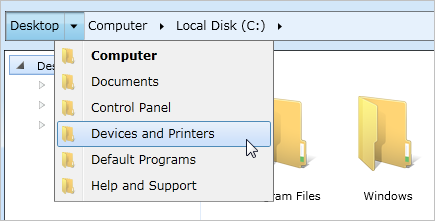
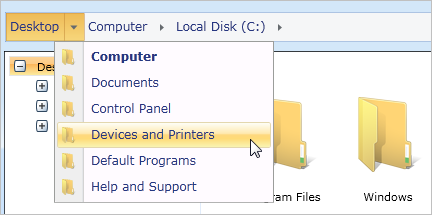
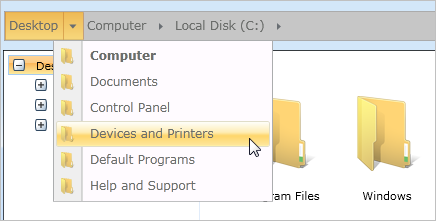
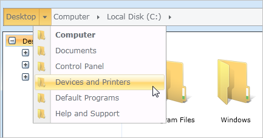
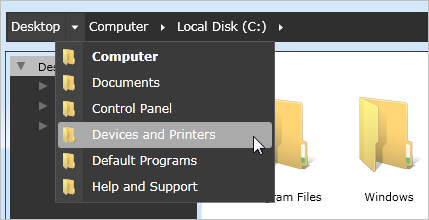
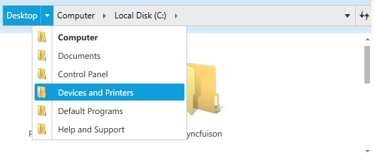

::: {style="DISPLAY: none"}
{#d2h_url_template}{#d2h_package_url style="WIDTH: 0px; DISPLAY: none; HEIGHT: 0px"}
:::

::: {.d2h_secondary_topic style="PADDING-BOTTOM: 10pt; MARGIN: 0pt; PADDING-LEFT: 0pt; PADDING-RIGHT: 0pt; PADDING-TOP: 0pt"}
##### Built-in skins {#built-in-skins style="tab-stops: 0pt"}

The Windows 7 theme is applied to the HierarchyNavigator control by default.

Add the following DLLs to apply the corresponding theme for Hierarchy Navigator control. SkinStorage class is used to apply a different visual style for a control, which is available in Syncfusion.Shared.WPF project.

1.   Create HierarchyNavigator instance either in XAML or code behind, as shown below.

[]{style="FONT-FAMILY: 'Trebuchet MS','sans-serif'; COLOR: #15428b; FONT-SIZE: 9pt"} 

+---------------------------------------------------------------------------------------------------------------------------------------------------------------------------------------------------------------------------------------------------------------------------------------------------------------------------------------------------------------------------------------------------------------------------------------------------------------------------------------+
| **[XAML]{style="FONT-FAMILY: Consolas; FONT-SIZE: 9.5pt"}**[]{style="FONT-FAMILY: Consolas; COLOR: blue"}                                                                                                                                                                                                                                                                                                                                                                             |
|                                                                                                                                                                                                                                                                                                                                                                                                                                                                                       |
| []{style="FONT-FAMILY: Consolas; COLOR: blue"}                                                                                                                                                                                                                                                                                                                                                                                                                                        |
|                                                                                                                                                                                                                                                                                                                                                                                                                                                                                       |
| [\<]{style="FONT-FAMILY: Consolas; COLOR: blue"}[syncfusion]{style="FONT-FAMILY: Consolas; COLOR: #a31515"}[:]{style="FONT-FAMILY: Consolas; COLOR: blue"}[HierarchyNavigator]{style="FONT-FAMILY: Consolas; COLOR: #a31515"}[ x]{style="FONT-FAMILY: Consolas; COLOR: red"}[:]{style="FONT-FAMILY: Consolas; COLOR: blue"}[Name]{style="FONT-FAMILY: Consolas; COLOR: red"}[=\"hierarchyNavigator\"/\>]{style="FONT-FAMILY: Consolas; COLOR: blue"}[]{style="FONT-FAMILY: Consolas"} |
+---------------------------------------------------------------------------------------------------------------------------------------------------------------------------------------------------------------------------------------------------------------------------------------------------------------------------------------------------------------------------------------------------------------------------------------------------------------------------------------+

 

Or

 

+------------------------------------------------------------------------------------------------------------------------------------------------------------------------------------------------------+
| **[C#]{style="FONT-FAMILY: Consolas; FONT-SIZE: 9.5pt"}**[]{style="FONT-FAMILY: Consolas; COLOR: #2b91af"}                                                                                           |
|                                                                                                                                                                                                      |
| []{style="FONT-FAMILY: Consolas; COLOR: #2b91af"}                                                                                                                                                    |
|                                                                                                                                                                                                      |
| [HierarchyNavigator]{style="FONT-FAMILY: Consolas; COLOR: #2b91af"}[ hierarchyNavigator = [new]{style="COLOR: blue"} [HierarchyNavigator]{style="COLOR: #2b91af"}();]{style="FONT-FAMILY: Consolas"} |
+------------------------------------------------------------------------------------------------------------------------------------------------------------------------------------------------------+

 

2.   Apply Visual Style as shown below in code behind by calling the static method in SkinStorage class in Syncfusion.Shared.WPF.

 

Window7

 

+-----------------------------------------------------------------------------------------------------------------------------------------------------------------------------------+
| **C#**[]{style="FONT-FAMILY: Consolas; COLOR: #2b91af"}                                                                                                                           |
|                                                                                                                                                                                   |
| []{style="FONT-FAMILY: Consolas; COLOR: #2b91af"}                                                                                                                                 |
|                                                                                                                                                                                   |
| [SkinStorage]{style="FONT-FAMILY: Consolas; COLOR: #2b91af"}[.SetVisualStyle([this]{style="COLOR: blue"}, [\"Default\"]{style="COLOR: #a31515"});]{style="FONT-FAMILY: Consolas"} |
+-----------------------------------------------------------------------------------------------------------------------------------------------------------------------------------+

 

{border="0"}

Figure 580: Windows7 Skin

 

Office2007Blue

 

+------------------------------------------------------------------------------------------------------------------------------------------------------------------------------------------+
| **C#**[]{style="FONT-FAMILY: Consolas; COLOR: #2b91af"}                                                                                                                                  |
|                                                                                                                                                                                          |
| []{style="FONT-FAMILY: Consolas; COLOR: #2b91af"}                                                                                                                                        |
|                                                                                                                                                                                          |
| [SkinStorage]{style="FONT-FAMILY: Consolas; COLOR: #2b91af"}[.SetVisualStyle([this]{style="COLOR: blue"}, [\"Office2007Blue\"]{style="COLOR: #a31515"});]{style="FONT-FAMILY: Consolas"} |
+------------------------------------------------------------------------------------------------------------------------------------------------------------------------------------------+

 

{border="0"}

 

Figure 581: Office2007Blue Skin

Office2007Black

 

+-------------------------------------------------------------------------------------------------------------------------------------------------------------------------------------------+
| **C#**[]{style="FONT-FAMILY: Consolas; COLOR: #2b91af"}                                                                                                                                   |
|                                                                                                                                                                                           |
| []{style="FONT-FAMILY: Consolas; COLOR: #2b91af"}                                                                                                                                         |
|                                                                                                                                                                                           |
| [SkinStorage]{style="FONT-FAMILY: Consolas; COLOR: #2b91af"}[.SetVisualStyle([this]{style="COLOR: blue"}, [\"Office2007Black\"]{style="COLOR: #a31515"});]{style="FONT-FAMILY: Consolas"} |
+-------------------------------------------------------------------------------------------------------------------------------------------------------------------------------------------+

 

{border="0"}

 

Figure 582: Office2007Black Skin

Office2007Silver

 

+--------------------------------------------------------------------------------------------------------------------------------------------------------------------------------------------+
| **C#**[]{style="FONT-FAMILY: Consolas; COLOR: #2b91af"}                                                                                                                                    |
|                                                                                                                                                                                            |
| []{style="FONT-FAMILY: Consolas; COLOR: #2b91af"}                                                                                                                                          |
|                                                                                                                                                                                            |
| [SkinStorage]{style="FONT-FAMILY: Consolas; COLOR: #2b91af"}[.SetVisualStyle([this]{style="COLOR: blue"}, [\"Office2007Silver\"]{style="COLOR: #a31515"});]{style="FONT-FAMILY: Consolas"} |
+--------------------------------------------------------------------------------------------------------------------------------------------------------------------------------------------+

 

{border="0"}

Figure 583: Office2007Silver Skin

 

Expression Blend

 

+---------------------------------------------------------------------------------------------------------------------------------------------------------------------------------+
| **C#**[]{style="FONT-FAMILY: Consolas; COLOR: #2b91af"}                                                                                                                         |
|                                                                                                                                                                                 |
| []{style="FONT-FAMILY: Consolas; COLOR: #2b91af"}                                                                                                                               |
|                                                                                                                                                                                 |
| [SkinStorage]{style="FONT-FAMILY: Consolas; COLOR: #2b91af"}[.SetVisualStyle([this]{style="COLOR: blue"}, [\"Blend\"]{style="COLOR: #a31515"});]{style="FONT-FAMILY: Consolas"} |
+---------------------------------------------------------------------------------------------------------------------------------------------------------------------------------+

 

{border="0"}

Figure 584: Expression Blend Skin

Metro Theme

 

+-------------------------------------------------------------------------------------------------------------------------------------------------------------------------------+
| **C#**[]{style="FONT-FAMILY: Consolas; COLOR: #2b91af"}                                                                                                                       |
|                                                                                                                                                                               |
| []{style="FONT-FAMILY: Consolas; COLOR: #2b91af"}                                                                                                                             |
|                                                                                                                                                                               |
| [SkinStorage]{style="FONT-FAMILY: Consolas; COLOR: #2b91af"}[.SetVisualStyle([this]{style="COLOR: blue"}, [Metro\"]{style="COLOR: #a31515"});]{style="FONT-FAMILY: Consolas"} |
+-------------------------------------------------------------------------------------------------------------------------------------------------------------------------------+

 

{border="0"}

Figure 585: Metro Skin

 

[]{#related-topics}
:::
