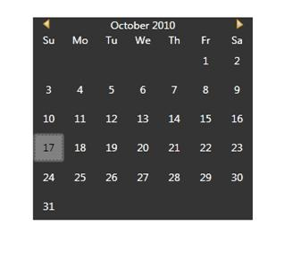

::: {style="DISPLAY: none"}
{#d2h_url_template}{#d2h_package_url style="WIDTH: 0px; DISPLAY: none; HEIGHT: 0px"}
:::

::::: {#nsbanner .d2h_main_nsbanner style="BORDER-BOTTOM: #999999 1px solid; POSITION: relative; PADDING-BOTTOM: 0px; BACKGROUND-COLOR: transparent; PADDING-LEFT: 0px; PADDING-RIGHT: 0px; DISPLAY: none; BORDER-TOP: #999999 1px solid; PADDING-TOP: 0px; LEFT: 0px"}
:::: {#TitleRow .d2h_main_titlerow style="PADDING-BOTTOM: 4px; BACKGROUND-COLOR: transparent; PADDING-LEFT: 22px; WIDTH: 100%; PADDING-RIGHT: 10px; DISPLAY: none; PADDING-TOP: 4px"}
::: {#ienav .d2h_main_ienav style="DISPLAY: none"}
{#D2HPrevious .D2HPreviousEnabled}  {#D2HNext .D2HNextEnabled}
:::
::::
:::::

::::: {#nstext .d2h_main_nstext style="PADDING-BOTTOM: 10px; BACKGROUND-COLOR: transparent; PADDING-LEFT: 22px; PADDING-RIGHT: 10px; HEIGHT: 100%; OVERFLOW: auto; PADDING-TOP: 5px" hasuserbackground="true" valign="bottom"}
::: {#d2h_breadcrumbs .d2h_breadcrumbs}
[Essential Studio User Guide Documentation](ms-xhelp:///?Id=12457748-09e3-4d74-a240-8e049cedf030){.d2h_breadcrumbsNormal}[ \> ]{.d2h_breadcrumbsLinkSeparator}[User Interface Edition](ms-xhelp:///?Id=c29296b7-531c-413b-a0ec-488ca1f7f669){.d2h_breadcrumbsNormal}[ \> ]{.d2h_breadcrumbsLinkSeparator}[Essential WPF](ms-xhelp:///?Id=7f4f82c5-151c-4262-94d0-75c4626c77bc){.d2h_breadcrumbsNormal}[ \> ]{.d2h_breadcrumbsLinkSeparator}[Essential Tools]{.d2h_breadcrumbsContentsOnly}[ \> ]{.d2h_breadcrumbsLinkSeparator}[Tools WPF Controls](ms-xhelp:///?Id=2ea58a12-9426-4a63-96b4-89eb80232c2c){.d2h_breadcrumbsNormal}[ \> ]{.d2h_breadcrumbsLinkSeparator}[Skin Manager](ms-xhelp:///?Id=ad2b7fcf-3aad-4d39-98a9-c256a6ce189a){.d2h_breadcrumbsNormal}
:::

### Built-In Skins {#built-in-skins style="tab-stops: 0pt"}

Skins can be applied to the control by setting the **VisualStyle** property defined in the Skin Storage class. Set the **VisualStyle** property to the corresponding theme. This property can be set either in XAML or in C#.

[]{style="FONT-FAMILY: 'Trebuchet MS','sans-serif'; COLOR: #15428b; FONT-SIZE: 9pt"} 

Table 77: Visual Style Property

::: {align="center"}
+-------------+--------------------------------------------------------+-------------------+-------------+--------------------------------------------------------------------------------------------------------------------------------------+
| Property    | Description                                            | Type              | Data Type   | Reference links                                                                                                                      |
+-------------+--------------------------------------------------------+-------------------+-------------+--------------------------------------------------------------------------------------------------------------------------------------+
| VisualStyle | Used to set Skins for the controls.                    | Attached Property | String      | [[[]{style="TEXT-DECORATION: none"}]{style="FONT-FAMILY: 'Trebuchet MS','sans-serif'; COLOR: #15428b; FONT-SIZE: 9pt"}]{.underline}  |
|             |                                                        |                   |             |                                                                                                                                      |
|             | The Built-In-Skins are as follows.                     |                   |             | [[Setting VisualStyle in XAML]{style="COLOR: windowtext; TEXT-DECORATION: none; text-underline: none"}](#SettingVisualStyleinXAML)   |
|             |                                                        |                   |             |                                                                                                                                      |
|             | [·      ]{style="FONT-FAMILY: Symbol"}Office2003       |                   |             |                                                                                                                                      |
|             |                                                        |                   |             |                                                                                                                                      |
|             | [·      ]{style="FONT-FAMILY: Symbol"}Office2007Blue   |                   |             | [[Setting VisualStyle in C#]{style="COLOR: windowtext; TEXT-DECORATION: none; text-underline: none"}](#SettingVisualStyleinC)        |
|             |                                                        |                   |             |                                                                                                                                      |
|             | [·      ]{style="FONT-FAMILY: Symbol"}Office2007Black  |                   |             | [[[]{style="TEXT-DECORATION: none"}]{style="FONT-FAMILY: 'Trebuchet MS','sans-serif'; COLOR: #15428b; FONT-SIZE: 9pt"}]{.underline}  |
|             |                                                        |                   |             |                                                                                                                                      |
|             | [·      ]{style="FONT-FAMILY: Symbol"}Office2007Silver |                   |             |                                                                                                                                      |
|             |                                                        |                   |             |                                                                                                                                      |
|             | [·      ]{style="FONT-FAMILY: Symbol"}ShinyRed         |                   |             |                                                                                                                                      |
|             |                                                        |                   |             |                                                                                                                                      |
|             | [·      ]{style="FONT-FAMILY: Symbol"}Blend            |                   |             |                                                                                                                                      |
|             |                                                        |                   |             |                                                                                                                                      |
|             | [·      ]{style="FONT-FAMILY: Symbol"}ShinyBlue        |                   |             |                                                                                                                                      |
|             |                                                        |                   |             |                                                                                                                                      |
|             | [·      ]{style="FONT-FAMILY: Symbol"}SyncOrange       |                   |             |                                                                                                                                      |
|             |                                                        |                   |             |                                                                                                                                      |
|             | [·      ]{style="FONT-FAMILY: Symbol"}VS2010           |                   |             |                                                                                                                                      |
|             |                                                        |                   |             |                                                                                                                                      |
|             | [·      ]{style="FONT-FAMILY: Symbol"}Office2010Blue   |                   |             |                                                                                                                                      |
|             |                                                        |                   |             |                                                                                                                                      |
|             | [·      ]{style="FONT-FAMILY: Symbol"}Office2010Black  |                   |             |                                                                                                                                      |
|             |                                                        |                   |             |                                                                                                                                      |
|             | [·      ]{style="FONT-FAMILY: Symbol"}Office2010Silver |                   |             |                                                                                                                                      |
|             |                                                        |                   |             |                                                                                                                                      |
|             | [·      ]{style="FONT-FAMILY: Symbol"}Metro            |                   |             |                                                                                                                                      |
+-------------+--------------------------------------------------------+-------------------+-------------+--------------------------------------------------------------------------------------------------------------------------------------+
:::

 

[[Setting VisualStyle in XAML]{style="FONT-FAMILY: 'Trebuchet MS','sans-serif'; COLOR: #15428b; FONT-SIZE: 9pt"}]{#SettingVisualStyleinXAML}[]{style="FONT-FAMILY: 'Trebuchet MS','sans-serif'; COLOR: #15428b; FONT-SIZE: 9pt"}

The following code snippet explains how to set the **VisualStyle** property in XAML.

[]{style="FONT-FAMILY: 'Trebuchet MS','sans-serif'; COLOR: #15428b; FONT-SIZE: 9pt"} 

1.   Add the following namespace in the sample.

+------------------------------------------------------------------------------------------------------------------------------------------------------------------------------------------------------------------------------------------------------------------+
| **[\[XAML\]]{style="FONT-FAMILY: 'Courier New'; COLOR: black"}**                                                                                                                                                                                                 |
|                                                                                                                                                                                                                                                                  |
| [xmlns]{style="FONT-FAMILY: 'Courier New'; COLOR: red"}[:]{style="FONT-FAMILY: 'Courier New'; COLOR: blue"}[syncfusion]{style="FONT-FAMILY: 'Courier New'; COLOR: red"}[=\"http://schemas.syncfusion.com/wpf\"]{style="FONT-FAMILY: 'Courier New'; COLOR: blue"} |
|                                                                                                                                                                                                                                                                  |
| []{style="FONT-FAMILY: 'Courier New'"}                                                                                                                                                                                                                           |
+------------------------------------------------------------------------------------------------------------------------------------------------------------------------------------------------------------------------------------------------------------------+

[]{style="FONT-FAMILY: 'Trebuchet MS','sans-serif'; COLOR: #15428b; FONT-SIZE: 9pt"} 

2.   Set the **VisualStyle** property for the control as shown below.

+------------------------------------------------------------------------------------------------------------------------------------------------------------------------------------------------------------------------------------------------------------------------------------------------------------------------------------------------------------------------------------------------------------------------------------------------------------------------------------------------------------------------------------------------------------------------------------------------------------------------------------------------------------------------------------------------------------------------------------------------------------------------------------------------------------+
| **[\[XAML\]]{style="FONT-FAMILY: 'Courier New'; COLOR: black"}**                                                                                                                                                                                                                                                                                                                                                                                                                                                                                                                                                                                                                                                                                                                                           |
|                                                                                                                                                                                                                                                                                                                                                                                                                                                                                                                                                                                                                                                                                                                                                                                                            |
| [\<]{style="FONT-FAMILY: 'Courier New'; COLOR: blue"}[syncfusion]{style="FONT-FAMILY: 'Courier New'; COLOR: #a31515"}[:]{style="FONT-FAMILY: 'Courier New'; COLOR: blue"}[CalendarEdit]{style="FONT-FAMILY: 'Courier New'; COLOR: #a31515"}[ syncfusion]{style="FONT-FAMILY: 'Courier New'; COLOR: red"}[:]{style="FONT-FAMILY: 'Courier New'; COLOR: blue"}[SkinStorage.VisualStyle]{style="FONT-FAMILY: 'Courier New'; COLOR: red"}[=\"Blend\"\>\</]{style="FONT-FAMILY: 'Courier New'; COLOR: blue"}[syncfusion]{style="FONT-FAMILY: 'Courier New'; COLOR: #a31515"}[:]{style="FONT-FAMILY: 'Courier New'; COLOR: blue"}[CalendarEdit]{style="FONT-FAMILY: 'Courier New'; COLOR: #a31515"}[\>]{style="FONT-FAMILY: 'Courier New'; COLOR: blue"}[  ]{style="FONT-FAMILY: 'Courier New'; COLOR: #a31515"} |
+------------------------------------------------------------------------------------------------------------------------------------------------------------------------------------------------------------------------------------------------------------------------------------------------------------------------------------------------------------------------------------------------------------------------------------------------------------------------------------------------------------------------------------------------------------------------------------------------------------------------------------------------------------------------------------------------------------------------------------------------------------------------------------------------------------+

 

[]{#SettingVisualStyleinC}[Setting VisualStyle in C#]{#_Ref274527204}

You can also set the **VisualStyle** property in C# using **SetVisualStyle**.

The following code snippet explains how to set the **VisualStyle** property in C#.

[]{style="FONT-FAMILY: 'Trebuchet MS','sans-serif'; COLOR: #15428b; FONT-SIZE: 9pt"} 

1.   Name the control using the **Name** attribute.

[]{style="FONT-FAMILY: 'Trebuchet MS','sans-serif'; COLOR: #15428b; FONT-SIZE: 9pt"} 

+---------------------------------------------------------------------------------------------------------------------------------------------------------------------------------------------------------------------------------------------------------------------------------------------------------------------------------------------------------------------------------------------------------------------------------------------------------------------------------------------------------------------------------------------------------------------------------------------------------------------------------------------------------------------------+
| [\[XAML\]]{style="FONT-FAMILY: 'Courier New'; COLOR: black"}                                                                                                                                                                                                                                                                                                                                                                                                                                                                                                                                                                                                              |
|                                                                                                                                                                                                                                                                                                                                                                                                                                                                                                                                                                                                                                                                           |
| [\<]{style="FONT-FAMILY: 'Courier New'; COLOR: blue"}[syncfusion]{style="FONT-FAMILY: 'Courier New'; COLOR: #a31515"}[:]{style="FONT-FAMILY: 'Courier New'; COLOR: blue"}[CalendarEdit]{style="FONT-FAMILY: 'Courier New'; COLOR: #a31515"}[ Name]{style="FONT-FAMILY: 'Courier New'; COLOR: red"}[=\"calendar\"\>\</]{style="FONT-FAMILY: 'Courier New'; COLOR: blue"}[syncfusion]{style="FONT-FAMILY: 'Courier New'; COLOR: #a31515"}[:]{style="FONT-FAMILY: 'Courier New'; COLOR: blue"}[CalendarEdit]{style="FONT-FAMILY: 'Courier New'; COLOR: #a31515"}[\>]{style="FONT-FAMILY: 'Courier New'; COLOR: blue"}[ ]{style="FONT-FAMILY: 'Courier New'; COLOR: #a31515"} |
+---------------------------------------------------------------------------------------------------------------------------------------------------------------------------------------------------------------------------------------------------------------------------------------------------------------------------------------------------------------------------------------------------------------------------------------------------------------------------------------------------------------------------------------------------------------------------------------------------------------------------------------------------------------------------+

[]{style="COLOR: blue; FONT-SIZE: 9pt"} 

2.   Add the following line in code behind file.

[]{style="FONT-FAMILY: 'Trebuchet MS','sans-serif'; COLOR: #15428b; FONT-SIZE: 9pt"} 

+------------------------------------------------------------------------------------------------------------------------------------------------------------------------+
| [\[C#\]]{style="FONT-FAMILY: 'Courier New'"}                                                                                                                           |
|                                                                                                                                                                        |
| [SkinStorage]{style="FONT-FAMILY: 'Courier New'; COLOR: #2b91af"}[.SetVisualStyle(calendar, [\"Blend\"]{style="COLOR: #a31515"});]{style="FONT-FAMILY: 'Courier New'"} |
+------------------------------------------------------------------------------------------------------------------------------------------------------------------------+

**[]{style="COLOR: #4e84c4; FONT-SIZE: 16pt"}** 

The output is displayed as shown below.

{border="0"}

Figure 950 : Calendar with Blend Style

**[]{style="FONT-FAMILY: 'Trebuchet MS','sans-serif'; COLOR: #15428b; FONT-SIZE: 9pt"}** 

[]{#related-topics}
:::::
