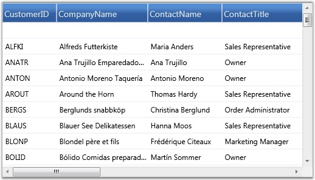
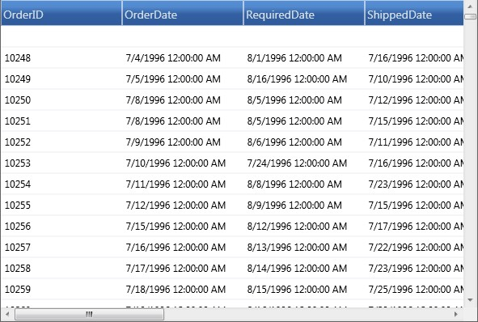

::: {style="DISPLAY: none"}
{#d2h_url_template}{#d2h_package_url style="WIDTH: 0px; DISPLAY: none; HEIGHT: 0px"}
:::

::: {.d2h_secondary_topic style="PADDING-BOTTOM: 10pt; MARGIN: 0pt; PADDING-LEFT: 0pt; PADDING-RIGHT: 0pt; PADDING-TOP: 0pt"}
#### Business Objects {#business-objects style="tab-stops: 0pt"}

[]{style="FONT-FAMILY: 'Trebuchet MS','sans-serif'; COLOR: #15428b; FONT-SIZE: 9pt"} 

The grid can be bound to user-defined collections that let you store arbitrary objects in a structured fashion.  The data binding is based on a set of interfaces that differ in the context of accessing and navigating through data and of course manipulating the data. These interfaces set up a two-way communication between the bound grid and the objects collection used by the same grid. Such object collections are called as *custom business collections*.

 

The data binding interfaces will allow you to create collection of custom objects where you want to present those collection of objects together, through the grid. You can also navigate through the objects to view them through the same grid and interact with them. Some of these interfaces are IList, IBindingList, and so on. For ease of use, .NET provides built-in, ready-to-use collection classes that internally implements these collection interfaces.

 

Some of the collection classes are as follows:

[]{style="FONT-FAMILY: 'Trebuchet MS','sans-serif'; COLOR: #15428b; FONT-SIZE: 9pt"} 

[·      ]{style="FONT-FAMILY: Symbol"}List that implements IList

[·      ]{style="FONT-FAMILY: Symbol"}BindingList that implements IBindingList

[·      ]{style="FONT-FAMILY: Symbol"}ObservableCollection.

[]{style="FONT-FAMILY: 'Trebuchet MS','sans-serif'; COLOR: #15428b; FONT-SIZE: 9pt"} 

Of the above classes, the **ObservableCollection** is widely preferred as it is more user-friendly to use in a WPF application, and can be easily created using XAML. 

 

Let us see an example usage of this collection class with our Grid Data control.

 

Example

**[]{style="FONT-FAMILY: 'Trebuchet MS','sans-serif'; COLOR: #15428b; FONT-SIZE: 9pt"}** 

Defining Observable Collection

**[]{style="FONT-FAMILY: 'Trebuchet MS','sans-serif'; COLOR: #15428b; FONT-SIZE: 9pt"}** 

+-------------------------------------------------------------------------------------------------------------------------------------------------------------------------------------------------------------------------------------------------------------------+
| **[\[C#\]]{style="FONT-FAMILY: 'Courier New'; COLOR: black"}**                                                                                                                                                                                                    |
|                                                                                                                                                                                                                                                                   |
| **[]{style="FONT-FAMILY: 'Courier New'; COLOR: black"}**                                                                                                                                                                                                          |
|                                                                                                                                                                                                                                                                   |
| [public]{style="FONT-FAMILY: 'Courier New'; COLOR: blue"}[ [class]{style="COLOR: blue"} Customer : ObservableCollection\<Customers\>]{style="FONT-FAMILY: 'Courier New'"}                                                                                         |
|                                                                                                                                                                                                                                                                   |
| [{        ]{style="FONT-FAMILY: 'Courier New'"}                                                                                                                                                                                                                   |
|                                                                                                                                                                                                                                                                   |
| [Northwind northWind;        ]{style="FONT-FAMILY: 'Courier New'"}                                                                                                                                                                                                |
|                                                                                                                                                                                                                                                                   |
| [public]{style="FONT-FAMILY: 'Courier New'; COLOR: blue"}[ Customer()        ]{style="FONT-FAMILY: 'Courier New'"}                                                                                                                                                |
|                                                                                                                                                                                                                                                                   |
| [{            ]{style="FONT-FAMILY: 'Courier New'"}                                                                                                                                                                                                               |
|                                                                                                                                                                                                                                                                   |
| [string]{style="FONT-FAMILY: 'Courier New'; COLOR: blue"}[ connectionString = [string]{style="COLOR: blue"}.Format([@\"Data Source = {0}\"]{style="COLOR: #a31515"}, [Northwind.sdf\"]{style="COLOR: #a31515"});            ]{style="FONT-FAMILY: 'Courier New'"} |
|                                                                                                                                                                                                                                                                   |
| [northWind = [new]{style="COLOR: blue"} Northwind(connectionString);            ]{style="FONT-FAMILY: 'Courier New'"}                                                                                                                                             |
|                                                                                                                                                                                                                                                                   |
| [var customer = northWind.Customers.Skip(0).Take(100).ToList();            ]{style="FONT-FAMILY: 'Courier New'"}                                                                                                                                                  |
|                                                                                                                                                                                                                                                                   |
| [foreach]{style="FONT-FAMILY: 'Courier New'; COLOR: blue"}[ (var o [in]{style="COLOR: blue"} customer)            ]{style="FONT-FAMILY: 'Courier New'"}                                                                                                           |
|                                                                                                                                                                                                                                                                   |
| [{                ]{style="FONT-FAMILY: 'Courier New'"}                                                                                                                                                                                                           |
|                                                                                                                                                                                                                                                                   |
| [this]{style="FONT-FAMILY: 'Courier New'; COLOR: blue"}[.Add(o);            ]{style="FONT-FAMILY: 'Courier New'"}                                                                                                                                                 |
|                                                                                                                                                                                                                                                                   |
| [}        ]{style="FONT-FAMILY: 'Courier New'"}                                                                                                                                                                                                                   |
|                                                                                                                                                                                                                                                                   |
| [}    ]{style="FONT-FAMILY: 'Courier New'"}                                                                                                                                                                                                                       |
|                                                                                                                                                                                                                                                                   |
| [}]{style="FONT-FAMILY: 'Courier New'"}                                                                                                                                                                                                                           |
+-------------------------------------------------------------------------------------------------------------------------------------------------------------------------------------------------------------------------------------------------------------------+

[]{style="FONT-FAMILY: 'Trebuchet MS','sans-serif'; COLOR: #15428b; FONT-SIZE: 9pt"} 

Binding the Above Collection to GDC

**[]{style="FONT-FAMILY: 'Trebuchet MS','sans-serif'; COLOR: #15428b; FONT-SIZE: 9pt"}** 

+----------------------------------------------------------------------------------------------------------------------------------------------------------------------------------------------------------------------------------------------------------------------------------------------------------------------------------------------------------------------------------------------------------------------------------------------------------------------------------------------------------+
| **[\[XAML\]]{style="FONT-FAMILY: 'Courier New'; COLOR: black"}**                                                                                                                                                                                                                                                                                                                                                                                                                                         |
|                                                                                                                                                                                                                                                                                                                                                                                                                                                                                                          |
| **[]{style="FONT-FAMILY: 'Courier New'; COLOR: black"}**                                                                                                                                                                                                                                                                                                                                                                                                                                                 |
|                                                                                                                                                                                                                                                                                                                                                                                                                                                                                                          |
| [\<]{style="FONT-FAMILY: 'Courier New'; COLOR: blue"}[Window.Resources]{style="FONT-FAMILY: 'Courier New'; COLOR: #a31515"}[\>]{style="FONT-FAMILY: 'Courier New'; COLOR: blue"}[        ]{style="FONT-FAMILY: 'Courier New'"}                                                                                                                                                                                                                                                                           |
|                                                                                                                                                                                                                                                                                                                                                                                                                                                                                                          |
| [\<]{style="FONT-FAMILY: 'Courier New'; COLOR: blue"}[ObjectDataProvider]{style="FONT-FAMILY: 'Courier New'; COLOR: #a31515"}[ [x:Key]{style="COLOR: red"}[=\"customer\"]{style="COLOR: blue"} [ObjectType]{style="COLOR: red"}[=\"{x:Type local:Customer}\"]{style="COLOR: blue"} [/\>]{style="COLOR: blue"}]{style="FONT-FAMILY: 'Courier New'"}                                                                                                                                                       |
|                                                                                                                                                                                                                                                                                                                                                                                                                                                                                                          |
| [\</]{style="FONT-FAMILY: 'Courier New'; COLOR: blue"}[Window.Resources]{style="FONT-FAMILY: 'Courier New'; COLOR: #a31515"}[\>]{style="FONT-FAMILY: 'Courier New'; COLOR: blue"}                                                                                                                                                                                                                                                                                                                        |
|                                                                                                                                                                                                                                                                                                                                                                                                                                                                                                          |
| []{style="FONT-FAMILY: 'Courier New'; COLOR: blue"}                                                                                                                                                                                                                                                                                                                                                                                                                                                      |
|                                                                                                                                                                                                                                                                                                                                                                                                                                                                                                          |
| [\<]{style="FONT-FAMILY: 'Courier New'; COLOR: blue"}[syncfusion:GridDataControl]{style="FONT-FAMILY: 'Courier New'; COLOR: #a31515"}[ [x:Name]{style="COLOR: red"}[=\"grid\"]{style="COLOR: blue"}  [AutoPopulateColumns]{style="COLOR: red"}[=\"True\"]{style="COLOR: blue"}    [AutoPopulateRelations]{style="COLOR: red"}[=\"False\"]{style="COLOR: blue"} [ItemsSource]{style="COLOR: red"}[=\"{StaticResource customer}\"\>]{style="COLOR: blue"}            ]{style="FONT-FAMILY: 'Courier New'"} |
|                                                                                                                                                                                                                                                                                                                                                                                                                                                                                                          |
| [\</]{style="FONT-FAMILY: 'Courier New'; COLOR: blue"}[syncfusion:GridDataControl]{style="FONT-FAMILY: 'Courier New'; COLOR: #a31515"}[\>]{style="FONT-FAMILY: 'Courier New'; COLOR: blue"}                                                                                                                                                                                                                                                                                                              |
+----------------------------------------------------------------------------------------------------------------------------------------------------------------------------------------------------------------------------------------------------------------------------------------------------------------------------------------------------------------------------------------------------------------------------------------------------------------------------------------------------------+

[]{style="FONT-FAMILY: 'Trebuchet MS','sans-serif'; COLOR: #15428b; FONT-SIZE: 9pt"} 

The following image shows a Grid bound with an Observable collection.

[]{style="FONT-FAMILY: 'Trebuchet MS','sans-serif'; COLOR: #15428b; FONT-SIZE: 9pt"} 

{border="0"}

***[]{style="FONT-FAMILY: 'Trebuchet MS','sans-serif'; COLOR: #15428b; FONT-SIZE: 9pt"}*** 

Figure 98: GDC bound to the ObservableCollection

***[]{style="FONT-FAMILY: 'Trebuchet MS','sans-serif'; COLOR: #15428b; FONT-SIZE: 9pt"}*** 

The GDC is bound with a data source provided by Observable Collection.

[]{style="FONT-FAMILY: 'Trebuchet MS','sans-serif'; COLOR: #15428b; FONT-SIZE: 9pt"} 

Collection View Source

**[]{style="FONT-FAMILY: 'Trebuchet MS','sans-serif'; COLOR: #15428b; FONT-SIZE: 9pt"}** 

The CollectionViewSource\[CVS\] serves as a wrapper for the custom collections. It acts as a filter between the source collection (ObservableCollection or List or BindingList) and the grid. Once your grid is bound to CollectionViewSource-driven source list, the CVS will manage all the data related operations such as grouping, sorting, filtering and so on. This relieves you of writing custom code for these operations. CVS does this by internally implementing the **ICollectionView** interface that understands the source type and manages the data operations. It also implements INotifyCollectionChanged interface. This means that if CVS is linked to a source collection (ObservableCollection), then all the updates to the source list will be transmitted to the grid.

[]{style="FONT-FAMILY: 'Trebuchet MS','sans-serif'; COLOR: #15428b; FONT-SIZE: 9pt"} 

Example

[]{style="FONT-FAMILY: 'Trebuchet MS','sans-serif'; COLOR: #15428b; FONT-SIZE: 9pt"} 

Let us see an example usage of this Collection View Source with our GDC.

[]{style="FONT-FAMILY: 'Trebuchet MS','sans-serif'; COLOR: #15428b; FONT-SIZE: 9pt"} 

+----------------------------------------------------------------------------------------------------------------------------------------------------------------------------------------------------------------------------------------------------------------------------------------------------------------------------------------------------------------------------------------------------------------------------------------------------------------------------------------------------------------+
| **[\[XAML\]]{style="FONT-FAMILY: 'Courier New'; COLOR: black"}**                                                                                                                                                                                                                                                                                                                                                                                                                                               |
|                                                                                                                                                                                                                                                                                                                                                                                                                                                                                                                |
| []{style="FONT-FAMILY: 'Courier New'; COLOR: blue"}                                                                                                                                                                                                                                                                                                                                                                                                                                                            |
|                                                                                                                                                                                                                                                                                                                                                                                                                                                                                                                |
| [\<]{style="FONT-FAMILY: 'Courier New'; COLOR: blue"}[Window.Resources]{style="FONT-FAMILY: 'Courier New'; COLOR: #a31515"}[\>]{style="FONT-FAMILY: 'Courier New'; COLOR: blue"}[        ]{style="FONT-FAMILY: 'Courier New'"}                                                                                                                                                                                                                                                                                 |
|                                                                                                                                                                                                                                                                                                                                                                                                                                                                                                                |
| [\<]{style="FONT-FAMILY: 'Courier New'; COLOR: blue"}[ObjectDataProvider]{style="FONT-FAMILY: 'Courier New'; COLOR: #a31515"}[ [x:Key]{style="COLOR: red"}[=\"customer\"]{style="COLOR: blue"} [ObjectType]{style="COLOR: red"}[=\"{x:Type local:Customer}\"]{style="COLOR: blue"} [/\>]{style="COLOR: blue"}        ]{style="FONT-FAMILY: 'Courier New'"}                                                                                                                                                     |
|                                                                                                                                                                                                                                                                                                                                                                                                                                                                                                                |
| [\<]{style="FONT-FAMILY: 'Courier New'; COLOR: blue"}[CollectionViewSource]{style="FONT-FAMILY: 'Courier New'; COLOR: #a31515"}[ [x:Key]{style="COLOR: red"}[=\"customerSource\"]{style="COLOR: blue"} [Source]{style="COLOR: red"}[=\"{StaticResource customer}\"]{style="COLOR: blue"} [\>]{style="COLOR: blue"}        ]{style="FONT-FAMILY: 'Courier New'"}                                                                                                                                                |
|                                                                                                                                                                                                                                                                                                                                                                                                                                                                                                                |
| [\</]{style="FONT-FAMILY: 'Courier New'; COLOR: blue"}[CollectionViewSource]{style="FONT-FAMILY: 'Courier New'; COLOR: #a31515"}[\>]{style="FONT-FAMILY: 'Courier New'; COLOR: blue"}[    ]{style="FONT-FAMILY: 'Courier New'"}                                                                                                                                                                                                                                                                                |
|                                                                                                                                                                                                                                                                                                                                                                                                                                                                                                                |
| [\</]{style="FONT-FAMILY: 'Courier New'; COLOR: blue"}[Window.Resources]{style="FONT-FAMILY: 'Courier New'; COLOR: #a31515"}[\>]{style="FONT-FAMILY: 'Courier New'; COLOR: blue"}                                                                                                                                                                                                                                                                                                                              |
|                                                                                                                                                                                                                                                                                                                                                                                                                                                                                                                |
| []{style="FONT-FAMILY: 'Courier New'; COLOR: blue"}                                                                                                                                                                                                                                                                                                                                                                                                                                                            |
|                                                                                                                                                                                                                                                                                                                                                                                                                                                                                                                |
| [\<]{style="FONT-FAMILY: 'Courier New'; COLOR: blue"}[syncfusion:GridDataControl]{style="FONT-FAMILY: 'Courier New'; COLOR: #a31515"}[ [x:Name]{style="COLOR: red"}[=\"grid\"]{style="COLOR: blue"}  [AutoPopulateColumns]{style="COLOR: red"}[=\"True\"]{style="COLOR: blue"}    [AutoPopulateRelations]{style="COLOR: red"}[=\"False\"]{style="COLOR: blue"} [ItemsSource]{style="COLOR: red"}[=\"{StaticResource customerSource}\"\>]{style="COLOR: blue"}            ]{style="FONT-FAMILY: 'Courier New'"} |
|                                                                                                                                                                                                                                                                                                                                                                                                                                                                                                                |
| [\</]{style="FONT-FAMILY: 'Courier New'; COLOR: blue"}[syncfusion:GridDataControl]{style="FONT-FAMILY: 'Courier New'; COLOR: #a31515"}[\>]{style="FONT-FAMILY: 'Courier New'; COLOR: blue"}                                                                                                                                                                                                                                                                                                                    |
+----------------------------------------------------------------------------------------------------------------------------------------------------------------------------------------------------------------------------------------------------------------------------------------------------------------------------------------------------------------------------------------------------------------------------------------------------------------------------------------------------------------+

[]{style="FONT-FAMILY: 'Trebuchet MS','sans-serif'; COLOR: #15428b; FONT-SIZE: 9pt"} 

Defining the Source Collection

**[]{style="FONT-FAMILY: 'Trebuchet MS','sans-serif'; COLOR: #15428b; FONT-SIZE: 9pt"}** 

+---------------------------------------------------------------------------------------------------------------------------------------------------------------------------------------------------------------------------------------------------------------------+
| **[\[C#\]]{style="FONT-FAMILY: 'Courier New'; COLOR: black"}**                                                                                                                                                                                                      |
|                                                                                                                                                                                                                                                                     |
| []{style="FONT-FAMILY: 'Courier New'; COLOR: blue"}                                                                                                                                                                                                                 |
|                                                                                                                                                                                                                                                                     |
| [public]{style="FONT-FAMILY: 'Courier New'; COLOR: blue"}[ [class]{style="COLOR: blue"} Customer : ObservableCollection\<Customers\>    ]{style="FONT-FAMILY: 'Courier New'"}                                                                                       |
|                                                                                                                                                                                                                                                                     |
| [{        ]{style="FONT-FAMILY: 'Courier New'"}                                                                                                                                                                                                                     |
|                                                                                                                                                                                                                                                                     |
| [Northwind northWind;        ]{style="FONT-FAMILY: 'Courier New'"}                                                                                                                                                                                                  |
|                                                                                                                                                                                                                                                                     |
| [public]{style="FONT-FAMILY: 'Courier New'; COLOR: blue"}[ Customer()        ]{style="FONT-FAMILY: 'Courier New'"}                                                                                                                                                  |
|                                                                                                                                                                                                                                                                     |
| [{            ]{style="FONT-FAMILY: 'Courier New'"}                                                                                                                                                                                                                 |
|                                                                                                                                                                                                                                                                     |
| [string]{style="FONT-FAMILY: 'Courier New'; COLOR: blue"}[ connectionString = [string]{style="COLOR: blue"}.Format([@\"Data Source = {0}\"]{style="COLOR: #a31515"}, [\"Northwind.sdf\"]{style="COLOR: #a31515"});            ]{style="FONT-FAMILY: 'Courier New'"} |
|                                                                                                                                                                                                                                                                     |
| [northWind = [new]{style="COLOR: blue"} Northwind(connectionString);            ]{style="FONT-FAMILY: 'Courier New'"}                                                                                                                                               |
|                                                                                                                                                                                                                                                                     |
| [var customer = northWind.Customers.Skip(0).Take(100).ToList();            ]{style="FONT-FAMILY: 'Courier New'"}                                                                                                                                                    |
|                                                                                                                                                                                                                                                                     |
| [foreach]{style="FONT-FAMILY: 'Courier New'; COLOR: blue"}[ (var o [in]{style="COLOR: blue"} customer)            ]{style="FONT-FAMILY: 'Courier New'"}                                                                                                             |
|                                                                                                                                                                                                                                                                     |
| [{                ]{style="FONT-FAMILY: 'Courier New'"}                                                                                                                                                                                                             |
|                                                                                                                                                                                                                                                                     |
| [this]{style="FONT-FAMILY: 'Courier New'; COLOR: blue"}[.Add(o);            ]{style="FONT-FAMILY: 'Courier New'"}                                                                                                                                                   |
|                                                                                                                                                                                                                                                                     |
| [}        ]{style="FONT-FAMILY: 'Courier New'"}                                                                                                                                                                                                                     |
|                                                                                                                                                                                                                                                                     |
| [}    ]{style="FONT-FAMILY: 'Courier New'"}                                                                                                                                                                                                                         |
|                                                                                                                                                                                                                                                                     |
| [}]{style="FONT-FAMILY: 'Courier New'"}                                                                                                                                                                                                                             |
+---------------------------------------------------------------------------------------------------------------------------------------------------------------------------------------------------------------------------------------------------------------------+

[]{style="FONT-FAMILY: 'Trebuchet MS','sans-serif'; COLOR: #15428b; FONT-SIZE: 9pt"} 

The following image shows the output of the above given code:

[]{style="FONT-FAMILY: 'Trebuchet MS','sans-serif'; COLOR: #15428b; FONT-SIZE: 9pt"} 

{border="0"}

[]{style="FONT-FAMILY: 'Trebuchet MS','sans-serif'; COLOR: #15428b; FONT-SIZE: 9pt"} 

Figure 99: Collection View Source with GDC

***[]{style="FONT-FAMILY: 'Trebuchet MS','sans-serif'; COLOR: #15428b; FONT-SIZE: 9pt"}*** 

The GDC is bound with a data source provided by Collection View Source.

[]{style="FONT-FAMILY: 'Trebuchet MS','sans-serif'; COLOR: #15428b; FONT-SIZE: 9pt"} 

Entity Collection

[]{style="FONT-FAMILY: 'Trebuchet MS','sans-serif'; COLOR: #15428b; FONT-SIZE: 9pt"} 

GridDataControl confirms that it is an EntityFramework-aware control by providing support to EF-driven data sources. The EF model offers several architectural benefits that can be experienced in the networking applications.

 

To bind your grid to an EF-driven data source, use the below code.

[]{style="FONT-FAMILY: 'Trebuchet MS','sans-serif'; COLOR: #15428b; FONT-SIZE: 9pt"} 

+------------------------------------------------------------------------------------------------------------------------------------------------------------------------------------------------------------------------------------------------------------------------------------------------------------------------+
| **[\[C#\]]{style="FONT-FAMILY: 'Courier New'; COLOR: black"}**                                                                                                                                                                                                                                                         |
|                                                                                                                                                                                                                                                                                                                        |
| []{style="FONT-FAMILY: 'Courier New'; COLOR: black"}                                                                                                                                                                                                                                                                   |
|                                                                                                                                                                                                                                                                                                                        |
| [string]{style="FONT-FAMILY: 'Courier New'; COLOR: blue"}[ connectionString = [string]{style="COLOR: blue"}.Format([@\"Data Source = {0}\"]{style="COLOR: #a31515"}, [LayoutControl]{style="COLOR: teal"}.FindFile([\"NorthwindGrid.sdf\"]{style="COLOR: #a31515"}));            ]{style="FONT-FAMILY: 'Courier New'"} |
|                                                                                                                                                                                                                                                                                                                        |
| [EntityConnectionStringBuilder entityBuilder = [new]{style="COLOR: blue"} EntityConnectionStringBuilder();            ]{style="FONT-FAMILY: 'Courier New'"}                                                                                                                                                            |
|                                                                                                                                                                                                                                                                                                                        |
| [entityBuilder.Metadata = [\"res://\*/NorthWind.csdl\|res://\*/NorthWind.ssdl\|res://\*/NorthWind.msl\"]{style="COLOR: #a31515"};            ]{style="FONT-FAMILY: 'Courier New'"}                                                                                                                                     |
|                                                                                                                                                                                                                                                                                                                        |
| [entityBuilder.Provider = [\"System.Data.SqlServerCe.3.5\"]{style="COLOR: #a31515"};            ]{style="FONT-FAMILY: 'Courier New'"}                                                                                                                                                                                  |
|                                                                                                                                                                                                                                                                                                                        |
| [entityBuilder.ProviderConnectionString = connectionString;]{style="FONT-FAMILY: 'Courier New'"}                                                                                                                                                                                                                       |
|                                                                                                                                                                                                                                                                                                                        |
| [NorthWind]{style="FONT-FAMILY: 'Courier New'; COLOR: teal"}[ northwind = [new]{style="COLOR: blue"} [NorthWind]{style="COLOR: teal"}(entityBuilder.ToString());            ]{style="FONT-FAMILY: 'Courier New'"}                                                                                                      |
|                                                                                                                                                                                                                                                                                                                        |
| [this]{style="FONT-FAMILY: 'Courier New'; COLOR: blue"}[.gridDataControl1.ItemsSource = northwind.Orders;]{style="FONT-FAMILY: 'Courier New'"}                                                                                                                                                                         |
+------------------------------------------------------------------------------------------------------------------------------------------------------------------------------------------------------------------------------------------------------------------------------------------------------------------------+

[]{style="FONT-FAMILY: 'Trebuchet MS','sans-serif'; COLOR: #15428b; FONT-SIZE: 9pt"} 

{border="0"}

[]{style="FONT-FAMILY: 'Trebuchet MS','sans-serif'; COLOR: #15428b; FONT-SIZE: 9pt"} 

Figure 100: Grid Control bound to an EntityFramework-driven Data Source

[]{#p232} 

 

[]{#related-topics}
:::
