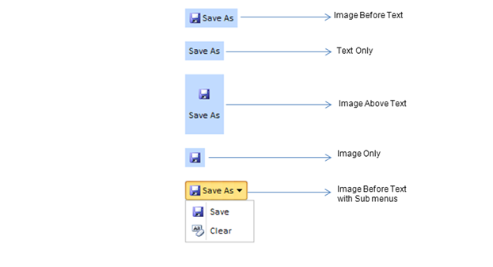

::: {style="DISPLAY: none"}
{#d2h_url_template}{#d2h_package_url style="WIDTH: 0px; DISPLAY: none; HEIGHT: 0px"}
:::

::::: {.d2h_secondary_topic style="PADDING-BOTTOM: 10pt; MARGIN: 0pt; PADDING-LEFT: 0pt; PADDING-RIGHT: 0pt; PADDING-TOP: 0pt"}
#### Button {#button style="tab-stops: 0pt"}

The Button Advanced control is fully customizable and gives your pages a sleek look.

**Features**

[·      ]{style="FONT-FAMILY: Symbol"}Custom Styles:   The  look and feel of the button control can be customized and enhanced using .CSS styles

[·      ]{style="FONT-FAMILY: Symbol"}Supports both server-side, and client-side events.

[·      ]{style="FONT-FAMILY: Symbol"}You have four different types of buttons to perfect the customization.

[·      ]{style="FONT-FAMILY: Symbol"}Menu Items: rendering with sub-menus is supported.

Use Case Scenarios

The Button Advanced control can be easily styled by using the CustomStyle property, to enhance the way the control appears.

Appearance and Structure of the control

This is how the Button Advanced control looks:

{border="0"}

Figure 152: Button

 

The Button Advanced Control follows one of the two structures-

[·      ]{style="FONT-FAMILY: Symbol"}Image or Text, or

[·      ]{style="FONT-FAMILY: Symbol"}Image and Text

The four different types of button advanced control spawned from the two structures are -

1.  Image Before Text

2.  Image Only

3.  Text Only

4.  Image Above Text

The Types can be chosen form the DisplayType property. These buttons can also be used as sub-menu buttons.

 

Properties

 

::: {align="center"}
+-----------------+-----------------------------------------------------------------------------------------------------------------------------------------------------+-----------------+-----------------+
| Property        | Description                                                                                                                                         | Type            | Data Type       |
+-----------------+-----------------------------------------------------------------------------------------------------------------------------------------------------+-----------------+-----------------+
|  DisplayType    | Specifies the type of the button control used. Default value is **ImageBeforeText**.                                                                | Server-Side     | Enum            |
|                 |                                                                                                                                                     |                 |                 |
|                 | The Options included are                                                                                                                            |                 |                 |
|                 |                                                                                                                                                     |                 |                 |
|                 | [·      ]{style="FONT-FAMILY: Symbol"}ImageBeforeText                                                                                               |                 |                 |
|                 |                                                                                                                                                     |                 |                 |
|                 | [·      ]{style="FONT-FAMILY: Symbol"}ImageAboveText                                                                                                |                 |                 |
|                 |                                                                                                                                                     |                 |                 |
|                 | [·      ]{style="FONT-FAMILY: Symbol"}ImageOnly                                                                                                     |                 |                 |
|                 |                                                                                                                                                     |                 |                 |
|                 | [·      ]{style="FONT-FAMILY: Symbol"}TextOnly                                                                                                      |                 |                 |
+-----------------+-----------------------------------------------------------------------------------------------------------------------------------------------------+-----------------+-----------------+
| Text            | Shows the text of the button                                                                                                                        | Server-Side     | String          |
+-----------------+-----------------------------------------------------------------------------------------------------------------------------------------------------+-----------------+-----------------+
| ImageUrl        | Specifies the ImageUrl for the image used in the button                                                                                             | Server-Side     | String          |
+-----------------+-----------------------------------------------------------------------------------------------------------------------------------------------------+-----------------+-----------------+
| ClassName       | Specifies the .css class name for the image used in the button                                                                                      | Server-Side     | String          |
+-----------------+-----------------------------------------------------------------------------------------------------------------------------------------------------+-----------------+-----------------+
| CustomClass     | Specifies the class for the background of the button which can be used to set the style and background color of the button.                         | Server-Side     | String          |
+-----------------+-----------------------------------------------------------------------------------------------------------------------------------------------------+-----------------+-----------------+
| Enabled         | Gets and sets the Boolean value, to allow the button to be enabled or disabled. Default Value is **True,** (thus allowing the button to be enabled) | Server-Side     | Boolean         |
+-----------------+-----------------------------------------------------------------------------------------------------------------------------------------------------+-----------------+-----------------+
| ExtraText       | Shows the extra text in the button                                                                                                                  | Server-Side     | String          |
+-----------------+-----------------------------------------------------------------------------------------------------------------------------------------------------+-----------------+-----------------+
| Name            | Specifies the unique name for the button which can be used as to identify it from the others.                                                       | Server-Side     | String          |
+-----------------+-----------------------------------------------------------------------------------------------------------------------------------------------------+-----------------+-----------------+
:::

 

Events

 

::: {align="center"}
  Event           Description                                                 Arguments                                                                                                                            Type
  --------------- ----------------------------------------------------------- ------------------------------------------------------------------------------------------------------------------------------------ -------------
  OnClientClick   The Event will be triggered when you click on the button    The text or name of the button will be passed as an argument.                                                                        Client-Side
  OnClick         The Event will be triggered when you click on the button    The text or name of the button will be passed as an argument. For buttons with submenus, the selected submenu item will be passed.   Server-Side
:::

[]{#related-topics}
:::::
