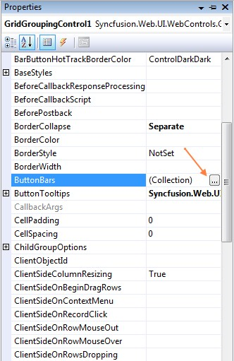
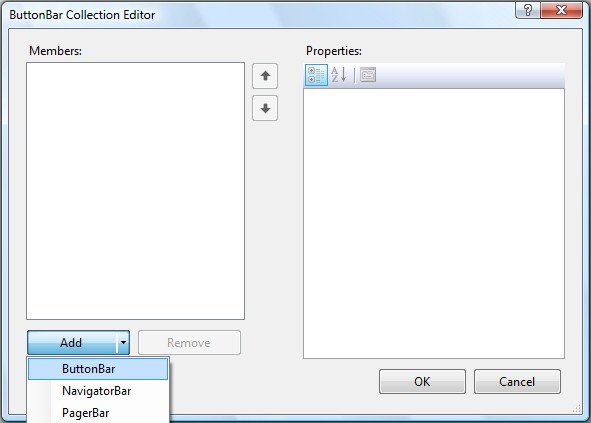
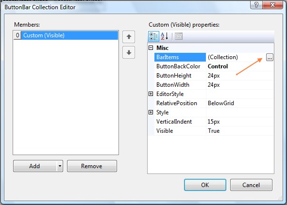
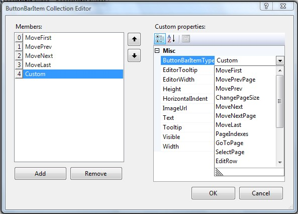
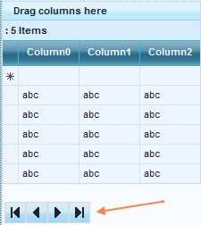
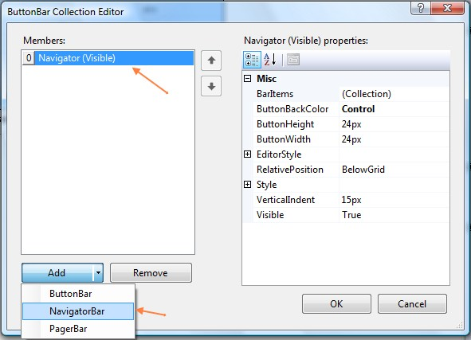
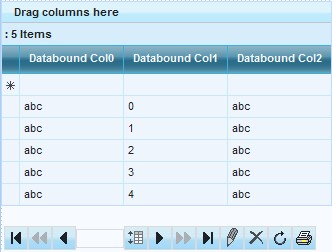

::: {style="DISPLAY: none"}
{#d2h_url_template}{#d2h_package_url style="WIDTH: 0px; DISPLAY: none; HEIGHT: 0px"}
:::

::::: {#nsbanner .d2h_main_nsbanner style="BORDER-BOTTOM: #999999 1px solid; POSITION: relative; PADDING-BOTTOM: 0px; BACKGROUND-COLOR: transparent; PADDING-LEFT: 0px; PADDING-RIGHT: 0px; DISPLAY: none; BORDER-TOP: #999999 1px solid; PADDING-TOP: 0px; LEFT: 0px"}
:::: {#TitleRow .d2h_main_titlerow style="PADDING-BOTTOM: 4px; BACKGROUND-COLOR: transparent; PADDING-LEFT: 22px; WIDTH: 100%; PADDING-RIGHT: 10px; DISPLAY: none; PADDING-TOP: 4px"}
::: {#ienav .d2h_main_ienav style="DISPLAY: none"}
{#D2HPrevious .D2HPreviousEnabled}  {#D2HNext .D2HNextEnabled}
:::
::::
:::::

::::: {#nstext .d2h_main_nstext style="PADDING-BOTTOM: 10px; BACKGROUND-COLOR: transparent; PADDING-LEFT: 22px; PADDING-RIGHT: 10px; HEIGHT: 100%; OVERFLOW: auto; PADDING-TOP: 5px" hasuserbackground="true" valign="bottom"}
::: {#d2h_breadcrumbs .d2h_breadcrumbs}
[Essential Studio User Guide Documentation](ms-xhelp:///?Id=12457748-09e3-4d74-a240-8e049cedf030){.d2h_breadcrumbsNormal}[ \> ]{.d2h_breadcrumbsLinkSeparator}[User Interface Edition](ms-xhelp:///?Id=c29296b7-531c-413b-a0ec-488ca1f7f669){.d2h_breadcrumbsNormal}[ \> ]{.d2h_breadcrumbsLinkSeparator}[Essential ASP.NET](ms-xhelp:///?Id=25c35330-c127-4dad-9a92-ed79dc7261a6){.d2h_breadcrumbsNormal}[ \> ]{.d2h_breadcrumbsLinkSeparator}[Essential Grid]{.d2h_breadcrumbsContentsOnly}[ \> ]{.d2h_breadcrumbsLinkSeparator}[Concepts and Features](ms-xhelp:///?Id=9e489974-524d-457c-9881-e458b1321685){.d2h_breadcrumbsNormal}[ \> ]{.d2h_breadcrumbsLinkSeparator}[Navigation](ms-xhelp:///?Id=c74d8a01-8662-44dd-9ece-9b19a138eed0){.d2h_breadcrumbsNormal}
:::

### ButtonBars {#buttonbars style="tab-stops: 0pt"}

[]{style="FONT-FAMILY: 'Trebuchet MS','sans-serif'; COLOR: #15428b; FONT-SIZE: 9pt"} 

Adding ButtonBars

**[]{style="FONT-FAMILY: 'Trebuchet MS','sans-serif'; COLOR: #15428b"}** 

A ButtonBar can be added by clicking on the **ButtonBars** property of the GridGroupingControl and launching the **ButtonBar** **Collection Editor**.

[]{style="FONT-SIZE: 8pt"} 

{border="0"}

Figure 89

**[]{style="FONT-FAMILY: 'Trebuchet MS','sans-serif'; COLOR: #15428b; FONT-SIZE: 9pt"}** 

**[]{style="FONT-FAMILY: 'Trebuchet MS','sans-serif'; COLOR: #15428b; FONT-SIZE: 9pt"}** 

ButtonBar Collection Editor

**[]{style="FONT-FAMILY: 'Trebuchet MS','sans-serif'; COLOR: #15428b; FONT-SIZE: 9pt"}** 

ButtonBars can be displayed either at the top or the bottom of the Grid via the **RelativePosition** property setting.

There are 3 types of ButtonBars.

[]{style="FONT-FAMILY: 'Trebuchet MS','sans-serif'; COLOR: #15428b; FONT-SIZE: 9pt"} 

[·      ]{style="FONT-FAMILY: Symbol"}NavigatorBar

[·      ]{style="FONT-FAMILY: Symbol"}PagerBar

[·      ]{style="FONT-FAMILY: Symbol"}Custom

[]{style="FONT-FAMILY: 'Trebuchet MS','sans-serif'; COLOR: #15428b; FONT-SIZE: 9pt"} 

{border="0"}

Figure 90

[]{style="FONT-FAMILY: 'Trebuchet MS','sans-serif'; COLOR: #15428b; FONT-SIZE: 9pt"} 

Users can also add a custom ButtonBar, to which they can add custom buttons as per their requirement.

[]{style="FONT-FAMILY: 'Trebuchet MS','sans-serif'; COLOR: #15428b; FONT-SIZE: 9pt"} 

Adding Buttons to ButtonBars

[]{style="FONT-SIZE: 8pt"} 

Buttons (BarItems) can be added to the ButtonBar by clicking on the **BarItems** property to launch the ButtonBarItem Collection Editor and clicking on the \'Add\' button. The **ButtonBarItemType** property determines the type of the button added. It can be set either to one of the existing types or can be set to Custom. The various properties of the Buttons like Tooltip, Text and so on can be set in the ButtonBarItem Collection Editor as shown below.

[]{style="FONT-FAMILY: 'Trebuchet MS','sans-serif'; COLOR: #15428b; FONT-SIZE: 9pt"} 

{border="0"}

Figure 91

[]{style="FONT-FAMILY: 'Trebuchet MS','sans-serif'; COLOR: #15428b; FONT-SIZE: 9pt"} 

{border="0"}

[]{style="FONT-FAMILY: 'Trebuchet MS','sans-serif'; COLOR: #15428b; FONT-SIZE: 9pt"} 

Figure 92: Setting properties for a Button via the ButtonBarItem Collection Editor

[]{style="FONT-FAMILY: 'Trebuchet MS','sans-serif'; COLOR: #15428b; FONT-SIZE: 9pt"} 

::: {style="BORDER-BOTTOM: windowtext 1pt solid; BORDER-LEFT: medium none; PADDING-BOTTOM: 1pt; MARGIN-TOP: 9pt; PADDING-LEFT: 0pt; PADDING-RIGHT: 0pt; MARGIN-BOTTOM: 9pt; BORDER-TOP: windowtext 1pt solid; BORDER-RIGHT: medium none; PADDING-TOP: 1pt"}
 

{border="0"}Note:[ ]{style="FONT-FAMILY: 'Segoe UI','sans-serif'"}Programming behavior of custom buttons is demonstrated in the SelectionModes sample.
:::

[]{style="FONT-FAMILY: 'Trebuchet MS','sans-serif'; COLOR: #15428b; FONT-SIZE: 9pt"} 

Customized ButtonBars can also be added to the GridGroupingControl, using the ButtonBars Collection. These ButtonBars include options for adding custom buttons, in addition to those buttons in navigator and pager bars. Custom Buttons can also be included in navigator and pager bars.

[]{style="FONT-SIZE: 8pt"} 

{border="0"}

[]{style="FONT-SIZE: 8pt"} 

Figure 93: Grid with ButtonBar

[]{style="FONT-SIZE: 8pt"} 

Navigator Bar

[]{style="FONT-SIZE: 8pt"} 

The Navigator Bar includes buttons that enable traversing between different pages and rows of the grid. It also includes options for editing grid rows and refreshing the grid. The buttons are hot-tracked on hovering the mouse cursor. The buttons included in this Navigator Bar are given below.

[]{style="FONT-FAMILY: 'Trebuchet MS','sans-serif'; COLOR: #15428b; FONT-SIZE: 9pt"} 

[·      ]{style="FONT-FAMILY: Symbol"}First row

[·      ]{style="FONT-FAMILY: Symbol"}Previous page

[·      ]{style="FONT-FAMILY: Symbol"}Previous row

[·      ]{style="FONT-FAMILY: Symbol"}Change page size

[·      ]{style="FONT-FAMILY: Symbol"}Next row

[·      ]{style="FONT-FAMILY: Symbol"}Next page

[·      ]{style="FONT-FAMILY: Symbol"}Last row

[·      ]{style="FONT-FAMILY: Symbol"}Edit row

[·      ]{style="FONT-FAMILY: Symbol"}Delete row

[·      ]{style="FONT-FAMILY: Symbol"}Refresh

[]{style="FONT-SIZE: 8pt"} 

Adding a NavigatorBar

[]{style="FONT-SIZE: 8pt"} 

{border="0"}

Figure 94

[]{style="FONT-SIZE: 8pt"} 

{border="0"}

 Figure 95[]{style="FONT-FAMILY: 'Trebuchet MS','sans-serif'; FONT-SIZE: 12pt"}

[]{#related-topics}
:::::
