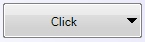
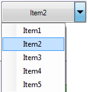

::: {style="DISPLAY: none"}
{#d2h_url_template}{#d2h_package_url style="WIDTH: 0px; DISPLAY: none; HEIGHT: 0px"}
:::

::: {.d2h_secondary_topic style="PADDING-BOTTOM: 10pt; MARGIN: 0pt; PADDING-LEFT: 0pt; PADDING-RIGHT: 0pt; PADDING-TOP: 0pt"}
#### Button Caption {#button-caption style="tab-stops: 0pt"}

This feature enables you to name your SplitButton as needed.

          []{style="COLOR: #c00000"}

Adding Caption to the SplitButton  

You can add a button caption to the SplitButton or set the selected item as the caption. 

 

The following code illustrates how to add a caption for the button:

 

+---------------------------------------------------------------------------------------------------+
| **[\[C#\]]{style="FONT-FAMILY: 'Courier New'"}**                                                  |
|                                                                                                   |
| [splitButton1.Text = [\"Click\"]{style="COLOR: #a31515"};   ]{style="FONT-FAMILY: 'Courier New'"} |
+---------------------------------------------------------------------------------------------------+

 

+-----------------------------------------------------------------------------------------------+
| **[\[VB\]]{style="FONT-FAMILY: 'Courier New'; FONT-SIZE: 12pt"}**                             |
|                                                                                               |
| []{style="FONT-FAMILY: 'Courier New'; FONT-SIZE: 12pt"}                                       |
|                                                                                               |
| [splitButton1.Text = [\"Click\"]{style="COLOR: darkred"}]{style="FONT-FAMILY: 'Courier New'"} |
+-----------------------------------------------------------------------------------------------+

 

{border="0"}

Figure 1489: Added Button Caption

 

The following code illustrates how to set the selected item from the dropdown as the caption:

 

+------------------------------------------------------------------------------------------------------------------------------------------------------------------------------------------------------------------------------------+
| **[\[C#\]]{style="FONT-FAMILY: 'Courier New'"}**                                                                                                                                                                                   |
|                                                                                                                                                                                                                                    |
| [ [private]{style="COLOR: blue"} [void]{style="COLOR: blue"} splitButton1_DropDowItemClicked([object]{style="COLOR: blue"} sender, [ToolStripItemClickedEventArgs]{style="COLOR: #2b91af"} e)]{style="FONT-FAMILY: 'Courier New'"} |
|                                                                                                                                                                                                                                    |
| [{             ]{style="FONT-FAMILY: 'Courier New'"}                                                                                                                                                                               |
|                                                                                                                                                                                                                                    |
| [             splitButton1.Text = e.ClickedItem.Text;]{style="FONT-FAMILY: 'Courier New'"}                                                                                                                                         |
|                                                                                                                                                                                                                                    |
| [}]{style="FONT-FAMILY: 'Courier New'"}                                                                                                                                                                                            |
+------------------------------------------------------------------------------------------------------------------------------------------------------------------------------------------------------------------------------------+

 

+--------------------------------------------------------------------------------------------------------------------------------------------------------------------------------------------------------------------------------------------------------------------------------------------------------------------------------------------------+
| **[\[VB\]]{style="FONT-FAMILY: 'Courier New'; FONT-SIZE: 12pt"}**                                                                                                                                                                                                                                                                                |
|                                                                                                                                                                                                                                                                                                                                                  |
| [Private]{style="FONT-FAMILY: 'Courier New'; COLOR: blue"}[ [Sub]{style="COLOR: blue"} splitButton1_DropDowItemClicked([ByVal]{style="COLOR: blue"} sender [As]{style="COLOR: blue"} [Object]{style="COLOR: blue"}, [ByVal]{style="COLOR: blue"} e [As]{style="COLOR: blue"} ToolStripItemClickedEventArgs)]{style="FONT-FAMILY: 'Courier New'"} |
|                                                                                                                                                                                                                                                                                                                                                  |
| [                   splitButton1.Text = e.ClickedItem.Text]{style="FONT-FAMILY: 'Courier New'"}                                                                                                                                                                                                                                                  |
|                                                                                                                                                                                                                                                                                                                                                  |
| [End]{style="FONT-FAMILY: 'Courier New'; COLOR: blue"}[ [Sub]{style="COLOR: blue"}]{style="FONT-FAMILY: 'Courier New'"}                                                                                                                                                                                                                          |
|                                                                                                                                                                                                                                                                                                                                                  |
| []{style="FONT-FAMILY: 'Courier New'"}                                                                                                                                                                                                                                                                                                           |
+--------------------------------------------------------------------------------------------------------------------------------------------------------------------------------------------------------------------------------------------------------------------------------------------------------------------------------------------------+

 

{border="0"}

Figure 1490: Selected item is set as caption

 

 

[]{#related-topics}
:::
