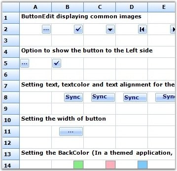

::: {style="DISPLAY: none"}
{#d2h_url_template}{#d2h_package_url style="WIDTH: 0px; DISPLAY: none; HEIGHT: 0px"}
:::

::: {.d2h_secondary_topic style="PADDING-BOTTOM: 10pt; MARGIN: 0pt; PADDING-LEFT: 0pt; PADDING-RIGHT: 0pt; PADDING-TOP: 0pt"}
##### Button Edit {#button-edit style="tab-stops: 0pt"}

[]{style="FONT-FAMILY: 'Trebuchet MS','sans-serif'; COLOR: #15428b; FONT-SIZE: 9pt"} 

The Button Edit cell type will allow you to add images to the button which can be embedded into the grid cells. This Button Edit cell type can be added by registering its cell model to the corresponding grid by using the **RegisterCellModel** class. There are some in-built images which will be added to the button by providing the button type, and also custom images can be added by specifying the button type as image and providing the location of the image. These Button Edit types can be used by initializing the **ButtonEditStyleProperties** class for the corresponding cell. The Button Edit types provided by grid control are listed as follows.

[]{style="FONT-FAMILY: 'Trebuchet MS','sans-serif'; COLOR: #15428b; FONT-SIZE: 9pt"} 

[·      ]{style="FONT-FAMILY: Symbol"}Browse

[·      ]{style="FONT-FAMILY: Symbol"}Check

[·      ]{style="FONT-FAMILY: Symbol"}Down

[·      ]{style="FONT-FAMILY: Symbol"}Left

[·      ]{style="FONT-FAMILY: Symbol"}Leftend

[·      ]{style="FONT-FAMILY: Symbol"}Redo

[·      ]{style="FONT-FAMILY: Symbol"}Right

[·      ]{style="FONT-FAMILY: Symbol"}Rightend

[·      ]{style="FONT-FAMILY: Symbol"}Undo

[·      ]{style="FONT-FAMILY: Symbol"}Up

[·      ]{style="FONT-FAMILY: Symbol"}Image

[]{style="FONT-FAMILY: 'Trebuchet MS','sans-serif'; COLOR: #15428b; FONT-SIZE: 9pt"} 

You can also add custom buttons that you have created to the grid cells. This enables you to add custom buttons like split button to the grid.

[]{style="FONT-FAMILY: 'Trebuchet MS','sans-serif'; COLOR: #15428b; FONT-SIZE: 9pt"} 

The following code examples illustrate how to set the cell type to ButtonEdit.

[]{style="FONT-FAMILY: 'Trebuchet MS','sans-serif'; COLOR: #15428b; FONT-SIZE: 9pt"} 

1.   Using C#

[]{style="FONT-FAMILY: 'Trebuchet MS','sans-serif'; COLOR: #15428b; FONT-SIZE: 9pt"} 

+--------------------------------------------------------------------------------------------------------------------------------------------------------------------------------------------------------------+
| **[\[C#\]]{style="FONT-FAMILY: 'Courier New'; COLOR: black"}**                                                                                                                                               |
|                                                                                                                                                                                                              |
| []{style="FONT-FAMILY: 'Courier New'; COLOR: black"}                                                                                                                                                         |
|                                                                                                                                                                                                              |
| [RegisterCellModel]{style="FONT-FAMILY: 'Courier New'; COLOR: #2b91af"}[.GridCellType(gridControl1, [CustomCellTypes]{style="COLOR: #2b91af"}.ButtonEdit);]{style="FONT-FAMILY: 'Courier New'"}              |
|                                                                                                                                                                                                              |
| [ButtonEditStyleProperties]{style="FONT-FAMILY: 'Courier New'; COLOR: #2b91af"}[ sp;]{style="FONT-FAMILY: 'Courier New'"}                                                                                    |
|                                                                                                                                                                                                              |
| [this]{style="FONT-FAMILY: 'Courier New'; COLOR: blue"}[.gridControl1\[rowIndex, colIndex\].CellType = [CustomCellTypes]{style="COLOR: #2b91af"}.ButtonEdit.ToString();]{style="FONT-FAMILY: 'Courier New'"} |
|                                                                                                                                                                                                              |
| [sp = [new]{style="COLOR: blue"} [ButtonEditStyleProperties]{style="COLOR: #2b91af"}([this]{style="COLOR: blue"}.gridControl1\[rowIndex, colIndex\]);]{style="FONT-FAMILY: 'Courier New'"}                   |
|                                                                                                                                                                                                              |
| [sp.ButtonEditInfo.ButtonEditType = [ButtonType]{style="COLOR: #2b91af"}.Browse;]{style="FONT-FAMILY: 'Courier New'"}                                                                                        |
|                                                                                                                                                                                                              |
| [sp.ButtonEditInfo.Width = 50;]{style="FONT-FAMILY: 'Courier New'"}                                                                                                                                          |
+--------------------------------------------------------------------------------------------------------------------------------------------------------------------------------------------------------------+

[]{style="FONT-FAMILY: 'Trebuchet MS','sans-serif'; COLOR: #15428b; FONT-SIZE: 9pt"} 

2.   Using VB.NET

[]{style="FONT-FAMILY: 'Trebuchet MS','sans-serif'; COLOR: #15428b; FONT-SIZE: 9pt"} 

+------------------------------------------------------------------------------------------------------------------------------------------------------------------------------------------+
| **[\[VB.NET\]]{style="FONT-FAMILY: 'Courier New'; COLOR: black"}**                                                                                                                       |
|                                                                                                                                                                                          |
| []{style="FONT-FAMILY: 'Courier New'; COLOR: black"}                                                                                                                                     |
|                                                                                                                                                                                          |
| [RegisterCellModel.GridCellType(gridControl1, CustomCellTypes.ButtonEdit)]{style="FONT-FAMILY: 'Courier New'"}                                                                           |
|                                                                                                                                                                                          |
| [Private]{style="FONT-FAMILY: 'Courier New'; COLOR: blue"}[ sp [As]{style="COLOR: blue"} ButtonEditStyleProperties]{style="FONT-FAMILY: 'Courier New'"}                                  |
|                                                                                                                                                                                          |
| [Me]{style="FONT-FAMILY: 'Courier New'; COLOR: blue"}[.gridControl1\[rowIndex += 1, colIndex\].CellType = [\"ButtonEdit\"]{style="COLOR: #a31515"};]{style="FONT-FAMILY: 'Courier New'"} |
|                                                                                                                                                                                          |
| [Me]{style="FONT-FAMILY: 'Courier New'; COLOR: blue"}[.gridControl1(rowIndex, colIndex).CellType = CustomCellTypes.ButtonEdit.ToString()]{style="FONT-FAMILY: 'Courier New'"}            |
|                                                                                                                                                                                          |
| [sp = [New]{style="COLOR: blue"} ButtonEditStyleProperties([Me]{style="COLOR: blue"}.gridControl1(rowIndex, colIndex))]{style="FONT-FAMILY: 'Courier New'"}                              |
|                                                                                                                                                                                          |
| [sp.ButtonEditInfo.ButtonEditType = ButtonType.Browse]{style="FONT-FAMILY: 'Courier New'"}                                                                                               |
+------------------------------------------------------------------------------------------------------------------------------------------------------------------------------------------+

[]{style="FONT-FAMILY: 'Trebuchet MS','sans-serif'; COLOR: #15428b; FONT-SIZE: 9pt"} 

{border="0"}

[]{style="FONT-FAMILY: 'Trebuchet MS','sans-serif'; COLOR: #15428b; FONT-SIZE: 9pt"} 

*[Figure ]{style="FONT-SIZE: 9pt"}[105]{style="FONT-SIZE: 9pt"}[: Button Edit Cells]{style="FONT-SIZE: 9pt"}*

 

[]{#p94} 

 

[]{#related-topics}
:::
