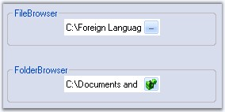

::: {style="DISPLAY: none"}
{#d2h_url_template}{#d2h_package_url style="WIDTH: 0px; DISPLAY: none; HEIGHT: 0px"}
:::

::: {.d2h_secondary_topic style="PADDING-BOTTOM: 10pt; MARGIN: 0pt; PADDING-LEFT: 0pt; PADDING-RIGHT: 0pt; PADDING-TOP: 0pt"}
#### ButtonEdit {#buttonedit style="tab-stops: 0pt"}

[]{style="COLOR: #15428b"} 

The **ButtonEdit control** embeds a text box control with a collection of button controls that can be customized to create many commonly used interfaces such as a file / folder browser or a drop-down text control. We can implement a file picker and folder browser using the ButtonEdit control. Drop-down popup controls can also be shown using the ButtonEdit control and the PopupContainerControl.

 

The edit control with a browse button extends a regular edit control by adding a button which can display an user-defined \"browse\" dialog. The ButtonEdit control provides an easy way to create controls with an edit control and any number of associated buttons.

[]{style="COLOR: #15428b"} 

{border="0"}

[]{style="COLOR: #15428b"} 

Figure 162: ButtonEdit Control

[]{style="COLOR: #15428b"} 

The ButtonEdit control derives from Syncfusion.Windows.Forms.ContainerControl and embeds one or more **ButtonEditChildButton** controls. The ButtonEditChildButton controls derive from Syncfusion.Windows.Forms.Button class and expose the functionality of buttons.

 

Using an edit control alongside one or more button controls is a very common requirement in graphical user interface programming. Some of the common examples are browse edit controls and drop-down controls.

More:

[ ]{#related-topics}

[{border="0" align="absMiddle"}Features](ms-xhelp:///?Id=91274cea-da2b-4de4-8209-7a20e44f09d7){style="TEXT-DECORATION: none"}

[{border="0" align="absMiddle"}Creating ButtonEdit](ms-xhelp:///?Id=f967db89-b73c-4c99-82a9-b0f1123b57e6){style="TEXT-DECORATION: none"}

[{border="0" align="absMiddle"}Concepts and Features](ms-xhelp:///?Id=ceb102be-1006-4a4f-aa69-c0badcd9a405){style="TEXT-DECORATION: none"}

[{border="0" align="absMiddle"}ButtonEdit Events](ms-xhelp:///?Id=f2f8c1ce-bd01-42f1-bac5-7773f1ba2342){style="TEXT-DECORATION: none"}

[{border="0" align="absMiddle"}Frequently Asked Questions](ms-xhelp:///?Id=481af5da-9f89-469e-8cad-271cb2e81241){style="TEXT-DECORATION: none"}
:::
