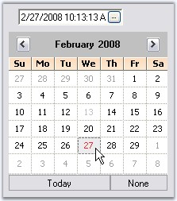

::: {style="DISPLAY: none"}
{#d2h_url_template}{#d2h_package_url style="WIDTH: 0px; DISPLAY: none; HEIGHT: 0px"}
:::

::::: {.d2h_secondary_topic style="PADDING-BOTTOM: 10pt; MARGIN: 0pt; PADDING-LEFT: 0pt; PADDING-RIGHT: 0pt; PADDING-TOP: 0pt"}
##### ButtonEdit Events {#buttonedit-events style="tab-stops: 0pt"}

[]{#p235} 

The below events are discussed in the event section.

[]{style="COLOR: #15428b"} 

###### []{#p236}[]{#_ButtonClicked_Event}3.3.2.2.4.1 ButtonClicked Event {#buttonclicked-event style="tab-stops: 0pt"}

**[]{style="COLOR: #333399"}** 

This event is handled whenever a child button of a ButtonEdit control is clicked. It gives *ClickedButton* member which lets you customize the button that is clicked.

[]{style="COLOR: #15428b"} 

The below code changes the alignment of the button that is clicked at runtime.

[]{style="COLOR: #15428b"} 

+-----------------------------------------------------------------------------------------------------------------------------------------------------------------------------------------------------------------------------------------------+
| **[\[C#\]]{style="FONT-FAMILY: 'Courier New'; COLOR: black"}**                                                                                                                                                                                |
|                                                                                                                                                                                                                                               |
| []{style="FONT-FAMILY: 'Courier New'; COLOR: black"}                                                                                                                                                                                          |
|                                                                                                                                                                                                                                               |
| [this]{style="FONT-FAMILY: 'Courier New'; COLOR: blue"}[.buttonEdit2.ButtonClicked +=[new]{style="COLOR: blue"} [ButtonClickedEventHandler]{style="COLOR: teal"}(buttonEdit2_ButtonClicked);]{style="FONT-FAMILY: 'Courier New'"}             |
|                                                                                                                                                                                                                                               |
| [private]{style="FONT-FAMILY: 'Courier New'; COLOR: blue"}[ [void]{style="COLOR: blue"} buttonEdit2_ButtonClicked([object]{style="COLOR: blue"} sender, [ButtonClickedEventArgs]{style="COLOR: teal"} e)]{style="FONT-FAMILY: 'Courier New'"} |
|                                                                                                                                                                                                                                               |
| [{]{style="FONT-FAMILY: 'Courier New'"}                                                                                                                                                                                                       |
|                                                                                                                                                                                                                                               |
| [    [//Changing the button alignment of the clicked button]{style="COLOR: green"}]{style="FONT-FAMILY: 'Courier New'"}                                                                                                                       |
|                                                                                                                                                                                                                                               |
| [    e.ClickedButton.ButtonAlign = [ButtonAlignment]{style="COLOR: teal"}.Left;]{style="FONT-FAMILY: 'Courier New'"}                                                                                                                          |
|                                                                                                                                                                                                                                               |
| [}]{style="FONT-FAMILY: 'Courier New'"}                                                                                                                                                                                                       |
+-----------------------------------------------------------------------------------------------------------------------------------------------------------------------------------------------------------------------------------------------+

[]{style="COLOR: #15428b"} 

+-------------------------------------------------------------------------------------------------------------------------------------------------------------------------------------------------------------------------------------------------------------------------------------------------------------------------------------+
| **[\[VB.NET\]]{style="FONT-FAMILY: 'Courier New'; COLOR: black"}**                                                                                                                                                                                                                                                                  |
|                                                                                                                                                                                                                                                                                                                                     |
| []{style="FONT-FAMILY: 'Courier New'; COLOR: black"}                                                                                                                                                                                                                                                                                |
|                                                                                                                                                                                                                                                                                                                                     |
| [AddHandler]{style="FONT-FAMILY: 'Courier New'; COLOR: blue"}[ [Me]{style="COLOR: blue"}.buttonEdit2.ButtonClicked, [AddressOf]{style="COLOR: blue"} buttonEdit2_ButtonClicked ]{style="FONT-FAMILY: 'Courier New'"}                                                                                                                |
|                                                                                                                                                                                                                                                                                                                                     |
| [Private]{style="FONT-FAMILY: 'Courier New'; COLOR: blue"}[ [Sub]{style="COLOR: blue"} buttonEdit2_ButtonClicked([ByVal]{style="COLOR: blue"} sender [As]{style="COLOR: blue"} [Object]{style="COLOR: blue"}, [ByVal]{style="COLOR: blue"} e [As]{style="COLOR: blue"} ButtonClickedEventArgs)]{style="FONT-FAMILY: 'Courier New'"} |
|                                                                                                                                                                                                                                                                                                                                     |
| [    [\'Changing the button alignment of the clicked button ]{style="COLOR: green"}]{style="FONT-FAMILY: 'Courier New'"}                                                                                                                                                                                                            |
|                                                                                                                                                                                                                                                                                                                                     |
| [    e.ClickedButton.ButtonAlign = ButtonAlignment.Left]{style="FONT-FAMILY: 'Courier New'"}                                                                                                                                                                                                                                        |
|                                                                                                                                                                                                                                                                                                                                     |
| [End]{style="FONT-FAMILY: 'Courier New'; COLOR: blue"}[ [Sub]{style="COLOR: blue"}]{style="FONT-FAMILY: 'Courier New'"}                                                                                                                                                                                                             |
+-------------------------------------------------------------------------------------------------------------------------------------------------------------------------------------------------------------------------------------------------------------------------------------------------------------------------------------+

###### []{#p237}[]{#_Border_Events}3.3.2.2.4.2 Border Events {#border-events style="tab-stops: 0pt"}

 

The below table list the events that are raised for border changes.

[]{style="COLOR: #15428b"} 

::: {align="center"}
  ----------------------- ----------------------------------------------------------------------
  ButtonEdit Properties   Description
  Border3DStyleChanged    Raised when Border3DStyle property of ButtonEdit control is changed.
  BorderSidesChanged      Raised when BorderSides property of ButtonEdit control is changed.
  ----------------------- ----------------------------------------------------------------------
:::

[]{style="COLOR: #15428b"} 

+-----------------------------------------------------------------------------------------------------------------------------------------------------------------------------------------------------------------------------------------+
| **[\[C#\]]{style="FONT-FAMILY: 'Courier New'; COLOR: black"}**                                                                                                                                                                          |
|                                                                                                                                                                                                                                         |
| []{style="FONT-FAMILY: 'Courier New'; COLOR: black"}                                                                                                                                                                                    |
|                                                                                                                                                                                                                                         |
| [private]{style="FONT-FAMILY: 'Courier New'; COLOR: blue"}[ [void]{style="COLOR: blue"} buttonEdit1_Border3DStyleChanged([object]{style="COLOR: blue"} sender, [EventArgs]{style="COLOR: teal"} e)]{style="FONT-FAMILY: 'Courier New'"} |
|                                                                                                                                                                                                                                         |
| [{]{style="FONT-FAMILY: 'Courier New'"}                                                                                                                                                                                                 |
|                                                                                                                                                                                                                                         |
| [    [Console]{style="COLOR: teal"}.WriteLine([\"3D border styles is changed\"]{style="COLOR: maroon"});            ]{style="FONT-FAMILY: 'Courier New'"}                                                                               |
|                                                                                                                                                                                                                                         |
| [}]{style="FONT-FAMILY: 'Courier New'"}                                                                                                                                                                                                 |
|                                                                                                                                                                                                                                         |
| []{style="FONT-FAMILY: 'Courier New'"}                                                                                                                                                                                                  |
|                                                                                                                                                                                                                                         |
| [private]{style="FONT-FAMILY: 'Courier New'; COLOR: blue"}[ [void]{style="COLOR: blue"} buttonEdit1_BorderSidesChanged([object]{style="COLOR: blue"} sender, [EventArgs]{style="COLOR: teal"} e)]{style="FONT-FAMILY: 'Courier New'"}   |
|                                                                                                                                                                                                                                         |
| [{]{style="FONT-FAMILY: 'Courier New'"}                                                                                                                                                                                                 |
|                                                                                                                                                                                                                                         |
| [    [Console]{style="COLOR: teal"}.WriteLine([\" Border sides is changed\"]{style="COLOR: maroon"});           ]{style="FONT-FAMILY: 'Courier New'"}                                                                                   |
|                                                                                                                                                                                                                                         |
| [}]{style="FONT-FAMILY: 'Courier New'"}                                                                                                                                                                                                 |
+-----------------------------------------------------------------------------------------------------------------------------------------------------------------------------------------------------------------------------------------+

[]{style="COLOR: #15428b"} 

+-------------------------------------------------------------------------------------------------------------------------------------------------------------------------------------------------------------------------------------------------------------------------------------------------------------------------------+
| **[\[VB.NET\]]{style="FONT-FAMILY: 'Courier New'; COLOR: black"}**                                                                                                                                                                                                                                                            |
|                                                                                                                                                                                                                                                                                                                               |
| []{style="FONT-FAMILY: 'Courier New'; COLOR: black"}                                                                                                                                                                                                                                                                          |
|                                                                                                                                                                                                                                                                                                                               |
| [Private]{style="FONT-FAMILY: 'Courier New'; COLOR: blue"}[ [Sub]{style="COLOR: blue"} buttonEdit1_Border3DStyleChanged([ByVal]{style="COLOR: blue"} sender [As]{style="COLOR: blue"} [Object]{style="COLOR: blue"}, [ByVal]{style="COLOR: blue"} e [As]{style="COLOR: blue"} EventArgs)]{style="FONT-FAMILY: 'Courier New'"} |
|                                                                                                                                                                                                                                                                                                                               |
| [    Console.WriteLine([\"3D border styles is changed\"]{style="COLOR: maroon"})]{style="FONT-FAMILY: 'Courier New'"}                                                                                                                                                                                                         |
|                                                                                                                                                                                                                                                                                                                               |
| [End]{style="FONT-FAMILY: 'Courier New'; COLOR: blue"}[ [Sub]{style="COLOR: blue"}]{style="FONT-FAMILY: 'Courier New'"}                                                                                                                                                                                                       |
|                                                                                                                                                                                                                                                                                                                               |
| []{style="FONT-FAMILY: 'Courier New'; COLOR: blue"}                                                                                                                                                                                                                                                                           |
|                                                                                                                                                                                                                                                                                                                               |
| [Private]{style="FONT-FAMILY: 'Courier New'; COLOR: blue"}[ [Sub]{style="COLOR: blue"} buttonEdit1_BorderSidesChanged([ByVal]{style="COLOR: blue"} sender [As]{style="COLOR: blue"} [Object]{style="COLOR: blue"}, [ByVal]{style="COLOR: blue"} e [As]{style="COLOR: blue"} EventArgs)]{style="FONT-FAMILY: 'Courier New'"}   |
|                                                                                                                                                                                                                                                                                                                               |
| [    Console.WriteLine([\" Border sides is changed\"]{style="COLOR: maroon"})]{style="FONT-FAMILY: 'Courier New'"}                                                                                                                                                                                                            |
|                                                                                                                                                                                                                                                                                                                               |
| [End]{style="FONT-FAMILY: 'Courier New'; COLOR: blue"}[ [Sub]{style="COLOR: blue"}]{style="FONT-FAMILY: 'Courier New'"}                                                                                                                                                                                                       |
+-------------------------------------------------------------------------------------------------------------------------------------------------------------------------------------------------------------------------------------------------------------------------------------------------------------------------------+

###### []{#p238}[]{#_ButtonEditChildButton_Events}3.3.2.2.4.3 ButtonEditChildButton Events {#buttoneditchildbutton-events style="tab-stops: 0pt"}

[]{style="COLOR: #15428b"} 

The below table list the events that are available for the ButtonEdit Child Buttons control.

[]{style="COLOR: #15428b"} 

::: {align="center"}
  ------------------------------ --------------------------------------------------------------------------------------------------------------------------------------------------------------------------------------------------------------
  ButtonEditChildButton Events   Description
  Click                          Occurs when the control is clicked. This event calls the ButtonEdit.HandleChildButtonClicked method. Using this method, we can access the corresponding control and customize it.
  TextChanged                    Raised when Text property value is changed. This event calls HandleChildButtonTextChanged method. Using this method, we can access the corresponding control and customize it.
  MouseDown                      Handled when the mouse is over the control and when mouse button is pressed. This event calls HandleChildButtonMouseDown. Using this method, we can access the corresponding control and customize it.
  MouseUp                        Handled when the mouse is over the control and mouse button is released. This event calls HandleChildButtonMouseUp. Using this method, we can access the corresponding control and customize it.
  MouseEnter                     Raised when the mouse pointer enters the control. This event calls HandleChildButtonMouseEnter method. Using this method, we can access the corresponding control and customize it.
  MouseLeave                     Raised when the mouse pointer leaves the control. This event calls HandleChildButtonMouseLeave method. Using this method, we can access the corresponding control and customize it.
  MouseHover                     Raised when the mouse pointer rests the control. This event calls HandleChildButtonMouseHover method. Using this method, we can access the corresponding control and customize it.
  BackColorChanged               Raised when BackColor property of the ButtonEdit control is changed. This event calls HandleChildButtonBackColorChanged method. Using this method, we can access the corresponding control and customize it.
  ------------------------------ --------------------------------------------------------------------------------------------------------------------------------------------------------------------------------------------------------------
:::

[]{#p239}[]{#_Click_Event}3.3.2.2.4.3.1      Click Event

[]{style="COLOR: #15428b"} 

Displaying a Calendar Popup in a ButtonEdit Control

[]{style="COLOR: #15428b"} 

Using ButtonEdit Child button click event, we can display a CalendarPopup at a specified location. It can be done using the below steps.

[]{style="COLOR: #15428b"} 

Using CalendarPopup

[]{style="COLOR: #15428b"} 

1.   Create an instance of CalendarPopup control.

[]{style="COLOR: #15428b"} 

+---------------------------------------------------------------------------------------------------------------------------------------------------------------------------+
| **[\[C#\]]{style="FONT-FAMILY: 'Courier New'; COLOR: black"}**                                                                                                            |
|                                                                                                                                                                           |
| []{style="FONT-FAMILY: 'Courier New'; COLOR: blue"}                                                                                                                       |
|                                                                                                                                                                           |
| [private]{style="FONT-FAMILY: 'Courier New'; COLOR: blue"}[ Syncfusion.Windows.Forms.Tools.CalendarPopup calendarPop1;]{style="FONT-FAMILY: 'Courier New'; COLOR: black"} |
|                                                                                                                                                                           |
| [calendarPop1=[new]{style="COLOR: blue"} Syncfusion.Windows.Forms.Tools.CalendarPopup ();]{style="FONT-FAMILY: 'Courier New'"}                                            |
+---------------------------------------------------------------------------------------------------------------------------------------------------------------------------+

[]{style="COLOR: #15428b"} 

+-------------------------------------------------------------------------------------------------------------------------------------------------------------------------------------------+
| **[\[VB.NET\]]{style="FONT-FAMILY: 'Courier New'; COLOR: black"}**                                                                                                                        |
|                                                                                                                                                                                           |
| []{style="FONT-FAMILY: 'Courier New'; COLOR: blue"}                                                                                                                                       |
|                                                                                                                                                                                           |
| [Private]{style="FONT-FAMILY: 'Courier New'; COLOR: blue"}[ calendarPop1 [As]{style="COLOR: blue"} Syncfusion.Windows.Forms.Tools.CalendarPopup]{style="FONT-FAMILY: 'Courier New'"}      |
|                                                                                                                                                                                           |
| [Private]{style="FONT-FAMILY: 'Courier New'; COLOR: blue"}[ calendarPop1 = [New]{style="COLOR: blue"} Syncfusion.Windows.Forms.Tools.CalendarPopup()]{style="FONT-FAMILY: 'Courier New'"} |
+-------------------------------------------------------------------------------------------------------------------------------------------------------------------------------------------+

[                        ]{style="COLOR: #15428b"}

2.   Declare an instance of  MonthCalendarAdv control and add it to the CalendarPopup.

[]{style="COLOR: #15428b"} 

+---------------------------------------------------------------------------------------------------------------------------------------------------------------------------------+
| **[\[C#\]]{style="FONT-FAMILY: 'Courier New'; COLOR: black"}**                                                                                                                  |
|                                                                                                                                                                                 |
| []{style="FONT-FAMILY: 'Courier New'; COLOR: blue"}                                                                                                                             |
|                                                                                                                                                                                 |
| [private]{style="FONT-FAMILY: 'Courier New'; COLOR: blue"}[ Syncfusion.Windows.Forms.Tools.MonthCalendarAdv MonthCal;]{style="FONT-FAMILY: 'Courier New'"}                      |
|                                                                                                                                                                                 |
| [MonthCal=[new]{style="COLOR: blue"} Syncfusion.Windows.Forms.Tools.MonthCalendarAdv();]{style="FONT-FAMILY: 'Courier New'"}                                                    |
|                                                                                                                                                                                 |
| [this]{style="FONT-FAMILY: 'Courier New'; COLOR: blue"}[.MonthCal.AutoSize = [false]{style="COLOR: blue"};]{style="FONT-FAMILY: 'Courier New'"}                                 |
|                                                                                                                                                                                 |
| [calendarPop1.AutoSize = [false]{style="COLOR: blue"};]{style="FONT-FAMILY: 'Courier New'"}                                                                                     |
|                                                                                                                                                                                 |
| [calendarPop1.Size = [new]{style="COLOR: blue"} [Size]{style="COLOR: teal"}(200, 200);]{style="FONT-FAMILY: 'Courier New'"}                                                     |
|                                                                                                                                                                                 |
| [this]{style="FONT-FAMILY: 'Courier New'; COLOR: blue"}[.MonthCal.Size = [new]{style="COLOR: blue"} [Size]{style="COLOR: teal"}(200, 200);]{style="FONT-FAMILY: 'Courier New'"} |
|                                                                                                                                                                                 |
| []{style="FONT-FAMILY: 'Courier New'"}                                                                                                                                          |
|                                                                                                                                                                                 |
| [this]{style="FONT-FAMILY: 'Courier New'; COLOR: blue"}[.calendarPop1.Controls.Add(MonthCal);]{style="FONT-FAMILY: 'Courier New'"}                                              |
+---------------------------------------------------------------------------------------------------------------------------------------------------------------------------------+

[]{style="COLOR: #15428b"} 

+------------------------------------------------------------------------------------------------------------------------------------------------------------------------------------------+
| **[\[VB.NET\]]{style="FONT-FAMILY: 'Courier New'; COLOR: black"}**                                                                                                                       |
|                                                                                                                                                                                          |
| []{style="FONT-FAMILY: 'Courier New'; COLOR: blue"}                                                                                                                                      |
|                                                                                                                                                                                          |
| [Private]{style="FONT-FAMILY: 'Courier New'; COLOR: blue"}[ MonthCal [As]{style="COLOR: blue"} Syncfusion.Windows.Forms.Tools.MonthCalendarAdv]{style="FONT-FAMILY: 'Courier New'"}      |
|                                                                                                                                                                                          |
| [Private]{style="FONT-FAMILY: 'Courier New'; COLOR: blue"}[ MonthCal = [New]{style="COLOR: blue"} Syncfusion.Windows.Forms.Tools.MonthCalendarAdv()]{style="FONT-FAMILY: 'Courier New'"} |
|                                                                                                                                                                                          |
| [Me]{style="FONT-FAMILY: 'Courier New'; COLOR: blue"}[.MonthCal.AutoSize = [False]{style="COLOR: blue"}]{style="FONT-FAMILY: 'Courier New'"}                                             |
|                                                                                                                                                                                          |
| [calendarPop1.AutoSize = [False]{style="COLOR: blue"}]{style="FONT-FAMILY: 'Courier New'"}                                                                                               |
|                                                                                                                                                                                          |
| [calendarPop1.Size = [New]{style="COLOR: blue"} [Size]{style="COLOR: black"}(200, 200)]{style="FONT-FAMILY: 'Courier New'"}                                                              |
|                                                                                                                                                                                          |
| [Me]{style="FONT-FAMILY: 'Courier New'; COLOR: blue"}[.MonthCal.Size = [New]{style="COLOR: blue"} [Size]{style="COLOR: black"}(200, 200)]{style="FONT-FAMILY: 'Courier New'"}            |
|                                                                                                                                                                                          |
| []{style="FONT-FAMILY: 'Courier New'"}                                                                                                                                                   |
|                                                                                                                                                                                          |
| [Me]{style="FONT-FAMILY: 'Courier New'; COLOR: blue"}[.calendarPop1.Controls.Add(MonthCal)]{style="FONT-FAMILY: 'Courier New'"}                                                          |
+------------------------------------------------------------------------------------------------------------------------------------------------------------------------------------------+

[                ]{style="COLOR: #15428b"}

3.   Handle the Click event of buttonEditChildButton1 to display the Calendar as follows.

[]{style="COLOR: #15428b"} 

+---------------------------------------------------------------------------------------------------------------------------------------------------------------------------------------------------------------------+
| **[\[C#\]]{style="FONT-FAMILY: 'Courier New'; COLOR: black"}**                                                                                                                                                      |
|                                                                                                                                                                                                                     |
| **[]{style="FONT-FAMILY: 'Courier New'; COLOR: black"}**                                                                                                                                                            |
|                                                                                                                                                                                                                     |
| [private]{style="FONT-FAMILY: 'Courier New'; COLOR: blue"}[ [void]{style="COLOR: blue"} buttonEditChildButton1_Click([object]{style="COLOR: blue"} sender, System.EventArgs e)]{style="FONT-FAMILY: 'Courier New'"} |
|                                                                                                                                                                                                                     |
| [{]{style="FONT-FAMILY: 'Courier New'"}                                                                                                                                                                             |
|                                                                                                                                                                                                                     |
| [this]{style="FONT-FAMILY: 'Courier New'; COLOR: blue"}[.calendarPop1.Visible =[true]{style="COLOR: blue"};]{style="FONT-FAMILY: 'Courier New'"}                                                                    |
|                                                                                                                                                                                                                     |
| [this]{style="FONT-FAMILY: 'Courier New'; COLOR: blue"}[.calendarPop1.ShowPopup ([new]{style="COLOR: blue"} Point(200,200));]{style="FONT-FAMILY: 'Courier New'"}                                                   |
|                                                                                                                                                                                                                     |
| [}]{style="FONT-FAMILY: 'Courier New'"}                                                                                                                                                                             |
+---------------------------------------------------------------------------------------------------------------------------------------------------------------------------------------------------------------------+

[]{style="COLOR: #15428b"} 

+----------------------------------------------------------------------------------------------------------------------------------------------------------------------------------------------------------------------------------------------------------------------------------------------------------------------------------+
| **[\[VB.NET\]]{style="FONT-FAMILY: 'Courier New'; COLOR: black"}**                                                                                                                                                                                                                                                               |
|                                                                                                                                                                                                                                                                                                                                  |
| **[]{style="FONT-FAMILY: 'Courier New'; COLOR: black"}**                                                                                                                                                                                                                                                                         |
|                                                                                                                                                                                                                                                                                                                                  |
| [Private]{style="FONT-FAMILY: 'Courier New'; COLOR: blue"}[ [Sub]{style="COLOR: blue"} buttonEditChildButton1_Click([ByVal]{style="COLOR: blue"} sender [As]{style="COLOR: blue"} [Object]{style="COLOR: blue"}, [ByVal]{style="COLOR: blue"} e [As]{style="COLOR: blue"} System.EventArgs)]{style="FONT-FAMILY: 'Courier New'"} |
|                                                                                                                                                                                                                                                                                                                                  |
| [    [Me]{style="COLOR: blue"}.calendarPop1.Visible = [True]{style="COLOR: blue"}]{style="FONT-FAMILY: 'Courier New'"}                                                                                                                                                                                                           |
|                                                                                                                                                                                                                                                                                                                                  |
| [    [Me]{style="COLOR: blue"}.calendarPop1.ShowPopup([New]{style="COLOR: blue"} Point(200, 200))]{style="FONT-FAMILY: 'Courier New'"}                                                                                                                                                                                           |
|                                                                                                                                                                                                                                                                                                                                  |
| [End]{style="FONT-FAMILY: 'Courier New'; COLOR: blue"}[ [Sub]{style="COLOR: blue"}]{style="FONT-FAMILY: 'Courier New'"}                                                                                                                                                                                                          |
+----------------------------------------------------------------------------------------------------------------------------------------------------------------------------------------------------------------------------------------------------------------------------------------------------------------------------------+

[                ]{style="COLOR: #15428b"}

4.   The event DateSelected can also be handled to display the selected date in the textbox of ButtonEdit control.

[]{style="COLOR: #15428b"} 

+-------------------------------------------------------------------------------------------------------------------------------------------------------------------------------------------------------------+
| **[\[C#\]]{style="FONT-FAMILY: 'Courier New'; COLOR: black"}**                                                                                                                                              |
|                                                                                                                                                                                                             |
| []{style="FONT-FAMILY: 'Courier New'; COLOR: blue"}                                                                                                                                                         |
|                                                                                                                                                                                                             |
| [this]{style="FONT-FAMILY: 'Courier New'; COLOR: blue"}[.MonthCal.DateSelected+=[new]{style="COLOR: blue"} EventHandler(MonthCal_DateSelected);]{style="FONT-FAMILY: 'Courier New'"}                        |
|                                                                                                                                                                                                             |
| []{style="FONT-FAMILY: 'Courier New'"}                                                                                                                                                                      |
|                                                                                                                                                                                                             |
| [private]{style="FONT-FAMILY: 'Courier New'; COLOR: blue"}[ [void]{style="COLOR: blue"} MonthCal_DateSelected([object]{style="COLOR: blue"} sender,System.EventArgs e)]{style="FONT-FAMILY: 'Courier New'"} |
|                                                                                                                                                                                                             |
| [{]{style="FONT-FAMILY: 'Courier New'"}                                                                                                                                                                     |
|                                                                                                                                                                                                             |
| [this]{style="FONT-FAMILY: 'Courier New'; COLOR: blue"}[.buttonEdit1.TextBox.Text= [this]{style="COLOR: blue"}.MonthCal.Value.ToString();]{style="FONT-FAMILY: 'Courier New'"}                              |
|                                                                                                                                                                                                             |
| [}]{style="FONT-FAMILY: 'Courier New'"}                                                                                                                                                                     |
+-------------------------------------------------------------------------------------------------------------------------------------------------------------------------------------------------------------+

[]{style="COLOR: #15428b"} 

+---------------------------------------------------------------------------------------------------------------------------------------------------------------------------------------------------------------------------------------------------------------------------------------------------------------------------+
| **[\[VB.NET\]]{style="FONT-FAMILY: 'Courier New'; COLOR: black"}**                                                                                                                                                                                                                                                        |
|                                                                                                                                                                                                                                                                                                                           |
| []{style="FONT-FAMILY: 'Courier New'; COLOR: blue"}                                                                                                                                                                                                                                                                       |
|                                                                                                                                                                                                                                                                                                                           |
| [Private]{style="FONT-FAMILY: 'Courier New'; COLOR: blue"}[ [Me]{style="COLOR: blue"}.MonthCal.DateSelected+= [New]{style="COLOR: blue"} EventHandler(MonthCal_DateSelected)]{style="FONT-FAMILY: 'Courier New'"}                                                                                                         |
|                                                                                                                                                                                                                                                                                                                           |
| []{style="FONT-FAMILY: 'Courier New'"}                                                                                                                                                                                                                                                                                    |
|                                                                                                                                                                                                                                                                                                                           |
| [Private]{style="FONT-FAMILY: 'Courier New'; COLOR: blue"}[ [Sub]{style="COLOR: blue"} MonthCal_DateSelected([ByVal]{style="COLOR: blue"} sender [As]{style="COLOR: blue"} [Object]{style="COLOR: blue"}, [ByVal]{style="COLOR: blue"} e [As]{style="COLOR: blue"} System.EventArgs)]{style="FONT-FAMILY: 'Courier New'"} |
|                                                                                                                                                                                                                                                                                                                           |
| [    [Me]{style="COLOR: blue"}.buttonEdit1.TextBox.Text = [Me]{style="COLOR: blue"}.MonthCal.Value.ToString()]{style="FONT-FAMILY: 'Courier New'"}                                                                                                                                                                        |
|                                                                                                                                                                                                                                                                                                                           |
| [End]{style="FONT-FAMILY: 'Courier New'; COLOR: blue"}[ [Sub]{style="COLOR: blue"}]{style="FONT-FAMILY: 'Courier New'"}                                                                                                                                                                                                   |
+---------------------------------------------------------------------------------------------------------------------------------------------------------------------------------------------------------------------------------------------------------------------------------------------------------------------------+

[                ]{style="COLOR: #15428b"}

{border="0"}

[]{style="COLOR: #15428b"} 

Figure 179: ButtonEdit databound with CalendarPopup Control

 

 

[]{#related-topics}
:::::
