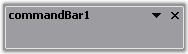

::: {style="DISPLAY: none"}
{#d2h_url_template}{#d2h_package_url style="WIDTH: 0px; DISPLAY: none; HEIGHT: 0px"}
:::

:::::: {.d2h_secondary_topic style="PADDING-BOTTOM: 10pt; MARGIN: 0pt; PADDING-LEFT: 0pt; PADDING-RIGHT: 0pt; PADDING-TOP: 0pt"}
#### Button Settings {#button-settings style="tab-stops: 0pt"}

[]{style="COLOR: #4a5c8c; FONT-SIZE: 8pt"} 

The buttons settings of the CommandBar control are given below.

[]{style="COLOR: #4a5c8c; FONT-SIZE: 8pt"} 

Close and DropDown Button

[]{style="COLOR: #4a5c8c; FONT-SIZE: 8pt"} 

The close button of CommandBar gets displayed when it is in the float state whereas the dropdown button gets displayed both in the dock and float state.

[]{style="COLOR: #15428b"} 

Table 8: Button Settings

::: {align="center"}
  ---------------------------- ---------------------------------------------------------------------------
  CommandBar Property          Description
  HideCloseButton              Determines whether the CommandBar will have a close button when floating.
  HideDropDownButton           Draws the CommandBar with / without the dropdown button.
  ---------------------------- ---------------------------------------------------------------------------
:::

[]{style="COLOR: #15428b"} 

::: {style="BORDER-BOTTOM: windowtext 1pt solid; BORDER-LEFT: medium none; PADDING-BOTTOM: 1pt; MARGIN-TOP: 9pt; PADDING-LEFT: 0pt; PADDING-RIGHT: 0pt; MARGIN-BOTTOM: 9pt; BORDER-TOP: windowtext 1pt solid; BORDER-RIGHT: medium none; PADDING-TOP: 1pt"}
{border="0"}Note: Popup Menu can be displayed from the dropdown button of the CommandBar. Refer [Popup Menu]{style="COLOR: black"} topic.
:::

[]{style="COLOR: #15428b"} 

+-----------------------------------------------------------------------------------------------------------------------------------------------------------+
| **[\[C#\]]{style="FONT-FAMILY: 'Courier New'; COLOR: black"}**                                                                                            |
|                                                                                                                                                           |
| []{style="FONT-FAMILY: 'Courier New'; COLOR: black"}                                                                                                      |
|                                                                                                                                                           |
| [this]{style="FONT-FAMILY: 'Courier New'; COLOR: blue"}[.commandBar1.HideCloseButton=[true]{style="COLOR: blue"};]{style="FONT-FAMILY: 'Courier New'"}    |
|                                                                                                                                                           |
| [this]{style="FONT-FAMILY: 'Courier New'; COLOR: blue"}[.commandBar1.HideDropDownButton=[true]{style="COLOR: blue"};]{style="FONT-FAMILY: 'Courier New'"} |
+-----------------------------------------------------------------------------------------------------------------------------------------------------------+

[]{style="COLOR: #15428b"} 

+--------------------------------------------------------------------------------------------------------------------------------------------------------+
| **[\[VB.NET\]]{style="FONT-FAMILY: 'Courier New'; COLOR: black"}**                                                                                     |
|                                                                                                                                                        |
| []{style="FONT-FAMILY: 'Courier New'; COLOR: black"}                                                                                                   |
|                                                                                                                                                        |
| [Me]{style="FONT-FAMILY: 'Courier New'; COLOR: blue"}[.commandBar1.HideCloseButton=[True]{style="COLOR: blue"}]{style="FONT-FAMILY: 'Courier New'"}    |
|                                                                                                                                                        |
| [Me]{style="FONT-FAMILY: 'Courier New'; COLOR: blue"}[.commandBar1.HideDropDownButton=[True]{style="COLOR: blue"}]{style="FONT-FAMILY: 'Courier New'"} |
+--------------------------------------------------------------------------------------------------------------------------------------------------------+

[]{style="COLOR: #15428b"} 

{border="0"}

[]{style="COLOR: #15428b"} 

Figure 17: \"DropDown Button\" and \"Close Button\" of CommandBar in Float State

[]{style="COLOR: #15428b"} 

{border="0"}

[]{style="COLOR: #15428b"} 

Figure 18: \"DropDown Button\" of CommandBar in Dock State

[]{style="COLOR: #15428b"} 

The methods associated with the above properties is given below.

[]{style="FONT-SIZE: 8pt"} 

Table 9: Button Settings - Methods

::: {align="center"}
  --------------------- --------------------------------------------------------------------
  Methods               Description
  GetCloseButtonState   Gets visual state for the close button of the floating CommandBar.
  GetDropDownState      Gets visual state for the dropdown button of the CommandBar.
  --------------------- --------------------------------------------------------------------
:::

 

A sample which demonstrates the DropDown Button settings of the CommandBar control is available in the below sample installation path.

 

..My Documents\\Syncfusion\\EssentialStudio\\***Version Number***\\Windows\\Tools.Windows\\Samples\\2.0\\CommandBars Package\\CommandBars

[]{#related-topics}
::::::
