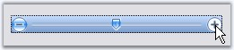
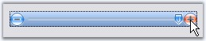

::: {style="DISPLAY: none"}
{#d2h_url_template}{#d2h_package_url style="WIDTH: 0px; DISPLAY: none; HEIGHT: 0px"}
:::

::::: {.d2h_secondary_topic style="PADDING-BOTTOM: 10pt; MARGIN: 0pt; PADDING-LEFT: 0pt; PADDING-RIGHT: 0pt; PADDING-TOP: 0pt"}
##### Button, Slider and Channel Settings {#button-slider-and-channel-settings style="tab-stops: 0pt"}

[]{style="COLOR: #15428b"} 

The properties which controls the size of various components of the TrackBarEx are as follows.

[]{style="COLOR: #15428b"} 

::: {align="center"}
  -------------------- ------------------------------------------------------------------
  Property             Description
  IncreaseButtonSize   Specifies the size of Increase button. Default value is (18, 18)
  DecreaseButtonSize   Specifies the size of Decrease button. Default value is (18, 18)
  SliderSize           Specifies the size of the slider. Default value is (11, 14).
  ChannelHeight        Specifies the height of the channel. Default value is 4.
  -------------------- ------------------------------------------------------------------
:::

[]{style="COLOR: #15428b"} 

Button Appearance

[]{style="COLOR: #15428b"} 

The below properties will let you control the appearance of the Increase, Decrease and slider buttons.

[]{style="COLOR: #15428b"} 

::: {align="center"}
  ------------------------ ---------------------------------------------------------------------------
  []{#p1192}Property       Description
  ShowButton               Specifies whether to show the Increase and Decrease buttons.
  ButtonColor              Sets the color for the buttons and the slider.
  HighlightedButtonColor   Sets the color for the buttons and the slider, when they are highlighted.
  PushedButtonEndColor     Sets the color of the buttons and the slider, when they are pushed.
  ------------------------ ---------------------------------------------------------------------------
:::

[]{style="COLOR: #15428b"} 

+-------------------------------------------------------------------------------------------------------------------------------------------------------------------------------------------+
| **[\[C#\]]{style="FONT-FAMILY: 'Courier New'; COLOR: black"}**                                                                                                                            |
|                                                                                                                                                                                           |
| []{style="FONT-FAMILY: 'Courier New'; COLOR: blue"}                                                                                                                                       |
|                                                                                                                                                                                           |
| [this]{style="FONT-FAMILY: 'Courier New'; COLOR: blue"}[.trackBarEx1.ShowButtons = [true]{style="COLOR: blue"};]{style="FONT-FAMILY: 'Courier New'"}                                      |
|                                                                                                                                                                                           |
| [this]{style="FONT-FAMILY: 'Courier New'; COLOR: blue"}[.trackBarEx1.ButtonColor = System.Drawing.[Color]{style="COLOR: teal"}.DodgerBlue;]{style="FONT-FAMILY: 'Courier New'"}           |
|                                                                                                                                                                                           |
| [this]{style="FONT-FAMILY: 'Courier New'; COLOR: blue"}[.trackBarEx1.HighlightedButtonColor = System.Drawing.[Color]{style="COLOR: teal"}.AliceBlue;]{style="FONT-FAMILY: 'Courier New'"} |
|                                                                                                                                                                                           |
| [this]{style="FONT-FAMILY: 'Courier New'; COLOR: blue"}[.trackBarEx1.PushedButtonEndColor = System.Drawing.[Color]{style="COLOR: teal"}.OrangeRed;]{style="FONT-FAMILY: 'Courier New'"}   |
+-------------------------------------------------------------------------------------------------------------------------------------------------------------------------------------------+

[]{style="COLOR: #15428b"} 

+-----------------------------------------------------------------------------------------------------------------------------------------------------------------+
| **[\[VB.NET\]]{style="FONT-FAMILY: 'Courier New'; COLOR: black"}**                                                                                              |
|                                                                                                                                                                 |
| []{style="FONT-FAMILY: 'Courier New'; COLOR: blue"}                                                                                                             |
|                                                                                                                                                                 |
| [Me]{style="FONT-FAMILY: 'Courier New'; COLOR: blue"}[.trackBarEx1.ShowButtons = [True]{style="COLOR: blue"} ]{style="FONT-FAMILY: 'Courier New'"}              |
|                                                                                                                                                                 |
| [Me]{style="FONT-FAMILY: 'Courier New'; COLOR: blue"}[.trackBarEx1.ButtonColor = System.Drawing.Color.DodgerBlue ]{style="FONT-FAMILY: 'Courier New'"}          |
|                                                                                                                                                                 |
| [Me]{style="FONT-FAMILY: 'Courier New'; COLOR: blue"}[.trackBarEx1.HighlightedButtonColor = System.Drawing.Color.AliceBlue]{style="FONT-FAMILY: 'Courier New'"} |
|                                                                                                                                                                 |
| [Me]{style="FONT-FAMILY: 'Courier New'; COLOR: blue"}[.trackBarEx1.PushedButtonEndColor = System.Drawing.Color.OrangeRed]{style="FONT-FAMILY: 'Courier New'"}   |
+-----------------------------------------------------------------------------------------------------------------------------------------------------------------+

[]{style="COLOR: #15428b"} 

{border="0"}

[]{style="COLOR: #15428b"} 

              Figure 1437: ButtonColor = \"DodgerBlue\"; HighlightedButtonColor = \"AliceBlue\"

[]{style="COLOR: #15428b"} 

{border="0"}

[]{style="COLOR: #15428b"} 

Figure 1438: PushedButtonEndColor = \"OrangeRed\"

 

 

 

 

[]{#related-topics}
:::::
