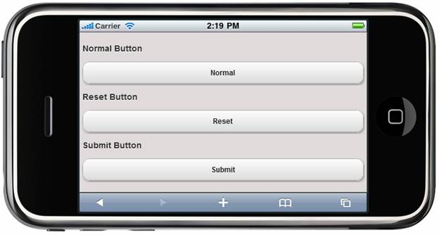

::: {style="DISPLAY: none"}
{#d2h_url_template} {#d2h_package_url style="WIDTH: 0px; DISPLAY: none; HEIGHT: 0px"}
:::

::: {.d2h_secondary_topic style="PADDING-BOTTOM: 10pt; MARGIN: 0pt; PADDING-LEFT: 0pt; PADDING-RIGHT: 0pt; PADDING-TOP: 0pt"}
##### Button Type {#button-type style="tab-stops: 0pt"}

The user can decide the button type of the button control while rendering the control via the **ButtonType** property.[]{style="FONT-FAMILY: Consolas; FONT-SIZE: 9.5pt"}

 

+-------------+------------------------------------------------------+------------------+-----------------------------+-------------+
| Name        | Description                                          | Type of Property | Value it Accepts            | Dependency  |
+-------------+------------------------------------------------------+------------------+-----------------------------+-------------+
| ButtonType  | Button---Create an input-type button of type Button. | Enum             | []{style="COLOR: #2b91af"}  | \-          |
|             |                                                      |                  |                             |             |
|             | Reset---Create an input-type button of type Reset.   |                  | []{style="COLOR: #2b91af"}  |             |
|             |                                                      |                  |                             |             |
|             | Submit---Create an input-type button of type Submit. |                  | MobButtonType.Button        |             |
|             |                                                      |                  |                             |             |
|             |                                                      |                  |                             |             |
|             |                                                      |                  |                             |             |
|             |                                                      |                  | MobButtonType.Reset         |             |
|             |                                                      |                  |                             |             |
|             |                                                      |                  |                             |             |
|             |                                                      |                  |                             |             |
|             |                                                      |                  | MobButtonType.Submit        |             |
|             |                                                      |                  |                             |             |
|             |                                                      |                  |                             |             |
|             |                                                      |                  |                             |             |
|             |                                                      |                  |                             |             |
+-------------+------------------------------------------------------+------------------+-----------------------------+-------------+

 

Using Builder

The following steps explain how to set the button type settings in the Form Button control using Builder.

 

1.   In the **view**, invoke the **Button** helper with the control ID as the first argument followed by the **ButtonType** methods with their respective text as desired by the user.

 

+---------------------------------------------------------------------------------------------------------------------------------------------------------------------------------------------------------------------------------------------------------------------------------------------------------------------------------------------------------------------+
| **[\[ASPX\]]{style="FONT-FAMILY: 'Courier New'"}**                                                                                                                                                                                                                                                                                                                  |
|                                                                                                                                                                                                                                                                                                                                                                     |
| [    ]{style="FONT-FAMILY: 'Courier New'"} [\<]{style="FONT-FAMILY: 'Courier New'; COLOR: blue"} [h3]{style="FONT-FAMILY: 'Courier New'; COLOR: maroon"} [\>]{style="FONT-FAMILY: 'Courier New'; COLOR: blue"} [Normal Button [\</]{style="COLOR: blue"}[h3]{style="COLOR: maroon"}[\>]{style="COLOR: blue"}]{style="FONT-FAMILY: 'Courier New'"}                   |
|                                                                                                                                                                                                                                                                                                                                                                     |
| [    [\<%]{style="BACKGROUND: yellow"}[=]{style="COLOR: blue"} Html.MobSyncfusion().Button([\"button\"]{style="COLOR: #a31515"}).ButtonType([MobButtonType]{style="COLOR: #2b91af"}.Button).Text([\"Normal\"]{style="COLOR: #a31515"}).AutoFormat([MobSkins]{style="COLOR: #2b91af"}.Spinach)[%\>]{style="BACKGROUND: yellow"}]{style="FONT-FAMILY: 'Courier New'"} |
|                                                                                                                                                                                                                                                                                                                                                                     |
| []{style="FONT-FAMILY: 'Courier New'"}                                                                                                                                                                                                                                                                                                                              |
|                                                                                                                                                                                                                                                                                                                                                                     |
| [    [\<]{style="COLOR: blue"}[h3]{style="COLOR: maroon"}[\>]{style="COLOR: blue"}Reset Button[\</]{style="COLOR: blue"}[h3]{style="COLOR: maroon"}[\>]{style="COLOR: blue"}]{style="FONT-FAMILY: 'Courier New'"}                                                                                                                                                   |
|                                                                                                                                                                                                                                                                                                                                                                     |
| [    [\<%]{style="BACKGROUND: yellow"}[=]{style="COLOR: blue"} Html.MobSyncfusion().Button([\"reset\"]{style="COLOR: #a31515"}).ButtonType([MobButtonType]{style="COLOR: #2b91af"}.Reset).Text([\"Reset\"]{style="COLOR: #a31515"}).AutoFormat([MobSkins]{style="COLOR: #2b91af"}.Spinach)[%\>]{style="BACKGROUND: yellow"}]{style="FONT-FAMILY: 'Courier New'"}    |
|                                                                                                                                                                                                                                                                                                                                                                     |
| []{style="FONT-FAMILY: 'Courier New'"}                                                                                                                                                                                                                                                                                                                              |
|                                                                                                                                                                                                                                                                                                                                                                     |
| [    [\<]{style="COLOR: blue"}[h3]{style="COLOR: maroon"}[\>]{style="COLOR: blue"}Submit Button[\</]{style="COLOR: blue"}[h3]{style="COLOR: maroon"}[\>]{style="COLOR: blue"}]{style="FONT-FAMILY: 'Courier New'"}                                                                                                                                                  |
|                                                                                                                                                                                                                                                                                                                                                                     |
| [    [\<%]{style="BACKGROUND: yellow"}[=]{style="COLOR: blue"} Html.MobSyncfusion().Button([\"submit\"]{style="COLOR: #a31515"}).ButtonType([MobButtonType]{style="COLOR: #2b91af"}.Submit).Text([\"Submit\"]{style="COLOR: #a31515"}).AutoFormat([MobSkins]{style="COLOR: #2b91af"}.Spinach)[%\>]{style="BACKGROUND: yellow"}]{style="FONT-FAMILY: 'Courier New'"} |
|                                                                                                                                                                                                                                                                                                                                                                     |
| **[]{style="FONT-FAMILY: 'Courier New'"}**                                                                                                                                                                                                                                                                                                                          |
|                                                                                                                                                                                                                                                                                                                                                                     |
| **[\[Razor\]]{style="FONT-FAMILY: 'Courier New'"}**                                                                                                                                                                                                                                                                                                                 |
|                                                                                                                                                                                                                                                                                                                                                                     |
| [    ]{style="FONT-FAMILY: 'Courier New'; COLOR: blue"} [\<]{style="FONT-FAMILY: 'Courier New'; COLOR: blue"} [h3]{style="FONT-FAMILY: 'Courier New'; COLOR: maroon"} [\>]{style="FONT-FAMILY: 'Courier New'; COLOR: blue"} [Normal Button [\</]{style="COLOR: blue"}[h3]{style="COLOR: maroon"}[\>]{style="COLOR: blue"}]{style="FONT-FAMILY: 'Courier New'"}      |
|                                                                                                                                                                                                                                                                                                                                                                     |
| [    [\@{]{style="BACKGROUND: yellow"} Html.MobSyncfusion().Button([\"button\"]{style="COLOR: #a31515"}).ButtonType([MobButtonType]{style="COLOR: #2b91af"}.Button).Text([\"Normal\"]{style="COLOR: #a31515"}).AutoFormat([MobSkins]{style="COLOR: #2b91af"}.Spinach).Render(); [}]{style="BACKGROUND: yellow"}]{style="FONT-FAMILY: 'Courier New'"}                |
|                                                                                                                                                                                                                                                                                                                                                                     |
| []{style="FONT-FAMILY: 'Courier New'"}                                                                                                                                                                                                                                                                                                                              |
|                                                                                                                                                                                                                                                                                                                                                                     |
| [    [\<]{style="COLOR: blue"}[h3]{style="COLOR: maroon"}[\>]{style="COLOR: blue"}Reset Button[\</]{style="COLOR: blue"}[h3]{style="COLOR: maroon"}[\>]{style="COLOR: blue"}]{style="FONT-FAMILY: 'Courier New'"}                                                                                                                                                   |
|                                                                                                                                                                                                                                                                                                                                                                     |
| [    [\@{]{style="BACKGROUND: yellow"} Html.MobSyncfusion().Button([\"reset\"]{style="COLOR: #a31515"}).ButtonType([MobButtonType]{style="COLOR: #2b91af"}.Reset).Text([\"Reset\"]{style="COLOR: #a31515"}).AutoFormat([MobSkins]{style="COLOR: #2b91af"}.Spinach).Render(); [}]{style="BACKGROUND: yellow"}]{style="FONT-FAMILY: 'Courier New'"}                   |
|                                                                                                                                                                                                                                                                                                                                                                     |
| []{style="FONT-FAMILY: 'Courier New'"}                                                                                                                                                                                                                                                                                                                              |
|                                                                                                                                                                                                                                                                                                                                                                     |
| [    [\<]{style="COLOR: blue"}[h3]{style="COLOR: maroon"}[\>]{style="COLOR: blue"}Submit Button[\</]{style="COLOR: blue"}[h3]{style="COLOR: maroon"}[\>]{style="COLOR: blue"}]{style="FONT-FAMILY: 'Courier New'"}                                                                                                                                                  |
|                                                                                                                                                                                                                                                                                                                                                                     |
| [    [\@{]{style="BACKGROUND: yellow"} Html.MobSyncfusion().Button([\"submit\"]{style="COLOR: #a31515"}).ButtonType([MobButtonType]{style="COLOR: #2b91af"}.Submit).Text([\"Submit\"]{style="COLOR: #a31515"}).AutoFormat([MobSkins]{style="COLOR: #2b91af"}.Spinach).Render(); [}]{style="BACKGROUND: yellow"}]{style="FONT-FAMILY: 'Courier New'"}                |
|                                                                                                                                                                                                                                                                                                                                                                     |
|                                                                                                                                                                                                                                                                                                                                                                     |
+---------------------------------------------------------------------------------------------------------------------------------------------------------------------------------------------------------------------------------------------------------------------------------------------------------------------------------------------------------------------+

 

2.   Build and run the application.

 

Using Properties Model

The following steps explain how to set the button type settings in the Form Button control using the properties model:

 

1.   In the **Controller**, create an instance of **MobButtonModel**, define the **ButtonType** property, and pass the instance through **ViewData** to the **view** as given below:**

+------------------------------------------------------------------------------------------------------------------------------------------------------------------------------------------------------------------------------+
| **[Controller]{style="FONT-FAMILY: 'Courier New'"}**                                                                                                                                                                         |
|                                                                                                                                                                                                                              |
| [       [public]{style="COLOR: blue"}[ActionResult]{style="COLOR: #2b91af"} Button()]{style="FONT-FAMILY: 'Courier New'"}                                                                                                    |
|                                                                                                                                                                                                                              |
| [        {]{style="FONT-FAMILY: 'Courier New'"}                                                                                                                                                                              |
|                                                                                                                                                                                                                              |
| [            [MobButtonModel]{style="COLOR: #2b91af"} model1 = [new]{style="COLOR: blue"}[MobButtonModel]{style="COLOR: #2b91af"}()]{style="FONT-FAMILY: 'Courier New'"}                                                     |
|                                                                                                                                                                                                                              |
|                        [{]{style="FONT-FAMILY: 'Courier New'"}                                                                                                                                                               |
|                                                                                                                                                                                                                              |
| [                ]{style="FONT-FAMILY: 'Courier New'"} [Text=[\"Normal\"]{style="COLOR: #a31515"},]{style="FONT-FAMILY: 'Courier New'"}                                                                                      |
|                                                                                                                                                                                                                              |
| [                ButtonType=]{style="FONT-FAMILY: 'Courier New'"} [ MobButtonType]{style="FONT-FAMILY: 'Courier New'; COLOR: #2b91af"} [.Button,]{style="FONT-FAMILY: 'Courier New'"} []{style="FONT-FAMILY: 'Courier New'"} |
|                                                                                                                                                                                                                              |
| [                AutoFormat=[MobSkins]{style="COLOR: #2b91af"}.Spinach]{style="FONT-FAMILY: 'Courier New'"}                                                                                                                  |
|                                                                                                                                                                                                                              |
| [            };]{style="FONT-FAMILY: 'Courier New'"}                                                                                                                                                                         |
|                                                                                                                                                                                                                              |
| []{style="FONT-FAMILY: 'Courier New'"}                                                                                                                                                                                       |
|                                                                                                                                                                                                                              |
| [             MobButtonModel]{style="FONT-FAMILY: 'Courier New'; COLOR: #2b91af"} [ model2 = [new]{style="COLOR: blue"}[MobButtonModel]{style="COLOR: #2b91af"}()]{style="FONT-FAMILY: 'Courier New'"}                       |
|                                                                                                                                                                                                                              |
|                        [{]{style="FONT-FAMILY: 'Courier New'"}                                                                                                                                                               |
|                                                                                                                                                                                                                              |
| [                ]{style="FONT-FAMILY: 'Courier New'"} [Text=[\"Reset\"]{style="COLOR: #a31515"},]{style="FONT-FAMILY: 'Courier New'"}                                                                                       |
|                                                                                                                                                                                                                              |
| [                ButtonType=]{style="FONT-FAMILY: 'Courier New'"} [ MobButtonType]{style="FONT-FAMILY: 'Courier New'; COLOR: #2b91af"} [.Reset]{style="FONT-FAMILY: 'Courier New'"},[]{style="FONT-FAMILY: 'Courier New'"}   |
|                                                                                                                                                                                                                              |
| [                AutoFormat=[MobSkins]{style="COLOR: #2b91af"}.Spinach]{style="FONT-FAMILY: 'Courier New'"}                                                                                                                  |
|                                                                                                                                                                                                                              |
| [            };]{style="FONT-FAMILY: 'Courier New'"}                                                                                                                                                                         |
|                                                                                                                                                                                                                              |
| []{style="FONT-FAMILY: 'Courier New'"}                                                                                                                                                                                       |
|                                                                                                                                                                                                                              |
| [            MobButtonModel]{style="FONT-FAMILY: 'Courier New'; COLOR: #2b91af"} [ model3 = [new]{style="COLOR: blue"}[MobButtonModel]{style="COLOR: #2b91af"}()]{style="FONT-FAMILY: 'Courier New'"}                        |
|                                                                                                                                                                                                                              |
|                        [{]{style="FONT-FAMILY: 'Courier New'"}                                                                                                                                                               |
|                                                                                                                                                                                                                              |
| [                ]{style="FONT-FAMILY: 'Courier New'"} [Text=[\"Submit\"]{style="COLOR: #a31515"},]{style="FONT-FAMILY: 'Courier New'"}                                                                                      |
|                                                                                                                                                                                                                              |
| [                ButtonType=]{style="FONT-FAMILY: 'Courier New'"} [ MobButtonType]{style="FONT-FAMILY: 'Courier New'; COLOR: #2b91af"} [.Submit]{style="FONT-FAMILY: 'Courier New'"},[]{style="FONT-FAMILY: 'Courier New'"}  |
|                                                                                                                                                                                                                              |
| [                AutoFormat=[MobSkins]{style="COLOR: #2b91af"}.Spinach]{style="FONT-FAMILY: 'Courier New'"}                                                                                                                  |
|                                                                                                                                                                                                                              |
| [            };]{style="FONT-FAMILY: 'Courier New'"}                                                                                                                                                                         |
|                                                                                                                                                                                                                              |
| []{style="FONT-FAMILY: 'Courier New'"}                                                                                                                                                                                       |
|                                                                                                                                                                                                                              |
| [            ViewData\[[\"button\"]{style="COLOR: #a31515"}\] = model1;]{style="FONT-FAMILY: 'Courier New'"}                                                                                                                 |
|                                                                                                                                                                                                                              |
| [            ViewData\[[\"reset\"]{style="COLOR: #a31515"}\] = model2;]{style="FONT-FAMILY: 'Courier New'"}                                                                                                                  |
|                                                                                                                                                                                                                              |
| [            ViewData\[[\"submit\"]{style="COLOR: #a31515"}\] = model3;]{style="FONT-FAMILY: 'Courier New'"}                                                                                                                 |
|                                                                                                                                                                                                                              |
| []{style="FONT-FAMILY: 'Courier New'"}                                                                                                                                                                                       |
|                                                                                                                                                                                                                              |
| [            [return]{style="COLOR: blue"} View();]{style="FONT-FAMILY: 'Courier New'"}                                                                                                                                      |
|                                                                                                                                                                                                                              |
| [        }]{style="FONT-FAMILY: 'Courier New'"}                                                                                                                                                                              |
+------------------------------------------------------------------------------------------------------------------------------------------------------------------------------------------------------------------------------+

 

2.   In the **view**, invoke the **Button** helper with the **ViewData** key as the first argument.

 

+----------------------------------------------------------------------------------------------------------------------------------------------------------------------------------------------------------------------------------------------------------------------------------------------------------------------------------------------+
| **[\[ASPX\]]{style="FONT-FAMILY: 'Courier New'"}**                                                                                                                                                                                                                                                                                           |
|                                                                                                                                                                                                                                                                                                                                              |
| [       [\<%]{style="BACKGROUND: yellow"}[=]{style="COLOR: blue"}Html.MobSyncfusion().Button]{style="FONT-FAMILY: 'Courier New'"} [([\"button\"]{style="COLOR: #a31515"}]{style="FONT-FAMILY: 'Courier New'"} [)[%\>]{style="BACKGROUND: yellow"}]{style="FONT-FAMILY: 'Courier New'"}                                                       |
|                                                                                                                                                                                                                                                                                                                                              |
| [       [\<%]{style="BACKGROUND: yellow"}[=]{style="COLOR: blue"}Html.MobSyncfusion().Button]{style="FONT-FAMILY: 'Courier New'"} [([\"reset\"]{style="COLOR: #a31515"}]{style="FONT-FAMILY: 'Courier New'"} [)[%\>]{style="BACKGROUND: yellow"}]{style="FONT-FAMILY: 'Courier New'"}                                                        |
|                                                                                                                                                                                                                                                                                                                                              |
| **[ ]{style="FONT-FAMILY: 'Courier New'"}** [      [\<%]{style="BACKGROUND: yellow"}[=]{style="COLOR: blue"}Html.MobSyncfusion().Button]{style="FONT-FAMILY: 'Courier New'"} [([\"submit\"]{style="COLOR: #a31515"}]{style="FONT-FAMILY: 'Courier New'"} [)[%\>]{style="BACKGROUND: yellow"}]{style="FONT-FAMILY: 'Courier New'"}            |
|                                                                                                                                                                                                                                                                                                                                              |
| []{style="FONT-FAMILY: 'Courier New'"}                                                                                                                                                                                                                                                                                                       |
|                                                                                                                                                                                                                                                                                                                                              |
| **[]{style="FONT-FAMILY: 'Courier New'"}**                                                                                                                                                                                                                                                                                                   |
|                                                                                                                                                                                                                                                                                                                                              |
| **[\[Razor\]]{style="FONT-FAMILY: 'Courier New'"}**                                                                                                                                                                                                                                                                                          |
|                                                                                                                                                                                                                                                                                                                                              |
| [       ]{style="FONT-FAMILY: 'Courier New'"} [\@{]{style="FONT-FAMILY: 'Courier New'; BACKGROUND: yellow"} [ Html.MobSyncfusion().Button]{style="FONT-FAMILY: 'Courier New'"} [([\"button\"]{style="COLOR: #a31515"}]{style="FONT-FAMILY: 'Courier New'"} [).Render(); [}]{style="BACKGROUND: yellow"}]{style="FONT-FAMILY: 'Courier New'"} |
|                                                                                                                                                                                                                                                                                                                                              |
| [       [\@{]{style="BACKGROUND: yellow"} Html.MobSyncfusion().Button]{style="FONT-FAMILY: 'Courier New'"} [([\"reset\"]{style="COLOR: #a31515"}]{style="FONT-FAMILY: 'Courier New'"} [).Render(); [}]{style="BACKGROUND: yellow"}]{style="FONT-FAMILY: 'Courier New'"}                                                                      |
|                                                                                                                                                                                                                                                                                                                                              |
| [       [\@{]{style="BACKGROUND: yellow"} Html.MobSyncfusion().Button]{style="FONT-FAMILY: 'Courier New'"} [([\"submit\"]{style="COLOR: #a31515"}]{style="FONT-FAMILY: 'Courier New'"} [).Render(); [}]{style="BACKGROUND: yellow"}]{style="FONT-FAMILY: 'Courier New'"}                                                                     |
+----------------------------------------------------------------------------------------------------------------------------------------------------------------------------------------------------------------------------------------------------------------------------------------------------------------------------------------------+

[]{style="BACKGROUND: yellow"} 

3.   Build and run the application.

 

The output is shown in the following screenshot.

{border="0"}

Figure 212: Button---ButtonType Properties

[]{#related-topics}
:::
