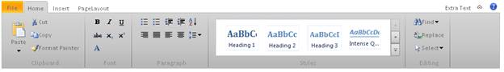

::: {style="DISPLAY: none"}
{#d2h_url_template}{#d2h_package_url style="WIDTH: 0px; DISPLAY: none; HEIGHT: 0px"}
:::

:::: {.d2h_secondary_topic style="PADDING-BOTTOM: 10pt; MARGIN: 0pt; PADDING-LEFT: 0pt; PADDING-RIGHT: 0pt; PADDING-TOP: 0pt"}
#### ButtonTypes {#buttontypes style="tab-stops: 0pt"}

 

::: {align="center"}
  ------------------ ------------------------------------------------------------------------------------------------------------------------------------------------------- ---------------
  **Property**       **Description**                                                                                                                                         **Data Type**
  ShowHelpButton     Gets and sets the Boolean value to allow the button to be visible or hidden. Default value is True.                                                     Boolean
  ShowToggleButton   Gets and sets the Boolean value to allow the toggle button (which is used to hide or show the ribbon) to be visible or hidden. Default value is True.   Boolean
  ------------------ ------------------------------------------------------------------------------------------------------------------------------------------------------- ---------------
:::

 

Using Builder

The following steps explain how to set different buttons through the builder.

1.   In the **view**, invoke the ribbon helper followed by the **ShowToggleButton** and **ShowHelpButton** methods with the Boolean value as an argument.

[]{style="FONT-FAMILY: Consolas; FONT-SIZE: 9.5pt"} 

+--------------------------------------------------------------------------------------------------------------------------------------------------------------------------------------------------------------------------------------------------------------------------------------------------------------------------------------------------------------------------------------------------------------------------------------------------------------------------------------+
| **[\[ASPX\]]{style="FONT-FAMILY: 'Courier New'"}**                                                                                                                                                                                                                                                                                                                                                                                                                                   |
|                                                                                                                                                                                                                                                                                                                                                                                                                                                                                      |
| [\<%]{style="FONT-FAMILY: Consolas; BACKGROUND: yellow; FONT-SIZE: 9.5pt"}[Html.Syncfusion().Ribbon([\"ribbon2\"]{style="COLOR: #a31515"}).Height([Unit]{style="COLOR: #2b91af"}.Pixel(155)).ShowHelpButton([true]{style="COLOR: blue"}).ShowHelpButton([true]{style="COLOR: blue"}).Width([Unit]{style="COLOR: #2b91af"}.Pixel(500)).Render();[%\>]{style="BACKGROUND: yellow"}]{style="FONT-FAMILY: Consolas; FONT-SIZE: 9.5pt"}                                                   |
|                                                                                                                                                                                                                                                                                                                                                                                                                                                                                      |
| []{style="FONT-FAMILY: Consolas; FONT-SIZE: 9.5pt"}                                                                                                                                                                                                                                                                                                                                                                                                                                  |
|                                                                                                                                                                                                                                                                                                                                                                                                                                                                                      |
| [\[Razor\]]{style="FONT-FAMILY: Consolas; FONT-SIZE: 9.5pt"}                                                                                                                                                                                                                                                                                                                                                                                                                         |
|                                                                                                                                                                                                                                                                                                                                                                                                                                                                                      |
| [\@{]{style="FONT-FAMILY: Consolas; BACKGROUND: yellow; FONT-SIZE: 9.5pt"}[Html.Syncfusion().Ribbon([\"ribbon2\"]{style="COLOR: #a31515"}).Height(System.Web.UI.WebControls.[Unit]{style="COLOR: #2b91af"}.Pixel(155)).ShowHelpButton([true]{style="COLOR: blue"}).ShowHelpButton([true]{style="COLOR: blue"}).Width(System.Web.UI.WebControls.[Unit]{style="COLOR: #2b91af"}.Pixel(500)).Render();[}]{style="BACKGROUND: yellow"}]{style="FONT-FAMILY: Consolas; FONT-SIZE: 9.5pt"} |
|                                                                                                                                                                                                                                                                                                                                                                                                                                                                                      |
| []{style="FONT-FAMILY: Consolas; BACKGROUND: yellow; FONT-SIZE: 9.5pt"}                                                                                                                                                                                                                                                                                                                                                                                                              |
+--------------------------------------------------------------------------------------------------------------------------------------------------------------------------------------------------------------------------------------------------------------------------------------------------------------------------------------------------------------------------------------------------------------------------------------------------------------------------------------+

 

2.   Build and run the application.

 

{border="0"}

Figure 196: Ribbon Control with Toggle and Help Buttons

[]{#related-topics}
::::
