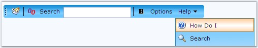
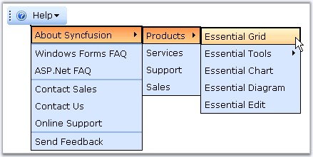

::: {style="DISPLAY: none"}
{#d2h_url_template}{#d2h_package_url style="WIDTH: 0px; DISPLAY: none; HEIGHT: 0px"}
:::

:::::: {.d2h_secondary_topic style="PADDING-BOTTOM: 10pt; MARGIN: 0pt; PADDING-LEFT: 0pt; PADDING-RIGHT: 0pt; PADDING-TOP: 0pt"}
##### Button Type Settings {#button-type-settings style="tab-stops: 0pt"}

[]{style="FONT-FAMILY: 'Trebuchet MS','sans-serif'; COLOR: #15428b; FONT-SIZE: 9pt"} 

The **ButtonType** property enables to customize the type of the buttons used in the toolbar. Every button on the toolbar can be altered independently to display either Regular or Toggle or DropDown button types.

[]{style="FONT-FAMILY: 'Trebuchet MS','sans-serif'; COLOR: #15428b; FONT-SIZE: 9pt"} 

::: {align="center"}
+-----------------------------------+-------------------------------------------------------------------------+
| ToolBar Item Property             | Description                                                             |
+-----------------------------------+-------------------------------------------------------------------------+
| ButtonType                        | Specifies the toolbar button type. The options included are as follows: |
|                                   |                                                                         |
|                                   | [·      ]{style="FONT-FAMILY: Symbol"}RegularButton                     |
|                                   |                                                                         |
|                                   | [·      ]{style="FONT-FAMILY: Symbol"}ToggleButton                      |
|                                   |                                                                         |
|                                   | [·      ]{style="FONT-FAMILY: Symbol"}DropDown                          |
+-----------------------------------+-------------------------------------------------------------------------+
:::

[]{style="FONT-FAMILY: 'Trebuchet MS','sans-serif'; COLOR: #15428b; FONT-SIZE: 9pt"} 

Programmatically the button types can be changed as follows.

[]{style="FONT-FAMILY: 'Trebuchet MS','sans-serif'; COLOR: #15428b; FONT-SIZE: 9pt"} 

+-------------------------------------------------------------------------------------------------------------------------------+
| **[\[C#\]]{style="FONT-FAMILY: 'Courier New'; FONT-SIZE: 9pt"}**                                                              |
|                                                                                                                               |
| []{style="FONT-FAMILY: 'Courier New'; FONT-SIZE: 9pt"}                                                                        |
|                                                                                                                               |
| [ToolBar1.ButtonType = [ToolBarButtonType]{style="COLOR: teal"}.Regular;]{style="FONT-FAMILY: 'Courier New'; FONT-SIZE: 9pt"} |
+-------------------------------------------------------------------------------------------------------------------------------+

[]{style="FONT-FAMILY: 'Trebuchet MS','sans-serif'; COLOR: #15428b; FONT-SIZE: 9pt"} 

+----------------------------------------------------------------------------------------------------------------------------------------------------------------------------------+
| **[\[VB\]]{style="FONT-FAMILY: 'Courier New'; FONT-SIZE: 9pt"}**                                                                                                                 |
|                                                                                                                                                                                  |
| []{style="FONT-FAMILY: 'Courier New'; FONT-SIZE: 9pt"}                                                                                                                           |
|                                                                                                                                                                                  |
| [Private]{style="FONT-FAMILY: 'Courier New'; COLOR: blue; FONT-SIZE: 9pt"}[ ToolBar1.ButtonType = ToolBarButtonType.Regular]{style="FONT-FAMILY: 'Courier New'; FONT-SIZE: 9pt"} |
+----------------------------------------------------------------------------------------------------------------------------------------------------------------------------------+

[]{style="FONT-FAMILY: 'Trebuchet MS','sans-serif'; COLOR: #15428b; FONT-SIZE: 9pt"} 

Regular Button

**[]{style="FONT-FAMILY: 'Trebuchet MS','sans-serif'; COLOR: #15428b; FONT-SIZE: 9pt"}** 

This option displays the regular buttons on the toolbar.

[]{style="FONT-FAMILY: 'Trebuchet MS','sans-serif'; COLOR: #15428b; FONT-SIZE: 9pt"} 

{border="0"}

**[]{style="FONT-FAMILY: 'Trebuchet MS','sans-serif'; COLOR: #15428b; FONT-SIZE: 9pt"}** 

Figure 263: Regular ButtonType

[]{style="FONT-FAMILY: 'Trebuchet MS','sans-serif'; COLOR: #15428b; FONT-SIZE: 9pt"} 

Toggle Button

[]{style="FONT-FAMILY: 'Trebuchet MS','sans-serif'; COLOR: #15428b; FONT-SIZE: 9pt"} 

This option displays the toggle buttons on the toolbar. To achieve the radio-button functionality, individual toggle buttons can be combined as a group.

[]{style="FONT-FAMILY: 'Trebuchet MS','sans-serif'; COLOR: #15428b; FONT-SIZE: 9pt"} 

{border="0"}

**[]{style="FONT-FAMILY: 'Trebuchet MS','sans-serif'; COLOR: #15428b; FONT-SIZE: 9pt"}** 

Figure 264: Toggle ButtonType

[]{style="FONT-FAMILY: 'Trebuchet MS','sans-serif'; COLOR: #15428b; FONT-SIZE: 9pt"} 

For the toggle buttons, initially the buttons can be maintained in pushed or selected state by enabling the pushed property.

[]{style="FONT-FAMILY: 'Trebuchet MS','sans-serif'; COLOR: #15428b; FONT-SIZE: 9pt"} 

::: {align="center"}
+-----------------------------------+-------------------------------------------------------+
|                                   |                                                       |
|                                   |                                                       |
| Property                          | Description                                           |
+-----------------------------------+-------------------------------------------------------+
| Pushed                            | Specifies whether the pushed state is enabled or not. |
+-----------------------------------+-------------------------------------------------------+
:::

[]{style="FONT-FAMILY: 'Trebuchet MS','sans-serif'; COLOR: #15428b; FONT-SIZE: 9pt"} 

Programmatically a toggle button can set by default in the pushed state as follows.

[]{style="FONT-FAMILY: 'Trebuchet MS','sans-serif'; COLOR: #15428b; FONT-SIZE: 9pt"} 

+------------------------------------------------------------------------------------------------------+
| **[\[C#\]]{style="FONT-FAMILY: 'Courier New'; FONT-SIZE: 9pt"}**                                     |
|                                                                                                      |
| []{style="FONT-FAMILY: 'Courier New'; FONT-SIZE: 9pt"}                                               |
|                                                                                                      |
| [ToolBar1.Pushed = [true]{style="COLOR: blue"};]{style="FONT-FAMILY: 'Courier New'; FONT-SIZE: 9pt"} |
+------------------------------------------------------------------------------------------------------+

[]{style="FONT-FAMILY: 'Trebuchet MS','sans-serif'; COLOR: #15428b; FONT-SIZE: 9pt"} 

+--------------------------------------------------------------------------------------------------------------------------------------------------------------------------------+
| **[\[VB\]]{style="FONT-FAMILY: 'Courier New'; FONT-SIZE: 9pt"}**                                                                                                               |
|                                                                                                                                                                                |
| []{style="FONT-FAMILY: 'Courier New'; FONT-SIZE: 9pt"}                                                                                                                         |
|                                                                                                                                                                                |
| [Private]{style="FONT-FAMILY: 'Courier New'; COLOR: blue; FONT-SIZE: 9pt"}[ ToolBar1.Pushed = [True]{style="COLOR: blue"}]{style="FONT-FAMILY: 'Courier New'; FONT-SIZE: 9pt"} |
+--------------------------------------------------------------------------------------------------------------------------------------------------------------------------------+

[]{style="FONT-FAMILY: 'Trebuchet MS','sans-serif'; COLOR: #15428b; FONT-SIZE: 9pt"} 

Toolbar toggle button type items can be set in the pushed or unpushed state using the following methods.

[]{style="FONT-FAMILY: 'Trebuchet MS','sans-serif'; COLOR: #15428b; FONT-SIZE: 9pt"} 

::: {align="center"}
+-----------------------+-----------------------+------------------------------------------------------------------------------------+
| Method                | Parameter             | Description                                                                        |
+-----------------------+-----------------------+------------------------------------------------------------------------------------+
| Push                  | obj, oEv, bool        | Sets item into pushing state.                                                      |
|                       |                       |                                                                                    |
|                       |                       | First parameter is identifier of HTML-element, index of item array or item object. |
|                       |                       |                                                                                    |
|                       |                       | Second parameter represents event.                                                 |
|                       |                       |                                                                                    |
|                       |                       | If third parameter is true then ClientSideOnItemSelect will be called.             |
+-----------------------+-----------------------+------------------------------------------------------------------------------------+
| UnPush                | obj, oEv, bool        | Sets item into unpushing state.                                                    |
|                       |                       |                                                                                    |
|                       |                       | First parameter is identifier of HTML-element, index of item array or item object. |
|                       |                       |                                                                                    |
|                       |                       | Second parameter represents event.                                                 |
|                       |                       |                                                                                    |
|                       |                       | If third parameter is true then ClientSideOnItemSelect will be called.             |
+-----------------------+-----------------------+------------------------------------------------------------------------------------+
:::

[]{style="FONT-FAMILY: 'Trebuchet MS','sans-serif'; COLOR: #15428b; FONT-SIZE: 9pt"} 

Here, on button click, the respective Pushed and UnPushed events will be triggered.

[]{style="FONT-FAMILY: 'Trebuchet MS','sans-serif'; COLOR: #15428b; FONT-SIZE: 9pt"} 

+--------------------------------------------------------------------------------------------------------------------------------------------------------------------------------------------------------------------------------------------------------------------------------+
| **[\[script\]]{style="FONT-FAMILY: 'Courier New'; FONT-SIZE: 9pt"}**                                                                                                                                                                                                           |
|                                                                                                                                                                                                                                                                                |
| []{style="FONT-FAMILY: 'Courier New'; FONT-SIZE: 9pt"}                                                                                                                                                                                                                         |
|                                                                                                                                                                                                                                                                                |
| [\<]{style="FONT-FAMILY: 'Courier New'; COLOR: blue; FONT-SIZE: 9pt"}[script]{style="FONT-FAMILY: 'Courier New'; COLOR: maroon; FONT-SIZE: 9pt"}[ [type]{style="COLOR: red"}[=\"text/javascript\"\>]{style="COLOR: blue"}]{style="FONT-FAMILY: 'Courier New'; FONT-SIZE: 9pt"} |
|                                                                                                                                                                                                                                                                                |
| [    [function]{style="COLOR: blue"} PushItem()]{style="FONT-FAMILY: 'Courier New'; FONT-SIZE: 9pt"}                                                                                                                                                                           |
|                                                                                                                                                                                                                                                                                |
| [    {]{style="FONT-FAMILY: 'Courier New'; FONT-SIZE: 9pt"}                                                                                                                                                                                                                    |
|                                                                                                                                                                                                                                                                                |
| [        toolbar.Push([\"Toolbar1_Item1\"]{style="COLOR: maroon"}, [null]{style="COLOR: blue"}, [true]{style="COLOR: blue"});]{style="FONT-FAMILY: 'Courier New'; FONT-SIZE: 9pt"}                                                                                             |
|                                                                                                                                                                                                                                                                                |
| [    }]{style="FONT-FAMILY: 'Courier New'; FONT-SIZE: 9pt"}                                                                                                                                                                                                                    |
|                                                                                                                                                                                                                                                                                |
| [    [function]{style="COLOR: blue"} UnPushItem()]{style="FONT-FAMILY: 'Courier New'; FONT-SIZE: 9pt"}                                                                                                                                                                         |
|                                                                                                                                                                                                                                                                                |
| [    {]{style="FONT-FAMILY: 'Courier New'; FONT-SIZE: 9pt"}                                                                                                                                                                                                                    |
|                                                                                                                                                                                                                                                                                |
| [        toolbar.UnPush([\"Toolbar1_Item1\"]{style="COLOR: maroon"}, [null]{style="COLOR: blue"}, [true]{style="COLOR: blue"});]{style="FONT-FAMILY: 'Courier New'; FONT-SIZE: 9pt"}                                                                                           |
|                                                                                                                                                                                                                                                                                |
| [    }]{style="FONT-FAMILY: 'Courier New'; FONT-SIZE: 9pt"}                                                                                                                                                                                                                    |
|                                                                                                                                                                                                                                                                                |
| [\</]{style="FONT-FAMILY: 'Courier New'; COLOR: blue; FONT-SIZE: 9pt"}[script]{style="FONT-FAMILY: 'Courier New'; COLOR: maroon; FONT-SIZE: 9pt"}[\>]{style="FONT-FAMILY: 'Courier New'; COLOR: blue; FONT-SIZE: 9pt"}                                                         |
+--------------------------------------------------------------------------------------------------------------------------------------------------------------------------------------------------------------------------------------------------------------------------------+

[]{style="FONT-FAMILY: 'Trebuchet MS','sans-serif'; COLOR: #15428b; FONT-SIZE: 9pt"} 

+-----------------------------------------------------------------------------------------------------------------------------------------------------------------------------------------------------------------------------------------------------------------------------------------------------------------------------------------------------------------------------------------------------------------------------------------------------------------------------------------------------------------------------------------------------------------------------------------------------------------------------------------+
| **[\[VB\]]{style="FONT-FAMILY: 'Courier New'; FONT-SIZE: 9pt"}**                                                                                                                                                                                                                                                                                                                                                                                                                                                                                                                                                                        |
|                                                                                                                                                                                                                                                                                                                                                                                                                                                                                                                                                                                                                                         |
| []{style="FONT-FAMILY: 'Courier New'; FONT-SIZE: 9pt"}                                                                                                                                                                                                                                                                                                                                                                                                                                                                                                                                                                                  |
|                                                                                                                                                                                                                                                                                                                                                                                                                                                                                                                                                                                                                                         |
| [\<]{style="FONT-FAMILY: 'Courier New'; COLOR: blue; FONT-SIZE: 9pt"}[cc1]{style="FONT-FAMILY: 'Courier New'; COLOR: maroon; FONT-SIZE: 9pt"}[:]{style="FONT-FAMILY: 'Courier New'; COLOR: blue; FONT-SIZE: 9pt"}[ToolBar]{style="FONT-FAMILY: 'Courier New'; COLOR: maroon; FONT-SIZE: 9pt"}[ [ID]{style="COLOR: red"}[=\"ToolBar1\"]{style="COLOR: blue"} [runat]{style="COLOR: red"}[=\"server\"]{style="COLOR: blue"} [ClientObjectId]{style="COLOR: red"}[=\"toolbar\"]{style="COLOR: blue"} [AutoFormat]{style="COLOR: red"}[=\"Office2007 Luna Blue\"]{style="COLOR: blue"}]{style="FONT-FAMILY: 'Courier New'; FONT-SIZE: 9pt"} |
|                                                                                                                                                                                                                                                                                                                                                                                                                                                                                                                                                                                                                                         |
| [    [EnableCallbacks]{style="COLOR: red"}[=\"true\"\>]{style="COLOR: blue"}]{style="FONT-FAMILY: 'Courier New'; FONT-SIZE: 9pt"}                                                                                                                                                                                                                                                                                                                                                                                                                                                                                                       |
|                                                                                                                                                                                                                                                                                                                                                                                                                                                                                                                                                                                                                                         |
| [    \.....]{style="FONT-FAMILY: 'Courier New'; FONT-SIZE: 9pt"}                                                                                                                                                                                                                                                                                                                                                                                                                                                                                                                                                                        |
|                                                                                                                                                                                                                                                                                                                                                                                                                                                                                                                                                                                                                                         |
| [\</]{style="FONT-FAMILY: 'Courier New'; COLOR: blue; FONT-SIZE: 9pt"}[cc1]{style="FONT-FAMILY: 'Courier New'; COLOR: maroon; FONT-SIZE: 9pt"}[:]{style="FONT-FAMILY: 'Courier New'; COLOR: blue; FONT-SIZE: 9pt"}[ToolBar]{style="FONT-FAMILY: 'Courier New'; COLOR: maroon; FONT-SIZE: 9pt"}[\>]{style="FONT-FAMILY: 'Courier New'; COLOR: blue; FONT-SIZE: 9pt"}                                                                                                                                                                                                                                                                     |
|                                                                                                                                                                                                                                                                                                                                                                                                                                                                                                                                                                                                                                         |
| [\<]{style="FONT-FAMILY: 'Courier New'; COLOR: blue; FONT-SIZE: 9pt"}[input]{style="FONT-FAMILY: 'Courier New'; COLOR: maroon; FONT-SIZE: 9pt"}[ [type]{style="COLOR: red"}[=\"button\"]{style="COLOR: blue"} [onclick]{style="COLOR: red"}[=\"PushItem()\"]{style="COLOR: blue"} [value]{style="COLOR: red"}[=\"Push\"]{style="COLOR: blue"} [/\>]{style="COLOR: blue"}[&nbsp;]{style="COLOR: red"}]{style="FONT-FAMILY: 'Courier New'; FONT-SIZE: 9pt"}                                                                                                                                                                               |
|                                                                                                                                                                                                                                                                                                                                                                                                                                                                                                                                                                                                                                         |
| [\<]{style="FONT-FAMILY: 'Courier New'; COLOR: blue; FONT-SIZE: 9pt"}[input]{style="FONT-FAMILY: 'Courier New'; COLOR: maroon; FONT-SIZE: 9pt"}[ [type]{style="COLOR: red"}[=\"button\"]{style="COLOR: blue"} [onclick]{style="COLOR: red"}[=\"UnPushItem()\"]{style="COLOR: blue"} [value]{style="COLOR: red"}[=\"UnPush\"]{style="COLOR: blue"} [/\>]{style="COLOR: blue"}]{style="FONT-FAMILY: 'Courier New'; FONT-SIZE: 9pt"}                                                                                                                                                                                                       |
+-----------------------------------------------------------------------------------------------------------------------------------------------------------------------------------------------------------------------------------------------------------------------------------------------------------------------------------------------------------------------------------------------------------------------------------------------------------------------------------------------------------------------------------------------------------------------------------------------------------------------------------------+

[]{style="FONT-FAMILY: 'Trebuchet MS','sans-serif'; COLOR: #15428b; FONT-SIZE: 9pt"} 

DropDown Button

[]{style="FONT-FAMILY: 'Trebuchet MS','sans-serif'; COLOR: #15428b; FONT-SIZE: 9pt"} 

This option displays the dropdown button type for the toolbar items.

[]{style="FONT-FAMILY: 'Trebuchet MS','sans-serif'; COLOR: #15428b; FONT-SIZE: 9pt"} 

{border="0"}

[]{style="FONT-FAMILY: 'Trebuchet MS','sans-serif'; COLOR: #15428b; FONT-SIZE: 9pt"} 

Figure 265: DropDown ButtonType

[]{style="FONT-FAMILY: 'Trebuchet MS','sans-serif'; COLOR: #15428b; FONT-SIZE: 9pt"} 

See Also

[]{style="COLOR: black; FONT-SIZE: 8pt"} 

[Appearance Mode Settings]{.UGHyperlink}[]{.UGHyperlink}

 

[]{#related-topics}
::::::
