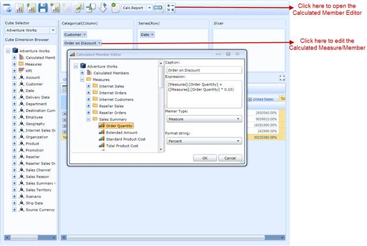

::: {style="DISPLAY: none"}
{#d2h_url_template}{#d2h_package_url style="WIDTH: 0px; DISPLAY: none; HEIGHT: 0px"}
:::

::::: {#nsbanner .d2h_main_nsbanner style="BORDER-BOTTOM: #999999 1px solid; POSITION: relative; PADDING-BOTTOM: 0px; BACKGROUND-COLOR: transparent; PADDING-LEFT: 0px; PADDING-RIGHT: 0px; DISPLAY: none; BORDER-TOP: #999999 1px solid; PADDING-TOP: 0px; LEFT: 0px"}
:::: {#TitleRow .d2h_main_titlerow style="PADDING-BOTTOM: 4px; BACKGROUND-COLOR: transparent; PADDING-LEFT: 22px; WIDTH: 100%; PADDING-RIGHT: 10px; DISPLAY: none; PADDING-TOP: 4px"}
::: {#ienav .d2h_main_ienav style="DISPLAY: none"}
{#D2HPrevious .D2HPreviousEnabled}  {#D2HNext .D2HNextEnabled}
:::
::::
:::::

:::: {#nstext .d2h_main_nstext style="PADDING-BOTTOM: 10px; BACKGROUND-COLOR: transparent; PADDING-LEFT: 22px; PADDING-RIGHT: 10px; HEIGHT: 100%; OVERFLOW: auto; PADDING-TOP: 5px" hasuserbackground="true" valign="bottom"}
::: {#d2h_breadcrumbs .d2h_breadcrumbs}
[Essential Studio User Guide Documentation](ms-xhelp:///?Id=12457748-09e3-4d74-a240-8e049cedf030){.d2h_breadcrumbsNormal}[ \> ]{.d2h_breadcrumbsLinkSeparator}[Business Intelligence Edition](ms-xhelp:///?Id=fdf33dd8-62b2-47b9-ad7b-fc50e590bca5){.d2h_breadcrumbsNormal}[ \> ]{.d2h_breadcrumbsLinkSeparator}[Essential BI Silverlight](ms-xhelp:///?Id=c006b39c-6aa2-4637-b7de-3e7b6cb3f9f9){.d2h_breadcrumbsNormal}[ \> ]{.d2h_breadcrumbsLinkSeparator}[Essential BI Client]{.d2h_breadcrumbsContentsOnly}[ \> ]{.d2h_breadcrumbsLinkSeparator}[Features](ms-xhelp:///?Id=4ae10797-e3a8-4270-b8ba-34441d2e1a3d){.d2h_breadcrumbsNormal}
:::

## Calculated Members UI Option in OlapClient Control {#calculated-members-ui-option-in-olapclient-control style="TEXT-ALIGN: justify; LINE-HEIGHT: 115%; tab-stops: 0pt"}

This feature allows the user to enable/disable, create, or edit the calculated members on the fly in the current OLAP report or current view of the OlapClient control. Using this feature, users can define measures and members they desire using the **Calculated Member Editor** (as shown in the following screenshot). The **Calculated Member Editor** dialog can be opened by clicking the button available in the toolbar of the OlapClient control.

 

{border="0"}

Figure 42: OlapClient with Calculated Member Editor Dialog

Use Case Scenarios

This feature can be used to add one or more measures that will be derived from the existing measure collection.

For example, the user can define discount on a measure called Order Quantity (and its unique name is \[Measures\].\[Order Quantity\]) by expressing the calculated measure "\[Measures\].\[Order Quantity\] + (0.1 \* \[Measures\].\[Order Quantity\])".

Property

Table 11: Property Table

  ---------------------------- ------------------------------------------------------------------------------ ------------ -----------
  Property                     Description                                                                    Type         Data Type
  IsCalculatedMembersEnabled   Gets or sets a value indicating whether calculated members are to be enabled   Dependency   Boolean
  ---------------------------- ------------------------------------------------------------------------------ ------------ -----------

[]{style="COLOR: #c00000"} 

Sample Link

Follow the steps given below to view the sample:

1.   Open **Syncfusion Dashboard**

2.   Navigate to **Business Intelligence**

3.   Select **Silverlight** item

4.   Click **Run Samples**

5.   Select **OlapClient**

6.   Select the **Product Showcase** feature list in left side tree

7.   Select **Calculated Members Demo**

 

Adding Calculated Members UI option to an Application

The following code snippet explains how to enable or disable the Calculated Members UI option in an OlapClient application:

+--------------------------------------------------------------------------------------------------------------------------------------------------------------------------------------------------------------------------------------------------------------------+
| **[\[C#\]]{style="FONT-FAMILY: 'Courier New'"}**                                                                                                                                                                                                                   |
|                                                                                                                                                                                                                                                                    |
| [////Enable the Calculated Members in current view of the OlapClient.]{style="FONT-FAMILY: 'Courier New'; COLOR: green"}[]{style="FONT-FAMILY: 'Courier New'; COLOR: black"}                                                                                       |
|                                                                                                                                                                                                                                                                    |
| [this]{style="FONT-FAMILY: 'Courier New'; COLOR: blue"}[.olapClient1.IsCalculatedMembersEnabled = ]{style="FONT-FAMILY: 'Courier New'; COLOR: black"}[true]{style="FONT-FAMILY: 'Courier New'; COLOR: blue"}[; ]{style="FONT-FAMILY: 'Courier New'; COLOR: black"} |
|                                                                                                                                                                                                                                                                    |
| [//if set false, then it will be disabled or all calculated members will be deleted from the current view of the OlapClient.]{style="FONT-FAMILY: 'Courier New'; COLOR: green"}                                                                                    |
+--------------------------------------------------------------------------------------------------------------------------------------------------------------------------------------------------------------------------------------------------------------------+

 

+--------------------------------------------------------------------------------------------------------------------------------------------------------------------------------------------------------------------------------+
| **[\[VB\]]{style="FONT-FAMILY: 'Courier New'"}**                                                                                                                                                                               |
|                                                                                                                                                                                                                                |
| [\'Enable the Calculated Members in ]{style="FONT-FAMILY: 'Courier New'; COLOR: green"}[current view of the OlapClient.]{style="FONT-FAMILY: 'Courier New'; COLOR: green"}[]{style="FONT-FAMILY: 'Courier New'; COLOR: black"} |
|                                                                                                                                                                                                                                |
|     Me.olapClient1.IsCalculatedMembersEnabled = True                                                                                                                                                                           |
|                                                                                                                                                                                                                                |
|     ''''if set false, then it will be disabled or all calculated members will be deleted from the current view of the OlapClient.                                                                                              |
+--------------------------------------------------------------------------------------------------------------------------------------------------------------------------------------------------------------------------------+

[]{style="FONT-FAMILY: Consolas; COLOR: black"} 

+------------------------------------------------------------------------------------------------------------------------------------------------------------------------------------------------------------------------+
|     [XAML]                                                                                                                                                                                                             |
|                                                                                                                                                                                                                        |
|     <CheckBox Name="chk_CalcMember  ToolTip="Enable/Disable Calculated Members" Content="Enable Calculated Members"      IsChecked="{Binding ElementName=olapClient1, Path=IsCalculatedMembersEnabled, Mode=TwoWay}"/> |
+------------------------------------------------------------------------------------------------------------------------------------------------------------------------------------------------------------------------+

 

[]{#related-topics}
::::
