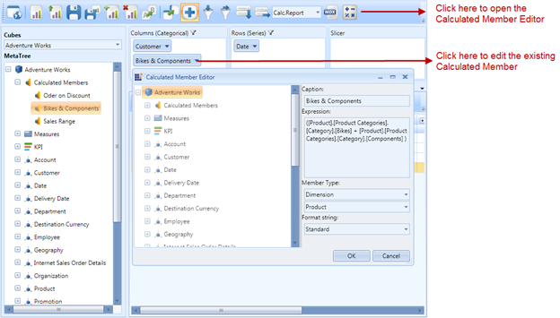

::: {style="DISPLAY: none"}
{#d2h_url_template} {#d2h_package_url style="WIDTH: 0px; DISPLAY: none; HEIGHT: 0px"}
:::

::::: {#nsbanner .d2h_main_nsbanner style="BORDER-BOTTOM: #999999 1px solid; POSITION: relative; PADDING-BOTTOM: 0px; BACKGROUND-COLOR: transparent; PADDING-LEFT: 0px; PADDING-RIGHT: 0px; DISPLAY: none; BORDER-TOP: #999999 1px solid; PADDING-TOP: 0px; LEFT: 0px"}
:::: {#TitleRow .d2h_main_titlerow style="PADDING-BOTTOM: 4px; BACKGROUND-COLOR: transparent; PADDING-LEFT: 22px; WIDTH: 100%; PADDING-RIGHT: 10px; DISPLAY: none; PADDING-TOP: 4px"}
::: {#ienav .d2h_main_ienav style="DISPLAY: none"}
{#D2HPrevious .D2HPreviousEnabled}  {#D2HNext .D2HNextEnabled}
:::
::::
:::::

:::: {#nstext .d2h_main_nstext style="PADDING-BOTTOM: 10px; BACKGROUND-COLOR: transparent; PADDING-LEFT: 22px; PADDING-RIGHT: 10px; HEIGHT: 100%; OVERFLOW: auto; PADDING-TOP: 5px" hasuserbackground="true" valign="bottom"}
::: {#d2h_breadcrumbs .d2h_breadcrumbs}
[Essential Studio User Guide Documentation](ms-xhelp:///?Id=12457748-09e3-4d74-a240-8e049cedf030){.d2h_breadcrumbsNormal} [ \> ]{.d2h_breadcrumbsLinkSeparator} [Business Intelligence Edition](ms-xhelp:///?Id=fdf33dd8-62b2-47b9-ad7b-fc50e590bca5){.d2h_breadcrumbsNormal} [ \> ]{.d2h_breadcrumbsLinkSeparator} [Essential BI WPF](ms-xhelp:///?Id=41e3d586-d922-4a01-8272-679fe4ae7343){.d2h_breadcrumbsNormal} [ \> ]{.d2h_breadcrumbsLinkSeparator} [Essential BI Client]{.d2h_breadcrumbsContentsOnly} [ \> ]{.d2h_breadcrumbsLinkSeparator} [Concepts and Features](ms-xhelp:///?Id=ac4d4da8-25e2-4317-98b8-e507a1eb5062){.d2h_breadcrumbsNormal}
:::

## Calculated Members UI Option in OlapClient Control {#calculated-members-ui-option-in-olapclient-control style="tab-stops: 0pt"}

This feature allows users to enable/disable, create, and edit the calculated members on the fly in the current OLAP report or current view of the OlapClient control. Using this feature, users can define measures and members as they wish using the **Calculated Member Editor** (as shown in the following image). The **Calculated Member Editor** dialog can be opened by clicking the button available in the toolbar of the OlapClient control.

 

{border="0"}

Figure 77: OlapClient with Calculated Member Editor

More:

[ ]{#related-topics}

[{border="0" align="absMiddle"}Use Case Scenarios](ms-xhelp:///?Id=8e031b9b-6ac2-416f-ba8e-961403ef4960){style="TEXT-DECORATION: none"}

[{border="0" align="absMiddle"}Properties](ms-xhelp:///?Id=a8be3e41-f820-4b04-a29e-91e00145f489){style="TEXT-DECORATION: none"}

[{border="0" align="absMiddle"}Sample Link](ms-xhelp:///?Id=d86767af-ad28-4c48-89fd-ee897069b9f5){style="TEXT-DECORATION: none"}

[{border="0" align="absMiddle"}Adding Calculated Members UI Option to an Application](ms-xhelp:///?Id=c0ae6625-0b05-47fd-a925-c357faec556d){style="TEXT-DECORATION: none"}
::::
