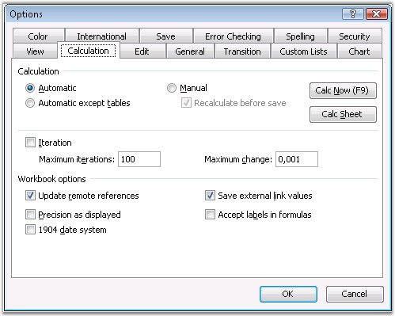

::: {style="DISPLAY: none"}
{#d2h_url_template}{#d2h_package_url style="WIDTH: 0px; DISPLAY: none; HEIGHT: 0px"}
:::

::: {.d2h_secondary_topic style="PADDING-BOTTOM: 10pt; MARGIN: 0pt; PADDING-LEFT: 0pt; PADDING-RIGHT: 0pt; PADDING-TOP: 0pt"}
#### Calculation Options {#calculation-options style="tab-stops: 0pt"}

**[]{style="FONT-FAMILY: 'Segoe UI','sans-serif'; COLOR: black"}** 

Excel has a range of options allowing you to control the way it calculates. To do this, open **Tools** menu, select **Options**, and click **Calculation** tab in the Options dialog box. By default, when one value is changed, the other cell that depends on this, immediately gets changed. This behavior can be changed by using the following Modes of Calculations.

[]{style="FONT-FAMILY: 'Trebuchet MS','sans-serif'; COLOR: #15428b; FONT-SIZE: 9pt"} 

[·      ]{style="FONT-FAMILY: Symbol"}Automatic

[·      ]{style="FONT-FAMILY: Symbol"}Automatic except for Tables

[·      ]{style="FONT-FAMILY: Symbol"}Manual

[]{style="FONT-FAMILY: 'Trebuchet MS','sans-serif'; COLOR: #15428b; FONT-SIZE: 9pt"} 

{border="0"}

Figure 120: Options Dialog Box- Calculation[]{style="FONT-FAMILY: 'Trebuchet MS','sans-serif'; COLOR: #15428b"}

[]{style="FONT-FAMILY: 'Trebuchet MS','sans-serif'; COLOR: #15428b; FONT-SIZE: 9pt"} 

Automatic Calculation

 

In the Automatic Calculation mode, Excel automatically recalculates all open workbooks at each and every change and whenever you open a workbook.

 

Usually when you open a workbook in Automatic mode, and recalculation is done, you will not be able to see the recalculation, because the changes will not be reflected until the workbook is saved. An exception is when you open a workbook in Excel 2000 that was saved by using Excel 97, or open a workbook by using Excel 2002/2003 saved by using Excel 2000. This is because Excel\'s calculation engines are different, and also because a Full calculation is done.

 

Manual Calculation

 

In the Manual Calculation mode, Excel will only recalculate all open workbooks, when you request it by pressing F9 or CTRL-ALT-F9, or when you Save a workbook. For workbooks taking more than a fraction of a second to recalculate, it is usually better to set the Calculation to \"Manual\".

 

Excel tells you when the workbook needs recalculation, by showing Calculate in the status bar.

 

Automatic Except Tables

 

Excel\'s Data Tables feature is designed to perform multiple calculations of the workbook, each driven by different values in the table. So using \"Automatic except Tables\" will stop Excel from automatically triggering multiple calculations at each calculation, but will still calculate all dependent formulae, except tables.

  

XlsIO provides support for all the above modes of calculation. Following code example illustrates how to set the calculation mode.

 

+-----------------------------------------------------------------------------------------------------------------------------------------------+
| **[\[C#\]]{style="FONT-FAMILY: 'Courier New'"}**                                                                                              |
|                                                                                                                                               |
| **[]{style="FONT-FAMILY: 'Courier New'"}**                                                                                                    |
|                                                                                                                                               |
| [IWorkbook]{style="FONT-FAMILY: 'Courier New'; COLOR: teal"}[ workbook = application.Workbooks.Create();]{style="FONT-FAMILY: 'Courier New'"} |
|                                                                                                                                               |
| [workbook.CalculationOptions.CalculationMode = [ExcelCalculationMode]{style="COLOR: teal"}.Manual;]{style="FONT-FAMILY: 'Courier New'"}       |
+-----------------------------------------------------------------------------------------------------------------------------------------------+

[]{style="FONT-FAMILY: 'Trebuchet MS','sans-serif'; COLOR: #15428b; FONT-SIZE: 9pt"} 

+----------------------------------------------------------------------------------------------------------------------------------------+
| **[\[VB.NET\]]{style="FONT-FAMILY: 'Courier New'"}**                                                                                   |
|                                                                                                                                        |
| **[]{style="FONT-FAMILY: 'Courier New'"}**                                                                                             |
|                                                                                                                                        |
| [Dim workbook as [IWorkbook]{style="COLOR: teal"} ]{style="FONT-FAMILY: 'Courier New'"}                                                |
|                                                                                                                                        |
| [workbook = application.Workbooks.Create()]{style="FONT-FAMILY: 'Courier New'"}                                                        |
|                                                                                                                                        |
| [workbook.CalculationOptions.CalculationMode = [ExcelCalculationMode]{style="COLOR: teal"}.Manual]{style="FONT-FAMILY: 'Courier New'"} |
+----------------------------------------------------------------------------------------------------------------------------------------+

 

There are other options that Excel provides to customize the calculation further.

 

Recalculate Before Save

 

In Manual mode, this option controls whether Excel will recalculate the workbook as part of the Save process. The default value is set to **True**. You can control this through XlsIO by using the **RecalcOnSave** property of **ICalculationOptions** interface.

 

Iteration

[]{style="FONT-FAMILY: 'Trebuchet MS','sans-serif'; COLOR: #15428b; FONT-SIZE: 9pt"} 

If you have intentional circular references in your workbook, these settings allow you to control the maximum number of times the workbook will be recalculated (iterations), and the convergence criteria (maximum change: when to stop). The default value should be set to False, so that Excel does not try to solve accidental circular references. XlsIO allows to control these iterations as follows.

[]{style="FONT-FAMILY: 'Trebuchet MS','sans-serif'; COLOR: #15428b; FONT-SIZE: 9pt"} 

+-----------------------------------------------------------------------------------------------------------------------------------------------+
| **[\[C#\]]{style="FONT-FAMILY: 'Courier New'"}**                                                                                              |
|                                                                                                                                               |
| **[]{style="FONT-FAMILY: 'Courier New'"}**                                                                                                    |
|                                                                                                                                               |
| [IWorkbook]{style="FONT-FAMILY: 'Courier New'; COLOR: teal"}[ workbook = application.Workbooks.Create();]{style="FONT-FAMILY: 'Courier New'"} |
|                                                                                                                                               |
| [workbook.CalculationOptions.IsIterationEnabled = [true]{style="COLOR: blue"};]{style="FONT-FAMILY: 'Courier New'"}                           |
|                                                                                                                                               |
| [workbook.CalculationOptions.MaximumIteration = 99;]{style="FONT-FAMILY: 'Courier New'"}                                                      |
|                                                                                                                                               |
| [workbook.CalculationOptions.MaximumChange = 40;]{style="FONT-FAMILY: 'Courier New'"}                                                         |
+-----------------------------------------------------------------------------------------------------------------------------------------------+

[]{style="FONT-FAMILY: 'Trebuchet MS','sans-serif'; COLOR: #15428b; FONT-SIZE: 9pt"} 

+---------------------------------------------------------------------------------------------------------------------+
| **[\[VB.NET\]]{style="FONT-FAMILY: 'Courier New'"}**                                                                |
|                                                                                                                     |
| **[]{style="FONT-FAMILY: 'Courier New'"}**                                                                          |
|                                                                                                                     |
| [Dim workbook as [IWorkbook]{style="COLOR: teal"} ]{style="FONT-FAMILY: 'Courier New'"}                             |
|                                                                                                                     |
| [workbook = application.Workbooks.Create()]{style="FONT-FAMILY: 'Courier New'"}                                     |
|                                                                                                                     |
| [workbook.CalculationOptions.IsIterationEnabled = [true]{style="COLOR: blue"};]{style="FONT-FAMILY: 'Courier New'"} |
|                                                                                                                     |
| [workbook.CalculationOptions.MaximumIteration = 99;]{style="FONT-FAMILY: 'Courier New'"}                            |
|                                                                                                                     |
| [workbook.CalculationOptions.MaximumChange = 40;]{style="FONT-FAMILY: 'Courier New'"}                               |
+---------------------------------------------------------------------------------------------------------------------+

 

[]{#related-topics}
:::
