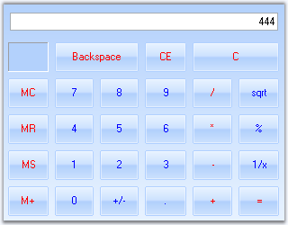

::: {style="DISPLAY: none"}
{#d2h_url_template}{#d2h_package_url style="WIDTH: 0px; DISPLAY: none; HEIGHT: 0px"}
:::

::: {.d2h_secondary_topic style="PADDING-BOTTOM: 10pt; MARGIN: 0pt; PADDING-LEFT: 0pt; PADDING-RIGHT: 0pt; PADDING-TOP: 0pt"}
#### CalculatorControl {#calculatorcontrol style="tab-stops: 0pt"}

 

[]{#p245}The Essential Tools **CalculatorControl** encapsulates the functionality of a standard calculator. It provides an easy way to implement a complete calculator in your applications. The value of the CalculatorControl in the form is maintained internally and also provides the value in the format required. The **CalculatorValue** class provides methods to get the value of the CalculatorControl as a **String** or as a **Double** Value. It supports Office2007 color schemes.

[]{style="FONT-SIZE: 8pt"} 

[]{style="FONT-SIZE: 8pt"} 

{border="0"}

Figure 185: Essential Tools Calculator Control

 

 

More:

[ ]{#related-topics}

[{border="0" align="absMiddle"}Features](ms-xhelp:///?Id=c42a0d52-aa82-4e53-a354-c1684263f59d){style="TEXT-DECORATION: none"}

[{border="0" align="absMiddle"}Creating Calculator control](ms-xhelp:///?Id=b3df109c-50ee-4fdd-8178-4b4cab15b013){style="TEXT-DECORATION: none"}

[{border="0" align="absMiddle"}Concepts and Features](ms-xhelp:///?Id=e154c94e-74d5-4d53-a937-aab417ad8a5c){style="TEXT-DECORATION: none"}

[{border="0" align="absMiddle"}Calculator Events](ms-xhelp:///?Id=fea1ebf5-2d0a-4c4e-8313-f5fd83d7b531){style="TEXT-DECORATION: none"}

[{border="0" align="absMiddle"}Frequently Asked Questions](ms-xhelp:///?Id=f0d2d85b-fb60-47cc-894b-9acf213348ef){style="TEXT-DECORATION: none"}
:::
