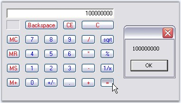
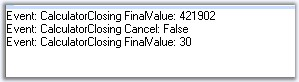

::: {style="DISPLAY: none"}
{#d2h_url_template}{#d2h_package_url style="WIDTH: 0px; DISPLAY: none; HEIGHT: 0px"}
:::

:::: {.d2h_secondary_topic style="PADDING-BOTTOM: 10pt; MARGIN: 0pt; PADDING-LEFT: 0pt; PADDING-RIGHT: 0pt; PADDING-TOP: 0pt"}
##### Calculator Events {#calculator-events style="tab-stops: 0pt"}

 

The event for Calculator control and PopupCalculator control are discussed in this section.

[]{style="COLOR: #15428b"} 

###### []{#p262}[]{#_ValueCalculated_Event}3.3.2.3.4.1 ValueCalculated Event {#valuecalculated-event style="tab-stops: 0pt"}

[]{style="COLOR: #15428b"} 

The **ValueCalculated** event fires each time the value of the CalculatorControl is changed. That is, even if you just press any digit, this event will be handled.

 

The event  handler receives an argument of type CalculatorValueCalculatedEventArgs. To get the final result, use **LastAction** property of the CalculatorValueCalculatedEventArgs in the ValueCalculated event.

 

::: {align="center"}
  ---------------- -----------------------------------------------------------------------------------------
   Members         Description
  ErrorCondition   Specifies the error condition of the Calculator control if any.
  LastAction       Gets/Sets the last action that was performed.
  MemoryValue      Gets/Sets the MemoryValue of the Calculator control.
  Message          Gets/Sets the custom error message when in error mode.
  Value            Gets/Sets the CalculatorValue object that contains the value of the Calculator control.
  ---------------- -----------------------------------------------------------------------------------------
:::

[]{style="COLOR: #15428b"} 

We can retrieve the value of the Calculator control after \'=\' button is pressed using the following code snippet.

[]{style="COLOR: #15428b"} 

+--------------------------------------------------------------------------------------------------------------------------------------------------------------------------------------------------------------+
| **[\[C#\]]{style="FONT-FAMILY: 'Courier New'; COLOR: black"}**                                                                                                                                               |
|                                                                                                                                                                                                              |
| []{style="COLOR: #15428b"}                                                                                                                                                                                   |
|                                                                                                                                                                                                              |
| [private void]{style="FONT-FAMILY: 'Courier New'; COLOR: blue"}[ calcctrl_ValueCalculated([object]{style="COLOR: blue"} sender,CalculatorValueCalculatedEventArgs arg) ]{style="FONT-FAMILY: 'Courier New'"} |
|                                                                                                                                                                                                              |
| [{]{style="FONT-FAMILY: 'Courier New'"}                                                                                                                                                                      |
|                                                                                                                                                                                                              |
| [   [ // Checks the final answer after \'=\' is pressed.]{style="COLOR: green"}]{style="FONT-FAMILY: 'Courier New'"}                                                                                         |
|                                                                                                                                                                                                              |
| [if]{style="FONT-FAMILY: 'Courier New'; COLOR: blue"}[(!arg.ErrorCondition && arg.LastAction == CalcActions.CalcOperatorEquals)  ]{style="FONT-FAMILY: 'Courier New'"}                                       |
|                                                                                                                                                                                                              |
| [MessageBox.Show(calcctrl.Value.ToString());]{style="FONT-FAMILY: 'Courier New'"}                                                                                                                            |
|                                                                                                                                                                                                              |
| [}]{style="FONT-FAMILY: 'Courier New'"}                                                                                                                                                                      |
+--------------------------------------------------------------------------------------------------------------------------------------------------------------------------------------------------------------+

[]{style="COLOR: #15428b"} 

+-----------------------------------------------------------------------------------------------------------------------------------------------------------------------------------------------------------------------------------------------------------------------------------------------------+
| **[\[VB.NET\]]{style="FONT-FAMILY: 'Courier New'; COLOR: black"}**                                                                                                                                                                                                                                  |
|                                                                                                                                                                                                                                                                                                     |
| []{style="COLOR: #15428b"}                                                                                                                                                                                                                                                                          |
|                                                                                                                                                                                                                                                                                                     |
| [Private Sub]{style="FONT-FAMILY: 'Courier New'; COLOR: blue"}[ calcctrl_ValueCalculated([ByVal]{style="COLOR: blue"} sender [As Object]{style="COLOR: blue"}, [ByVal]{style="COLOR: blue"} arg [As]{style="COLOR: blue"} CalculatorValueCalculatedEventArgs) ]{style="FONT-FAMILY: 'Courier New'"} |
|                                                                                                                                                                                                                                                                                                     |
| [If Not]{style="FONT-FAMILY: 'Courier New'; COLOR: blue"}[ arg.ErrorCondition AndAlso arg.LastAction = CalcActions.CalcOperatorEquals [Then]{style="COLOR: blue"} ]{style="FONT-FAMILY: 'Courier New'"}                                                                                             |
|                                                                                                                                                                                                                                                                                                     |
| []{style="FONT-FAMILY: 'Courier New'"}                                                                                                                                                                                                                                                              |
|                                                                                                                                                                                                                                                                                                     |
| [   [ \' Checks the final answer after \'=\' is pressed.]{style="COLOR: green"}]{style="FONT-FAMILY: 'Courier New'"}                                                                                                                                                                                |
|                                                                                                                                                                                                                                                                                                     |
| [MessageBox.Show(calcctrl.Value.ToString()) ]{style="FONT-FAMILY: 'Courier New'"}                                                                                                                                                                                                                   |
|                                                                                                                                                                                                                                                                                                     |
| [End If ]{style="FONT-FAMILY: 'Courier New'; COLOR: blue"}                                                                                                                                                                                                                                          |
|                                                                                                                                                                                                                                                                                                     |
| [End Sub]{style="FONT-FAMILY: 'Courier New'; COLOR: blue"}                                                                                                                                                                                                                                          |
+-----------------------------------------------------------------------------------------------------------------------------------------------------------------------------------------------------------------------------------------------------------------------------------------------------+

[]{style="FONT-FAMILY: 'Courier New'; COLOR: blue"} 

{border="0"}

Figure 201: LastAction identified using ValueCalculated Event

 

 

###### []{#p263}[]{#_Closing_Event}3.3.2.3.4.2 Closing Event {#closing-event style="tab-stops: 0pt"}

[]{style="COLOR: #15428b"} 

Closing Event of the PopupCalculator control

[]{style="COLOR: #15428b"} 

This will be raised by popupCalculator when closing after \"=\" button was clicked. We can implement this event to display the final value of the Calculator control as follows.

[]{style="COLOR: #15428b"} 

+---------------------------------------------------------------------------------------------------------------------------------------------------------------------------------------------------------------------------------------------------------+
| **[\[C#\]]{style="FONT-FAMILY: 'Courier New'; COLOR: black"}**                                                                                                                                                                                          |
|                                                                                                                                                                                                                                                         |
| []{style="FONT-FAMILY: 'Courier New'"}                                                                                                                                                                                                                  |
|                                                                                                                                                                                                                                                         |
| [this]{style="FONT-FAMILY: 'Courier New'; COLOR: blue"}[.popupCalculator1.Closing += [new]{style="COLOR: blue"} PopupCalculatorClosingEventHandler([this]{style="COLOR: blue"}.HandlePopupCalculatorClosingEvent);]{style="FONT-FAMILY: 'Courier New'"} |
|                                                                                                                                                                                                                                                         |
| []{style="FONT-FAMILY: 'Courier New'"}                                                                                                                                                                                                                  |
|                                                                                                                                                                                                                                                         |
| [public]{style="FONT-FAMILY: 'Courier New'; COLOR: blue"}[ [void]{style="COLOR: blue"} HandlePopupCalculatorClosingEvent([object]{style="COLOR: blue"} sender, CalculatorClosingEventArgs args)]{style="FONT-FAMILY: 'Courier New'"}                    |
|                                                                                                                                                                                                                                                         |
| [{]{style="FONT-FAMILY: 'Courier New'"}                                                                                                                                                                                                                 |
|                                                                                                                                                                                                                                                         |
| [//Event logging]{style="FONT-FAMILY: 'Courier New'; COLOR: green"}                                                                                                                                                                                     |
|                                                                                                                                                                                                                                                         |
| [string]{style="FONT-FAMILY: 'Courier New'; COLOR: blue"}[ item = args.FinalValue.ToString();]{style="FONT-FAMILY: 'Courier New'"}                                                                                                                      |
|                                                                                                                                                                                                                                                         |
| [string]{style="FONT-FAMILY: 'Courier New'; COLOR: blue"}[ eventlogmessage = String.Format(\"Event: {0} FinalValue: {1}\\r\\n\", \"CalculatorClosing\", item);]{style="FONT-FAMILY: 'Courier New'"}                                                     |
|                                                                                                                                                                                                                                                         |
| [Console.WriteLine(eventlogmessage);]{style="FONT-FAMILY: 'Courier New'"}                                                                                                                                                                               |
|                                                                                                                                                                                                                                                         |
| [}]{style="FONT-FAMILY: 'Courier New'"}                                                                                                                                                                                                                 |
+---------------------------------------------------------------------------------------------------------------------------------------------------------------------------------------------------------------------------------------------------------+

[]{style="COLOR: #15428b"} 

+---------------------------------------------------------------------------------------------------------------------------------------------------------------------------------------------------------------------------------------------------------------------------------------------------------------------------------------------------+
| **[\[VB.NET\]]{style="FONT-FAMILY: 'Courier New'; COLOR: black"}**                                                                                                                                                                                                                                                                                |
|                                                                                                                                                                                                                                                                                                                                                   |
| []{style="FONT-FAMILY: 'Courier New'"}                                                                                                                                                                                                                                                                                                            |
|                                                                                                                                                                                                                                                                                                                                                   |
| [Private]{style="FONT-FAMILY: 'Courier New'; COLOR: blue"}[ [Me]{style="COLOR: blue"}.popupCalculator1.Closing += [New]{style="COLOR: blue"} PopupCalculatorClosingEventHandler([Me]{style="COLOR: blue"}.HandlePopupCalculatorClosingEvent)]{style="FONT-FAMILY: 'Courier New'"}                                                                 |
|                                                                                                                                                                                                                                                                                                                                                   |
| []{style="FONT-FAMILY: 'Courier New'"}                                                                                                                                                                                                                                                                                                            |
|                                                                                                                                                                                                                                                                                                                                                   |
| [Public]{style="FONT-FAMILY: 'Courier New'; COLOR: blue"}[ [Sub]{style="COLOR: blue"} HandlePopupCalculatorClosingEvent([ByVal]{style="COLOR: blue"} sender [As]{style="COLOR: blue"} [Object]{style="COLOR: blue"}, [ByVal]{style="COLOR: blue"} args [As]{style="COLOR: blue"} CalculatorClosingEventArgs)]{style="FONT-FAMILY: 'Courier New'"} |
|                                                                                                                                                                                                                                                                                                                                                   |
| [    [\'Event logging]{style="COLOR: green"}]{style="FONT-FAMILY: 'Courier New'"}                                                                                                                                                                                                                                                                 |
|                                                                                                                                                                                                                                                                                                                                                   |
| [    [Dim]{style="COLOR: blue"} item [As]{style="COLOR: blue"} [String]{style="COLOR: blue"} = args.FinalValue.ToString()]{style="FONT-FAMILY: 'Courier New'"}                                                                                                                                                                                    |
|                                                                                                                                                                                                                                                                                                                                                   |
| [    [Dim]{style="COLOR: blue"} eventlogmessage [As]{style="COLOR: blue"} [String]{style="COLOR: blue"} = [String]{style="COLOR: blue"}.Format([\"Event: {0} FinalValue: {1}\"]{style="COLOR: maroon"} & Constants.vbCrLf, [\"CalculatorClosing\"]{style="COLOR: maroon"}, item)]{style="FONT-FAMILY: 'Courier New'"}                             |
|                                                                                                                                                                                                                                                                                                                                                   |
| [    Console.WriteLine(eventlogmessage)]{style="FONT-FAMILY: 'Courier New'"}                                                                                                                                                                                                                                                                      |
|                                                                                                                                                                                                                                                                                                                                                   |
| [End]{style="FONT-FAMILY: 'Courier New'; COLOR: blue"}[ [Sub]{style="COLOR: blue"}]{style="FONT-FAMILY: 'Courier New'"}                                                                                                                                                                                                                           |
+---------------------------------------------------------------------------------------------------------------------------------------------------------------------------------------------------------------------------------------------------------------------------------------------------------------------------------------------------+

[]{style="COLOR: #15428b"} 

{border="0"}

[]{style="COLOR: #15428b"} 

Figure 202: Event log Message of the last action in the Calculator Control

[]{#related-topics}
::::
