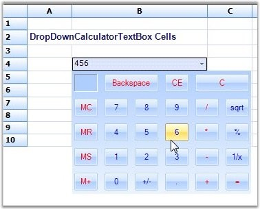

::: {style="DISPLAY: none"}
{#d2h_url_template}{#d2h_package_url style="WIDTH: 0px; DISPLAY: none; HEIGHT: 0px"}
:::

::: {.d2h_secondary_topic style="PADDING-BOTTOM: 10pt; MARGIN: 0pt; PADDING-LEFT: 0pt; PADDING-RIGHT: 0pt; PADDING-TOP: 0pt"}
##### Calculator Text Box {#calculator-text-box style="tab-stops: 0pt"}

[]{style="FONT-FAMILY: 'Trebuchet MS','sans-serif'; COLOR: #15428b; FONT-SIZE: 9pt"} 

The Calculator Text Box cell type is implemented as a drop-down container, embedded in the cell where the drop-down contains the calculator which displays the value in the cell.

 

The following code examples illustrate how to set the cell type to CalculatorTextBox.

[]{style="FONT-FAMILY: 'Trebuchet MS','sans-serif'; COLOR: #15428b; FONT-SIZE: 9pt"} 

1.   Using C#

[]{style="FONT-FAMILY: 'Trebuchet MS','sans-serif'; COLOR: #15428b; FONT-SIZE: 9pt"} 

+--------------------------------------------------------------------------------------------------------------------------------------------------------------------------------------------------------+
| **[\[C#\]]{style="FONT-FAMILY: 'Courier New'; COLOR: black"}**                                                                                                                                         |
|                                                                                                                                                                                                        |
| []{style="FONT-FAMILY: 'Courier New'; COLOR: black"}                                                                                                                                                   |
|                                                                                                                                                                                                        |
| [RegisterCellModel]{style="FONT-FAMILY: 'Courier New'; COLOR: #2b91af"}[.GridCellType(gridControl1, [CustomCellTypes]{style="COLOR: #2b91af"}.CalculatorTextBox);]{style="FONT-FAMILY: 'Courier New'"} |
|                                                                                                                                                                                                        |
| [CalculatorControl c2 = [new]{style="COLOR: blue"} CalculatorControl();]{style="FONT-FAMILY: 'Courier New'"}                                                                                           |
|                                                                                                                                                                                                        |
| [c2.BorderStyle = [Border3DStyle]{style="COLOR: #2b91af"}.RaisedOuter;]{style="FONT-FAMILY: 'Courier New'"}                                                                                            |
|                                                                                                                                                                                                        |
| [c2.BackColor = [Color]{style="COLOR: #2b91af"}.BlanchedAlmond;]{style="FONT-FAMILY: 'Courier New'"}                                                                                                   |
|                                                                                                                                                                                                        |
| [style = gridControl1\[6, 2\];]{style="FONT-FAMILY: 'Courier New'"}                                                                                                                                    |
|                                                                                                                                                                                                        |
| [style.CellType = [CustomCellTypes]{style="COLOR: #2b91af"}.CalculatorTextBox.ToString();]{style="FONT-FAMILY: 'Courier New'"}                                                                         |
|                                                                                                                                                                                                        |
| [style.Control = c2;]{style="FONT-FAMILY: 'Courier New'"}                                                                                                                                              |
+--------------------------------------------------------------------------------------------------------------------------------------------------------------------------------------------------------+

[]{style="FONT-FAMILY: 'Trebuchet MS','sans-serif'; COLOR: #15428b; FONT-SIZE: 9pt"} 

2.   Using VB.NET

[]{style="FONT-FAMILY: 'Courier New'; COLOR: #15428b"} 

+----------------------------------------------------------------------------------------------------------------------------------------------------------------------------------------------+
| **[\[VB.NET\]]{style="FONT-FAMILY: 'Courier New'; COLOR: black"}**                                                                                                                           |
|                                                                                                                                                                                              |
| []{style="FONT-FAMILY: 'Courier New'; COLOR: black"}                                                                                                                                         |
|                                                                                                                                                                                              |
| [RegisterCellModel.GridCellType([Me]{style="COLOR: blue"}.gridControl1, CustomCellTypes.CalculatorTextBox)]{style="FONT-FAMILY: 'Courier New'"}                                              |
|                                                                                                                                                                                              |
| [Dim]{style="FONT-FAMILY: 'Courier New'; COLOR: blue"}[ c2 [As]{style="COLOR: blue"} CalculatorControl = [New]{style="COLOR: blue"} CalculatorControl()]{style="FONT-FAMILY: 'Courier New'"} |
|                                                                                                                                                                                              |
| [c2.BorderStyle = Border3DStyle.RaisedOuter]{style="FONT-FAMILY: 'Courier New'"}                                                                                                             |
|                                                                                                                                                                                              |
| [c2.BackColor = Color.BlanchedAlmond]{style="FONT-FAMILY: 'Courier New'"}                                                                                                                    |
|                                                                                                                                                                                              |
| [style = gridControl1(6, 2)]{style="FONT-FAMILY: 'Courier New'"}                                                                                                                             |
|                                                                                                                                                                                              |
| [style.CellType = CustomCellTypes.CalculatorTextBox.ToString()]{style="FONT-FAMILY: 'Courier New'"}                                                                                          |
|                                                                                                                                                                                              |
| [style.Control = c2]{style="FONT-FAMILY: 'Courier New'"}                                                                                                                                     |
+----------------------------------------------------------------------------------------------------------------------------------------------------------------------------------------------+

[]{style="FONT-FAMILY: 'Trebuchet MS','sans-serif'; COLOR: #15428b; FONT-SIZE: 9pt"} 

{border="0"}

[]{style="FONT-FAMILY: 'Trebuchet MS','sans-serif'; COLOR: #15428b; FONT-SIZE: 9pt"} 

*[Figure ]{style="FONT-SIZE: 9pt"}[106]{style="FONT-SIZE: 9pt"}[: Calculator Text Box Cell]{style="FONT-SIZE: 9pt"}*

 

[]{#p95} 

 

[]{#related-topics}
:::
