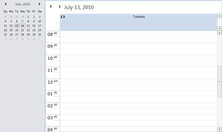
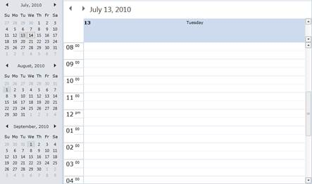

::: {style="DISPLAY: none"}
{#d2h_url_template}{#d2h_package_url style="WIDTH: 0px; DISPLAY: none; HEIGHT: 0px"}
:::

::::: {#nsbanner .d2h_main_nsbanner style="BORDER-BOTTOM: #999999 1px solid; POSITION: relative; PADDING-BOTTOM: 0px; BACKGROUND-COLOR: transparent; PADDING-LEFT: 0px; PADDING-RIGHT: 0px; DISPLAY: none; BORDER-TOP: #999999 1px solid; PADDING-TOP: 0px; LEFT: 0px"}
:::: {#TitleRow .d2h_main_titlerow style="PADDING-BOTTOM: 4px; BACKGROUND-COLOR: transparent; PADDING-LEFT: 22px; WIDTH: 100%; PADDING-RIGHT: 10px; DISPLAY: none; PADDING-TOP: 4px"}
::: {#ienav .d2h_main_ienav style="DISPLAY: none"}
{#D2HPrevious .D2HPreviousEnabled}  {#D2HNext .D2HNextEnabled}
:::
::::
:::::

:::: {#nstext .d2h_main_nstext style="PADDING-BOTTOM: 10px; BACKGROUND-COLOR: transparent; PADDING-LEFT: 22px; PADDING-RIGHT: 10px; HEIGHT: 100%; OVERFLOW: auto; PADDING-TOP: 5px" hasuserbackground="true" valign="bottom"}
::: {#d2h_breadcrumbs .d2h_breadcrumbs}
[Essential Studio User Guide Documentation](ms-xhelp:///?Id=12457748-09e3-4d74-a240-8e049cedf030){.d2h_breadcrumbsNormal}[ \> ]{.d2h_breadcrumbsLinkSeparator}[User Interface Edition](ms-xhelp:///?Id=c29296b7-531c-413b-a0ec-488ca1f7f669){.d2h_breadcrumbsNormal}[ \> ]{.d2h_breadcrumbsLinkSeparator}[Essential Silverlight](ms-xhelp:///?Id=66221bd1-ba2e-43c2-94a7-618f50e01d24){.d2h_breadcrumbsNormal}[ \> ]{.d2h_breadcrumbsLinkSeparator}[Essential Schedule]{.d2h_breadcrumbsContentsOnly}[ \> ]{.d2h_breadcrumbsLinkSeparator}[Schedule Control](ms-xhelp:///?Id=641660d5-c458-4c5d-9615-332d1a8eb458){.d2h_breadcrumbsNormal}[ \> ]{.d2h_breadcrumbsLinkSeparator}[Appearance](ms-xhelp:///?Id=436fb287-6cea-4a87-b33f-7177087dd205){.d2h_breadcrumbsNormal}
:::

### Calendar {#calendar style="LINE-HEIGHT: 150%; tab-stops: 0pt"}

A calendar displays the matrix of days and dates in each month on the left side of the Schedule control. When a date is clicked in the calendar, the corresponding date with appointments (if any) is displayed in the Schedule control. This section covers:

[]{#_Calendar_Visibility}Calendar Visibility

The Calendar can be displayed or hidden by using the **CalendarVisibility** property in Schedule control. By default the CalendarVisibility value is **Collapsed**.

+--------------------------------------------------------------------------------------------------------------------------------------------------------------------------------------------------------------------------------------------------------------------------------------------------------------------------------------------------------------------------------------------------------------------------------------------------------------------------------------------------------------------------------------------------------------------------------------------------------------------------------------------------------------------------------------------------------------------+
| **[\[XAML\]]{style="FONT-FAMILY: 'Courier New'"}**[]{style="FONT-FAMILY: 'Courier New'"}                                                                                                                                                                                                                                                                                                                                                                                                                                                                                                                                                                                                                           |
|                                                                                                                                                                                                                                                                                                                                                                                                                                                                                                                                                                                                                                                                                                                    |
| [\<]{style="FONT-FAMILY: 'Courier New'; COLOR: blue"}[Schedule:Schedule]{style="FONT-FAMILY: 'Courier New'; COLOR: #a31515"}[ ]{style="FONT-FAMILY: 'Courier New'; COLOR: blue"}[x:Name]{style="FONT-FAMILY: 'Courier New'; COLOR: red"}[=]{style="FONT-FAMILY: 'Courier New'; COLOR: blue"}[\"]{style="FONT-FAMILY: 'Courier New'; COLOR: black"}[schedule]{style="FONT-FAMILY: 'Courier New'; COLOR: blue"}[\" ]{style="FONT-FAMILY: 'Courier New'; COLOR: black"}[CalendarVisibility]{style="FONT-FAMILY: 'Courier New'; COLOR: red"}[=\"Visible\"]{style="FONT-FAMILY: 'Courier New'; COLOR: blue"}[ /]{style="FONT-FAMILY: 'Courier New'; COLOR: black"}[\>]{style="FONT-FAMILY: 'Courier New'; COLOR: blue"} |
+--------------------------------------------------------------------------------------------------------------------------------------------------------------------------------------------------------------------------------------------------------------------------------------------------------------------------------------------------------------------------------------------------------------------------------------------------------------------------------------------------------------------------------------------------------------------------------------------------------------------------------------------------------------------------------------------------------------------+

 

{border="0"}

 

Figure 31: Calendar Visibility is Visible

[]{style="LETTER-SPACING: 0.75pt; FONT-FAMILY: 'Cambria','serif'"} 

[]{#_Calendar_Items_Count}Calendar Items Count

You can use the **CalendarItemsCount** property to set the number of calendar items to be displayed. By default, the value is set to 1.

+---------------------------------------------------------------------------------------------------------------------------------------------------------------------------------------------------------------------------------------------------------------------------------------------------------------------------------------------------------------------------------------------------------------------------------------------------------------------------------------------------------------------------------------------------------------------------------------------------------------------------------------------------------------------------------------------------------------------------------------------------------------------------------------------------------------------------------------------------+
| **[\[XAML\]]{style="FONT-FAMILY: 'Courier New'"}**[]{style="FONT-FAMILY: 'Courier New'"}                                                                                                                                                                                                                                                                                                                                                                                                                                                                                                                                                                                                                                                                                                                                                          |
|                                                                                                                                                                                                                                                                                                                                                                                                                                                                                                                                                                                                                                                                                                                                                                                                                                                   |
| [\<]{style="FONT-FAMILY: 'Courier New'; COLOR: blue"}[Schedule:Schedule]{style="FONT-FAMILY: 'Courier New'; COLOR: #a31515"}[ ]{style="FONT-FAMILY: 'Courier New'; COLOR: blue"}[x:Name]{style="FONT-FAMILY: 'Courier New'; COLOR: red"}[=]{style="FONT-FAMILY: 'Courier New'; COLOR: blue"}[\"]{style="FONT-FAMILY: 'Courier New'; COLOR: black"}[schedule]{style="FONT-FAMILY: 'Courier New'; COLOR: blue"}[\" ]{style="FONT-FAMILY: 'Courier New'; COLOR: black"}[CalendarVisibility]{style="FONT-FAMILY: 'Courier New'; COLOR: red"}[=\"Visible\" ]{style="FONT-FAMILY: 'Courier New'; COLOR: blue"}[CalendarItemsCount]{style="FONT-FAMILY: 'Courier New'; COLOR: red"}[=\"3\" ]{style="FONT-FAMILY: 'Courier New'; COLOR: blue"}[ /]{style="FONT-FAMILY: 'Courier New'; COLOR: black"}[\>]{style="FONT-FAMILY: 'Courier New'; COLOR: blue"} |
+---------------------------------------------------------------------------------------------------------------------------------------------------------------------------------------------------------------------------------------------------------------------------------------------------------------------------------------------------------------------------------------------------------------------------------------------------------------------------------------------------------------------------------------------------------------------------------------------------------------------------------------------------------------------------------------------------------------------------------------------------------------------------------------------------------------------------------------------------+

 

{border="0"}

 

Figure 32: Calendar Items Count is 3

[]{#related-topics}
::::
