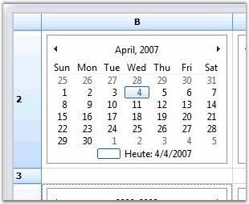

::: {style="DISPLAY: none"}
{#d2h_url_template}{#d2h_package_url style="WIDTH: 0px; DISPLAY: none; HEIGHT: 0px"}
:::

::: {.d2h_secondary_topic style="PADDING-BOTTOM: 10pt; MARGIN: 0pt; PADDING-LEFT: 0pt; PADDING-RIGHT: 0pt; PADDING-TOP: 0pt"}
##### Calendar {#calendar style="tab-stops: 0pt"}

[]{style="FONT-FAMILY: 'Trebuchet MS','sans-serif'; COLOR: #15428b; FONT-SIZE: 9pt"} 

The Calendar cell type by can be added by registering the cell model by using the **RegisterCellModel** class.

 

The following code examples illustrate how to set the cell type to Calendar.

[]{style="FONT-FAMILY: 'Trebuchet MS','sans-serif'; COLOR: #15428b; FONT-SIZE: 9pt"} 

1.   Using C#

[]{style="FONT-FAMILY: 'Trebuchet MS','sans-serif'; COLOR: #15428b; FONT-SIZE: 9pt"} 

+-----------------------------------------------------------------------------------------------------------------------------+
| **[\[C#\]]{style="FONT-FAMILY: 'Courier New'; COLOR: black"}**                                                              |
|                                                                                                                             |
| []{style="FONT-FAMILY: 'Courier New'; COLOR: black"}                                                                        |
|                                                                                                                             |
| [GridStyleInfo]{style="FONT-FAMILY: 'Courier New'; COLOR: #2b91af"}[ style;]{style="FONT-FAMILY: 'Courier New'"}            |
|                                                                                                                             |
| [style = gridControl1\[row, 2\];]{style="FONT-FAMILY: 'Courier New'"}                                                       |
|                                                                                                                             |
| [style.CellType = [CustomCellTypes]{style="COLOR: #2b91af"}.Calendar.ToString();]{style="FONT-FAMILY: 'Courier New'"}       |
|                                                                                                                             |
| [style.Control = [new]{style="COLOR: blue"} [MonthCalendar]{style="COLOR: #2b91af"}();]{style="FONT-FAMILY: 'Courier New'"} |
+-----------------------------------------------------------------------------------------------------------------------------+

[]{style="FONT-FAMILY: 'Trebuchet MS','sans-serif'; COLOR: #15428b; FONT-SIZE: 9pt"} 

2.   Using VB.NET

[]{style="FONT-FAMILY: 'Trebuchet MS','sans-serif'; COLOR: #15428b; FONT-SIZE: 9pt"} 

+--------------------------------------------------------------------------------------------------------------------------------------------+
| **[\[VB.NET\]]{style="FONT-FAMILY: 'Courier New'; COLOR: black"}**                                                                         |
|                                                                                                                                            |
| []{style="FONT-FAMILY: 'Courier New'; COLOR: black"}                                                                                       |
|                                                                                                                                            |
| [Dim]{style="FONT-FAMILY: 'Courier New'; COLOR: blue"}[ style [As]{style="COLOR: blue"} GridStyleInfo]{style="FONT-FAMILY: 'Courier New'"} |
|                                                                                                                                            |
| [style = gridControl1(row, 2)]{style="FONT-FAMILY: 'Courier New'"}                                                                         |
|                                                                                                                                            |
| [style.CellType = CustomCellTypes.Calendar.ToString()]{style="FONT-FAMILY: 'Courier New'"}                                                 |
|                                                                                                                                            |
| [style.Control = [New]{style="COLOR: blue"} MonthCalendar()]{style="FONT-FAMILY: 'Courier New'"}                                           |
+--------------------------------------------------------------------------------------------------------------------------------------------+

[]{style="FONT-FAMILY: 'Trebuchet MS','sans-serif'; COLOR: #15428b; FONT-SIZE: 9pt"} 

{border="0"}

[]{style="FONT-FAMILY: 'Trebuchet MS','sans-serif'; COLOR: #15428b; FONT-SIZE: 9pt"} 

*[Figure ]{style="FONT-SIZE: 9pt"}[107]{style="FONT-SIZE: 9pt"}[: Calendar Cell]{style="FONT-SIZE: 9pt"}*

 

[]{#p96} 

 

[]{#related-topics}
:::
