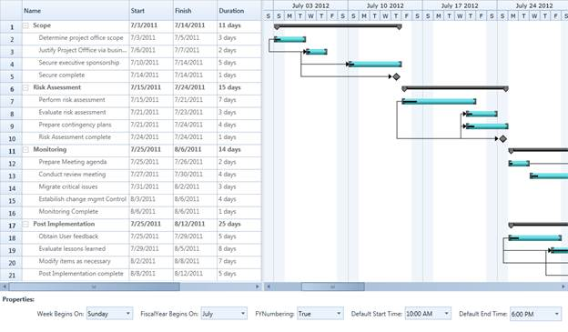

::: {style="DISPLAY: none"}
{#d2h_url_template}{#d2h_package_url style="WIDTH: 0px; DISPLAY: none; HEIGHT: 0px"}
:::

::::: {#nsbanner .d2h_main_nsbanner style="BORDER-BOTTOM: #999999 1px solid; POSITION: relative; PADDING-BOTTOM: 0px; BACKGROUND-COLOR: transparent; PADDING-LEFT: 0px; PADDING-RIGHT: 0px; DISPLAY: none; BORDER-TOP: #999999 1px solid; PADDING-TOP: 0px; LEFT: 0px"}
:::: {#TitleRow .d2h_main_titlerow style="PADDING-BOTTOM: 4px; BACKGROUND-COLOR: transparent; PADDING-LEFT: 22px; WIDTH: 100%; PADDING-RIGHT: 10px; DISPLAY: none; PADDING-TOP: 4px"}
::: {#ienav .d2h_main_ienav style="DISPLAY: none"}
{#D2HPrevious .D2HPreviousEnabled}  {#D2HNext .D2HNextEnabled}
:::
::::
:::::

::::: {#nstext .d2h_main_nstext style="PADDING-BOTTOM: 10px; BACKGROUND-COLOR: transparent; PADDING-LEFT: 22px; PADDING-RIGHT: 10px; HEIGHT: 100%; OVERFLOW: auto; PADDING-TOP: 5px" hasuserbackground="true" valign="bottom"}
::: {#d2h_breadcrumbs .d2h_breadcrumbs}
[Essential Studio User Guide Documentation](ms-xhelp:///?Id=12457748-09e3-4d74-a240-8e049cedf030){.d2h_breadcrumbsNormal}[ \> ]{.d2h_breadcrumbsLinkSeparator}[User Interface Edition](ms-xhelp:///?Id=c29296b7-531c-413b-a0ec-488ca1f7f669){.d2h_breadcrumbsNormal}[ \> ]{.d2h_breadcrumbsLinkSeparator}[Essential WPF](ms-xhelp:///?Id=7f4f82c5-151c-4262-94d0-75c4626c77bc){.d2h_breadcrumbsNormal}[ \> ]{.d2h_breadcrumbsLinkSeparator}[Essential Gantt]{.d2h_breadcrumbsContentsOnly}[ \> ]{.d2h_breadcrumbsLinkSeparator}[Concepts and Features](ms-xhelp:///?Id=b8172a4a-8718-4370-8781-8351a2959492){.d2h_breadcrumbsNormal}
:::

## Calendar Customization {#calendar-customization style="tab-stops: 0pt"}

This feature allows you to set your own schedule for the entire project. Using this feature you can customize the calendar as per the organization's requirement. Currently Essential Gantt provides  the following properties of the schedule to customize the calendar:

[·      ]{style="FONT-FAMILY: Symbol"}**Week Begins On**---Gets or sets the starting day of a week in the Schedule

[·      ]{style="FONT-FAMILY: Symbol"}**Fiscal Year Begin On---**Gets or sets the starting month of a Fiscal Year

[·      ]{style="FONT-FAMILY: Symbol"}**Is FY Numbering Enabled---**Gets or sets the FY Numbering to true or false in the Schedule

[·      ]{style="FONT-FAMILY: Symbol"}**Default Start Time**---Gets or sets the task starting time of the day.

[·      ]{style="FONT-FAMILY: Symbol"}**Default End Time**---Gets or sets the task ending time of the day.

 

Currently Default Start Time and Default End Time will reflects only in the Chart Background Panel.

 

Use Case Scenarios

You can use this when you want to change the schedule as needed. For example if April to March is your financial year, you can set this as your fiscal year and schedule the tasks accordingly.

 

You can also use this to schedule the works that have different week cycle. For example if your organization follows the week cycle from Wednesday to Tuesday, you can achieve this using this feature.

Properties

::: {align="center"}
+----------------------+------------------------------------------------------------------------------------------------------------+---------------------+-------------+-----------------+
| Property             | Description                                                                                                | Type                | Data Type   | Reference links |
+----------------------+------------------------------------------------------------------------------------------------------------+---------------------+-------------+-----------------+
| WeekBeginsOn         | Gets or sets the starting day of a week in the project schedule.                                           | DependencyProperty  | Enum        | N/A             |
|                      |                                                                                                            |                     |             |                 |
|                      | By default this is set to Sunday.                                                                          |                     |             |                 |
|                      |                                                                                                            |                     |             |                 |
|                      |                                                                                                            |                     |             |                 |
+----------------------+------------------------------------------------------------------------------------------------------------+---------------------+-------------+-----------------+
| FiscalYearBeginsOn   | Gets or sets the starting month of a fiscal year.                                                          | DependencyProperty  | Enum        | N/A             |
|                      |                                                                                                            |                     |             |                 |
|                      |  By default this is set to January                                                                         |                     |             |                 |
+----------------------+------------------------------------------------------------------------------------------------------------+---------------------+-------------+-----------------+
| IsFYNumberingEnabled | Gets or sets the Fiscal Year Numbering. When this property changed it will be reflected in the schedule.   | Dependency Property | bool        | N/A             |
|                      |                                                                                                            |                     |             |                 |
|                      |                                                                                                            |                     |             |                 |
|                      |                                                                                                            |                     |             |                 |
|                      | By default FY Numbering is set to false.                                                                   |                     |             |                 |
+----------------------+------------------------------------------------------------------------------------------------------------+---------------------+-------------+-----------------+
| DefaultStartTime     | Gets or sets the task starting time in a day. This is based on the *GanttTime* class of the Gantt control. | Dependency Property | GanttTime   | N/A             |
|                      |                                                                                                            |                     |             |                 |
|                      |                                                                                                            |                     |             |                 |
|                      |                                                                                                            |                     |             |                 |
|                      | By default this is set to 9.00 AM                                                                          |                     |             |                 |
+----------------------+------------------------------------------------------------------------------------------------------------+---------------------+-------------+-----------------+
| DefaultEndTime       | Gets or sets the task ending time in a day. This is based on the *GanttTime* class of the Gantt control.   | Dependency Property | GanttTime   | N/A             |
|                      |                                                                                                            |                     |             |                 |
|                      |                                                                                                            |                     |             |                 |
|                      |                                                                                                            |                     |             |                 |
|                      | By default this is set to 6.00 PM                                                                          |                     |             |                 |
+----------------------+------------------------------------------------------------------------------------------------------------+---------------------+-------------+-----------------+
:::

[]{style="FONT-FAMILY: 'Calibri','sans-serif'; COLOR: black"} 

Adding Calendar Customization to an Application

Define the value to the weekdays, months, FY Numbering, default start time and default end time as required and assign it to the appropriate APIs in the Gantt.

The following code illustrates this:

 

+-----------------------------------------------------------------------------------------------------------------------------------------------------------------------------------------------------------------------------------------------------------------------------------------------------------------------------------------------------------------------------------------------------------------------------------------------------------------------------------------------------------------------------------------------------------------------+
| **[\[XAML\]]{style="FONT-FAMILY: 'Courier New'"}**                                                                                                                                                                                                                                                                                                                                                                                                                                                                                                                    |
|                                                                                                                                                                                                                                                                                                                                                                                                                                                                                                                                                                       |
| []{style="FONT-FAMILY: 'Courier New'; COLOR: #a31515"}[]{style="FONT-FAMILY: 'Courier New'; COLOR: #a31515"}                                                                                                                                                                                                                                                                                                                                                                                                                                                          |
|                                                                                                                                                                                                                                                                                                                                                                                                                                                                                                                                                                       |
| [  ]{style="FONT-FAMILY: 'Courier New'; COLOR: #a31515"}[\<]{style="FONT-FAMILY: 'Courier New'; COLOR: blue"}[sync]{style="FONT-FAMILY: 'Courier New'; COLOR: #a31515"}[:]{style="FONT-FAMILY: 'Courier New'; COLOR: blue"}[GanttControl]{style="FONT-FAMILY: 'Courier New'; COLOR: #a31515"}[ Grid.Row]{style="FONT-FAMILY: 'Courier New'; COLOR: red"}[=\"1\"]{style="FONT-FAMILY: 'Courier New'; COLOR: blue"}[ [ x]{style="COLOR: red"}[:]{style="COLOR: blue"}[Name]{style="COLOR: red"}[=\"Gantt\"\>]{style="COLOR: blue"}]{style="FONT-FAMILY: 'Courier New'"} |
|                                                                                                                                                                                                                                                                                                                                                                                                                                                                                                                                                                       |
| [                ]{style="FONT-FAMILY: 'Courier New'; COLOR: #a31515"}[\<]{style="FONT-FAMILY: 'Courier New'; COLOR: blue"}[sync]{style="FONT-FAMILY: 'Courier New'; COLOR: #a31515"}[:]{style="FONT-FAMILY: 'Courier New'; COLOR: blue"}[GanttControl.TaskAttributeMapping]{style="FONT-FAMILY: 'Courier New'; COLOR: #a31515"}[\>]{style="FONT-FAMILY: 'Courier New'; COLOR: blue"}[]{style="FONT-FAMILY: 'Courier New'"}                                                                                                                                           |
|                                                                                                                                                                                                                                                                                                                                                                                                                                                                                                                                                                       |
| [                    ]{style="FONT-FAMILY: 'Courier New'; COLOR: #a31515"}[\<]{style="FONT-FAMILY: 'Courier New'; COLOR: blue"}[sync]{style="FONT-FAMILY: 'Courier New'; COLOR: #a31515"}[:]{style="FONT-FAMILY: 'Courier New'; COLOR: blue"}[TaskAttributeMapping]{style="FONT-FAMILY: 'Courier New'; COLOR: #a31515"}[ TaskIdMapping]{style="FONT-FAMILY: 'Courier New'; COLOR: red"}[=\"Id\"]{style="FONT-FAMILY: 'Courier New'; COLOR: blue"}[]{style="FONT-FAMILY: 'Courier New'"}                                                                               |
|                                                                                                                                                                                                                                                                                                                                                                                                                                                                                                                                                                       |
| [                                           [ TaskNameMapping]{style="COLOR: red"}[=\"Name\"]{style="COLOR: blue"}]{style="FONT-FAMILY: 'Courier New'"}                                                                                                                                                                                                                                                                                                                                                                                                               |
|                                                                                                                                                                                                                                                                                                                                                                                                                                                                                                                                                                       |
| [                                           [ StartDateMapping]{style="COLOR: red"}[=\"StDate\"]{style="COLOR: blue"} ]{style="FONT-FAMILY: 'Courier New'"}                                                                                                                                                                                                                                                                                                                                                                                                           |
|                                                                                                                                                                                                                                                                                                                                                                                                                                                                                                                                                                       |
| [                                           [ ChildMapping]{style="COLOR: red"}[=\"ChildTask\"]{style="COLOR: blue"}]{style="FONT-FAMILY: 'Courier New'"}                                                                                                                                                                                                                                                                                                                                                                                                             |
|                                                                                                                                                                                                                                                                                                                                                                                                                                                                                                                                                                       |
| [                                           [ FinishDateMapping]{style="COLOR: red"}[=\"EndDate\"]{style="COLOR: blue"}]{style="FONT-FAMILY: 'Courier New'"}                                                                                                                                                                                                                                                                                                                                                                                                          |
|                                                                                                                                                                                                                                                                                                                                                                                                                                                                                                                                                                       |
| [                                           [ DurationMapping]{style="COLOR: red"}[=\"Duration\"]{style="COLOR: blue"}                                            ]{style="FONT-FAMILY: 'Courier New'"}                                                                                                                                                                                                                                                                                                                                                               |
|                                                                                                                                                                                                                                                                                                                                                                                                                                                                                                                                                                       |
| [                                           [ ProgressMapping]{style="COLOR: red"}[=\"Complete\"]{style="COLOR: blue"}]{style="FONT-FAMILY: 'Courier New'"}                                                                                                                                                                                                                                                                                                                                                                                                           |
|                                                                                                                                                                                                                                                                                                                                                                                                                                                                                                                                                                       |
| [                                           [ PredecessorMapping]{style="COLOR: red"}[=\"Predecessor\"\>]{style="COLOR: blue"}]{style="FONT-FAMILY: 'Courier New'"}                                                                                                                                                                                                                                                                                                                                                                                                   |
|                                                                                                                                                                                                                                                                                                                                                                                                                                                                                                                                                                       |
| [                    ]{style="FONT-FAMILY: 'Courier New'; COLOR: #a31515"}[\</]{style="FONT-FAMILY: 'Courier New'; COLOR: blue"}[sync]{style="FONT-FAMILY: 'Courier New'; COLOR: #a31515"}[:]{style="FONT-FAMILY: 'Courier New'; COLOR: blue"}[TaskAttributeMapping]{style="FONT-FAMILY: 'Courier New'; COLOR: #a31515"}[\>]{style="FONT-FAMILY: 'Courier New'; COLOR: blue"}[]{style="FONT-FAMILY: 'Courier New'"}                                                                                                                                                   |
|                                                                                                                                                                                                                                                                                                                                                                                                                                                                                                                                                                       |
| [                ]{style="FONT-FAMILY: 'Courier New'; COLOR: #a31515"}[\</]{style="FONT-FAMILY: 'Courier New'; COLOR: blue"}[sync]{style="FONT-FAMILY: 'Courier New'; COLOR: #a31515"}[:]{style="FONT-FAMILY: 'Courier New'; COLOR: blue"}[GanttControl.TaskAttributeMapping]{style="FONT-FAMILY: 'Courier New'; COLOR: #a31515"}[\>]{style="FONT-FAMILY: 'Courier New'; COLOR: blue"}[]{style="FONT-FAMILY: 'Courier New'"}                                                                                                                                          |
|                                                                                                                                                                                                                                                                                                                                                                                                                                                                                                                                                                       |
| [            ]{style="FONT-FAMILY: 'Courier New'; COLOR: #a31515"}[\</]{style="FONT-FAMILY: 'Courier New'; COLOR: blue"}[sync]{style="FONT-FAMILY: 'Courier New'; COLOR: #a31515"}[:]{style="FONT-FAMILY: 'Courier New'; COLOR: blue"}[GanttControl]{style="FONT-FAMILY: 'Courier New'; COLOR: #a31515"}[\>]{style="FONT-FAMILY: 'Courier New'; COLOR: blue"}[           ]{style="FONT-FAMILY: 'Courier New'; COLOR: #a31515"}                                                                                                                                        |
|                                                                                                                                                                                                                                                                                                                                                                                                                                                                                                                                                                       |
| [  ]{style="FONT-FAMILY: 'Courier New'"}                                                                                                                                                                                                                                                                                                                                                                                                                                                                                                                              |
+-----------------------------------------------------------------------------------------------------------------------------------------------------------------------------------------------------------------------------------------------------------------------------------------------------------------------------------------------------------------------------------------------------------------------------------------------------------------------------------------------------------------------------------------------------------------------+

 

+---------------------------------------------------------------------------------------------------------------------------------------------------------------------------------------------------+
| **[\[C#\]]{style="FONT-FAMILY: 'Courier New'"}**                                                                                                                                                  |
|                                                                                                                                                                                                   |
| []{style="FONT-FAMILY: 'Courier New'; COLOR: #a31515"}                                                                                                                                            |
|                                                                                                                                                                                                   |
| [// To Set Week BeginsOn ]{style="FONT-FAMILY: 'Courier New'; COLOR: green"}                                                                                                                      |
|                                                                                                                                                                                                   |
| []{style="FONT-FAMILY: 'Courier New'"}                                                                                                                                                            |
|                                                                                                                                                                                                   |
| [ Gantt.WeekBeginsOn = [DayOfWeek]{style="COLOR: #2b91af"}.Wednesday;]{style="FONT-FAMILY: 'Courier New'"}                                                                                        |
|                                                                                                                                                                                                   |
| []{style="FONT-FAMILY: 'Courier New'; COLOR: #a31515"}                                                                                                                                            |
|                                                                                                                                                                                                   |
| [// To Set Fiscal Year starting Month]{style="FONT-FAMILY: 'Courier New'; COLOR: green"}                                                                                                          |
|                                                                                                                                                                                                   |
| []{style="FONT-FAMILY: 'Courier New'; COLOR: #a31515"}                                                                                                                                            |
|                                                                                                                                                                                                   |
| [ Gantt.FiscalYearBeginsOn = [Month]{style="COLOR: #2b91af"}.July;]{style="FONT-FAMILY: 'Courier New'"}                                                                                           |
|                                                                                                                                                                                                   |
| []{style="FONT-FAMILY: 'Courier New'"}                                                                                                                                                            |
|                                                                                                                                                                                                   |
| [// To Set FY Numbering]{style="FONT-FAMILY: 'Courier New'; COLOR: green"}                                                                                                                        |
|                                                                                                                                                                                                   |
| []{style="FONT-FAMILY: 'Courier New'; COLOR: #a31515"}                                                                                                                                            |
|                                                                                                                                                                                                   |
| [ Gantt.IsFYNumberingEndbled = [true]{style="COLOR: blue"};]{style="FONT-FAMILY: 'Courier New'"}                                                                                                  |
|                                                                                                                                                                                                   |
| []{style="FONT-FAMILY: 'Courier New'; COLOR: #a31515"}                                                                                                                                            |
|                                                                                                                                                                                                   |
| [// To Set Default Start Time]{style="FONT-FAMILY: 'Courier New'; COLOR: green"}                                                                                                                  |
|                                                                                                                                                                                                   |
| []{style="FONT-FAMILY: 'Courier New'; COLOR: blue"}                                                                                                                                               |
|                                                                                                                                                                                                   |
| [ ]{style="FONT-FAMILY: 'Courier New'; COLOR: blue"}[Gantt.DefaultStartTime = [new]{style="COLOR: blue"} [GanttTime]{style="COLOR: #2b91af"}() { Hour = 10};]{style="FONT-FAMILY: 'Courier New'"} |
|                                                                                                                                                                                                   |
| []{style="FONT-FAMILY: 'Courier New'"}                                                                                                                                                            |
|                                                                                                                                                                                                   |
| [// To Set Default End Time]{style="FONT-FAMILY: 'Courier New'; COLOR: green"}                                                                                                                    |
|                                                                                                                                                                                                   |
| [Gantt.DefaultEndTime = [new ]{style="COLOR: blue"}[GanttTime]{style="COLOR: #2b91af"}() { Hour = 6};]{style="FONT-FAMILY: 'Courier New'"}**[]{style="FONT-FAMILY: 'Courier New'"}**              |
|                                                                                                                                                                                                   |
| [  ]{style="FONT-FAMILY: 'Courier New'"}                                                                                                                                                          |
+---------------------------------------------------------------------------------------------------------------------------------------------------------------------------------------------------+

 

{border="0"}

Figure 30: Customized Calender

 

Samples Link

To view samples:

1.   Select **Start** -\> **Programs** -\> **Syncfusion** -\> **Essential Studio x.x.xx** -\> **Dashboard**.

2.   Click **Run Samples** for WPF under User Interface Edition panel .

3.   Select **Gantt**.

4.   Expand the **Interactive Features** item in the Sample Browser.

5.   Choose the **Calendar Customization** sample to launch.

 

[]{#related-topics}
:::::
