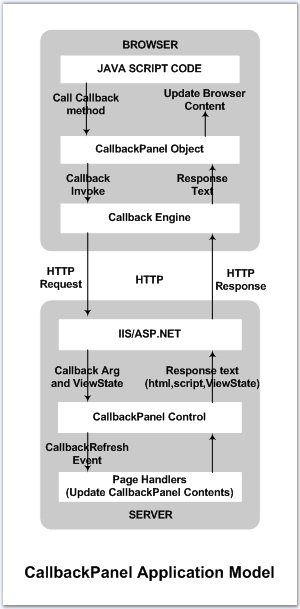

::: {style="DISPLAY: none"}
{#d2h_url_template}{#d2h_package_url style="WIDTH: 0px; DISPLAY: none; HEIGHT: 0px"}
:::

::::: {#nsbanner .d2h_main_nsbanner style="BORDER-BOTTOM: #999999 1px solid; POSITION: relative; PADDING-BOTTOM: 0px; BACKGROUND-COLOR: transparent; PADDING-LEFT: 0px; PADDING-RIGHT: 0px; DISPLAY: none; BORDER-TOP: #999999 1px solid; PADDING-TOP: 0px; LEFT: 0px"}
:::: {#TitleRow .d2h_main_titlerow style="PADDING-BOTTOM: 4px; BACKGROUND-COLOR: transparent; PADDING-LEFT: 22px; WIDTH: 100%; PADDING-RIGHT: 10px; DISPLAY: none; PADDING-TOP: 4px"}
::: {#ienav .d2h_main_ienav style="DISPLAY: none"}
{#D2HPrevious .D2HPreviousEnabled}  {#D2HNext .D2HNextEnabled}
:::
::::
:::::

:::: {#nstext .d2h_main_nstext style="PADDING-BOTTOM: 10px; BACKGROUND-COLOR: transparent; PADDING-LEFT: 22px; PADDING-RIGHT: 10px; HEIGHT: 100%; OVERFLOW: auto; PADDING-TOP: 5px" hasuserbackground="true" valign="bottom"}
::: {#d2h_breadcrumbs .d2h_breadcrumbs}
[Essential Studio User Guide Documentation](ms-xhelp:///?Id=12457748-09e3-4d74-a240-8e049cedf030){.d2h_breadcrumbsNormal}[ \> ]{.d2h_breadcrumbsLinkSeparator}[User Interface Edition](ms-xhelp:///?Id=c29296b7-531c-413b-a0ec-488ca1f7f669){.d2h_breadcrumbsNormal}[ \> ]{.d2h_breadcrumbsLinkSeparator}[Essential ASP.NET](ms-xhelp:///?Id=25c35330-c127-4dad-9a92-ed79dc7261a6){.d2h_breadcrumbsNormal}[ \> ]{.d2h_breadcrumbsLinkSeparator}[Essential Tools]{.d2h_breadcrumbsContentsOnly}[ \> ]{.d2h_breadcrumbsLinkSeparator}[Controls and Components](ms-xhelp:///?Id=99dc3762-3a6c-4306-b62b-5aa347ed3105){.d2h_breadcrumbsNormal}[ \> ]{.d2h_breadcrumbsLinkSeparator}[Callback Package](ms-xhelp:///?Id=8abd71e0-5dee-456d-840b-4751e98e8381){.d2h_breadcrumbsNormal}
:::

### CallbackPanel {#callbackpanel style="tab-stops: 0pt"}

 

The CallbackPanel control is a panel derived class that lets you invoke AJAX style callbacks from the client and refresh the contents of the panel in the server.

The common usage for this control is very simple.

 

1.   Drag the CallbackPanel control from the toolbox onto your page.

9.   Fill more controls within this panel.

10.  Decide when to invoke a callback on this panel. For example, on a button click or listbox selection change.

11.  Write java script code to invoke the callback on the panel, from the button element\'s click, for example, as given below.

 

  ---------------------------------------------------------------------------------------------------
  [\_sfCallbackPanel1.callback(\'some args\');]{style="FONT-FAMILY: 'Courier New'; FONT-SIZE: 9pt"}
  ---------------------------------------------------------------------------------------------------

 

This will load the page on the server and will call the CallbackPanel\'s CallbackRefresh event. In this event handler, the new values selected / changed by the user in the page are available, based on which you can update the CallbackPanel\'s content.

 

+--------------------------------------------------------------------------------------------------------------------------------------------------------------------------------------------------------------------------------------------------------------------------------------------------------------------------+
| [protected]{style="FONT-FAMILY: 'Courier New'; COLOR: blue; FONT-SIZE: 9pt"}[ [void]{style="COLOR: blue"} CallbackPanel1_CallbackRefresh([object]{style="COLOR: blue"} sender, Syncfusion.Web.UI.WebControls.[CancellableCallbackEventArgs]{style="COLOR: teal"} e)]{style="FONT-FAMILY: 'Courier New'; FONT-SIZE: 9pt"} |
|                                                                                                                                                                                                                                                                                                                          |
| [{]{style="FONT-FAMILY: 'Courier New'; FONT-SIZE: 9pt"}                                                                                                                                                                                                                                                                  |
|                                                                                                                                                                                                                                                                                                                          |
| [// Update CallbackPanel1 contents here.]{style="FONT-FAMILY: 'Courier New'; FONT-SIZE: 9pt"}                                                                                                                                                                                                                            |
|                                                                                                                                                                                                                                                                                                                          |
| [}]{style="FONT-FAMILY: 'Courier New'; FONT-SIZE: 9pt"}                                                                                                                                                                                                                                                                  |
+--------------------------------------------------------------------------------------------------------------------------------------------------------------------------------------------------------------------------------------------------------------------------------------------------------------------------+

 

The following diagram illustrates the sequence of events that result in a CallbackPanel\'s refresh.

 

[]{#p244}{border="0"}

[[[]{style="TEXT-DECORATION: none"}]{style="FONT-FAMILY: 'Trebuchet MS','sans-serif'; COLOR: #15428b; FONT-SIZE: 14pt"}]{.underline} 

More:

[ ]{#related-topics}

[{border="0" align="absMiddle"}Creating CallbackPanel](ms-xhelp:///?Id=3cba0570-40ec-4555-9b9d-8122536346ea){style="TEXT-DECORATION: none"}

[{border="0" align="absMiddle"}Concepts and Features](ms-xhelp:///?Id=8c7a4a2a-b229-4c49-8512-cc1d5debf03f){style="TEXT-DECORATION: none"}

[{border="0" align="absMiddle"}Events](ms-xhelp:///?Id=5387cd56-9b8a-4151-84a8-3634b146449a){style="TEXT-DECORATION: none"}
::::
