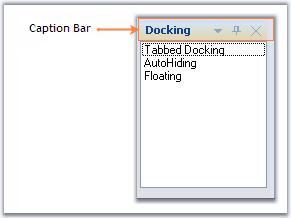

::: {style="DISPLAY: none"}
{#d2h_url_template}{#d2h_package_url style="WIDTH: 0px; DISPLAY: none; HEIGHT: 0px"}
:::

::: {.d2h_secondary_topic style="PADDING-BOTTOM: 10pt; MARGIN: 0pt; PADDING-LEFT: 0pt; PADDING-RIGHT: 0pt; PADDING-TOP: 0pt"}
#### Caption Bar {#caption-bar style="tab-stops: 0pt"}

[]{style="COLOR: #15428b"} 

Caption for the docked controls can be enabled using **ShowCaption** property. By default this property is true.

[]{style="COLOR: #15428b"} 

{border="0"}[]{style="COLOR: #15428b"}

[]{#p55}***[]{style="COLOR: #15428b"}*** 

Figure 55: Illustrates CaptionBar in a Docked Control

 

The following topics will guide the end users on how to effectively use the caption bar settings for the docked controls.

[]{style="COLOR: #15428b"} 

More:

[ ]{#related-topics}

[{border="0" align="absMiddle"}Label and Image for CaptionBar](ms-xhelp:///?Id=f0ff8cff-4fa0-43e6-a4f3-015cf152c1df){style="TEXT-DECORATION: none"}

[{border="0" align="absMiddle"}Caption Buttons](ms-xhelp:///?Id=1fb9c73c-f470-425e-9c03-77bca43abfbb){style="TEXT-DECORATION: none"}

[{border="0" align="absMiddle"}Custom Caption Buttons](ms-xhelp:///?Id=ab89bd33-017b-4f85-91c4-6b7bdb8cfbd0){style="TEXT-DECORATION: none"}
:::
